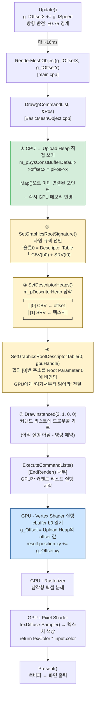

# Chapter 06 - Texture + Constant Buffer 학습 요약

## Chapter 05 → 06 핵심 변경사항

Chapter 06은 Chapter 05(텍스처 렌더링)에서 **Constant Buffer**를 추가하여,
CPU에서 매 프레임 삼각형의 (x, y) 위치를 GPU 셰이더로 전달하는 방법을 학습한다.

---

## 1. 추가된 구조체 (`typedef.h`)

```cpp
struct CONSTANT_BUFFER_DEFAULT {
    XMFLOAT4 offset;  // x, y 오프셋 (z, w는 미사용)
};
```

---

## 2. Descriptor Table 구조 변화

| | Chapter 05 | Chapter 06 |
|---|---|---|
| 슬롯 수 | 1개 | 2개 |
| 슬롯 구성 | `[0] SRV(TEX)` | `[0] CBV` / `[1] SRV(TEX)` |
| `Draw()` 인자 | `(pCommandList)` | `(pCommandList, const XMFLOAT2* pPos)` |

---

## 3. Root Signature 변화

```cpp
// Chapter 05: SRV 1개
ranges[0].Init(D3D12_DESCRIPTOR_RANGE_TYPE_SRV, 1, 0);  // t0

// Chapter 06: CBV + SRV 2개
ranges[0].Init(D3D12_DESCRIPTOR_RANGE_TYPE_CBV, 1, 0);  // b0
ranges[1].Init(D3D12_DESCRIPTOR_RANGE_TYPE_SRV, 1, 0);  // t0
```

Root Signature는 "어떤 자원을 셰이더에 어떤 레지스터로 넘기는지"의 **규격**이다.  
자원의 내용(텍스처 이미지, 버퍼 값)이 바뀌어도 **구조가 같으면 Root Signature는 바뀌지 않는다.**

---

## 4. Constant Buffer 생성 (`CreateMesh()`)

```cpp
// 1. GPU UPLOAD 힙에 버퍼 할당
pD3DDeivce->CreateCommittedResource(
    D3D12_HEAP_TYPE_UPLOAD, ...
    IID_PPV_ARGS(&m_pConstantBuffer));

// 2. Descriptor Heap의 CBV 슬롯에 등록
D3D12_CONSTANT_BUFFER_VIEW_DESC cbvDesc;
cbvDesc.BufferLocation = m_pConstantBuffer->GetGPUVirtualAddress();
cbvDesc.SizeInBytes    = constantBufferSize;  // 256바이트 정렬 필수
pD3DDeivce->CreateConstantBufferView(&cbvDesc, cbv);

// 3. CPU가 직접 쓸 수 있도록 Map (앱 종료까지 유지)
m_pConstantBuffer->Map(0, &readRange,
    reinterpret_cast<void**>(&m_pSysConstBufferDefault));
```

---

## 5. `m_pConstantBuffer` vs `m_pSysConstBufferDefault`

```
GPU Upload 힙 메모리
┌─────────────────────────────────┐
│  offset.x │ offset.y │ ...      │
└─────────────────────────────────┘
        ↑                    ↑
  m_pConstantBuffer    m_pSysConstBufferDefault
  (ID3D12Resource*)    (CONSTANT_BUFFER_DEFAULT*)

  GPU에게 "이 버퍼가     Map()으로 얻은
  CBV다" 알리는 핸들     CPU 직접 접근 포인터
```

- `Map()`이 Upload 힙 메모리를 CPU 가상 주소로 매핑한다.
- `m_pSysConstBufferDefault->offset.x = value;` 로 쓰면  
  **중간 복사 없이** 즉시 GPU 메모리에 반영된다.

---

## 6. 매 프레임 흐름 (Draw 시점)

```
메인 루프 (매 프레임)
│
├── Update()  ← 약 60FPS
│    └── g_fOffsetX += g_fSpeed  (0.75 경계에서 방향 반전)
│
├── RenderMeshObject(g_fOffsetX, g_fOffsetY)
│    └── pMeshObj->Draw(pCommandList, &Pos)
│         ├── m_pSysConstBufferDefault->offset.x = pPos->x  ← CPU가 Upload 힙에 씀
│         ├── SetGraphicsRootSignature(m_pRootSignature)
│         ├── SetDescriptorHeaps(1, &m_pDescritorHeap)      ← 힙 1개로 CBV+SRV 모두 등록
│         ├── SetGraphicsRootDescriptorTable(0, gpuHandle)  ← 힙 시작 주소 전달
│         └── DrawInstanced(3, 1, 0, 0)
│              └── GPU가 셰이더에서 g_Offset 읽어 삼각형 위치 오프셋
│
└── Present()
```

---

## 7. Descriptor Heap과 Root Signature의 관계

`SetDescriptorHeaps()`에 힙 1개만 넘겨도 CBV + SRV 둘 다 동작하는 이유:

```
m_pDescritorHeap (슬롯 2개짜리 힙)
┌─────────────────────────────────┐
│ [0] CBV  ← CreateConstantBufferView()로 등록  │
│ [1] SRV  ← CreateShaderResourceView()로 등록  │
└─────────────────────────────────┘
        ↑
SetDescriptorHeaps(1, &m_pDescritorHeap)   // 힙 장착
SetGraphicsRootDescriptorTable(0, start)   // [0]번부터 시작

GPU는 Root Signature 정의 순서대로 연속 슬롯을 읽음:
  [0] → b0 (g_Offset)
  [1] → t0 (texDiffuse)
```

---

## 8. NDC 좌표와 0.75 경계값

D3D12 화면 좌표(NDC)는 -1.0 ~ +1.0 범위.  
삼각형의 오른쪽 꼭짓점 원래 위치: x = +0.25

$$0.25 + \text{offsetX} = 1.0 \implies \text{offsetX} = 0.75$$

→ offset이 0.75가 되는 순간 삼각형 끝이 화면 오른쪽 경계에 닿음.  
→ 반대쪽도 동일: -0.75에서 왼쪽 끝이 경계에 닿음.

---

## 9. Root Signature는 오브젝트마다 있나?

`m_pRootSignature`는 `static` 멤버이다.  
→ **같은 타입의 CBasicMeshObject 인스턴스들이 모두 공유**한다.

| 멤버 | 공유 여부 |
|---|---|
| `m_pRootSignature` (static) | 같은 타입 모두 공유 |
| `m_pPipelineState` (static) | 같은 타입 모두 공유 |
| `m_pConstantBuffer` | 인스턴스마다 개별 소유 |
| `m_pTexResource` | 인스턴스마다 개별 소유 |
| `m_pDescritorHeap` | 인스턴스마다 개별 소유 |

Root Signature는 "같은 셰이더를 쓰는 오브젝트들의 공통 자원 규격"이다.  
내용(텍스처, 위치값)이 달라도 규격이 같으면 Root Signature는 하나로 공유한다.

---

## 10. HLSL 셰이더 변화

```hlsl
// Chapter 06에서 추가
cbuffer CONSTANT_BUFFER_DEFAULT : register(b0) {
    float4 g_Offset;
};

PSInput VSMain(VSInput input) {
    result.position = input.Pos;
    result.position.xy += g_Offset.xy;  // ← CPU에서 받은 오프셋 적용
    ...
}
```

---

## 11. pPos → GPU 렌더링 반영 전체 흐름

### 텍스트 흐름 요약

```
[main.cpp] Update()
  g_fOffsetX += g_fSpeed
       ↓
[main.cpp] RenderMeshObject(g_fOffsetX, g_fOffsetY)
       ↓
[D3D12Renderer.cpp] RenderMeshObject()
  XMFLOAT2 Pos = { x_offset, y_offset }
  pMeshObj->Draw(pCommandList, &Pos)
       ↓
[BasicMeshObject.cpp] Draw(pCommandList, pPos)
  ① m_pSysConstBufferDefault->offset.x = pPos->x   ← CPU가 Upload 힙에 직접 씀
     (Map()으로 연결된 포인터이므로 즉시 GPU 메모리에 반영)
  ② SetGraphicsRootSignature(m_pRootSignature)       ← 자원 규격 선언
  ③ SetDescriptorHeaps(1, &m_pDescritorHeap)         ← 힙 장착
  ④ SetGraphicsRootDescriptorTable(0, gpuHandle)     ← 힙 시작 주소 바인딩
  ⑤ DrawInstanced(3, 1, 0, 0)                        ← 드로우콜 발행
       ↓
[GPU - Vertex Shader]
  g_Offset = Descriptor Table[0] → CBV(b0) 읽기
  result.position.xy += g_Offset.xy
       ↓
[GPU - Rasterizer / Pixel Shader]
  최종 화면 출력
```

---

### Mermaid 차트



### 핵심 포인트

| 단계 | 위치 | 특이사항 |
|---|---|---|
| ① Upload 힙 쓰기 | CPU | Map()으로 포인터 직결, 복사 없음 |
| ②③④ 커맨드 기록 | CPU | 실제 GPU 실행이 아닌 명령 예약 |
| ⑤ DrawInstanced | CPU | 커맨드 리스트에 기록만 함 |
| ExecuteCommandLists | CPU→GPU | 이 시점에 GPU가 실제 실행 시작 |
| Vertex Shader | GPU | Upload 힙에서 offset 값 읽어 위치 계산 |
