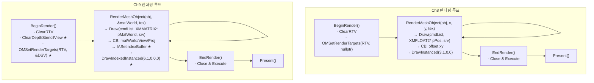
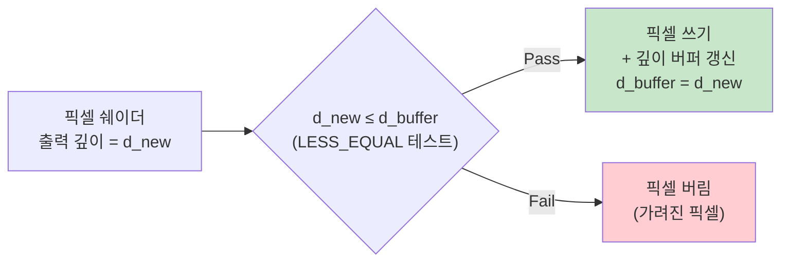

# Ch9 (DepthBuffer) vs Ch8 (DynamicDescriptorTable_CBV_SRV) — 코드 기반 심층 비교

## 한눈에 보는 변경 사항 요약

| 항목 | Ch8 | Ch9 |
|---|---|---|
| Depth Buffer | ❌ 없음 | ✅ `D32_FLOAT` 형식 DSV |
| DSV Heap | ❌ 없음 | ✅ `CreateDescriptorHeapForDSV()` |
| 카메라/행렬 | ❌ 없음 | ✅ View + Projection 행렬 |
| Constant Buffer 내용 | `XMFLOAT4 offset` (2D 이동) | `XMMATRIX matWorld/View/Proj` |
| Shader 변환 | position + offset.xy | position × World × View × Proj |
| PSO Depth 설정 | `DepthEnable = FALSE` | `CD3DX12_DEPTH_STENCIL_DESC(DEFAULT)` + DSVFormat |
| CullMode | D3D12_DEFAULT (Back) | `CULL_MODE_NONE` (양면 렌더링) |
| 메시 형태 | 삼각형 3정점 | 사각형 4정점 + 인덱스 6개 |
| Draw Call | `DrawInstanced(3,1,0,0)` | `DrawIndexedInstanced(6,1,0,0,0)` |
| Index Buffer | ❌ 없음 | ✅ `CreateIndexBuffer()` 추가 |
| `RenderMeshObject` 인자 | `float x_offset, float y_offset` | `const XMMATRIX* pMatWorld` |
| Update 로직 | 2D 바운스 애니메이션 | 3D 회전(X축/Y축) + 위치 이동 |

---

## 전체 흐름 Flowchart

```mermaid
flowchart TD
    subgraph CH8["Ch8 Initialize()"]
        A8[CreateDescriptorHeapForRTV] --> B8[SwapChain 생성]
        B8 --> C8[RTV 생성]
        C8 --> D8[CreateCommandList]
        D8 --> E8[CreateFence]
        E8 --> F8[ResourceManager / DescriptorPool / CBPool 초기화]
    end

    subgraph CH9["Ch9 Initialize()"]
        A9[CreateDescriptorHeapForRTV] --> B9[SwapChain 생성]
        B9 --> C9[RTV 생성]
        C9 --> D9["★ CreateDescriptorHeapForDSV()"]
        D9 --> E9["★ CreateDepthStencil(Width, Height)"]
        E9 --> F9[CreateCommandList]
        F9 --> G9[CreateFence]
        G9 --> H9[ResourceManager / DescriptorPool / CBPool 초기화]
        H9 --> I9["★ InitCamera()"]
    end
```



---

## 1. Depth Stencil 리소스 — 완전 신규 추가

### 1-1. 멤버 변수 (D3D12Renderer.h)

```cpp
// ======== Ch8 ========
// m_pDepthStencil 없음
// m_dsvDescriptorSize 없음

// ======== Ch9 ========
ID3D12Resource*         m_pDepthStencil = nullptr;   // ★ NEW
UINT                    m_dsvDescriptorSize = 0;      // ★ NEW
```

### 1-2. `CreateDescriptorHeapForDSV()` — 신규 메서드

Ch8에는 없는 메서드. DSV 전용 Descriptor Heap을 생성한다.

```cpp
// Ch9 D3D12Renderer.cpp
BOOL CD3D12Renderer::CreateDescriptorHeapForDSV()
{
    D3D12_DESCRIPTOR_HEAP_DESC dsvHeapDesc = {};
    dsvHeapDesc.NumDescriptors = 1;   // 기본 Depth Buffer 하나
    dsvHeapDesc.Type  = D3D12_DESCRIPTOR_HEAP_TYPE_DSV;
    dsvHeapDesc.Flags = D3D12_DESCRIPTOR_HEAP_FLAG_NONE;
    // ↑ DSV/RTV Heap은 SHADER_VISIBLE 플래그 불필요 (GPU에서 직접 샘플링 안 함)

    m_pD3DDevice->CreateDescriptorHeap(&dsvHeapDesc, IID_PPV_ARGS(&m_pDSVHeap));

    m_dsvDescriptorSize =
        m_pD3DDevice->GetDescriptorHandleIncrementSize(D3D12_DESCRIPTOR_HEAP_TYPE_DSV);
    return TRUE;
}
```

> **포인트**: RTV/DSV Heap은 `D3D12_DESCRIPTOR_HEAP_FLAG_NONE`이어야 한다.  
> `D3D12_DESCRIPTOR_HEAP_FLAG_SHADER_VISIBLE`은 CBV/SRV/UAV Heap에만 사용.

### 1-3. `CreateDepthStencil(UINT Width, UINT Height)` — 신규 메서드

```cpp
// Ch9 D3D12Renderer.cpp
BOOL CD3D12Renderer::CreateDepthStencil(UINT Width, UINT Height)
{
    // ① DSV 기술자(Desc) 작성
    D3D12_DEPTH_STENCIL_VIEW_DESC depthStencilDesc = {};
    depthStencilDesc.Format        = DXGI_FORMAT_D32_FLOAT;         // 32비트 float 깊이
    depthStencilDesc.ViewDimension = D3D12_DSV_DIMENSION_TEXTURE2D;
    depthStencilDesc.Flags         = D3D12_DSV_FLAG_NONE;

    // ② 최적화 클리어 값 — ClearDepthStencilView 호출 시 이 값과 같으면 HW가 fast-clear 수행
    D3D12_CLEAR_VALUE depthOptimizedClearValue = {};
    depthOptimizedClearValue.Format               = DXGI_FORMAT_D32_FLOAT;
    depthOptimizedClearValue.DepthStencil.Depth   = 1.0f;  // 깊이 최대값 (가장 먼 곳)
    depthOptimizedClearValue.DepthStencil.Stencil = 0;

    // ③ 리소스 Desc — 주의: 포맷은 TYPELESS
    CD3DX12_RESOURCE_DESC depthDesc(
        D3D12_RESOURCE_DIMENSION_TEXTURE2D,
        0,                                    // alignment (0 = auto)
        Width, Height,
        1,                                    // ArraySize
        1,                                    // MipLevels
        DXGI_FORMAT_R32_TYPELESS,             // ★ DSV용 리소스는 TYPELESS으로 생성
        1, 0,                                 // SampleDesc
        D3D12_TEXTURE_LAYOUT_UNKNOWN,
        D3D12_RESOURCE_FLAG_ALLOW_DEPTH_STENCIL  // ★ 필수 플래그
    );

    // ④ GPU 메모리에 커밋 — DEFAULT Heap, 초기 상태 DEPTH_WRITE
    m_pD3DDevice->CreateCommittedResource(
        &CD3DX12_HEAP_PROPERTIES(D3D12_HEAP_TYPE_DEFAULT),
        D3D12_HEAP_FLAG_NONE,
        &depthDesc,
        D3D12_RESOURCE_STATE_DEPTH_WRITE,     // ★ 첫 상태는 바로 DEPTH_WRITE
        &depthOptimizedClearValue,
        IID_PPV_ARGS(&m_pDepthStencil)
    );

    // ⑤ DSV 생성 (Heap의 첫 번째 슬롯에)
    CD3DX12_CPU_DESCRIPTOR_HANDLE dsvHandle(m_pDSVHeap->GetCPUDescriptorHandleForHeapStart());
    m_pD3DDevice->CreateDepthStencilView(m_pDepthStencil, &depthStencilDesc, dsvHandle);

    return TRUE;
}
```

> **왜 포맷이 `DXGI_FORMAT_R32_TYPELESS`인가?**  
> 같은 메모리를 DSV로 볼 때는 `DXGI_FORMAT_D32_FLOAT`,  
> SRV(Shader에서 깊이를 읽을 때)로 볼 때는 `DXGI_FORMAT_R32_FLOAT`로 해석할 수 있도록  
> 리소스 자체는 타입 없이 만든다. Ch9에서는 SRV로는 사용하지 않지만, 관례적으로 TYPELESS 사용.

---

## 2. BeginRender() — DSV 바인딩 및 클리어

```cpp
// ======== Ch8 BeginRender() ========
m_pCommandList->ClearRenderTargetView(rtvHandle, BackColor, 0, nullptr);
// DSV 클리어 없음
m_pCommandList->OMSetRenderTargets(1, &rtvHandle, FALSE, nullptr);
//                                                          ^^^^^ DSV = nullptr

// ======== Ch9 BeginRender() ========
CD3DX12_CPU_DESCRIPTOR_HANDLE dsvHandle(m_pDSVHeap->GetCPUDescriptorHandleForHeapStart());

m_pCommandList->ClearRenderTargetView(rtvHandle, BackColor, 0, nullptr);

// ★ 깊이 버퍼 클리어 추가
m_pCommandList->ClearDepthStencilView(
    dsvHandle,               // DSV 핸들
    D3D12_CLEAR_FLAG_DEPTH,  // Depth만 클리어 (Stencil 없음)
    1.0f,                    // 클리어 깊이값 (1.0 = 무한히 먼 곳)
    0,                       // 클리어 스텐실값
    0, nullptr               // 클리어할 Rect 수, Rect 배열 (0이면 전체)
);

m_pCommandList->OMSetRenderTargets(1, &rtvHandle, FALSE, &dsvHandle);
//                                                          ^^^^^^^^ ★ DSV 연결
```

> **`ClearDepthStencilView` 인자 상세:**
> ```
> ClearDepthStencilView(
>   D3D12_CPU_DESCRIPTOR_HANDLE DepthStencilView,  // DSV Heap의 CPU 핸들
>   D3D12_CLEAR_FLAGS ClearFlags,                  // DEPTH | STENCIL 선택
>   FLOAT Depth,                                   // 클리어할 깊이값 (보통 1.0f)
>   UINT8 Stencil,                                 // 클리어할 스텐실값
>   UINT NumRects,                                 // 부분 클리어 영역 수
>   const D3D12_RECT* pRects                       // 부분 클리어 영역 배열
> )
> ```

---

## 3. Camera 초기화 — 신규 추가

Ch9에서는 카메라(View 행렬)와 원근 투영(Projection 행렬)을 Renderer가 직접 관리한다.

### 3-1. 멤버 추가

```cpp
// Ch9 D3D12Renderer.h
XMMATRIX m_matView = {};   // ★ 뷰 행렬
XMMATRIX m_matProj = {};   // ★ 투영 행렬
```

### 3-2. `InitCamera()`

```cpp
// Ch9 D3D12Renderer.cpp
void CD3D12Renderer::InitCamera()
{
    // 카메라 설정: 위치(0,0,-1), 방향(0,0,+1 = 정면), 업벡터(0,1,0)
    XMVECTOR eyePos = XMVectorSet(0.0f, 0.0f, -1.0f, 1.0f);
    XMVECTOR eyeDir = XMVectorSet(0.0f, 0.0f,  1.0f, 0.0f);
    XMVECTOR upDir  = XMVectorSet(0.0f, 1.0f,  0.0f, 0.0f);

    // Left-Handed View 행렬 생성
    // XMMatrixLookToLH(eyePosition, eyeDirection, upDirection)
    m_matView = XMMatrixLookToLH(eyePos, eyeDir, upDir);

    // Perspective Projection (FOV 45도, 종횡비, Near=0.1, Far=1000)
    float fovY       = XM_PIDIV4; // 45도 = π/4
    float fAspect    = (float)m_dwWidth / (float)m_dwHeight;
    float fNear      = 0.1f;
    float fFar       = 1000.0f;
    m_matProj = XMMatrixPerspectiveFovLH(fovY, fAspect, fNear, fFar);
}
```

> **`XMMatrixLookToLH` vs `XMMatrixLookAtLH`:**
> - `LookAtLH(eyePos, focusPos, upDir)` — 바라볼 **점** 지정
> - `LookToLH(eyePos, eyeDir, upDir)` — 바라볼 **방향** 지정 ← Ch9 사용
>
> **종횡비(Aspect Ratio):** 창 크기가 바뀌면 투영 행렬도 바뀌어야 하므로  
> `UpdateWindowSize()` 안에서도 `InitCamera()`를 재호출한다.

### 3-3. `GetViewProjMatrix()` — 공개 인터페이스

```cpp
// Ch9 D3D12Renderer.cpp
void CD3D12Renderer::GetViewProjMatrix(XMMATRIX* pOutMatView, XMMATRIX* pOutMatProj)
{
    *pOutMatView = XMMatrixTranspose(m_matView);
    *pOutMatProj = XMMatrixTranspose(m_matProj);
}
```

> **왜 Transpose 하는가?**  
> HLSL의 `matrix` 타입은 **row-major** 로 레이아웃을 해석한다.  
> DirectXMath의 `XMMATRIX`는 **row-major** 메모리 레이아웃이지만,  
> HLSL의 `mul(vec, mat)` 연산은 수학적으로 행렬을 column-major로 처리한다.  
> 따라서 상수 버퍼로 보낼 때 전치(Transpose)해서 HLSL이 올바르게 해석하게 한다.  
> World 행렬도 `Draw()` 안에서 `XMMatrixTranspose(*pMatWorld)` 적용 후 전달한다.

---

## 4. CONSTANT_BUFFER_DEFAULT 구조체 변경

```cpp
// ======== Ch8 typedef.h ========
struct CONSTANT_BUFFER_DEFAULT
{
    XMFLOAT4 offset;     // (x, y, 0, 0) — 2D 이동 오프셋
};
// 크기: 16 bytes

// ======== Ch9 typedef.h ========
struct CONSTANT_BUFFER_DEFAULT
{
    XMMATRIX matWorld;   // 4x4 = 64 bytes  — 오브젝트의 월드 변환
    XMMATRIX matView;    // 4x4 = 64 bytes  — 카메라 변환
    XMMATRIX matProj;    // 4x4 = 64 bytes  — 원근 투영
};
// 크기: 192 bytes → 256 bytes로 정렬 (AlignConstantBufferSize 적용)
```

> **상수 버퍼 정렬:** D3D12에서 상수 버퍼는 **256바이트 단위**로 정렬해야 한다.  
> `AlignConstantBufferSize(sizeof(CONSTANT_BUFFER_DEFAULT))` 가 이를 처리.  
> Ch8: `AlignConstantBufferSize(16)` → 256  
> Ch9: `AlignConstantBufferSize(192)` → 256 (우연히 같음)

---

## 5. Shader (shaders.hlsl) 변경

### Ch8 — 2D 오프셋 기반 변환

```hlsl
cbuffer CONSTANT_BUFFER_DEFAULT : register(b0)
{
    float4 g_Offset;
};

PSInput VSMain(VSInput input)
{
    PSInput result = (PSInput)0;
    result.position    = input.Pos;
    result.position.xy += g_Offset.xy;   // ← XY 이동만
    result.TexCoord    = input.TexCoord;
    result.color       = input.color;
    return result;
}
```

### Ch9 — World × View × Proj 행렬 변환

```hlsl
cbuffer CONSTANT_BUFFER_DEFAULT : register(b0)
{
    matrix g_matWorld;
    matrix g_matView;
    matrix g_matProj;
};

PSInput VSMain(VSInput input)
{
    PSInput result = (PSInput)0;

    matrix matViewProj      = mul(g_matView, g_matProj);       // View × Proj
    matrix matWorldViewProj = mul(g_matWorld, matViewProj);    // World × (View × Proj)
    result.position = mul(input.Pos, matWorldViewProj);        // 최종 클립 공간 좌표

    result.TexCoord = input.TexCoord;
    result.color    = input.color;
    return result;
}
```

### 변환 파이프라인 흐름


> **HLSL `mul(v, M)` vs `mul(M, v)` 주의:**  
> HLSL에서 `mul(row_vector, matrix)`는 행벡터 × 행렬이다.  
> Ch9는 `mul(input.Pos, matWorldViewProj)`로 행벡터 × 행렬 스타일을 사용.  
> 상수 버퍼에 Transpose된 행렬을 넣었으므로, HLSL에서는 이 방식이 수학적으로 올바르다.

---

## 6. PSO (Pipeline State Object) 변경 — `InitPipelineState()`

```cpp
// ======== Ch8 ========
psoDesc.DepthStencilState.DepthEnable   = FALSE;   // 깊이 테스트 끔
psoDesc.DepthStencilState.StencilEnable = FALSE;
// DSVFormat 미설정 (DXGI_FORMAT_UNKNOWN = 0)

// ======== Ch9 ========
psoDesc.DepthStencilState = CD3DX12_DEPTH_STENCIL_DESC(D3D12_DEFAULT);
// ↑ 기본값: DepthEnable=TRUE, DepthWriteMask=ALL, DepthFunc=LESS, StencilEnable=FALSE

psoDesc.DepthStencilState.DepthFunc    = D3D12_COMPARISON_FUNC_LESS_EQUAL;
// ↑ LESS → LESS_EQUAL: 같은 깊이값도 통과 (z-fighting 완화, 후면도 렌더링 가능)

psoDesc.DepthStencilState.StencilEnable = FALSE;

psoDesc.RasterizerState.CullMode = D3D12_CULL_MODE_NONE;
// ↑ ★ 양면 렌더링: 사각형이 회전할 때 뒷면도 보이도록

psoDesc.DSVFormat = DXGI_FORMAT_D32_FLOAT;
// ↑ ★ 반드시 실제 DSV 포맷과 일치해야 함 (Ch8에서는 nullptr DSV라 불필요)
```

> **`D3D12_COMPARISON_FUNC_LESS` vs `LESS_EQUAL`:**  
> - `LESS`: 새 픽셀 깊이 < 버퍼 깊이일 때만 통과 (표준)  
> - `LESS_EQUAL`: 새 픽셀 깊이 ≤ 버퍼 깊이일 때 통과  
>   같은 깊이의 픽셀을 덮어쓸 수 있어 투명 레이어나 동일 평면 오브젝트에 유용
>
> **`CullMode = NONE` 이유:**  
> Ch9에서 사각형이 X축/Y축으로 회전하면 뒷면(backface)도 화면에 보인다.  
> 기본 `D3D12_CULL_MODE_BACK`으로는 뒷면이 잘려서 사라지기 때문에 NONE 사용.

---

## 7. 메시 & 인덱스 버퍼 변경 (`BasicMeshObject`)

### 7-1. 멤버 변수 (BasicMeshObject.h)

```cpp
// ======== Ch8 ========
ID3D12Resource*          m_pVertexBuffer = nullptr;
D3D12_VERTEX_BUFFER_VIEW m_VertexBufferView = {};
// 인덱스 버퍼 없음

// ======== Ch9 ========
ID3D12Resource*          m_pVertexBuffer = nullptr;
D3D12_VERTEX_BUFFER_VIEW m_VertexBufferView = {};
ID3D12Resource*          m_pIndexBuffer = nullptr;   // ★ NEW
D3D12_INDEX_BUFFER_VIEW  m_IndexBufferView = {};     // ★ NEW
```

### 7-2. 기하 데이터 변경 (`CreateMesh()`)

```cpp
// ======== Ch8 — 삼각형 3정점 ========
BasicVertex Vertices[] =
{
    { { 0.0f,  0.25f, 0.0f}, {1,1,1,1}, {0.5f, 0.0f} },
    { { 0.25f,-0.25f, 0.0f}, {1,1,1,1}, {1.0f, 1.0f} },
    { {-0.25f,-0.25f, 0.0f}, {1,1,1,1}, {0.0f, 1.0f} }
};
// 인덱스 없음

// ======== Ch9 — 사각형 4정점 + 인덱스 ========
BasicVertex Vertices[] =
{
    { {-0.25f, 0.25f, 0.0f}, {1,1,1,1}, {0.0f, 0.0f} },  // 좌상
    { { 0.25f, 0.25f, 0.0f}, {1,1,1,1}, {1.0f, 0.0f} },  // 우상
    { { 0.25f,-0.25f, 0.0f}, {1,1,1,1}, {1.0f, 1.0f} },  // 우하
    { {-0.25f,-0.25f, 0.0f}, {1,1,1,1}, {0.0f, 1.0f} },  // 좌하
};
WORD Indices[] =
{
    0, 1, 2,   // 첫 번째 삼각형 (좌상-우상-우하)
    0, 2, 3    // 두 번째 삼각형 (좌상-우하-좌하)
};
```

### 7-3. 인덱스 버퍼 생성

```cpp
// Ch9 CreateMesh() 추가 코드
if (FAILED(pResourceManager->CreateIndexBuffer(
    (DWORD)_countof(Indices),   // 인덱스 개수: 6
    &m_IndexBufferView,          // [out] Index Buffer View
    &m_pIndexBuffer,             // [out] 리소스 포인터
    Indices                      // 초기 데이터
)))
{
    __debugbreak();
    goto lb_return;
}
```

### 7-4. `D3D12ResourceManager::CreateIndexBuffer()` — 신규 메서드

```cpp
// Ch9 D3D12ResourceManager.cpp
HRESULT CD3D12ResourceManager::CreateIndexBuffer(
    DWORD dwIndexNum,                        // 인덱스 개수
    D3D12_INDEX_BUFFER_VIEW* pOutIndexBufferView,  // [out] IBV
    ID3D12Resource** ppOutBuffer,            // [out] GPU 버퍼
    void* pInitData                          // 초기 인덱스 데이터
)
{
    UINT IndexBufferSize = sizeof(WORD) * dwIndexNum;
    // ... (VertexBuffer 생성과 동일 패턴: DEFAULT Heap + UPLOAD Heap 복사)

    // IBV 초기화
    IndexBufferView.BufferLocation = pIndexBuffer->GetGPUVirtualAddress();
    IndexBufferView.Format         = DXGI_FORMAT_R16_UINT;  // WORD = 16비트
    IndexBufferView.SizeInBytes    = IndexBufferSize;
}
```

> **`DXGI_FORMAT_R16_UINT` vs `R32_UINT`:**  
> `WORD`(unsigned short) = 16비트이므로 `R16_UINT` 사용.  
> 최대 65535개 정점을 참조할 수 있다. 더 많으면 `DWORD`(32비트) + `R32_UINT` 사용.

---

## 8. `Draw()` 함수 변경 (`BasicMeshObject`)

### 시그니처 변경

```cpp
// ======== Ch8 ========
void CBasicMeshObject::Draw(
    ID3D12GraphicsCommandList* pCommandList,
    const XMFLOAT2* pPos,          // ← 2D 오프셋 (x, y)
    D3D12_CPU_DESCRIPTOR_HANDLE srv
)

// ======== Ch9 ========
void CBasicMeshObject::Draw(
    ID3D12GraphicsCommandList* pCommandList,
    const XMMATRIX* pMatWorld,     // ← ★ 4×4 월드 변환 행렬
    D3D12_CPU_DESCRIPTOR_HANDLE srv
)
```

### 상수 버퍼 설정 부분 변경

```cpp
// ======== Ch8 ========
CONSTANT_BUFFER_DEFAULT* pCB = (CONSTANT_BUFFER_DEFAULT*)pCBContainer->pSystemMemAddr;
pCB->offset.x = pPos->x;
pCB->offset.y = pPos->y;

// ======== Ch9 ========
CONSTANT_BUFFER_DEFAULT* pCB = (CONSTANT_BUFFER_DEFAULT*)pCBContainer->pSystemMemAddr;

// View / Proj는 Renderer에서 가져옴 (카메라는 Renderer 소유)
m_pRenderer->GetViewProjMatrix(&pCB->matView, &pCB->matProj);
// ↑ GetViewProjMatrix 내부에서 XMMatrixTranspose 적용

// World는 Draw 호출자가 전달
pCB->matWorld = XMMatrixTranspose(*pMatWorld);
// ↑ HLSL에서 mul(v, M) 방식 사용이므로 전치 필요
```

### Draw Call 변경

```cpp
// ======== Ch8 ========
pCommandList->IASetVertexBuffers(0, 1, &m_VertexBufferView);
pCommandList->DrawInstanced(
    3,    // VertexCountPerInstance
    1,    // InstanceCount
    0,    // StartVertexLocation
    0     // StartInstanceLocation
);

// ======== Ch9 ========
pCommandList->IASetVertexBuffers(0, 1, &m_VertexBufferView);
pCommandList->IASetIndexBuffer(&m_IndexBufferView);   // ★ 인덱스 버퍼 바인딩
pCommandList->DrawIndexedInstanced(
    6,    // IndexCountPerInstance (삼각형 2개 × 3정점 = 6)
    1,    // InstanceCount
    0,    // StartIndexLocation
    0,    // BaseVertexLocation
    0     // StartInstanceLocation
);
```

> **`DrawInstanced` vs `DrawIndexedInstanced`:**  
> | 파라미터 | DrawInstanced | DrawIndexedInstanced |
> |---|---|---|
> | 1 | VertexCount | IndexCount |
> | 2 | InstanceCount | InstanceCount |
> | 3 | StartVertexLocation | StartIndexLocation |
> | 4 | StartInstanceLocation | BaseVertexLocation |
> | 5 | — | StartInstanceLocation |
>
> `BaseVertexLocation`: 각 인덱스 값에 더해지는 오프셋. 여러 메시를 하나의 VB에 넣을 때 사용.

---

## 9. `RenderMeshObject()` 시그니처 변경

```cpp
// ======== Ch8 D3D12Renderer.h ========
void RenderMeshObject(void* pMeshObjHandle, float x_offset, float y_offset, void* pTexHandle);

// ======== Ch9 D3D12Renderer.h ========
void RenderMeshObject(void* pMeshObjHandle, const XMMATRIX* pMatWorld, void* pTexHandle);
```

```cpp
// ======== Ch8 D3D12Renderer.cpp ========
void CD3D12Renderer::RenderMeshObject(void* pMeshObjHandle, float x_offset, float y_offset, void* pTexHandle)
{
    D3D12_CPU_DESCRIPTOR_HANDLE srv = {};
    CBasicMeshObject* pMeshObj = (CBasicMeshObject*)pMeshObjHandle;
    if (pTexHandle)
        srv = ((TEXTURE_HANDLE*)pTexHandle)->srv;

    XMFLOAT2 Pos = { x_offset, y_offset };
    pMeshObj->Draw(m_pCommandList, &Pos, srv);
}

// ======== Ch9 D3D12Renderer.cpp ========
void CD3D12Renderer::RenderMeshObject(void* pMeshObjHandle, const XMMATRIX* pMatWorld, void* pTexHandle)
{
    D3D12_CPU_DESCRIPTOR_HANDLE srv = {};
    CBasicMeshObject* pMeshObj = (CBasicMeshObject*)pMeshObjHandle;
    if (pTexHandle)
        srv = ((TEXTURE_HANDLE*)pTexHandle)->srv;

    pMeshObj->Draw(m_pCommandList, pMatWorld, srv);  // ★ 행렬 직접 전달
}
```

---

## 10. `UpdateWindowSize()` 변경

```cpp
// ======== Ch8 ========
// SwapChain 리사이즈 후:
// RTV 재생성만 수행
// → 깊이 버퍼 없음

// ======== Ch9 ========
// 추가된 부분:

// ① 기존 Depth Stencil 해제
if (m_pDepthStencil)
{
    m_pDepthStencil->Release();
    m_pDepthStencil = nullptr;
}

// ② SwapChain ResizeBuffers ...
// ③ RTV 재생성 ...

// ④ Depth Stencil 재생성 (새 크기로)
CreateDepthStencil(dwBackBufferWidth, dwBackBufferHeight);

// ⑤ 투영 행렬 재계산 (종횡비 변경)
InitCamera();
```

---

## 11. main.cpp — Update() 로직 변경

### Ch8: 2D 바운스 애니메이션

```cpp
// Ch8 전역 변수
float g_fOffsetX = 0.0f, g_fOffsetY = 0.0f;
float g_fSpeedX  = 0.02f, g_fSpeedY = 0.02f;

void Update()
{
    g_fOffsetX += g_fSpeedX;
    if (g_fOffsetX > 0.75f || g_fOffsetX < -0.75f) g_fSpeedX *= -1.0f;

    g_fOffsetY += g_fSpeedY;
    if (g_fOffsetY > 0.75f || g_fOffsetY < -0.75f) {
        g_fSpeedY *= -1.0f;
        // 방향 바뀔 때 텍스처 교환
        void* pTemp = g_pTexHandle0;
        g_pTexHandle0 = g_pTexHandle1;
        g_pTexHandle1 = pTemp;
    }
}

// RunGame()에서:
g_pRenderer->RenderMeshObject(g_pMeshObj, g_fOffsetX, 0.0f, g_pTexHandle0);
g_pRenderer->RenderMeshObject(g_pMeshObj, 0.0f, g_fOffsetY, g_pTexHandle1);
```

### Ch9: 3D 회전 + 위치 이동

```cpp
// Ch9 전역 변수
float    g_fRot0 = 0.0f, g_fRot1 = 0.0f;
XMMATRIX g_matWorld0 = {}, g_matWorld1 = {};

void Update()
{
    // 오브젝트 0: X축 회전 후 (-0.15, 0, 0.25)으로 이동
    XMMATRIX matRot0   = XMMatrixRotationX(g_fRot0);
    XMMATRIX matTrans0 = XMMatrixTranslation(-0.15f, 0.0f, 0.25f);
    g_matWorld0 = XMMatrixMultiply(matRot0, matTrans0);  // Rot × Trans

    // 오브젝트 1: Y축 회전 후 (+0.15, 0, 0.25)으로 이동
    XMMATRIX matRot1   = XMMatrixRotationY(g_fRot1);
    XMMATRIX matTrans1 = XMMatrixTranslation(0.15f, 0.0f, 0.25f);
    g_matWorld1 = XMMatrixMultiply(matRot1, matTrans1);

    g_fRot0 += 0.05f;
    if (g_fRot0 > XM_2PI) { g_fRot0 = 0.0f; bChangeTex = TRUE; }

    g_fRot1 += 0.1f;
    if (g_fRot1 > XM_2PI) g_fRot1 = 0.0f;
}

// RunGame()에서:
g_pRenderer->RenderMeshObject(g_pMeshObj, &g_matWorld0, g_pTexHandle0);
g_pRenderer->RenderMeshObject(g_pMeshObj, &g_matWorld1, g_pTexHandle1);
```

> **`XMMatrixMultiply(R, T)` 순서:**  
> DirectXMath는 **행-우선(row-major)** 행렬이며  
> `XMMatrixMultiply(A, B)` = A × B (행벡터 기준 왼쪽부터 적용).  
> 따라서 `XMMatrixMultiply(matRot, matTrans)` = 먼저 회전, 그 다음 이동.  
> 순서가 바뀌면 이동 후 회전이 되어 원점이 아닌 이동된 위치를 기준으로 회전한다.

---

## 12. 전체 렌더링 파이프라인 흐름 비교



---

## 13. Depth Test 동작 원리



Ch8에서는 두 삼각형을 렌더링해도 그리는 순서에 따라 앞뒤가 결정된다.  
Ch9에서는 깊이 테스트로 겹치는 사각형이 올바르게 앞/뒤 관계를 갖는다.

---

## 14. Cleanup() 변경

```cpp
// Ch9에 추가된 해제 코드
CleanupDescriptorHeapForDSV();   // ★ DSV Heap 해제

if (m_pDepthStencil)             // ★ Depth Stencil 리소스 해제
{
    m_pDepthStencil->Release();
    m_pDepthStencil = nullptr;
}
```

---

## 변경 파일 목록 정리

| 파일 | 변경 내용 |
|---|---|
| `D3D12Renderer.h` | `m_pDepthStencil`, `m_dsvDescriptorSize`, `m_matView`, `m_matProj` 멤버 추가; `InitCamera`, `CreateDepthStencil`, `CreateDescriptorHeapForDSV`, `CleanupDescriptorHeapForDSV`, `GetViewProjMatrix` 선언 추가; `RenderMeshObject` 시그니처 변경 |
| `D3D12Renderer.cpp` | `Initialize()` — DSV 생성 + `InitCamera()` 추가; `BeginRender()` — DSV 클리어 + `OMSetRenderTargets`에 DSV 연결; `UpdateWindowSize()` — DSV 재생성 + `InitCamera()` 재호출; `RenderMeshObject()` 시그니처/내부 변경; `Cleanup()` — DSV 해제 추가; 신규 메서드 4개 구현 |
| `typedef.h` | `CONSTANT_BUFFER_DEFAULT`: `XMFLOAT4 offset` → `XMMATRIX matWorld/View/Proj` |
| `Shaders/shaders.hlsl` | cbuffer 내용 변경; VSMain에서 행렬 변환 적용 |
| `BasicMeshObject.h` | `m_pIndexBuffer`, `m_IndexBufferView` 추가; `Draw()` 시그니처 변경 |
| `BasicMeshObject.cpp` | `InitPipelineState()` — Depth 활성화 + `DSVFormat` 설정 + `CullMode NONE`; `CreateMesh()` — 4정점 쿼드 + 인덱스 데이터; `Draw()` 시그니처/CB 설정/DrawCall 변경; `Cleanup()` — `m_pIndexBuffer` 해제 추가 |
| `D3D12ResourceManager.h` | `CreateIndexBuffer()` 선언 추가 |
| `D3D12ResourceManager.cpp` | `CreateIndexBuffer()` 구현 추가 |
| `main.cpp` | 전역 변수 변경 (offset → rotation + worldMatrix); `Update()` 2D 바운스 → 3D 회전; `RunGame()` 의 `RenderMeshObject` 호출 인자 변경 |
