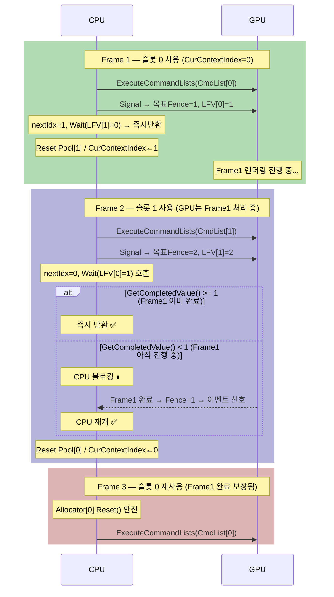
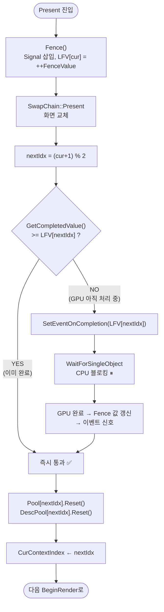

# Chapter 11 Q&A

---

## Q. 4프레임 동안 Fence값 / CurContextIndex / LFV가 어떻게 변하는가?

### 변수 목록 (추적 대상)

| 변수 | 의미 |
|---|---|
| `CurCtx` | `m_dwCurContextIndex` — 지금 CPU가 기록 중인 슬롯 |
| `FenceVal` | `m_ui64FenceVaule` — 지금까지 Signal에 사용한 최신 Fence 번호 |
| `LFV[0]` | `m_pui64LastFenceValue[0]` — 슬롯 0이 마지막으로 사용한 Fence 번호 |
| `LFV[1]` | `m_pui64LastFenceValue[1]` — 슬롯 1이 마지막으로 사용한 Fence 번호 |
| `GPU 완료` | `GetCompletedValue()` — GPU가 실제로 처리 완료한 Fence 번호 |

---

### 4프레임 단계별 전체 추적

```
초기 상태
  CurCtx=0  FenceVal=0  LFV[0]=0  LFV[1]=0  GPU완료=0
━━━━━━━━━━━━━━━━━━━━━━━━━━━━━━━━━━━━━━━━━━━━━━━━━━━━━
▶ FRAME 1  (슬롯 0 사용)
━━━━━━━━━━━━━━━━━━━━━━━━━━━━━━━━━━━━━━━━━━━━━━━━━━━━━

  BeginRender()
    Allocator[0].Reset()  ← LFV[0]=0 이었으므로 안전(전 Q 참고)
    CommandList[0].Reset()
    (GPU는 이전 작업 없으므로 아무것도 진행 중이지 않음)

  EndRender()
    CommandList[0].Close()
    ExecuteCommandLists(CmdList[0])  → GPU 큐에 Frame1 커맨드 투입
    [GPU가 백그라운드에서 Frame1 처리 시작]

  Present()
    ① Fence()
         FenceVal = 0+1 = 1
         Signal(Fence, 1)         → GPU 큐에 "Fence=1 마커" 삽입
         LFV[CurCtx=0] = 1       → LFV[0] = 1

    ② SwapChain::Present()        → 화면 출력

    ③ nextIdx = (0+1)%2 = 1

    ④ WaitForFenceValue(LFV[1])
       = WaitForFenceValue(0)
         GetCompletedValue() >= 0  → 항상 참 → 즉시 반환 ✅
         (슬롯 1은 한 번도 쓴 적 없으므로 기다릴 것 없음)

    ⑤ Reset Pool[1], DescPool[1]
    ⑥ CurCtx = 1

  Frame 1 Present 직후 상태:
    CurCtx=1  FenceVal=1  LFV[0]=1  LFV[1]=0  GPU완료=0~1

━━━━━━━━━━━━━━━━━━━━━━━━━━━━━━━━━━━━━━━━━━━━━━━━━━━━━
▶ FRAME 2  (슬롯 1 사용)  ← GPU는 이 시점에 Frame1 처리 중일 수 있음
━━━━━━━━━━━━━━━━━━━━━━━━━━━━━━━━━━━━━━━━━━━━━━━━━━━━━

  BeginRender()
    Allocator[1].Reset()  ← LFV[1]=0, Wait(0)으로 이미 확인됨 → 안전
    CommandList[1].Reset()
    (GPU는 Frame1을 처리 중 — 슬롯 0을 쓰고 있으므로 슬롯 1 Reset은 무관)

  EndRender()
    CommandList[1].Close()
    ExecuteCommandLists(CmdList[1])  → GPU 큐에 Frame2 커맨드 투입
    [GPU 큐: Frame1 커맨드 → Fence=1 마커 → Frame2 커맨드]

  Present()
    ① Fence()
         FenceVal = 1+1 = 2
         Signal(Fence, 2)         → GPU 큐에 "Fence=2 마커" 삽입
         LFV[CurCtx=1] = 2       → LFV[1] = 2

    ② SwapChain::Present()

    ③ nextIdx = (1+1)%2 = 0

    ④ WaitForFenceValue(LFV[0])
       = WaitForFenceValue(1)     ← "Frame1이 GPU에서 끝났는가?"

       경우 A: GPU완료 >= 1  → 즉시 반환 ✅ (Frame1이 이미 끝난 경우)
       경우 B: GPU완료 < 1   → CPU 블로킹 ⏸ → Frame1 완료 후 재개

    ⑤ Reset Pool[0], DescPool[0]  ← Frame3이 슬롯 0을 쓰기 위한 준비
    ⑥ CurCtx = 0

  Frame 2 Present 직후 상태:
    CurCtx=0  FenceVal=2  LFV[0]=1  LFV[1]=2  GPU완료=1~2

━━━━━━━━━━━━━━━━━━━━━━━━━━━━━━━━━━━━━━━━━━━━━━━━━━━━━
▶ FRAME 3  (슬롯 0 재사용)  ← Frame1 완료 보장됨
━━━━━━━━━━━━━━━━━━━━━━━━━━━━━━━━━━━━━━━━━━━━━━━━━━━━━

  BeginRender()
    Allocator[0].Reset()  ← WaitForFenceValue(1)을 통과했으므로 100% 안전
    CommandList[0].Reset()

  EndRender()
    ExecuteCommandLists(CmdList[0])

  Present()
    ① Fence()
         FenceVal = 2+1 = 3
         Signal(Fence, 3)
         LFV[CurCtx=0] = 3       → LFV[0] = 3

    ② SwapChain::Present()

    ③ nextIdx = (0+1)%2 = 1

    ④ WaitForFenceValue(LFV[1])
       = WaitForFenceValue(2)     ← "Frame2가 GPU에서 끝났는가?"

       경우 A: GPU완료 >= 2  → 즉시 반환 ✅
       경우 B: GPU완료 < 2   → CPU 블로킹 ⏸ → Frame2 완료 후 재개

    ⑤ Reset Pool[1], DescPool[1]
    ⑥ CurCtx = 1

  Frame 3 Present 직후 상태:
    CurCtx=1  FenceVal=3  LFV[0]=3  LFV[1]=2  GPU완료=2~3

━━━━━━━━━━━━━━━━━━━━━━━━━━━━━━━━━━━━━━━━━━━━━━━━━━━━━
▶ FRAME 4  (슬롯 1 재사용)  ← Frame2 완료 보장됨
━━━━━━━━━━━━━━━━━━━━━━━━━━━━━━━━━━━━━━━━━━━━━━━━━━━━━

  BeginRender()
    Allocator[1].Reset()  ← WaitForFenceValue(2)를 통과했으므로 100% 안전

  EndRender()
    ExecuteCommandLists(CmdList[1])

  Present()
    ① Fence()
         FenceVal = 3+1 = 4
         Signal(Fence, 4)
         LFV[CurCtx=1] = 4       → LFV[1] = 4

    ② SwapChain::Present()

    ③ nextIdx = (1+1)%2 = 0

    ④ WaitForFenceValue(LFV[0])
       = WaitForFenceValue(3)     ← "Frame3이 GPU에서 끝났는가?"

       경우 A: GPU완료 >= 3  → 즉시 반환 ✅
       경우 B: GPU완료 < 3   → CPU 블로킹 ⏸

    ⑤ Reset Pool[0], DescPool[0]
    ⑥ CurCtx = 0

  Frame 4 Present 직후 상태:
    CurCtx=0  FenceVal=4  LFV[0]=3  LFV[1]=4  GPU완료=3~4
```

---

### 한눈에 보는 변수 변화 테이블

| 프레임 | Present() 진입 전 CurCtx | Fence() 후 FenceVal | LFV[0] | LFV[1] | nextIdx | Wait 대상 | Wait 조건 |
|:---:|:---:|:---:|:---:|:---:|:---:|:---:|:---|
| 1 | 0 | **1** | **1** | 0 | 1 | LFV[1]=**0** | 즉시 반환 (슬롯1 미사용) |
| 2 | 1 | **2** | 1 | **2** | 0 | LFV[0]=**1** | Frame1 완료 여부 확인 |
| 3 | 0 | **3** | **3** | 2 | 1 | LFV[1]=**2** | Frame2 완료 여부 확인 |
| 4 | 1 | **4** | 3 | **4** | 0 | LFV[0]=**3** | Frame3 완료 여부 확인 |

---

### 슬롯 순환 패턴

```
Frame:  1      2      3      4      5      6  ...
슬롯:   [0]    [1]    [0]    [1]    [0]    [1] ...
Wait:   LFV[1] LFV[0] LFV[1] LFV[0] LFV[1] LFV[0]
        =0     =1     =2     =3     =4     =5
        Frame? Frame1 Frame2 Frame3 Frame4 Frame5
```

**항상 "직전 프레임(N-1)"의 완료를 확인한다.**  
이유: 슬롯이 2개이므로, nextIdx가 가리키는 슬롯의 마지막 사용자는  
항상 2프레임 전(= 슬롯 사이클이 2이므로)이 아니라 바로 직전 프레임이다.

---

## Q. Frame2의 Present()에서 왜 Frame1을 기다리는가?

### 결론: Frame2가 Frame1을 기다리는 게 아니다. Frame3을 위해 슬롯 0을 청소하는 것이다

Present() 안의 Wait는 **현재 프레임(Frame 2)의 렌더링**을 위한 것이 아니다.  
**다음 프레임(Frame 3)이 쓸 슬롯을 안전하게 Reset하기 위한** 사전 준비다.

```cpp
void CD3D12Renderer::Present()
{
    Fence();  // Frame2 커맨드 완료 마커 삽입 (LFV[1]=2)

    m_pSwapChain->Present(...);  // Frame2 화면 출력

    // ↓ 여기서부터는 "Frame3를 위한 준비"
    DWORD dwNextContextIndex = (m_dwCurContextIndex + 1) % MAX_PENDING_FRAME_COUNT;
    //    = (1 + 1) % 2 = 0  ← Frame3이 쓸 슬롯

    WaitForFenceValue(m_pui64LastFenceValue[dwNextContextIndex]);
    //  = WaitForFenceValue(LFV[0] = 1)
    //  ← "슬롯 0을 마지막으로 쓴 Frame1이 GPU에서 끝났는가?" 를 확인

    // ↓ Wait를 통과했다 = Frame1이 슬롯 0을 다 썼음이 보장됨
    m_ppConstantBufferPool[dwNextContextIndex]->Reset();  // 슬롯 0 리소스 초기화
    m_ppDescriptorPool[dwNextContextIndex]->Reset();

    m_dwCurContextIndex = dwNextContextIndex;  // Frame3은 슬롯 0을 쓴다
}
```

### 슬롯과 프레임의 관계를 명확히

```
슬롯 0이 마지막으로 사용된 프레임: Frame1 (LFV[0] = 1)
슬롯 0을 다음에 사용할 프레임:    Frame3

Frame2의 Present()는 Frame3를 위해
"슬롯 0의 이전 주인인 Frame1이 GPU에서 끝났는지" 확인하는 것이다.
```

### 왜 Reset 전에 반드시 확인해야 하는가

```
GPU 타임라인 (느린 GPU 가정):

  t=0ms  Frame1 커맨드 GPU 처리 시작
         ├─ DescriptorPool[0] 에 있는 Descriptor를 GPU가 읽는 중
         └─ ConstantBufferPool[0] 에 있는 행렬 데이터를 GPU가 읽는 중

  t=2ms  Frame2의 Present()에서 Wait 없이 즉시 Reset() 해버린다면?
         ├─ DescriptorPool[0].Reset() → Descriptor 메모리 덮어씀
         └─ GPU는 같은 메모리를 아직 읽는 중 → 쓰레기 데이터 참조 → 화면 깨짐 or 크래시

  t=5ms  Frame1 완료 (이 시점에야 Reset이 안전)
```

### 타임라인으로 한눈에 보기

```
CPU:  [Frame1 기록·제출]──[Frame2 기록·제출]──[Wait(LFV[0]=1)]──[Frame3 기록·제출]
                                                       ↑
                                              Frame1 완료 확인 후
                                              슬롯 0 Reset → Frame3에 넘김

GPU:                       [Frame1 렌더링-----------완료]
                                              [Frame2 렌더링------...]
```

Wait가 일어나는 위치를 주목하라.  
Frame2의 **렌더링(BeginRender~EndRender)** 구간에서는 아무것도 기다리지 않는다.  
Frame2 렌더링은 Frame1과 **완전히 병렬**로 진행된다.  
Wait는 오직 Frame2의 **Present() 끝자락**, 즉 Frame3 준비 구간에서만 일어난다.

### 만약 GPU가 충분히 빠르다면?

```
CPU:  [Frame1 기록·제출]──[Frame2 기록·제출]──[Wait(LFV[0]=1)]──[Frame3 기록...]
GPU:  [Frame1 렌더링·완료]──[Frame2 렌더링...]
              ↑
  Frame2의 기록이 시작되기도 전에 Frame1이 이미 완료

→ Wait(LFV[0]=1) 호출 시 GetCompletedValue() >= 1 이므로 즉시 반환
→ 블로킹 제로, CPU와 GPU 완전 병렬
```

즉, Wait는 **느린 GPU에 대한 안전망**이다.  
GPU가 빠르면 Wait는 거의 항상 즉시 통과되어 실질적인 성능 손실이 없다.

---

## Q. 프레임별 Fence 값 추적과 Frame1 미완료 시 동작을 도식으로 보여줘

### 프레임별 상태 추적 테이블

| 시점 | 동작 | LFV[0] | LFV[1] | GPU 완료값(예) | Wait 결과 |
|---|---|---|---|---|---|
| 초기 | — | 0 | 0 | 0 | — |
| Frame1 EndRender | ExecuteCommandLists(CmdList[0]) | 0 | 0 | 0 | — |
| Frame1 Present | Signal(1) → LFV[0]=1 | **1** | 0 | 0 | — |
| Frame1 Present | Wait(LFV[1]=**0**) | 1 | 0 | 0 | **즉시 반환** (0≤0) |
| Frame2 EndRender | ExecuteCommandLists(CmdList[1]) | 1 | 0 | 0~1 | — |
| Frame2 Present | Signal(2) → LFV[1]=2 | 1 | **2** | 0~1 | — |
| Frame2 Present | Wait(LFV[0]=**1**) | 1 | 2 | **0이면 대기 / 1이면 즉시** | 조건부 |
| Frame3 EndRender | ExecuteCommandLists(CmdList[0]) | 1 | 2 | 1~2 | — |
| Frame3 Present | Signal(3) → LFV[0]=3 | **3** | 2 | 1~2 | — |
| Frame3 Present | Wait(LFV[1]=**2**) | 3 | 2 | **1이면 대기 / 2이면 즉시** | 조건부 |

> LFV = LastFenceValue

---

### CPU-GPU 병렬 시퀀스 다이어그램



---

### Present() 내부 결정 흐름도



---

### Frame1 미완료 시 실제로 어떤 일이 일어나는가

```
CPU Timeline:
  t=0ms  Frame1: ExecuteCommandLists → Signal(1) → LFV[0]=1
  t=1ms  Frame2: ExecuteCommandLists → Signal(2) → LFV[1]=2
  t=2ms  Frame2 Present: Wait(LFV[0]=1) 호출
              └─ GetCompletedValue() = 0  ← GPU 아직 Frame1 처리 중
              └─ CPU가 여기서 멈춤 ⏸

GPU Timeline:
  t=0ms  Frame1 커맨드 처리 시작
  t=5ms  Frame1 완료 → Fence 값을 1로 설정
              └─ hFenceEvent 신호 → CPU 재개 ✅

CPU Timeline (재개):
  t=5ms  Reset Pool[0] → CurContextIndex←0
  t=5ms  Frame3: BeginRender() → Allocator[0].Reset() (Frame1 완료 보장)
```

CPU가 블로킹된 구간(`t=2ms ~ t=5ms`)이 바로 **Overlapped의 한계 지점**이다.  
GPU가 충분히 빠르면 `WaitForFenceValue`는 대부분 즉시 반환되어 블로킹이 거의 없다.  
GPU가 느리면 (또는 드로우콜이 많으면) CPU가 잠깐 기다리게 되지만,  
그것은 **"이번 슬롯 하나"**가 끝날 때까지만이며, Chapter 10처럼 **매 프레임 전체 대기는 아니다**.

---

## Q. `WaitForFenceValue(0)` 즉시 반환, `WaitForFenceValue(1)` 대기? GPU가 알아서 돌리는 건가?

### 결론: 맞다. `ExecuteCommandLists` 호출 순간 GPU에 던지고 CPU는 바로 다음 줄로 간다

CPU와 GPU는 **서로 독립된 프로세서**이며, 각자의 작업 큐를 통해 비동기로 동작한다.

```cpp
// EndRender()
m_pCommandQueue->ExecuteCommandLists(_countof(ppCommandLists), ppCommandLists);
// ↑ 이 함수는 "GPU야 이 커맨드 리스트 실행해" 라고 큐에 넣고 즉시 반환된다.
//   CPU는 GPU가 끝날 때까지 기다리지 않는다.
//   GPU는 이후 자기 페이스로 백그라운드에서 렌더링을 실행한다.
```

### Fence가 없다면 무슨 일이 생기는가

```
CPU 타임라인:
  [Frame1 기록] → ExecuteCommandLists(Frame1) → [Frame2 기록 시작]
                                ↓ (GPU에 던짐)
GPU 타임라인:
                                [Frame1 처리 중............]

문제: CPU가 Frame2 기록을 시작하면서 CommandAllocator를 Reset()했는데
      GPU는 아직 같은 Allocator로 Frame1을 처리 중
      → GPU가 이미 사라진 커맨드 데이터를 읽음 → 크래시 or 오류
```

### Signal / Fence / Wait의 역할

```cpp
// Fence()
m_pCommandQueue->Signal(m_pFence, 1);
// ↑ GPU 커맨드 큐에 "여기까지 실행이 완료되면 Fence 값을 1로 설정해라" 라는
//   마커를 삽입한다. 이것도 즉시 반환. GPU가 그 지점에 도달했을 때 값이 바뀐다.

// WaitForFenceValue(1)
if (m_pFence->GetCompletedValue() < 1)      // GPU가 아직 1에 못 미침
{
    m_pFence->SetEventOnCompletion(1, m_hFenceEvent);
    WaitForSingleObject(m_hFenceEvent, INFINITE); // CPU를 여기서 멈춤
}
// GPU가 Fence 값을 1로 설정하는 순간 → hFenceEvent 신호 → CPU 재개
```

### 구체적인 값 예시로 이해하기

```
상황: Frame1 제출 직후, Frame2의 Present()에서
  m_ui64FenceVaule        = 1   (Frame1에서 Signal(1) 발행)
  LastFenceValue[0]       = 1   (슬롯 0이 Frame1에 사용됨)
  LastFenceValue[1]       = 0   (슬롯 1은 아직 한 번도 안 쓴 초기값)
  GetCompletedValue()     = ??? (GPU가 얼마나 진행했는지 모름)
```

```
Frame2의 Present() 실행:
  nextIdx = (0+1) % 2 = 1  →  슬롯 1을 다음에 쓴다

  WaitForFenceValue(LastFenceValue[1])
= WaitForFenceValue(0)

  if (GetCompletedValue() < 0)   // GetCompletedValue()는 최소 0 이상
      → 조건이 절대 참이 될 수 없음 → 즉시 반환
```

`LastFenceValue[1] = 0`은 "슬롯 1은 GPU 작업을 한 번도 요청한 적이 없다"는 뜻이다.  
GPU에 요청한 게 없으니 기다릴 것도 없다.

```
Frame3의 Present() 실행:
  Frame2는 슬롯 1을 사용했고 Signal(2) 발행 → LastFenceValue[1] = 2
  Frame3도 슬롯 0을 사용하고 Signal(3) 발행 → LastFenceValue[0] = 3

  nextIdx = (1+1) % 2 = 0  →  슬롯 0을 다음에 쓴다

  WaitForFenceValue(LastFenceValue[0])
= WaitForFenceValue(1)

  if (GetCompletedValue() < 1)
  → GPU가 Signal(1) 지점을 아직 안 지났으면 여기서 대기
  → 이미 지났으면(=Frame1 완료) 즉시 반환
```

### 전체 흐름 도식

```
CPU                              GPU (독립 실행)
──────────────────────           ──────────────────────────
ExecuteCommandLists(Frame1) ──→  [큐에 Frame1 커맨드 추가]
Signal(1)               ──────→  [큐에 "Fence=1 설정" 마커 추가]
                                  ↓ GPU가 순서대로 처리 시작
ExecuteCommandLists(Frame2) ──→  [큐에 Frame2 커맨드 추가]
Signal(2)               ──────→  [큐에 "Fence=2 설정" 마커 추가]
WaitForFenceValue(1)              ↓
  GetCompletedValue() = 0         [Frame1 처리 중...]
  → 이벤트 등록하고 대기           [Frame1 완료 → Fence=1 설정]
  → Fence=1 되는 순간 신호 ←──── ↑
  → CPU 재개                      [Frame2 처리 중...]
슬롯 0 Reset() 및 재사용
```

핵심: CPU와 GPU는 **같은 시간에 서로 다른 일을 한다**.  
Fence는 그 둘 사이에서 "GPU야 여기까지 끝냈어?" 를 확인하는 **동기화 체크포인트**일 뿐이다.

---

## Q. `delete pMeshObjHandle` 바로 하면 안 되나? 왜 캐스팅 후 삭제하는가?

```cpp
void CD3D12Renderer::DeleteBasicMeshObject(void* pMeshObjHandle)
{
    CBasicMeshObject* pMeshObj = (CBasicMeshObject*)pMeshObjHandle;
    delete pMeshObj;   // ← 왜 캐스팅 후 삭제?
}
```

### 결론부터: `delete void*`는 C++에서 **미정의 동작(Undefined Behavior)**이다

```cpp
void* p = new CBasicMeshObject();
delete p;   // ← 컴파일은 되지만, 소멸자가 호출되지 않음
```

C++ 표준(ISO/IEC 14882)은 `delete`가 `void*`에 대해 호출되면 동작이 정의되지 않는다고 명시한다.  
실제로 대부분의 컴파일러에서는 **소멸자 없이 메모리만 해제**되거나, MSVC Release에서는 경고 없이 통과되어 리소스 누수가 발생한다.

### 무슨 일이 생기는가

```cpp
class CBasicMeshObject {
    ID3D12Resource* m_pVertexBuffer = nullptr;   // GPU 리소스
    ID3D12PipelineState* m_pPSO = nullptr;
public:
    ~CBasicMeshObject() {
        if (m_pVertexBuffer) m_pVertexBuffer->Release();  // COM 해제
        if (m_pPSO)          m_pPSO->Release();
    }
};

void* pHandle = new CBasicMeshObject();   // 내부에서 GPU 리소스 생성됨

delete pHandle;          // ← 소멸자 미호출 → Release() 안 됨 → GPU 메모리 누수
delete (CBasicMeshObject*)pHandle;  // ← 소멸자 호출 → Release() 정상 실행
```

| 삭제 방법 | 소멸자 호출 | GPU 리소스 해제 |
|---|---|---|
| `delete pHandle` (void*) | ❌ 호출 안 됨 | ❌ 누수 |
| `delete (CBasicMeshObject*)pHandle` | ✅ 호출됨 | ✅ 정상 해제 |

### 왜 인터페이스가 `void*`인가?

`CD3D12Renderer`의 공개 인터페이스는 `CBasicMeshObject`를 외부에 노출하지 않으려고 `void*`를 사용한다.  
헤더 의존성 차단, 구현 은닉(불투명 핸들 패턴)이 목적이다.  
내부에서는 실제 타입을 알고 있으므로 캐스팅 후 삭제하는 것이 올바르다.

```cpp
// 외부 사용자 코드 — CBasicMeshObject가 뭔지 몰라도 된다
void* pMesh = g_pRenderer->CreateBasicMeshObject();
g_pRenderer->DeleteBasicMeshObject(pMesh);   // 내부에서 올바른 타입으로 캐스팅하여 삭제
```

---

## Q. FPS 측정 방식은 어떻게 되는가?

### 관련 코드 (main.cpp)

```cpp
// 전역 변수
ULONGLONG g_PrvFrameCheckTick = 0;
DWORD     g_FrameCount        = 0;

void RunGame()
{
    g_FrameCount++;                          // 1. 매 호출마다 프레임 카운터 증가

    ULONGLONG CurTick = GetTickCount64();    // 2. 현재 시각(ms) 획득

    // ... 렌더링 ...

    if (CurTick - g_PrvFrameCheckTick > 1000)  // 3. 1초 경과 여부 확인
    {
        g_PrvFrameCheckTick = CurTick;

        WCHAR wchTxt[64];
        swprintf_s(wchTxt, L"FPS:%u", g_FrameCount);
        SetWindowText(g_hMainWindow, wchTxt);  // 4. 타이틀바에 FPS 표시

        g_FrameCount = 0;                      // 5. 카운터 리셋
    }
}
```

### 동작 원리

| 단계 | 내용 |
|---|---|
| 1 | `RunGame()`은 메시지 큐가 비어있을 때마다 호출된다 (`PeekMessage` + `PM_REMOVE` 방식). 호출될 때마다 `g_FrameCount`를 1 증가. |
| 2 | `GetTickCount64()`로 시스템 부팅 이후 경과 시간을 **밀리초(ms)** 단위로 얻는다. |
| 3 | `CurTick - g_PrvFrameCheckTick > 1000` 조건이 참이 되는 순간, 즉 **이전 측정 후 1초 이상 경과**했을 때 FPS를 갱신한다. |
| 4 | 그 1초 구간에 `RunGame()`이 호출된 횟수 = `g_FrameCount`가 곧 FPS. `SetWindowText`로 창 타이틀바에 출력한다. |
| 5 | 카운터를 0으로 리셋하여 다음 1초 구간을 새로 측정한다. |

### 측정 방식의 특성

- **1초 구간 누적 카운트** 방식이다. 매 프레임마다 평균을 내는 rolling average 방식이 아니다.
- 표시되는 FPS는 **직전 1초 구간에 실제로 렌더링한 프레임 수**이므로, 값은 1초마다 한 번씩 갱신된다.
- `GetTickCount64()`의 분해능은 Windows에서 보통 약 **10~15ms** 수준이다. 따라서 측정 구간이 정확히 1000ms가 아니라 최대 1015ms까지 늘어날 수 있어, 표시 FPS가 실제보다 약간 낮게 나올 수 있다.

### 게임 로직 업데이트(Update)와 렌더링 FPS의 분리

```cpp
ULONGLONG g_PrvUpdateTick = 0;

if (CurTick - g_PrvUpdateTick > 16)   // 약 60fps (16ms마다)
{
    Update();
    g_PrvUpdateTick = CurTick;
}
```

렌더링(`BeginRender` ~ `Present`)은 메인 루프 속도 그대로(제한 없음) 실행되지만,  
게임 로직(`Update`)은 **16ms(≈60fps)마다 한 번**만 실행된다.  
따라서 렌더링 FPS가 수백이 되어도 오브젝트의 회전 속도는 일정하게 유지된다.

VSync는 꺼져 있으므로(`m_SyncInterval = 0`, `DXGI_PRESENT_ALLOW_TEARING`) FPS는 모니터 주사율에 묶이지 않고 가능한 한 최대로 올라간다.

---

## Q. "슬롯별 선택적 대기"가 왜 불필요한 블로킹을 줄이는가?

### 시나리오 설정

슬롯이 2개(인덱스 0, 1)이고, 지금 **Frame 3**을 막 제출했다고 가정한다.

```
슬롯 사용 이력:
  Frame 1 → 슬롯 0 사용 → Fence Signal(1) → LastFenceValue[0] = 1
  Frame 2 → 슬롯 1 사용 → Fence Signal(2) → LastFenceValue[1] = 2
  Frame 3 → 슬롯 0 사용 → Fence Signal(3) → LastFenceValue[0] = 3
  Frame 4 → 슬롯 1 사용 → Fence Signal(4) → LastFenceValue[1] = 4
  Frame 5 → 슬롯 0 사용 → Fence Signal(5) → LastFenceValue[0] = 5
  Frame 6 → 슬롯 1 사용 → Fence Signal(6) → LastFenceValue[1] = 6  ← 방금 제출
```

이 시점에서 현재 상태:

```
m_ui64FenceVaule       = 6   (지금까지 발행한 최신 Fence 값)
LastFenceValue[0]      = 5   (슬롯 0이 마지막으로 사용한 Fence 값)
LastFenceValue[1]      = 6   (슬롯 1이 마지막으로 사용한 Fence 값, 지금 막 제출)

GPU 완료 상황 (예):
  m_pFence->GetCompletedValue() = 5   ← GPU가 Fence 5까지는 완료함
                                         Fence 6(Frame 6)은 아직 처리 중
```

### Chapter 10 방식 (전체 대기)

```cpp
// Chapter 10 WaitForFenceValue() - 인자 없음, 항상 최신값으로 대기
void WaitForFenceValue()
{
    const UINT64 ExpectedFenceValue = m_ui64FenceValue; // = 6
    if (m_pFence->GetCompletedValue() < 6)              // 현재 GPU = 5 → 조건 참
    {
        m_pFence->SetEventOnCompletion(6, m_hFenceEvent);
        WaitForSingleObject(m_hFenceEvent, INFINITE);   // GPU가 6을 완료할 때까지 블로킹
    }
}
// → Frame 6(방금 제출한 것)이 끝날 때까지 무조건 기다린다.
// → 다음 프레임(Frame 7)은 Frame 6이 완전히 끝나야 시작할 수 있다.
```

### Chapter 11 방식 (슬롯별 선택적 대기)

```
Frame 7에서 사용할 슬롯은? → (6 % 2 = 0) 이므로 슬롯 0
슬롯 0의 마지막 Fence 값은? → LastFenceValue[0] = 5
GPU 완료 상태는?            → GetCompletedValue() = 5 (이미 완료!)
```

```cpp
// Chapter 11 Present() 내부
DWORD dwNextContextIndex = (m_dwCurContextIndex + 1) % MAX_PENDING_FRAME_COUNT;
// = (1 + 1) % 2 = 0  → 슬롯 0을 다음에 쓴다

WaitForFenceValue(m_pui64LastFenceValue[dwNextContextIndex]);
// = WaitForFenceValue(LastFenceValue[0])
// = WaitForFenceValue(5)

void WaitForFenceValue(UINT64 ExpectedFenceValue)
{
    if (m_pFence->GetCompletedValue() < 5)  // 현재 GPU = 5 → 조건 거짓!
    {
        // 이 블록에 진입하지 않는다
    }
    // → 즉시 반환
}
// → GPU가 Frame 6을 아직 처리 중이어도 CPU는 즉시 Frame 7 준비를 시작한다.
```

### 핵심 비교 타임라인

```
[Chapter 10 - 매 프레임 전체 대기]

CPU: [Frame6 기록] [대기----] [Frame7 기록] [대기----] [Frame8 기록]
GPU:               [Frame6 처리-----------] [Frame7 처리-----------]
                        ^--- CPU가 여기서 GPU 완료까지 멈춤

[Chapter 11 - 슬롯별 선택적 대기]

CPU: [Frame6 기록] [Frame7 기록] [Frame8 기록] ...
GPU:  [Frame5 처리] [Frame6 처리] [Frame7 처리] ...
      ^--- CPU가 슬롯5(이미완료)만 확인하고 즉시 다음 작업 진행
```

### 왜 슬롯 1(Fence=6)이 끝날 때까지 기다릴 필요가 없는가?

Frame 7은 **슬롯 0**의 CommandAllocator, DescriptorPool, ConstantBufferPool을 사용한다.  
슬롯 1의 리소스는 전혀 건드리지 않는다.  
슬롯 1(Frame 6)이 GPU에서 아직 처리 중이어도, 슬롯 0은 이미 안전하게 재사용 가능하다.

```
슬롯 0 리소스: CommandAllocator[0], CommandList[0], DescPool[0], CBPool[0]
슬롯 1 리소스: CommandAllocator[1], CommandList[1], DescPool[1], CBPool[1]
                                              ↑
                              GPU가 이것을 처리 중이어도 슬롯 0과 무관
```

이처럼 **"지금 쓸 슬롯의 완료만 확인"**하는 것이 선택적 대기이며,  
GPU가 이전 프레임을 처리하는 동안 CPU는 계속 다음 프레임을 기록할 수 있어  
파이프라인 활용률이 높아진다.
