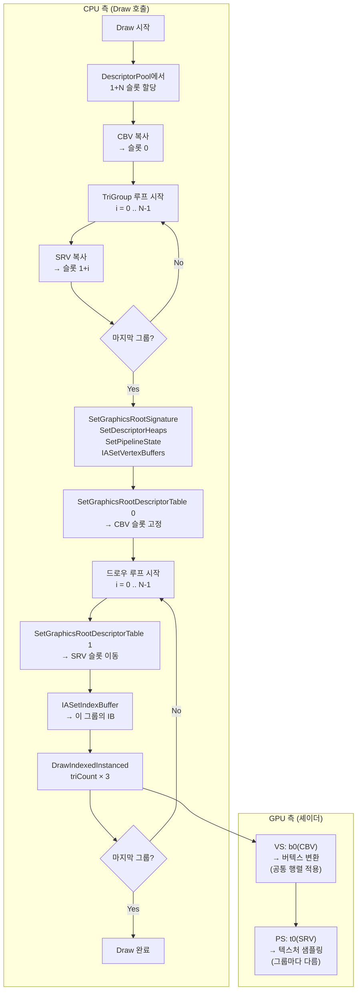

# Chapter 12 — Q&A

---

## Q1. Obj와 TriGroup의 차이가 뭔가요? CBV vs SRV는 왜?

### 한 줄 답변

> **Obj(Object)** = 하나의 3D 물체 전체.  
> **TriGroup(Triangle Group)** = 그 물체를 이루는 **면(face) 단위의 조각**.  
> 둘 다 셰이더에 데이터를 전달하지만, 전달하는 **데이터의 종류**가 다르다.

---

### Object란?

`CBasicMeshObject` 하나가 Object다.  
예를 들어 박스(정육면체) 하나 = Object 하나.

Object는 **"이 물체가 지금 어디에, 어떤 자세로 있는가"** 를 담는다.  
그 정보가 바로 **World/View/Projection 행렬**이다 → **Constant Buffer (CBV)** 에 들어간다.

```
Object의 관심사:
  "박스가 월드 좌표 (0, 0, 0.25)에, X축으로 45도 기울어져 있다"
  → CONSTANT_BUFFER_DEFAULT { matWorld, matView, matProj }
  → CBV(Constant Buffer View) : b0 레지스터
```

CBV는 드로우콜 전에 한 번만 설정하면 되고, **같은 버텍스 셰이더**가 모든 면에 공통으로 사용한다.

---

### TriGroup이란?

Object 안에는 **여러 면**이 있다.  
박스라면 앞/뒤/좌/우/위/아래 총 6면.

각 면은 **"어떤 텍스처를 입힐 것인가"** 가 다르다.  
텍스처 = 이미지 데이터 = **Shader Resource View (SRV)** 로 셰이더에 전달된다.

```
TriGroup의 관심사:
  "이 면에는 tex_00.dds 이미지를 붙인다"
  → ID3D12Resource* (텍스처 리소스)
  → SRV(Shader Resource View) : t0 레지스터
```

SRV는 **면마다 다른 값**이므로, 드로우콜 루프 안에서 매번 교체된다.

---

### "Object에도 SRV가 있지 않나요?"

```
셰이더 코드:
  cbuffer ... : register(b0) { matrix... }   ← CBV (Object용)
  Texture2D texDiffuse : register(t0);        ← SRV (TriGroup용)
```

셰이더에는 두 종류의 입력이 모두 있다.  
다만 **레지스터 슬롯**이 다르고, **업데이트 빈도**가 다르다.

| | Object (CBV, b0) | TriGroup (SRV, t0) |
|---|---|---|
| 내용 | World/View/Proj 행렬 | 텍스처 이미지 |
| 업데이트 | 오브젝트당 1회 | 삼각형 그룹마다 1회 |
| Root Param | `rootParameters[0]` | `rootParameters[1]` |
| 크기 | 고정 (192 bytes) | 가변 (이미지 크기) |

---

### 전체 관계 요약 다이어그램

```
CBasicMeshObject (= "박스" Object 1개)
│
├── Vertex Buffer (공유: 박스의 모든 꼭짓점)
│
├── [RootParam 0] CBV ─────────────────────────────────────────
│       CONSTANT_BUFFER_DEFAULT {                              │
│           matWorld (이 박스의 위치/회전)                       │ 오브젝트당
│           matView  (카메라)                                   │    1회 설정
│           matProj  (투영)                                     │
│       }                                                       │
│                                                              ─
├── TriGroup[0] (+z 면, tex_00.dds)
│   ├── Index Buffer  [0,1,2, 0,2,3] ── 삼각형 2개
│   └── [RootParam 1] SRV ─ tex_00.dds ← DrawIndexedInstanced()
│
├── TriGroup[1] (-z 면, tex_01.dds)
│   ├── Index Buffer  [6,7,8, 6,8,9]
│   └── [RootParam 1] SRV ─ tex_01.dds ← DrawIndexedInstanced()
│
├── TriGroup[2] (-x 면, tex_02.dds)
│   └── ...
│
...
└── TriGroup[5] (-y 면, tex_05.dds)
    └── [RootParam 1] SRV ─ tex_05.dds ← DrawIndexedInstanced()
```

---

## Q2. TriGroup의 구조 — 버텍스, 인덱스, 텍스처까지

### Box의 좌표계

`CreateBoxMesh(... fHalfBoxLen=0.25f)` 로 만들면  
반변 길이가 0.25이므로 실제 박스는 **0.5 × 0.5 × 0.5** 크기다.

```
박스의 8개 꼭짓점 (월드 포지션):

        [4]─────────[7]
       /|           /|
      / |          / |
    [0]─────────[3]  |   ← Y 위쪽
     |  |        |  |
     | [5]───────|─[6]
     | /          | /
     |/           |/
    [1]─────────[2]

 인덱스별 좌표 (fHalfBoxLen = 0.25):
  [0] = (-0.25,  0.25,  0.25)   좌상앞
  [1] = (-0.25, -0.25,  0.25)   좌하앞
  [2] = ( 0.25, -0.25,  0.25)   우하앞
  [3] = ( 0.25,  0.25,  0.25)   우상앞
  [4] = (-0.25,  0.25, -0.25)   좌상뒤
  [5] = (-0.25, -0.25, -0.25)   좌하뒤
  [6] = ( 0.25, -0.25, -0.25)   우하뒤
  [7] = ( 0.25,  0.25, -0.25)   우상뒤
```

---

### TriGroup 하나의 내부 구조 (+z 앞면 예시)

```
TriGroup[0] — +z 면 (tex_00.dds)

[버텍스 버퍼] (Object 전체 공유, 실제는 압축됨)
  v0 = position(-0.25, 0.25, 0.25), UV(0.0, 0.0)   좌상
  v1 = position(-0.25,-0.25, 0.25), UV(0.0, 1.0)   좌하
  v2 = position( 0.25,-0.25, 0.25), UV(1.0, 1.0)   우하
  v3 = position( 0.25, 0.25, 0.25), UV(1.0, 0.0)   우상

[인덱스 버퍼] — 이 TriGroup만의 전용 버퍼
  삼각형1: v3 → v0 → v1   (인덱스: 3, 0, 1)
  삼각형2: v3 → v1 → v2   (인덱스: 3, 1, 2)
  총 6개의 WORD 값: [3, 0, 1, 3, 1, 2]

[SRV] → tex_00.dds 텍스처 이미지

                UV (0,0)──────UV (1,0)
                   │  삼각형1 /│
                   │        /  │
                   │      /    │
                   │    /  삼각형2│
                UV (0,1)──────UV (1,1)
```

**왜 버텍스 버퍼는 공유하고 인덱스 버퍼는 그룹마다 따로 있나?**  
버텍스(위치/UV 정보)는 6면이 일부 공유하기 때문에 한 번만 GPU에 올린다.  
인덱스는 "어느 버텍스를 어떤 순서로 쓸까"를 면마다 다르게 지정하기 위해 그룹별로 분리한다.

---

### Box vs Quad — 무엇이 다른가

#### Box (정육면체)

```
3D 입체 도형. 6개의 면.
각 면 = 2개의 삼각형 = 1개의 TriGroup.
총 6개의 TriGroup, 각각 다른 텍스처.

  앞면(+z) ─── tex_00.dds
  뒷면(-z) ─── tex_01.dds
  왼면(-x) ─── tex_02.dds
  오른면(+x) ── tex_03.dds
  윗면(+y) ─── tex_04.dds
  아랫면(-y) ── tex_05.dds
```

#### Quad (사각형 평면)

```
2D 평면 도형. 1개의 면.
1개의 TriGroup, 1개의 텍스처(tex_06.dds).

  v0(좌상)─────v1(우상)
    │  \          │
    │    \삼각2   │
    │삼각1 \      │
  v3(좌하)─────v2(우하)

  삼각형1: v0 → v1 → v2   (인덱스: 0, 1, 2)
  삼각형2: v0 → v2 → v3   (인덱스: 0, 2, 3)
```

---

## Q3. `InsertTriGroup(pMeshObj, pIndexList + i*6, 2, wchTexFileNameList[i])` 분석

### 전체 맥락

```cpp
WORD pIndexList[36] = {};   // 36개 = 6면 × 6인덱스

CreateBoxMesh(&pVertexList, pIndexList, 36, 0.25f);
// CreateBoxMesh가 pIndexList를 채운 후:
// pIndexList[0..5]  = +z 면 인덱스 (삼각형 2개 = 6개)
// pIndexList[6..11] = -z 면 인덱스
// pIndexList[12..17]= -x 면 인덱스
// pIndexList[18..23]= +x 면 인덱스
// pIndexList[24..29]= +y 면 인덱스
// pIndexList[30..35]= -y 면 인덱스

g_pRenderer->BeginCreateMesh(pMeshObj, pVertexList, dwVertexCount, 6);
for (DWORD i = 0; i < 6; i++)
{
    g_pRenderer->InsertTriGroup(pMeshObj, pIndexList + i * 6, 2, wchTexFileNameList[i]);
}
```

### `pIndexList + i*6` 해석 — 포인터 슬라이싱

```
pIndexList 배열 메모리 레이아웃:
인덱스:  [ 0  1  2  3  4  5 | 6  7  8  9 10 11 | 12 ... | 18 ... | 24 ... | 30 ... ]
면:      [────── +z 면 ─────|──── -z 면 ────────| -x 면  |  +x 면 |  +y 면 | -y 면  ]
         ↑                   ↑                   ↑        ↑        ↑        ↑
   i=0: +0               i=1: +6            i=2: +12  i=3: +18  i=4: +24  i=5: +30
```

`pIndexList + i*6` = i번째 면의 시작 주소.  
`InsertTriGroup`에 이 주소를 넘기면, 그 함수는 6개의 인덱스(= 삼각형 2개)만 읽는다.

### 인자 하나씩 뜯어보기

```cpp
g_pRenderer->InsertTriGroup(
    pMeshObj,            // 어느 오브젝트에 추가할지
    pIndexList + i * 6,  // 이 그룹의 인덱스 배열 시작 주소 (6개짜리 슬라이스)
    2,                   // dwTriCount = 삼각형 2개
                         //   → GPU에 DrawIndexedInstanced(2*3=6, ...) 로 전달됨
    wchTexFileNameList[i] // 이 면에 붙일 텍스처 파일명
);
```

내부 흐름:

```
InsertTriGroup(pMeshObj, pIndexList+0, 2, L"tex_00.dds")  → i=0, +z면
  ↓
InsertIndexedTriList(pIndexList+0, 2, L"tex_00.dds")
  ↓
  CreateIndexBuffer(2*3=6개 인덱스) → GPU에 WORD[6] 업로드
  CreateTextureFromFile(L"tex_00.dds") → DDS 파일 로드 → TEXTURE_HANDLE 생성
  m_pTriGroupList[0] = { pIndexBuffer, IndexBufferView, dwTriCount=2, pTexHandle }
```

### 루프 전체 실행 결과

```
i=0: TriGroup[0] ← 인덱스[0..5],  tex_00.dds (+z 앞면)
i=1: TriGroup[1] ← 인덱스[6..11], tex_01.dds (-z 뒷면)
i=2: TriGroup[2] ← 인덱스[12..17],tex_02.dds (-x 왼면)
i=3: TriGroup[3] ← 인덱스[18..23],tex_03.dds (+x 오른면)
i=4: TriGroup[4] ← 인덱스[24..29],tex_04.dds (+y 윗면)
i=5: TriGroup[5] ← 인덱스[30..35],tex_05.dds (-y 아랫면)
```

---

## 전체 렌더링 흐름 요약



---

## Q4. 왜 면마다 DrawIndexedInstanced를 따로 호출해야 하는가? 박스 전체를 한 번에 못 그리나?

### 핵심 이유: GPU 셰이더에는 텍스처 슬롯이 1개뿐이다

셰이더 코드를 보면:

```hlsl
Texture2D texDiffuse : register(t0);   // 텍스처 슬롯은 t0 딱 하나
```

`DrawIndexedInstanced`를 한 번 호출하면, GPU는 그 드로우콜 안의 **모든 삼각형**에 대해  
**현재 t0에 바인딩된 텍스처 하나**를 사용한다.

박스의 6면(12삼각형)을 한 번에 그리면 t0에는 텍스처가 1개밖에 묶이지 않으므로  
**6면 전부 같은 텍스처**가 칠해진다.

```
한 번에 그리면:
  DrawIndexedInstanced(12*3, ...)
  ├── 앞면 삼각형들 → t0 = tex_00.dds ✔
  ├── 뒷면 삼각형들 → t0 = tex_00.dds ✘ (틀린 텍스처!)
  ├── 왼면 삼각형들 → t0 = tex_00.dds ✘
  └── ...

면마다 나눠서 그리면:
  SetDescriptorTable(1, SRV→tex_00) → DrawIndexed(앞면)   → t0 = tex_00 ✔
  SetDescriptorTable(1, SRV→tex_01) → DrawIndexed(뒷면)   → t0 = tex_01 ✔
  SetDescriptorTable(1, SRV→tex_02) → DrawIndexed(왼면)   → t0 = tex_02 ✔
  ...
```

**따라서 텍스처를 교체하려면 반드시 드로우콜을 분리해야 한다.**

---

### "SRV를 드로우콜마다 교체한다"는 것의 실체

"교체"란 GPU에게 "다음 드로우콜에서는 t0으로 이 텍스처를 써라"라고 알려주는 것이다.  
그 명령이 바로 `SetGraphicsRootDescriptorTable(1, ...)` 이다.

```cpp
// Draw() 내부의 드로우 루프 전체
CD3DX12_GPU_DESCRIPTOR_HANDLE gpuHandle(gpuDescriptorTable,
                                         DESCRIPTOR_COUNT_PER_OBJ,   // CBV 1개 건너뜀
                                         srvDescriptorSize);
for (DWORD i = 0; i < m_dwTriGroupCount; i++)
{
    // ① t0 슬롯이 가리키는 SRV를 이 그룹의 텍스처로 교체
    pCommandList->SetGraphicsRootDescriptorTable(1, gpuHandle);

    // ② 핸들을 한 칸 앞으로 이동 (다음 루프에서 다음 텍스처를 가리키게)
    gpuHandle.Offset(1, srvDescriptorSize);

    // ③ 이 면의 인덱스 버퍼 세팅
    pCommandList->IASetIndexBuffer(&pTriGroup->IndexBufferView);

    // ④ 실제 그리기 — t0 = 이번에 세팅한 SRV
    pCommandList->DrawIndexedInstanced(pTriGroup->dwTriCount * 3, 1, 0, 0, 0);
}
```

`SetGraphicsRootDescriptorTable(1, gpuHandle)`은 **"Root Parameter 1번(= t0)이  
이제부터 gpuHandle이 가리키는 Descriptor를 사용하라"** 고 CommandList에 기록하는 것이다.

다음 `DrawIndexedInstanced`가 실행될 때 GPU는 그 기록을 읽어  
해당 Descriptor가 가리키는 텍스처로 픽셀을 샘플링한다.

---

### "SRV 복사"와 "SRV 슬롯 이동" 두 단계가 왜 분리되어 있는가

`Draw()` 안을 보면 루프가 **두 개**로 나뉜다.

#### 1단계 — SRV 복사 루프 (드로우 전)

```cpp
// DescriptorPool(shader-visible heap)에서 연속 슬롯을 통째로 할당
//   슬롯 레이아웃: [ CBV | SRV_0 | SRV_1 | SRV_2 | SRV_3 | SRV_4 | SRV_5 ]
//                  ↑ idx 0  ↑ idx 1  ↑ idx 2  ...

// CBV 복사 (슬롯 0)
pD3DDeivce->CopyDescriptorsSimple(1, Dest, pCB->CBVHandle, ...);
Dest.Offset(1, srvDescriptorSize);

// SRV 복사 루프 (슬롯 1 ~ 6)
for (DWORD i = 0; i < m_dwTriGroupCount; i++)
{
    pD3DDeivce->CopyDescriptorsSimple(1, Dest, pTexHandle->srv, ...);
    Dest.Offset(1, srvDescriptorSize);  // CPU 핸들을 한 칸씩 전진
}
```

이 루프는 각 TriGroup의 SRV를 **shader-visible heap의 연속 슬롯**에 미리 복사해 놓는다.  
왜 미리 복사하는가? D3D12 규칙상 GPU가 읽을 수 있는 Descriptor Heap(shader-visible)은  
**CPU가 직접 쓸 수 없고**, 반드시 non-shader-visible heap → shader-visible heap으로  
`CopyDescriptorsSimple`을 통해 옮겨야 하기 때문이다.

```
non-shader-visible heap (CPU가 직접 Write 가능)
  텍스처 로드 시점에 미리 만들어 둔 SRV들:
  pTexHandle->srv ─── [SRV for tex_00.dds]
                 ─── [SRV for tex_01.dds]
                 ...

              CopyDescriptorsSimple (복사)
                      ↓

shader-visible heap (DescriptorPool, GPU가 읽을 수 있음)
  [ CBV | SRV_0 | SRV_1 | SRV_2 | SRV_3 | SRV_4 | SRV_5 ]
    idx0   idx1   idx2   idx3   idx4   idx5   idx6
```

#### 2단계 — 드로우 루프 (SRV 슬롯 이동)

```
shader-visible heap 상의 연속 슬롯:
  [ CBV | SRV_0 | SRV_1 | SRV_2 | SRV_3 | SRV_4 | SRV_5 ]
           ↑       ↑       ↑       ↑       ↑       ↑
          i=0     i=1     i=2     i=3     i=4     i=5

i=0: SetDescriptorTable(1, SRV_0의 주소) → DrawIndexed(앞면) → GPU: t0=tex_00
i=1: SetDescriptorTable(1, SRV_1의 주소) → DrawIndexed(뒷면) → GPU: t0=tex_01
...
```

`gpuHandle.Offset(1, srvDescriptorSize)`는 GPU 핸들 포인터를  
**한 슬롯(= srvDescriptorSize 바이트)만큼 앞으로 이동**시키는 것이다.  
덕분에 다음 루프에서 `SetGraphicsRootDescriptorTable`에 넘기는 주소가  
자동으로 다음 텍스처를 가리키게 된다.

---

### 한눈에 보는 메모리 구조와 루프 관계

```
Draw() 시작 시점에 DescriptorPool에서 할당된 연속 블록:

GPU heap 주소:  [base+0]   [base+1]   [base+2]  ... [base+6]
                  CBV       SRV[0]     SRV[1]         SRV[5]
                   │          │          │               │
                   │      tex_00.dds tex_01.dds      tex_05.dds
                   │
           SetDescriptorTable(0, base+0) ← 오브젝트당 1회, 고정
                             (1, base+1) ← i=0 드로우 전
                             (1, base+2) ← i=1 드로우 전
                             ...
                             (1, base+6) ← i=5 드로우 전

루프마다:
  핸들이 base+1 → base+2 → ... → base+6 으로 한 칸씩 이동
  = "SRV 슬롯 이동"
```

**요약:**

| 단계 | 코드 | 의미 |
|------|------|------|
| SRV 복사 (1단계) | `CopyDescriptorsSimple` | non-shader-visible → shader-visible heap 복사 |
| SRV 슬롯 이동 (2단계) | `gpuHandle.Offset(1, ...)` | GPU 핸들을 다음 SRV 위치로 전진 |
| SRV 교체 | `SetGraphicsRootDescriptorTable(1, gpuHandle)` | GPU에게 "다음 드로우는 이 SRV를 t0으로 써라" 지시 |
| 드로우콜 분리 이유 | 셰이더 t0은 1개뿐 | 면마다 텍스처가 다르면 드로우콜을 반드시 나눠야 함 |

---

## Q5. CopyDescriptorsSimple이 뭔가? Upload Heap → Default Heap으로 옮기는 건가?

아니다. Upload/Default Heap과는 **완전히 다른 레이어**의 이야기다.

| 개념 | 대상 | 내용 |
|------|------|------|
| Upload Heap → Default Heap | **리소스 데이터** | 텍스처 픽셀, 버텍스 좌표 등 실제 데이터 |
| `CopyDescriptorsSimple` | **Descriptor** | 리소스를 "어떻게 읽을지" 기술한 작은 구조체(~64 bytes) |

Descriptor는 텍스처 픽셀 데이터 자체가 아니라 **"이 리소스는 이 포맷, 이 크기, t0 슬롯으로 읽어라"** 는 메타데이터다.

```
리소스 계층 (데이터)              Descriptor 계층 (뷰/메타데이터)
─────────────────────             ──────────────────────────────
Upload Heap  ─ 텍스처 픽셀        non-shader-visible heap  ← CPU가 자유롭게 Write
Default Heap ← GPU 전용                    │
(텍스처 픽셀이 영구적으로 여기 있음)   CopyDescriptorsSimple
                                           ↓
                                  shader-visible heap     ← GPU가 렌더링 중에 읽음
                                  (= DescriptorPool)
```

따라서 `CopyDescriptorsSimple`은:
- **무엇을 복사하나** → Descriptor (작은 구조체)
- **어디서 어디로** → non-shader-visible heap → shader-visible heap (DescriptorPool)
- **텍스처 픽셀은** → Default Heap에 그대로, 아무것도 움직이지 않음

```cpp
pD3DDevice->CopyDescriptorsSimple(
    1,                // 복사할 Descriptor 개수
    Dest,             // 목적지: shader-visible heap의 슬롯
    pTexHandle->srv,  // 원본: non-shader-visible heap의 SRV Descriptor
    D3D12_DESCRIPTOR_HEAP_TYPE_CBV_SRV_UAV
);
```

---

## Q6. DescriptorPool과 CopyDescriptorsSimple의 차이가 뭔가?

비교 대상이 아니라 **같이 쓰이는 것**이다. 레벨이 다르다.

| | CDescriptorPool | CopyDescriptorsSimple |
|---|---|---|
| 종류 | 이 프로젝트의 커스텀 클래스 | D3D12 내장 API 함수 |
| 역할 | shader-visible heap의 **슬롯 관리자** | Descriptor **내용을 복사**하는 동작 |
| 비유 | 노트의 "몇 번째 줄에 쓸지" 결정 | 그 줄에 실제 글씨를 씀 |

```
DescriptorPool.AllocDescriptorTable(7)
  → shader-visible heap에서 7개 슬롯 예약
  → "어디에 쓸지"의 CPU/GPU 핸들(주소) 반환

CopyDescriptorsSimple(dst=예약된 슬롯, src=텍스처의 SRV)
  → "무엇을 쓸지" — Descriptor 내용을 그 슬롯에 복사
```

전체 흐름:

```
① DescriptorPool.AllocDescriptorTable(7)   ← 슬롯 위치 확보
         ↓
② CopyDescriptorsSimple(Dest, CBVHandle)   ← 슬롯 0에 CBV 내용 기입
   CopyDescriptorsSimple(Dest, srv[0])     ← 슬롯 1에 SRV 내용 기입
   CopyDescriptorsSimple(Dest, srv[1])     ← 슬롯 2에 SRV 내용 기입
   ...
         ↓
③ SetGraphicsRootDescriptorTable(0, gpuHandle)  ← GPU에게 "이 슬롯을 b0으로 써라"
   SetGraphicsRootDescriptorTable(1, gpuHandle)  ← GPU에게 "이 슬롯을 t0으로 써라"
```

---

## Q7. 애초에 shader-visible heap에 바로 넣으면 되는 거 아닌가? 왜 non-shader-visible에 뒀다가 옮기나?

**수명(lifetime)이 다르기 때문이다.**

### shader-visible heap(DescriptorPool)은 매 프레임 초기화된다

```cpp
void CDescriptorPool::Reset()
{
    m_AllocatedDescriptorCount = 0;  // Present() 후 매 프레임 호출
}
```

`Reset()`은 슬롯 포인터를 0으로 되돌린다. 다음 프레임의 `AllocDescriptorTable`이 같은 자리에 덮어쓴다.  
shader-visible heap은 **1프레임짜리 임시 작업공간**이다.

```
프레임 1:  [ CBV | SRV_tex00 | SRV_tex01 | ... ]  ← Draw()가 채움
           ↓ Reset()
프레임 2:  [ CBV | SRV_tex00 | SRV_tex01 | ... ]  ← 같은 자리에 다시 덮어씀
```

### 텍스처 SRV는 게임 내내 살아있어야 한다

텍스처는 씬이 끝날 때까지 유지된다. 만약 처음부터 shader-visible heap에 넣으면:

```
텍스처 로드 → shader-visible heap 슬롯 42에 SRV 생성
프레임 1 Reset() → 슬롯 42가 재사용 가능 상태
프레임 2 Draw() → 슬롯 42에 다른 CBV가 덮어씀 → 텍스처 SRV 파괴
```

### 두 heap의 역할 분리

| | non-shader-visible (SingleDescriptorAllocator) | shader-visible (DescriptorPool) |
|---|---|---|
| **수명** | 텍스처 로드 ~ 삭제 (영구) | 1프레임 (매 프레임 Reset) |
| **크기** | 로드된 텍스처 수만큼 | 1프레임 드로우콜 수만큼 |
| **역할** | SRV 원본 보관소 | GPU 렌더링 중 참조하는 작업공간 |
| **CPU Write** | 자유롭게 가능 | 가능하지만 제약 있음 |
| **GPU Read** | 불가 | 가능 |

```
non-shader-visible (영구 보관)
  tex_00의 SRV ──┐
  tex_01의 SRV ──┤  CopyDescriptorsSimple  →  shader-visible (1프레임용)
  tex_02의 SRV ──┘  Draw()마다 필요한 것만 골라서 복사         ↓ Reset() 매 프레임
  ...계속 살아있음                                         다시 채워짐
```

**결론:** shader-visible heap에 처음부터 넣으면 `Reset()` 때 날아가기 때문에,  
영구 보관은 non-shader-visible에 하고, 렌더링 직전에 필요한 것만 골라 복사하는 구조다.

---

## Q8. `GetCurrentBackBufferIndex()`는 render target이 2개면 0, 1, 0, 1로 교대로 나오나?

**맞다.** `Present()` 호출마다 스왑체인이 버퍼를 교체하므로 인덱스가 교대로 반환된다.

```
Present() → GetCurrentBackBufferIndex() = 0
Present() → GetCurrentBackBufferIndex() = 1
Present() → GetCurrentBackBufferIndex() = 0
...
```

단, `GetCurrentBackBufferIndex()`는 **`Present()` 호출 이후에** 불러야 다음 프레임의 올바른 인덱스를 얻는다.  
`Present()` 전에 호출하면 현재 렌더링 중인 버퍼 인덱스가 반환된다.

---

## Q9. `DESCRIPTOR_COUNT_PER_OBJ + (m_dwTriGroupCount * DESCRIPTOR_COUNT_PER_TRI_GROUP)` 왜 이런 숫자인가?

```cpp
static const UINT DESCRIPTOR_COUNT_PER_OBJ       = 1;  // CBV 1개 (오브젝트 공통)
static const UINT DESCRIPTOR_COUNT_PER_TRI_GROUP  = 1;  // SRV 1개 (그룹별 텍스처)
static const UINT MAX_TRI_GROUP_COUNT_PER_OBJ     = 8;
```

디스크립터 테이블 레이아웃이 아래와 같이 생겼기 때문이다.

```
| CBV(공통) | SRV(그룹0) | SRV(그룹1) | ... | SRV(그룹N) |
  ←── 1개 ──→ ←──────────── triGroupCount 개 ──────────────→
```

- **CBV**: 오브젝트 전체(Transform 행렬)가 공용 → 1개만 필요  
- **SRV**: 트라이그룹마다 텍스처가 다름 → 그룹 수만큼 필요

최대 경우(박스 8면) `1 + 8×1 = 9`개가 된다.  
실제 할당은 `dwRequiredDescriptorCount = 1 + (m_dwTriGroupCount × 1)` 로, 오브젝트 실제 그룹 수만큼만 잡는다.

---

## Q10. `m_dwTriGroupCount`가 6, 1, 6, 1 교대로 보이는 이유

두 오브젝트가 **별도로 생성**되어 있기 때문이다.

```cpp
g_pMeshObj0 = CreateBoxMeshObject();  // m_dwTriGroupCount = 6 (6면 × 텍스처 1개씩)
g_pMeshObj1 = CreateQuadMesh();       // m_dwTriGroupCount = 1 (1면 × 텍스처 1개)
```

한 프레임의 렌더 순서:

```
RenderMeshObject(g_pMeshObj0, &g_matWorld0);  → m_dwTriGroupCount = 6
RenderMeshObject(g_pMeshObj0, &g_matWorld1);  → m_dwTriGroupCount = 6  (같은 메쉬, 다른 위치)
RenderMeshObject(g_pMeshObj1, &g_matWorld2);  → m_dwTriGroupCount = 1
```

실제로는 **6, 6, 1** 순서로 호출된다.  
박스를 두 위치에 그리는 것도 이 예제가 보여주는 포인트다(같은 메쉬 오브젝트, 다른 World Matrix).

---

## Q11. `Dest` (CD3DX12_CPU_DESCRIPTOR_HANDLE)가 뭔가?

`Dest`는 **shader-visible heap에서 현재 쓸 슬롯 위치를 가리키는 쓰기 커서**다.

```cpp
// cpuDescriptorTable = AllocDescriptorTable이 반환한 시작 슬롯
CD3DX12_CPU_DESCRIPTOR_HANDLE Dest(cpuDescriptorTable,
    BASIC_MESH_DESCRIPTOR_INDEX_PER_OBJ_CBV, srvDescriptorSize);

CopyDescriptorsSimple(1, Dest, pCB->CBVHandle, ...); // 슬롯 0에 CBV 복사
Dest.Offset(1, srvDescriptorSize);                    // 슬롯 1로 이동

for (DWORD i = 0; i < m_dwTriGroupCount; i++)
{
    CopyDescriptorsSimple(1, Dest, pTexHandle->srv, ...); // 슬롯 1+i에 SRV 복사
    Dest.Offset(1, srvDescriptorSize);                     // 다음 슬롯으로 이동
}
```

```
cpuDescriptorTable (할당받은 슬롯 시작)
┌──────────┬──────────┬──────────┬─ ─ ─┐
│  CBV[0]  │  SRV[0]  │  SRV[1]  │ ... │
└──────────┴──────────┴──────────┴─ ─ ─┘
  ↑Dest 초기     ↑Offset(1)후    ↑Offset(2)후
```

CPU 핸들에 쓴 내용이 곧 shader-visible heap의 해당 슬롯이므로,  
대응하는 GPU 핸들(`gpuDescriptorTable`)로 `SetGraphicsRootDescriptorTable`을 호출하면 GPU가 그 슬롯을 읽는다.

---

## Q12. `pCB->CBVHandle`이 뭔가? Upload Heap인가?

`pCB`는 `CB_CONTAINER` 구조체다.

```cpp
struct CB_CONTAINER
{
    D3D12_CPU_DESCRIPTOR_HANDLE  CBVHandle;     // non-shader-visible 힙의 CPU 핸들
    D3D12_GPU_VIRTUAL_ADDRESS    pGPUMemAddr;   // Upload Heap의 GPU Virtual Address
    UINT8*                       pSystemMemAddr; // CPU에서 데이터를 쓰는 주소
};
```

`CSimpleConstantBufferPool::Initialize()`에서 미리 만들어 둔다:

```
Upload Heap (ID3D12Resource)
┌──────────┬──────────┬──────────┬─ ─ ─┐
│  CB[0]   │  CB[1]   │  CB[2]   │ ... │  ← pSystemMemAddr로 CPU write
└──────────┴──────────┴──────────┴─ ─ ─┘

Non-Shader-Visible CBV Heap (m_pCBVHeap)
┌──────────┬──────────┬──────────┬─ ─ ─┐
│ CBV[0]   │ CBV[1]   │ CBV[2]   │ ... │  ← CBVHandle이 각 슬롯 주소
└──────────┴──────────┴──────────┴─ ─ ─┘
```

| 필드 | 역할 |
|---|---|
| `pSystemMemAddr` | CPU에서 행렬 등 상수값을 직접 write하는 주소 |
| `pGPUMemAddr` | Upload Heap의 GPU Virtual Address |
| `CBVHandle` | Non-Shader-Visible 힙의 CPU 디스크립터 핸들 |

실제 흐름:

```
① pSystemMemAddr → 행렬 데이터 CPU write
② CBVHandle(non-visible) → CopyDescriptorsSimple → cpuDescriptorTable(visible)
③ SetGraphicsRootDescriptorTable(0, gpuDescriptorTable) → 셰이더가 b0으로 읽음
```

---

## Q13. `SetDescriptorHeaps`의 역할은? CPU Dest를 채웠으면 바로 `SetGraphicsRootDescriptorTable`이 가능한가?

### `SetDescriptorHeaps`의 역할

GPU에게 **"이 커맨드리스트가 사용할 Shader-Visible 힙이 이것이다"** 라고 바인딩하는 것이다.  
`SetGraphicsRootDescriptorTable`에 넘기는 GPU 핸들은 이 힙 안의 주소이기 때문에,  
반드시 먼저 힙을 등록해야 GPU가 주소를 해석할 수 있다.

### CPU Dest를 채운 뒤 바로 `SetGraphicsRootDescriptorTable(0)` 가능한가?

가능하다. `CopyDescriptorsSimple`로 슬롯을 모두 채우고 나면  
그 데이터는 이미 Shader-Visible 힙에 있으므로, GPU 핸들(`gpuDescriptorTable`)을 바로 넘기면 된다.

### CPU handle에 write하면 GPU handle도 자동으로 반영되는가?

그렇다. `AllocDescriptorTable`을 보면:

```cpp
*pOutCPUDescriptor = CD3DX12_CPU_DESCRIPTOR_HANDLE(m_cpuDescriptorHandle, offset, ...);
*pOutGPUDescriptor = CD3DX12_GPU_DESCRIPTOR_HANDLE(m_gpuDescriptorHandle, offset, ...);
```

**같은 offset**으로 같은 힙의 같은 슬롯을 CPU/GPU 두 관점으로 반환한 것이다.  
힙 자체가 `D3D12_DESCRIPTOR_HEAP_FLAG_SHADER_VISIBLE`인 하나의 힙이므로,  
CPU 핸들로 내용을 쓰면 GPU 핸들이 가리키는 슬롯에도 즉시 반영된다.

---

## Q14. 왜 for 루프로 `SetGraphicsRootDescriptorTable(1)`을 반복 호출하나? 한 번에 안 되나?

루트 시그니처에서 RootParam[1]이 **SRV 1개짜리 테이블**로 선언되어 있기 때문이다.

```cpp
rangesPerTriGroup[0].Init(D3D12_DESCRIPTOR_RANGE_TYPE_SRV, 1, 0); // SRV 1개만!
rootParameters[1].InitAsDescriptorTable(...rangesPerTriGroup...);   // t0 = SRV 1개
```

셰이더는 `t0` 하나만 참조한다. 드로우콜 하나에는 t0이 1개만 바인딩되므로,  
면마다 텍스처를 바꾸려면 드로우콜 전에 매번 교체해야 한다.

```
Draw 0: SetDescriptorTable(1, SRV[0]) → t0 = tex_00 → DrawIndexed(앞면) ✔
Draw 1: SetDescriptorTable(1, SRV[1]) → t0 = tex_01 → DrawIndexed(뒷면) ✔
Draw 2: SetDescriptorTable(1, SRV[2]) → t0 = tex_02 → DrawIndexed(왼면) ✔
```

만약 `rangesPerTriGroup`을 SRV 6개짜리로 선언하고 셰이더도 `t0~t5`를 쓰도록 바꾼다면 루프 없이 한 번에 가능하다.  
하지만 셰이더가 `t0` 하나만 쓰는 구조이므로 드로우마다 RootParam[1]을 갱신하는 방식을 택한 것이다.

---

## Q15. `DrawIndexedInstanced`에서 왜 `dwTriCount * 3`인가?

첫 번째 인자는 **인덱스 개수(IndexCountPerInstance)** 다.  
삼각형 1개 = 정점 3개 = 인덱스 3개이므로:

```
IndexCount = 삼각형 개수 × 3
```

쿼드(사각형) 1면 예시:
- `dwTriCount = 2` (삼각형 2개)
- `DrawIndexedInstanced(2 * 3 = 6, ...)` → 인덱스 6개

---

## Q16. `CreateBasicMeshObject()`의 역할은?

**빈 메쉬 오브젝트를 생성하고 공통 GPU 리소스를 초기화하는 팩토리 함수**다.

```cpp
void* CD3D12Renderer::CreateBasicMeshObject()
{
    CBasicMeshObject* pMeshObj = new CBasicMeshObject;
    pMeshObj->Initialize(this);  // RootSignature + PSO 초기화
    return pMeshObj;
}
```

내부 단계:

```
CreateBasicMeshObject()
    └─ new CBasicMeshObject
    └─ Initialize(pRenderer)
            └─ InitCommonResources()  ← static ref count로 최초 1회만 실행
                    ├─ InitRootSignature()  → RootSignature 생성 (CBV/SRV 레이아웃 정의)
                    └─ InitPipelineState()  → PSO 생성 (셰이더, 입력 레이아웃, 렌더 설정)
```

### `InitCommonResources`의 `m_dwInitRefCount` — 왜 skip하나?

`m_pRootSignature`와 `m_pPipelineState`는 **static 멤버**다.

```cpp
static ID3D12RootSignature* m_pRootSignature;
static ID3D12PipelineState* m_pPipelineState;
static DWORD                m_dwInitRefCount;
```

모든 인스턴스가 공유하므로 한 번만 만들면 된다.

```
첫 번째 CreateBasicMeshObject() → m_dwInitRefCount = 0
    → InitRootSignature() 실행 ✓
    → InitPipelineState() 실행 ✓
    → m_dwInitRefCount = 1

두 번째 CreateBasicMeshObject() → m_dwInitRefCount = 1
    → if(m_dwInitRefCount) goto lb_true  ← 건너뜀 (비싼 GPU 리소스 중복 생성 방지)
    → m_dwInitRefCount = 2
```

박스든 쿼드든 셰이더·파이프라인 설정은 동일하므로 RootSignature/PSO는 **전체에서 1개만 존재**한다.

### `CreateBasicMeshObject()` 이후 메쉬 데이터를 채우는 순서

| 호출 | 역할 |
|---|---|
| `CreateBasicMeshObject()` | 빈 오브젝트 생성 + RootSignature/PSO 준비 |
| `BeginCreateMesh(vertices, vertexCount, triGroupCount)` | GPU에 **버텍스 버퍼** 업로드, TriGroup 배열 할당 |
| `InsertTriGroup(indices, triCount, texFile)` 반복 | GPU에 **인덱스 버퍼** 업로드, **텍스처** 로드 후 TriGroup에 등록 |
| `EndCreateMesh()` | (현재는 비어있음) |

---

## Q17. `BeginCreateMesh`와 `InsertTriGroup`의 역할

### `BeginCreateMesh(pVertexList, dwVertexNum, dwTriGroupCount)`

```cpp
// 버텍스 버퍼를 GPU 메모리에 업로드 (모든 면 공유)
pResourceManager->CreateVertexBuffer(..., &m_VertexBufferView, &m_pVertexBuffer, pVertexList);

// InsertTriGroup을 몇 번 호출할지 미리 선언
m_dwMaxTriGroupCount = dwTriGroupCount;
m_pTriGroupList = new INDEXED_TRI_GROUP[m_dwMaxTriGroupCount];
```

- 모든 면이 공유하는 버텍스 버퍼를 **GPU에 1번만 업로드**  
- `dwTriGroupCount`로 TriGroup 배열을 미리 할당 (박스=6, 쿼드=1)

### `InsertTriGroup(pIndexList, dwTriCount, wchTexFileName)`

```cpp
// 이 면의 인덱스 버퍼를 GPU에 업로드
pResourceManager->CreateIndexBuffer(dwTriCount * 3, &IndexBufferView, &pIndexBuffer, pIndexList);

// TriGroup에 등록
pTriGroup->pIndexBuffer  = pIndexBuffer;
pTriGroup->dwTriCount    = dwTriCount;
pTriGroup->pTexHandle    = m_pRenderer->CreateTextureFromFile(wchTexFileName);  // 텍스처 로드
m_dwTriGroupCount++;
```

- 면마다 **다른 인덱스 버퍼 + 다른 텍스처**를 GPU에 업로드  
- 호출할 때마다 `m_pTriGroupList` 배열의 다음 슬롯에 추가

### 전체 구조 관계

```
버텍스 버퍼 (BeginCreateMesh에서 1번)
┌─────────────────────────────────────┐
│ v0, v1, v2, v3, ... v23 (박스 24개) │  ← 모든 면이 공유
└─────────────────────────────────────┘

인덱스 버퍼 (InsertTriGroup마다 1개씩)
TriGroup[0]: [3,0,1, 3,1,2] + tex_00.dds   ← +z 앞면
TriGroup[1]: [인덱스 6개]   + tex_01.dds   ← -z 뒷면
...
TriGroup[5]: [인덱스 6개]   + tex_05.dds   ← -y 아랫면
```

버텍스는 공유하고, **"어떤 정점을 어떤 순서로(인덱스) + 어떤 텍스처를"** 을 TriGroup 단위로 분리한 구조다.

---

## Q18. `INDEXED_TRI_GROUP`이 뭐고 `InsertIndexedTriList`와 어떻게 연결되나?

`INDEXED_TRI_GROUP`은 **한 면(트라이그룹)을 그리기 위해 필요한 GPU 리소스를 묶어둔 구조체**다.

```cpp
struct INDEXED_TRI_GROUP
{
    ID3D12Resource*         pIndexBuffer;    // GPU의 인덱스 버퍼 리소스
    D3D12_INDEX_BUFFER_VIEW IndexBufferView; // 버퍼를 어떻게 읽을지 (포맷, 크기 등)
    DWORD                   dwTriCount;      // 삼각형 개수
    TEXTURE_HANDLE*         pTexHandle;      // 이 면에 붙일 텍스처
};
```

`CBasicMeshObject`는 이것을 배열로 들고 있다:

```cpp
INDEXED_TRI_GROUP* m_pTriGroupList = nullptr;  // BeginCreateMesh에서 할당
DWORD              m_dwTriGroupCount = 0;
```

### `InsertIndexedTriList`가 채우는 쪽

```cpp
// GPU에 인덱스 버퍼 업로드
CreateIndexBuffer(dwTriCount * 3, &IndexBufferView, &pIndexBuffer, pIndexList);

// 텍스처 로드
pTexHandle = CreateTextureFromFile(wchTexFileName);

// 배열 다음 슬롯에 저장
INDEXED_TRI_GROUP* pTriGroup = m_pTriGroupList + m_dwTriGroupCount;
pTriGroup->pIndexBuffer   = pIndexBuffer;
pTriGroup->IndexBufferView = IndexBufferView;
pTriGroup->dwTriCount      = dwTriCount;
pTriGroup->pTexHandle      = pTexHandle;
m_dwTriGroupCount++;
```

### `Draw()`가 읽는 쪽

```cpp
for (DWORD i = 0; i < m_dwTriGroupCount; i++)
{
    INDEXED_TRI_GROUP* pTriGroup = m_pTriGroupList + i;

    // 텍스처 → shader-visible heap에 복사
    CopyDescriptorsSimple(1, Dest, pTriGroup->pTexHandle->srv, ...);

    // 인덱스 버퍼 세팅
    pCommandList->IASetIndexBuffer(&pTriGroup->IndexBufferView);

    // 드로우
    pCommandList->DrawIndexedInstanced(pTriGroup->dwTriCount * 3, ...);
}
```

`InsertIndexedTriList`가 **채우는 쪽**, `Draw()`가 **읽는 쪽**, `INDEXED_TRI_GROUP`은 그 사이의 **저장 컨테이너**다.

---

## Q19. `CreateBoxMeshObject`는 왜 인덱스 배열을 빈 채로 선언하나? `CreateQuadMesh`는 직접 값을 채우는데

```cpp
// CreateBoxMeshObject — 빈 배열로 선언
WORD pIndexList[36] = {};
DWORD dwVertexCount = CreateBoxMesh(&pVertexList, pIndexList, 36, 0.25f);
//                                                ↑ 이 함수가 채워줌

// CreateQuadMesh — 직접 값 작성
WORD pIndexList[] = { 0,1,2, 0,2,3 };
```

| | `CreateQuadMesh` | `CreateBoxMeshObject` |
|---|---|---|
| 버텍스 수 | 4개 (고정, 단순) | 20개 (중복 제거 계산 필요) |
| 인덱스 | 단순해서 직접 작성 | 8개 꼭짓점 + UV 중복 제거 계산이 복잡 |
| 인덱스 채우는 곳 | 코드에서 `{ }` 초기화 | `CreateBoxMesh()` 내부에서 out param으로 채움 |

박스는 꼭짓점 8개가 여러 면에서 공유되지만 UV가 면마다 달라서 최종 인덱스 값을 미리 알 수 없다.  
그래서 빈 배열을 넘기고 `CreateBoxMesh()`의 `AddVertex()` 중복 제거 로직이 채운다.

---

## Q20. `dwBasicVertexCount`가 왜 20인가? `INDEX_COUNT`는 36인데

`AddVertex()`가 **position + color + UV가 완전히 동일한 버텍스를 중복으로 처리**하기 때문이다.

36개 인덱스를 처리하면서 중복이 두 종류 발생한다:

**① 면 내부 중복 (12개) — 사각형을 삼각형 2개로 쪼갤 때**

각 면의 6개 인덱스는 꼭짓점 4개를 공유:
```
+z 면: 3,0,1,  3,1,2
        ↑중복   ↑중복
→ 6인덱스 중 4개만 고유 → 면 1개당 2개 중복
→ 6면 × 2 = 12개 중복
```

**② 면 간 중복 (4개) — 서로 다른 면에서 position+UV가 우연히 일치**

```
-x 면의 pos[0]+UV(0,0)  ==  +y 면의 pos[0]+UV(0,0)  → 중복
+x 면의 pos[3]+UV(1,0)  ==  +y 면의 pos[3]+UV(1,0)  → 중복
-x 면의 pos[5]+UV(1,1)  ==  -y 면의 pos[5]+UV(1,1)  → 중복
+x 면의 pos[6]+UV(0,1)  ==  -y 면의 pos[6]+UV(0,1)  → 중복
```

**최종 계산:**
```
36 - 12(면 내부 중복) - 4(면 간 중복) = 20개 고유 버텍스
```

---

## Q21. `AddVertex`의 `memcmp`는 정확히 무엇을 비교하나?

`BasicVertex` 구조체 전체(36바이트)를 바이트 단위로 비교한다.

```cpp
struct BasicVertex
{
    XMFLOAT3 position;  // x, y, z     → 12 bytes
    XMFLOAT4 color;     // r, g, b, a  → 16 bytes
    XMFLOAT2 texCoord;  // u, v        →  8 bytes
};                      // 총 36 bytes
```

```cpp
if (!memcmp(pVertexList + i, pVertex, sizeof(BasicVertex)))
//          ↑기존 버텍스        ↑새 버텍스  ↑36바이트 전부 비교
```

**position만 같아도 중복이 아닌 이유:**

```
박스 꼭짓점 pos[3]이 3개 면에 등장:
  +z 면: pos[3] + UV(0,0) → 버텍스 A
  +x 면: pos[3] + UV(1,0) → 버텍스 B  ← position 같지만 UV 달라 → 다른 버텍스
  +y 면: pos[3] + UV(1,0) → 버텍스 B  ← B와 완전히 동일 → 중복 처리
```

셰이더가 텍스처를 샘플링할 때 UV를 사용하므로 UV가 다른 두 꼭짓점은 절대 같은 버텍스가 될 수 없다.

### `AddVertex` 전체 동작

```cpp
DWORD AddVertex(BasicVertex* pVertexList, DWORD* pdwInOutVertexCount, const BasicVertex* pVertex)
{
    DWORD dwExistVertexCount = *pdwInOutVertexCount;

    for (DWORD i = 0; i < dwExistVertexCount; i++)
    {
        if (!memcmp(pVertexList + i, pVertex, sizeof(BasicVertex)))
            return i;   // 동일 버텍스 발견 → 기존 인덱스 반환 (추가 안 함)
    }

    // 없으면 새로 추가
    DWORD dwNewIndex = dwExistVertexCount;
    pVertexList[dwNewIndex] = *pVertex;
    *pdwInOutVertexCount = dwExistVertexCount + 1;
    return dwNewIndex;
}
```

`CreateBoxMesh` 루프에서:

```cpp
for (DWORD i = 0; i < 36; i++)
{
    BasicVertex v;
    v.position = pWorldPosList[pIndexList[i]];  // 8개 위치 중 하나
    v.texCoord = pTexCoordList[i];              // 36개 UV 중 하나 (면마다 다름)

    pOutIndexList[i] = AddVertex(pWorkingVertexList, &dwBasicVertexCount, &v);
    //  ↑ 중복이면 기존 인덱스 반환, 아니면 새로 추가 후 인덱스 반환
}
```

결과:
- `pWorkingVertexList` → 중복 없는 고유 버텍스 20개
- `pOutIndexList` → 그것을 가리키는 인덱스 36개

---

## Q22. `Draw()`의 CommandList 호출들 각각의 역할은?

### 드로우 루프 진입 전 — 오브젝트 공통 설정 (1회)

```cpp
pCommandList->SetGraphicsRootSignature(m_pRootSignature);
```
"이 드로우콜에서 사용할 셰이더 입력 레이아웃은 이것이다"  
RootParam[0] = CBV(b0), RootParam[1] = SRV(t0) 라고 GPU에 선언.

```cpp
pCommandList->SetDescriptorHeaps(1, &pDescriptorHeap);
```
"GPU가 Descriptor를 읽을 힙은 이것이다"  
이후 `SetGraphicsRootDescriptorTable`에 넘기는 GPU 핸들이 이 힙 안의 주소임을 등록.

```cpp
pCommandList->SetPipelineState(m_pPipelineState);
```
"어떤 셰이더(VS/PS)로, 어떤 설정(컬링/블렌딩/뎁스)으로 그릴 것인가"  
PSO 전체를 한 번에 바인딩.

```cpp
pCommandList->IASetPrimitiveTopology(D3D_PRIMITIVE_TOPOLOGY_TRIANGLELIST);
```
"인덱스 3개씩 묶어서 삼각형 1개로 해석해라"

```cpp
pCommandList->IASetVertexBuffers(0, 1, &m_VertexBufferView);
```
"버텍스 데이터는 이 버퍼에서 읽어라" (박스 20개 버텍스)  
모든 면이 공유하므로 루프 밖에서 1회만 설정.

```cpp
pCommandList->SetGraphicsRootDescriptorTable(0, gpuDescriptorTable);
```
"RootParam[0](b0 슬롯) = 이 GPU 핸들이 가리키는 CBV를 써라"  
World/View/Proj 행렬 → 오브젝트 전체에 공통이므로 루프 밖 1회.

---

### 드로우 루프 — 트라이그룹마다 반복 (N회)

```cpp
pCommandList->SetGraphicsRootDescriptorTable(1, gpuDescriptorTableForTriGroup);
gpuDescriptorTableForTriGroup.Offset(1, srvDescriptorSize);
```
"RootParam[1](t0 슬롯) = 이번 면의 텍스처 SRV를 써라"  
다음 루프를 위해 핸들을 한 슬롯 앞으로 이동.

```cpp
pCommandList->IASetIndexBuffer(&pTriGroup->IndexBufferView);
```
"이번 면의 인덱스 버퍼로 교체해라"  
어떤 버텍스를 어떤 순서로 쓸지를 면마다 다르게 지정.

```cpp
pCommandList->DrawIndexedInstanced(pTriGroup->dwTriCount * 3, 1, 0, 0, 0);
```
"현재 설정된 버텍스 버퍼 + 인덱스 버퍼 + t0 텍스처로 실제로 그려라"  
인덱스 `dwTriCount*3`개를 읽어 삼각형을 래스터라이즈.

---

### 한눈에 요약

```
SetRootSignature      → 셰이더 입력 구조 선언
SetDescriptorHeaps    → GPU가 읽을 힙 등록
SetPipelineState      → 셰이더 + 렌더 설정
IASetPrimitiveTopology→ 삼각형 해석 방식
IASetVertexBuffers    → 버텍스 데이터 (공통, 1회)
SetDescriptorTable(0) → CBV 바인딩 (공통, 1회)
─── 루프 시작 ──────────────────────────────────
SetDescriptorTable(1) → 이번 면의 텍스처 SRV 교체
IASetIndexBuffer      → 이번 면의 인덱스 버퍼 교체
DrawIndexedInstanced  → 실제 GPU 드로우
─── 루프 반복 ──────────────────────────────────
```

---

## Q23. DescriptorPool 슬롯 카운터의 증가 단위

한 프레임에서 박스(6 tri-group)와 쿼드(1 tri-group)를 렌더링할 때 `m_AllocatedDescriptorCount`가 증가하는 패턴은?

```cpp
RenderMeshObject(박스, matWorld0)   // dwRequired = 1 + 6×1 = 7
RenderMeshObject(박스, matWorld1)   // dwRequired = 1 + 6×1 = 7
RenderMeshObject(쿼드, matWorld2)   // dwRequired = 1 + 1×1 = 2
```

`AllocDescriptorTable` 내부:
```cpp
*pOutCPU = CD3DX12_CPU_DESCRIPTOR_HANDLE(m_cpuHandle, m_AllocatedDescriptorCount, size);
*pOutGPU = CD3DX12_GPU_DESCRIPTOR_HANDLE(m_gpuHandle, m_AllocatedDescriptorCount, size);
m_AllocatedDescriptorCount += DescriptorCount;  // 호출마다 dwRequiredDescriptorCount만큼 증가
```

```
프레임 시작 → m_AllocatedDescriptorCount = 0

박스 Draw #1  → dwRequired = 7  → 카운터: 0  → 7   (슬롯 0~6  사용)
박스 Draw #2  → dwRequired = 7  → 카운터: 7  → 14  (슬롯 7~13 사용)
쿼드 Draw #3  → dwRequired = 2  → 카운터: 14 → 16  (슬롯 14~15 사용)

Present() → Reset() → m_AllocatedDescriptorCount = 0
```

각 Draw 호출은 자신의 슬롯 블록을 연속으로 할당받으므로 서로 겹치지 않는다.

---

## Q24. Descriptor 슬롯 1개의 실제 크기

`srvDescriptorSize = 32`일 때, 박스 1번의 Draw에서 shader-visible heap이 차지하는 실제 바이트 크기는?

- `dwRequiredDescriptorCount = 7` (CBV 1 + SRV 6)
- 슬롯 1개 = `srvDescriptorSize` = 32 bytes

```
base + 0   [slot 0] CBV  ─ 32 bytes
base + 32  [slot 1] SRV0 ─ 32 bytes
base + 64  [slot 2] SRV1 ─ 32 bytes
base + 96  [slot 3] SRV2 ─ 32 bytes
base + 128 [slot 4] SRV3 ─ 32 bytes
base + 160 [slot 5] SRV4 ─ 32 bytes
base + 192 [slot 6] SRV5 ─ 32 bytes
base + 224 ← 다음 Draw의 시작 위치
```

**32 × 7 = 224 bytes** 연속 사용.  
`Dest.Offset(1, srvDescriptorSize)` = 포인터를 32바이트씩 전진.  
CBV든 SRV든 힙에서 동일한 32바이트 슬롯을 차지한다.

---

## Q25. PSO/RootSignature는 GPU에서 복사되나?

박스를 렌더링하면 모니터에 6면이 보인다. GPU 내부에서 PSO/RootSignature가 복사되는 것인가?

**아니다.** 복사되는 것과 복사되지 않는 것을 구분해야 한다.

```
GPU 메모리
┌──────────────────────────────────────────┐
│ [PSO - 셰이더 프로그램]    1개, 영구 존재 │ ← 복사 안 됨, 참조만
│ [RootSignature - 레이아웃] 1개, 영구 존재 │ ← 복사 안 됨, 참조만
│                                          │
│ [버텍스/인덱스 버퍼]       오브젝트별     │ ← 복사 안 됨, 참조만
│ [텍스처 데이터]             텍스처별      │ ← 복사 안 됨, 참조만
│ [Upload Heap - 상수버퍼]   매 프레임 변경 │ ← 행렬 데이터만 CPU→GPU 복사
│ [RenderTarget 백버퍼]                    │ ← 픽셀 색상값이 새로 써짐
└──────────────────────────────────────────┘
```

`SetGraphicsRootSignature(m_pRootSignature)` / `SetPipelineState(m_pPipelineState)`는  
GPU에게 **"이 주소에 있는 객체를 참조해라"** 고 포인터를 알려주는 것이다. 데이터를 복사하지 않는다.

모니터에 보이는 박스 6면은 **RenderTarget 버퍼(백버퍼)에 픽셀 색상값이 써진 것**이다:

```
설계도 (PSO/RootSignature) ─ GPU에 1개, 복사 없음
재료   (버텍스/텍스처)     ─ GPU에 1개, 복사 없음
        ↓ GPU가 처리
출력물 (픽셀 색상)         ─ 백버퍼에 새로 써짐 ← 이것만 생성됨
        ↓ Present()
모니터 출력
```

---

## Q26. `m_pRootSignature`/`m_pPipelineState` static 멤버의 수명주기

`static` 멤버여서 인스턴스가 여러 개 생겨도 1개만 존재한다고 할 때, 정확히 언제 생성되고 언제 해제되는가?

**생성 시점:** 첫 번째 `CreateBasicMeshObject()` 호출 시 (`m_dwInitRefCount == 0`일 때)

```
CreateBasicMeshObject() #1 (박스) → m_dwInitRefCount=0 → InitRootSignature() + InitPipelineState() 실행
                                                         m_dwInitRefCount = 1
CreateBasicMeshObject() #2 (쿼드) → m_dwInitRefCount=1 → 건너뜀
                                                         m_dwInitRefCount = 2
```

**존재 기간:**

```
인스턴스 A (박스)  ─────────────────────────── DeleteBasicMeshObject() → refCount=1
인스턴스 B (쿼드)  ────────────── DeleteBasicMeshObject() → refCount=0 → Release()
                                                                           ↑
m_pRootSignature  ══════════════════════════════════════════════════════════X
m_pPipelineState  ══════════════════════════════════════════════════════════X
```

**해제 시점:** 마지막 인스턴스가 `DeleteBasicMeshObject()`로 삭제되어 `m_dwInitRefCount`가 0이 될 때

```cpp
// CleanupSharedResources 내부
m_dwInitRefCount--;
if (m_dwInitRefCount == 0)
{
    m_pRootSignature->Release();  // 마지막 인스턴스 삭제 시 비로소 해제
    m_pPipelineState->Release();
}
```

**일반 멤버(인스턴스별)와 비교:**

```
                  인스턴스 A (박스)   인스턴스 B (쿼드)   static (공유)
m_pVertexBuffer       [박스 데이터]       [쿼드 데이터]
m_pTriGroupList       [6개]              [1개]
m_pRootSignature           └────────────────────── [공유 1개] ──┘
m_pPipelineState           └────────────────────── [공유 1개] ──┘
```
