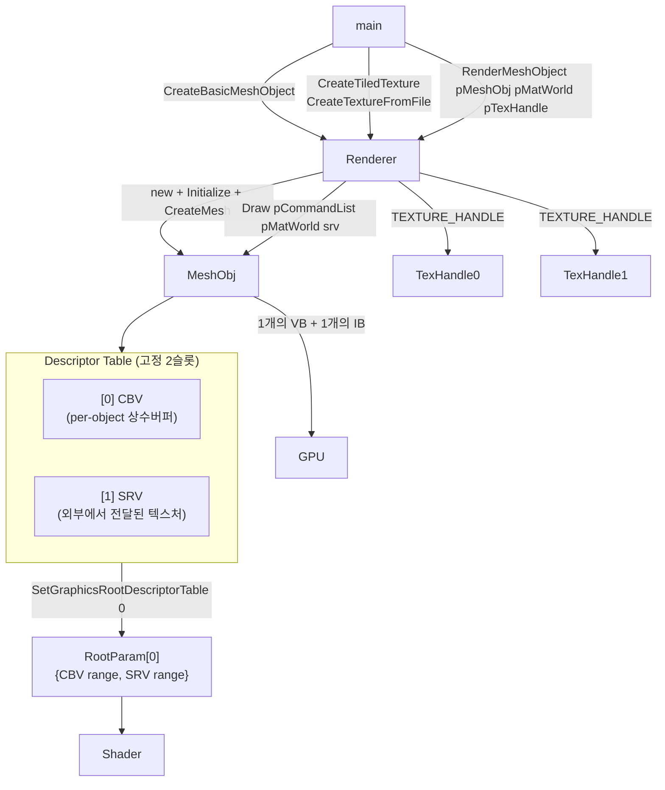
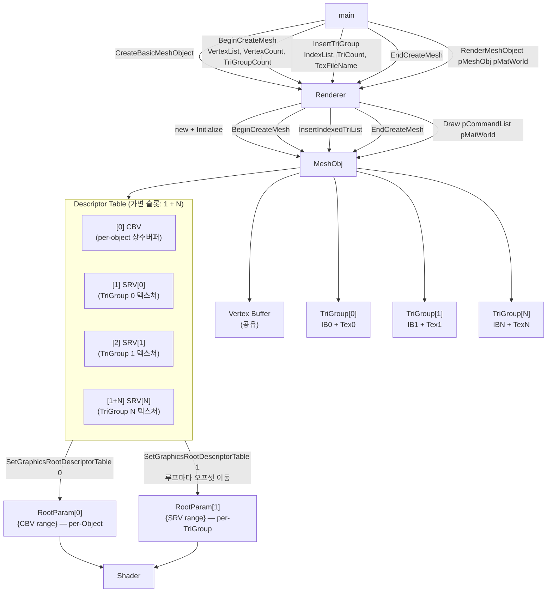

# Chapter 11 vs Chapter 12 — 변경점 심층 분석

## 한 줄 요약
Chapter 11 (OverlappedFrames)은 **하나의 메쉬 오브젝트 + 외부에서 주입하는 단일 텍스처**로 렌더링했다.  
Chapter 12 (MultiMaterial)는 **하나의 메쉬 오브젝트 안에 N개의 삼각형 그룹(TriGroup)을 두고, 각 그룹이 독립 텍스처를 소유**하는 멀티 머티리얼 구조로 전환했다.

---

## 전체 구조 변화 (Mermaid Flowchart)

### Chapter 11 — 단일 머티리얼 구조



### Chapter 12 — 멀티 머티리얼 구조



---

## 변경점 상세

### 1. 신규 파일: `VertexUtil.h` / `VertexUtil.cpp`

Chapter 12에서 **박스(정육면체) 메쉬 생성 유틸리티**가 추가됐다.  
Chapter 11까지는 `BasicMeshObject::CreateMesh()` 내부에 하드코딩된 4-vertex quad가 있었다.

#### `CreateBoxMesh()`

```cpp
// VertexUtil.h
DWORD CreateBoxMesh(
    BasicVertex** ppOutVertexList,  // [OUT] 동적 할당된 Vertex 배열 포인터
    WORD*         pOutIndexList,    // [OUT] 인덱스 배열 (호출자가 WORD[36] 배열 제공)
    DWORD         dwMaxBufferCount, // [IN]  pOutIndexList 버퍼 크기 (최소 36 필요)
    float         fHalfBoxLen       // [IN]  박스 반변 길이 (ex. 0.25f → 0.5x0.5x0.5 박스)
);
```

| 역할 | 설명 |
|------|------|
| 정점 생성 | 8개의 월드 포지션을 6면 × 2삼각형 × 3버텍스 = 36버텍스로 펼친 뒤 중복 제거하여 최적화된 `BasicVertex` 배열 생성 |
| 인덱스 생성 | 36개의 인덱스(6면 × 2tri × 3vert) 생성. **각 면이 6개의 연속 인덱스**를 가짐 → `InsertTriGroup` 호출 시 `pIndexList + i*6`으로 면별 그룹 분리 |
| UV 좌표 | 면마다 `(0,0)-(1,0)-(1,1)` 패턴으로 UV 부여 |
| 메모리 | `ppOutVertexList`는 `new`로 할당 → `DeleteBoxMesh()`로 해제 |

```cpp
void DeleteBoxMesh(BasicVertex* pVertexList);  // delete[] 호출
```

> **핵심 알고리즘:** 내부의 `AddVertex()` 함수가 동일한 position+color+UV를 가진 버텍스는 중복 추가하지 않고 기존 인덱스를 반환하여 버텍스 버퍼를 압축한다.

---

### 2. 신규 구조체: `INDEXED_TRI_GROUP`

```cpp
// BasicMeshObject.h (Ch12 신규)
struct INDEXED_TRI_GROUP
{
    ID3D12Resource*       pIndexBuffer  = nullptr;  // GPU 인덱스 버퍼 리소스
    D3D12_INDEX_BUFFER_VIEW IndexBufferView = {};   // IA 스테이지에 바인딩할 뷰
    DWORD                 dwTriCount;               // 삼각형 수 (DrawIndexedInstanced에 *3)
    TEXTURE_HANDLE*       pTexHandle;               // 이 그룹에 적용할 텍스처 핸들
};
```

**목적:** 하나의 메쉬 안에서 **면 단위로 독립적인 인덱스 버퍼와 텍스처를 결합**하는 컨테이너.  
박스 예시에서는 6면 각각이 하나의 `INDEXED_TRI_GROUP`이 되어, 각각 다른 텍스처를 가진다.

---

### 3. `CBasicMeshObject` — 데이터 구조 변화

| 항목 | Ch11 | Ch12 |
|------|------|------|
| 인덱스 버퍼 | `m_pIndexBuffer` (단일) | 없음 |
| 인덱스 버퍼 뷰 | `m_IndexBufferView` (단일) | 없음 |
| 삼각형 그룹 | 없음 | `m_pTriGroupList` (`INDEXED_TRI_GROUP*` 동적 배열) |
| 최대 그룹 수 | — | `MAX_TRI_GROUP_COUNT_PER_OBJ = 8` |
| 디스크립터 상수 | `DESCRIPTOR_COUNT_FOR_DRAW = 2` | `DESCRIPTOR_COUNT_PER_OBJ = 1`<br>`DESCRIPTOR_COUNT_PER_TRI_GROUP = 1`<br>`MAX_DESCRIPTOR_COUNT_FOR_DRAW = 9` |

```cpp
// Ch12 — 가변 크기 디스크립터 계산 상수
static const UINT DESCRIPTOR_COUNT_PER_OBJ      = 1;   // CBV 1개
static const UINT DESCRIPTOR_COUNT_PER_TRI_GROUP = 1;   // SRV 1개
static const UINT MAX_TRI_GROUP_COUNT_PER_OBJ    = 8;
static const UINT MAX_DESCRIPTOR_COUNT_FOR_DRAW  =
    DESCRIPTOR_COUNT_PER_OBJ + (MAX_TRI_GROUP_COUNT_PER_OBJ * DESCRIPTOR_COUNT_PER_TRI_GROUP);
    // = 1 + (8 * 1) = 9
```

---

### 4. 메쉬 생성 API 전면 교체

#### Ch11 — `CreateMesh()` (내부 하드코딩)

```cpp
// CBasicMeshObject::CreateMesh() — Ch11
// 내부에 4-vertex quad + 6 index가 하드코딩됨
BOOL CBasicMeshObject::CreateMesh();
```

- `CreateBasicMeshObject()` 호출 즉시 지오메트리가 생성된다.
- 외부에서 정점/인덱스 데이터를 전달할 수 없다.

#### Ch12 — Begin/Insert/End 3단계 API

```cpp
// ① 메쉬 생성 시작 — 버텍스 버퍼 생성 + TriGroup 배열 초기화
BOOL BeginCreateMesh(
    const BasicVertex* pVertexList,   // [IN] 버텍스 배열 포인터
    DWORD              dwVertexNum,   // [IN] 버텍스 수
    DWORD              dwTriGroupCount // [IN] 이후 Insert할 그룹 수 (상한치)
);

// ② 삼각형 그룹 추가 — 인덱스 버퍼 생성 + 텍스처 로드
BOOL InsertIndexedTriList(
    const WORD*   pIndexList,      // [IN] 이 그룹의 인덱스 배열
    DWORD         dwTriCount,      // [IN] 삼각형 수 (인덱스 수 = dwTriCount * 3)
    const WCHAR*  wchTexFileName   // [IN] 적용할 텍스처 파일명 (.dds)
);

// ③ 생성 완료
void EndCreateMesh();  // 현재는 빈 함수, 향후 확장 예약
```

**CD3D12Renderer의 래퍼 함수들:**

```cpp
// Ch12 D3D12Renderer.h에 추가
BOOL  BeginCreateMesh(void* pMeshObjHandle, const BasicVertex* pVertexList,
                      DWORD dwVertexCount, DWORD dwTriGroupCount);
BOOL  InsertTriGroup(void* pMeshObjHandle, const WORD* pIndexList,
                     DWORD dwTriCount, const WCHAR* wchTexFileName);
void  EndCreateMesh(void* pMeshObjHandle);
```

**기존 `CreateMesh()` 제거:**

```cpp
// Ch12 CreateBasicMeshObject() — Ch11의 CreateMesh() 호출이 사라짐
void* CD3D12Renderer::CreateBasicMeshObject()
{
    CBasicMeshObject* pMeshObj = new CBasicMeshObject;
    pMeshObj->Initialize(this);
    // Ch11에는 여기서 pMeshObj->CreateMesh(); 가 있었음
    return pMeshObj;
}
```

---

### 5. Root Signature 변화 (핵심)

#### Ch11 — 1개의 Root Parameter

```cpp
// Ch11: CBV와 SRV가 하나의 descriptor table에 묶임
CD3DX12_DESCRIPTOR_RANGE ranges[2] = {};
ranges[0].Init(D3D12_DESCRIPTOR_RANGE_TYPE_CBV, 1, 0); // b0: CBV
ranges[1].Init(D3D12_DESCRIPTOR_RANGE_TYPE_SRV, 1, 0); // t0: SRV

CD3DX12_ROOT_PARAMETER rootParameters[1] = {};
rootParameters[0].InitAsDescriptorTable(
    _countof(ranges),          // 2 ranges
    ranges,
    D3D12_SHADER_VISIBILITY_ALL
);
// 레이아웃: [ CBV | SRV ] → rootParam[0]
```

#### Ch12 — 2개의 Root Parameter (분리)

```cpp
// Ch12: CBV(per-Object)와 SRV(per-TriGroup)를 별도 root param으로 분리
CD3DX12_DESCRIPTOR_RANGE rangesPerObj[1] = {};
rangesPerObj[0].Init(D3D12_DESCRIPTOR_RANGE_TYPE_CBV, 1, 0);     // b0: CBV per-Object

CD3DX12_DESCRIPTOR_RANGE rangesPerTriGroup[1] = {};
rangesPerTriGroup[0].Init(D3D12_DESCRIPTOR_RANGE_TYPE_SRV, 1, 0); // t0: SRV per-TriGroup

CD3DX12_ROOT_PARAMETER rootParameters[2] = {};
rootParameters[0].InitAsDescriptorTable(
    _countof(rangesPerObj), rangesPerObj, D3D12_SHADER_VISIBILITY_ALL
);  // → SetGraphicsRootDescriptorTable(0, ...) : 오브젝트당 1회
rootParameters[1].InitAsDescriptorTable(
    _countof(rangesPerTriGroup), rangesPerTriGroup, D3D12_SHADER_VISIBILITY_ALL
);  // → SetGraphicsRootDescriptorTable(1, ...) : TriGroup 루프마다 1회
```

**분리한 이유:**  
CBV는 오브젝트당 1번만 설정하면 되지만, SRV(텍스처)는 삼각형 그룹마다 달라진다.  
루트 파라미터를 분리하면 CBV는 유지한 채 SRV만 루프 안에서 교체할 수 있어 효율적이다.

---

### 6. `Draw()` 함수 로직 변화

#### Ch11 — Draw(pCommandList, pMatWorld, **srv**)

```cpp
// Ch11: 외부에서 CPU descriptor handle(srv)을 받아 복사
void CBasicMeshObject::Draw(
    ID3D12GraphicsCommandList* pCommandList,
    const XMMATRIX* pMatWorld,
    D3D12_CPU_DESCRIPTOR_HANDLE srv   // ← 렌더러가 외부에서 전달
);

// 디스크립터 할당 (고정 2슬롯)
pDescriptorPool->AllocDescriptorTable(&cpuDT, &gpuDT, DESCRIPTOR_COUNT_FOR_DRAW); // 2개

// 복사
pD3DDeivce->CopyDescriptorsSimple(1, cbvDest, pCB->CBVHandle, ...); // CBV
pD3DDeivce->CopyDescriptorsSimple(1, srvDest, srv, ...);            // SRV

// 드로우 (루트 파라미터 0으로 전체 테이블 묶음)
pCommandList->SetGraphicsRootDescriptorTable(0, gpuDescriptorTable);
pCommandList->IASetIndexBuffer(&m_IndexBufferView);
pCommandList->DrawIndexedInstanced(6, 1, 0, 0, 0); // 항상 6
```

#### Ch12 — Draw(pCommandList, pMatWorld) — 텍스처 인자 제거, 루프 추가

```cpp
// Ch12: 텍스처는 TriGroup 내부에서 꺼냄, Draw() 인자 없음
void CBasicMeshObject::Draw(
    ID3D12GraphicsCommandList* pCommandList,
    const XMMATRIX* pMatWorld
);

// 디스크립터 할당 (가변: 1 + TriGroupCount)
DWORD dwRequired = DESCRIPTOR_COUNT_PER_OBJ + (m_dwTriGroupCount * DESCRIPTOR_COUNT_PER_TRI_GROUP);
pDescriptorPool->AllocDescriptorTable(&cpuDT, &gpuDT, dwRequired);

// per-Object: CBV 복사
CD3DX12_CPU_DESCRIPTOR_HANDLE Dest(cpuDT, BASIC_MESH_DESCRIPTOR_INDEX_PER_OBJ_CBV, srvSize);
pD3DDeivce->CopyDescriptorsSimple(1, Dest, pCB->CBVHandle, ...);
Dest.Offset(1, srvSize); // 다음 슬롯으로 전진

// per-TriGroup: SRV 복사 (연속 배치)
for (DWORD i = 0; i < m_dwTriGroupCount; i++)
{
    pD3DDeivce->CopyDescriptorsSimple(1, Dest, pTriGroupList[i].pTexHandle->srv, ...);
    Dest.Offset(1, srvSize);
}

// 루트 시그니처/파이프라인/VB 설정
pCommandList->SetGraphicsRootSignature(m_pRootSignature);
pCommandList->SetDescriptorHeaps(1, &pDescriptorHeap);
pCommandList->SetPipelineState(m_pPipelineState);
pCommandList->IASetPrimitiveTopology(D3D_PRIMITIVE_TOPOLOGY_TRIANGLELIST);
pCommandList->IASetVertexBuffers(0, 1, &m_VertexBufferView);

// rootParam[0] — per-Object CBV (1회만)
pCommandList->SetGraphicsRootDescriptorTable(0, gpuDescriptorTable);

// rootParam[1] — per-TriGroup SRV 루프
CD3DX12_GPU_DESCRIPTOR_HANDLE gpuForTriGroup(gpuDT, DESCRIPTOR_COUNT_PER_OBJ, srvSize);
for (DWORD i = 0; i < m_dwTriGroupCount; i++)
{
    pCommandList->SetGraphicsRootDescriptorTable(1, gpuForTriGroup);  // SRV 교체
    gpuForTriGroup.Offset(1, srvSize);

    pCommandList->IASetIndexBuffer(&m_pTriGroupList[i].IndexBufferView);  // IB 교체
    pCommandList->DrawIndexedInstanced(
        m_pTriGroupList[i].dwTriCount * 3, // ← 가변 (그룹마다 다름)
        1, 0, 0, 0
    );
}
```

---

### 7. Descriptor Table 메모리 레이아웃

#### Ch11

```
Descriptor Pool 슬롯 (고정 2개 per draw):
┌─────────────┬─────────────┐
│   CBV [0]   │   SRV [1]   │
└─────────────┴─────────────┘
         ↑ RootParam[0] 전체를 가리킴
```

#### Ch12 (TriGroupCount = 6인 박스 예시)

```
Descriptor Pool 슬롯 (가변 1+6=7개 per draw):
┌─────────────┬────────────┬────────────┬────────────┬────────────┬────────────┬────────────┐
│   CBV [0]   │ SRV[0] +z  │ SRV[1] -z  │ SRV[2] -x  │ SRV[3] +x  │ SRV[4] +y  │ SRV[5] -y  │
└─────────────┴────────────┴────────────┴────────────┴────────────┴────────────┴────────────┘
      ↑                 ↑           ↑           ↑           ↑           ↑           ↑
  RootParam[0]     RootParam[1] 루프 i=0  루프 i=1  루프 i=2  루프 i=3  루프 i=4  루프 i=5
  (오브젝트당 1회) (DrawIndexedInstanced 직전에 매번 Offset)
```

---

### 8. PSO (Pipeline State Object) — CullMode 변경

| | Ch11 | Ch12 |
|---|---|---|
| `CullMode` | `D3D12_CULL_MODE_NONE` | `D3D12_CULL_MODE_BACK` |

```cpp
// Ch11
psoDesc.RasterizerState.CullMode = D3D12_CULL_MODE_NONE; // 뒷면 컬링 없음

// Ch12
psoDesc.RasterizerState.CullMode = D3D12_CULL_MODE_BACK; // 뒷면 컬링 활성화
```

**이유:** 3D 박스는 안쪽 면이 카메라에 보이지 않으므로 백페이스 컬링을 켜야 성능이 개선되고 올바른 렌더링을 얻는다.  
(평면 quad였던 Ch11은 앞면/뒷면 구분 없이 렌더링했다.)

---

### 9. `CD3D12Renderer::Initialize()` — DescriptorPool 크기 변경

```cpp
// Ch11
m_ppDescriptorPool[i]->Initialize(
    m_pD3DDevice,
    MAX_DRAW_COUNT_PER_FRAME * CBasicMeshObject::DESCRIPTOR_COUNT_FOR_DRAW
    // = 256 * 2 = 512 descriptors
);

// Ch12
m_ppDescriptorPool[i]->Initialize(
    m_pD3DDevice,
    MAX_DRAW_COUNT_PER_FRAME * CBasicMeshObject::MAX_DESCRIPTOR_COUNT_FOR_DRAW
    // = 256 * 9 = 2304 descriptors
);
```

그룹당 최대 9개(CBV 1 + SRV 8)를 수용하도록 풀 크기가 증가했다.

---

### 10. `RenderMeshObject()` 시그니처 변화

```cpp
// Ch11: 텍스처 핸들을 렌더링 시점에 외부 인자로 전달
void RenderMeshObject(void* pMeshObjHandle, const XMMATRIX* pMatWorld, void* pTexHandle);

// Ch12: 텍스처는 메쉬 내부(TriGroup)에 저장됨 — 인자 제거
void RenderMeshObject(void* pMeshObjHandle, const XMMATRIX* pMatWorld);
```

---

### 11. `main.cpp` — 사용 패턴 변화

#### Ch11 — 단일 메쉬 + 외부 텍스처

```cpp
// 초기화
void* g_pMeshObj   = nullptr;
void* g_pTexHandle0 = nullptr;  // 런타임에 전달할 텍스처들
void* g_pTexHandle1 = nullptr;

g_pMeshObj    = g_pRenderer->CreateBasicMeshObject();        // 내부 quad
g_pTexHandle0 = g_pRenderer->CreateTiledTexture(16, 16, 192, 128, 255);
g_pTexHandle1 = g_pRenderer->CreateTextureFromFile(L"miku.dds");

// 렌더링 — 같은 메쉬에 다른 텍스처로 2번 그림
g_pRenderer->RenderMeshObject(g_pMeshObj, &g_matWorld0, g_pTexHandle0);
g_pRenderer->RenderMeshObject(g_pMeshObj, &g_matWorld1, g_pTexHandle1);
```

#### Ch12 — 다중 메쉬 + 내장 멀티 텍스처

```cpp
// 초기화
void* g_pMeshObj0 = nullptr;  // 박스 (6면 × 서로 다른 텍스처)
void* g_pMeshObj1 = nullptr;  // 평면 쿼드 (1면 × 1텍스처)

// 박스 생성 — BeginCreateMesh → InsertTriGroup × 6 → EndCreateMesh
g_pMeshObj0 = CreateBoxMeshObject();

// 쿼드 생성 — BeginCreateMesh → InsertTriGroup × 1 → EndCreateMesh
g_pMeshObj1 = CreateQuadMesh();

// 렌더링 — 텍스처 인자 없음, 메쉬 내부에서 알아서 처리
g_pRenderer->RenderMeshObject(g_pMeshObj0, &g_matWorld0);  // 박스 인스턴스 1
g_pRenderer->RenderMeshObject(g_pMeshObj0, &g_matWorld1);  // 동일 박스 다른 위치
g_pRenderer->RenderMeshObject(g_pMeshObj1, &g_matWorld2);  // 쿼드
```

**박스 메쉬 생성 상세:**

```cpp
void* CreateBoxMeshObject()
{
    WORD pIndexList[36] = {};
    BasicVertex* pVertexList = nullptr;

    // VertexUtil: 36인덱스를 6그룹(면)으로 나눌 수 있도록 연속 배치
    DWORD dwVertexCount = CreateBoxMesh(&pVertexList, pIndexList,
                                        _countof(pIndexList), 0.25f);

    void* pMeshObj = g_pRenderer->CreateBasicMeshObject();

    // 텍스처 파일 6개 (각 면에 하나씩)
    const WCHAR* wchTexFileNameList[6] = {
        L"tex_00.dds", L"tex_01.dds", L"tex_02.dds",
        L"tex_03.dds", L"tex_04.dds", L"tex_05.dds"
    };

    g_pRenderer->BeginCreateMesh(pMeshObj, pVertexList, dwVertexCount, 6);
    for (DWORD i = 0; i < 6; i++)
    {
        // pIndexList + i*6 : 6면 × 6인덱스(삼각형2개) 단위로 슬라이스
        g_pRenderer->InsertTriGroup(pMeshObj, pIndexList + i * 6, 2, wchTexFileNameList[i]);
    }
    g_pRenderer->EndCreateMesh(pMeshObj);

    DeleteBoxMesh(pVertexList);
    return pMeshObj;
}
```

---

### 12. `Cleanup()` 로직 강화

#### Ch11

```cpp
void CBasicMeshObject::Cleanup()
{
    if (m_pVertexBuffer) { m_pVertexBuffer->Release(); ... }
    if (m_pIndexBuffer)  { m_pIndexBuffer->Release();  ... }  // 단일 IB 해제
    CleanupSharedResources();
}
```

#### Ch12 — TriGroup 배열 순회 해제

```cpp
void CBasicMeshObject::Cleanup()
{
    if (m_pTriGroupList)
    {
        for (DWORD i = 0; i < m_dwTriGroupCount; i++)
        {
            if (m_pTriGroupList[i].pIndexBuffer)
            {
                m_pTriGroupList[i].pIndexBuffer->Release();
                m_pTriGroupList[i].pIndexBuffer = nullptr;
            }
            if (m_pTriGroupList[i].pTexHandle)
            {
                m_pRenderer->DeleteTexture(m_pTriGroupList[i].pTexHandle); // SDA 반환
                m_pTriGroupList[i].pTexHandle = nullptr;
            }
        }
        delete[] m_pTriGroupList;  // 배열 해제
        m_pTriGroupList = nullptr;
    }
    if (m_pVertexBuffer) { m_pVertexBuffer->Release(); ... }
    CleanupSharedResources();
}
```

---

### 13. Shader — 변경 없음

`Shaders/shaders.hlsl`은 Ch11과 Ch12 모두 동일하다.  
Root Signature 변경에도 불구하고 셰이더 코드는 그대로다.

```hlsl
// Ch11 == Ch12 — 변경 없음
Texture2D texDiffuse : register(t0);      // SRV는 여전히 t0
cbuffer CONSTANT_BUFFER_DEFAULT : register(b0) { ... }  // CBV는 여전히 b0
```

Root Signature의 **RootParam 분리**는 CPU 측 바인딩 전략 변경이고,  
셰이더 레지스터(`t0`, `b0`)는 그대로이므로 HLSL 수정이 불필요하다.

---

## 전체 변경 요약표

| 파일 | Ch11 | Ch12 | 비고 |
|------|------|------|------|
| `VertexUtil.h/cpp` | 없음 | **신규** | 박스 메쉬 생성 유틸리티 |
| `BasicMeshObject.h` | `DESCRIPTOR_COUNT_FOR_DRAW=2`<br>단일 IB | `MAX_DESCRIPTOR_COUNT_FOR_DRAW=9`<br>`INDEXED_TRI_GROUP` 배열 | 멀티 머티리얼 구조 |
| `BasicMeshObject.cpp` | `CreateMesh()` (내부 하드코딩)<br>Root Param 1개<br>`CullMode=NONE`<br>`Draw(srv)` | `Begin/Insert/EndCreateMesh()`<br>Root Param 2개<br>`CullMode=BACK`<br>`Draw()` TriGroup 루프 | 전면 리팩터링 |
| `D3D12Renderer.h` | `RenderMeshObject(... pTexHandle)`<br>텍스처 관련 독립 API | `RenderMeshObject(...)` 텍스처 삭제<br>`BeginCreateMesh/InsertTriGroup/EndCreateMesh` 추가 | 메쉬 생성 API 외부 노출 |
| `D3D12Renderer.cpp` | `DescriptorPool` 초기화: `256*2=512` | `DescriptorPool` 초기화: `256*9=2304` | 풀 사이즈 증가 |
| `main.cpp` | 단일 MeshObj + 2 TexHandle | 박스 + 쿼드 MeshObj, TexHandle 없음<br>3개 월드 행렬 | 텍스처 외부 관리 제거 |
| `Shaders/shaders.hlsl` | 동일 | **변경 없음** | t0/b0 레지스터 유지 |
