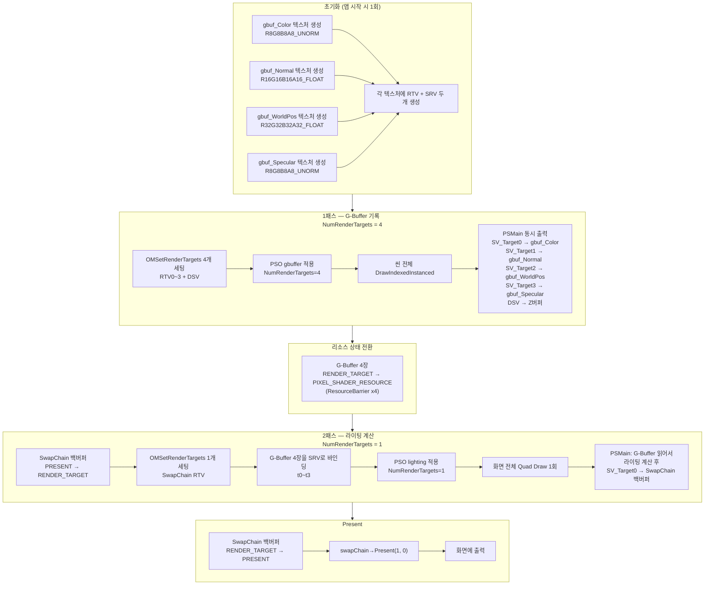
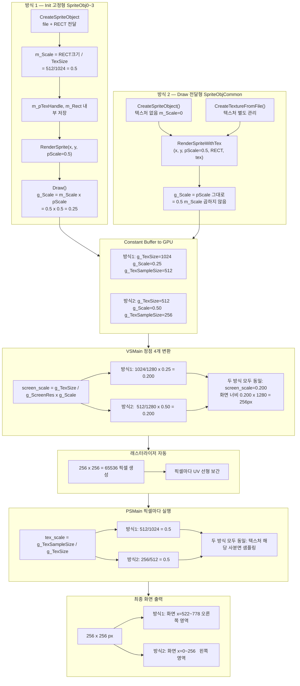

# Chapter 13 질문 & 답변

---

## Q1. Texture(텍스처)가 뭔가요?

텍스처는 GPU 메모리에 올려둔 이미지 데이터다.  
JPG, PNG, DDS 같은 이미지 파일을 GPU에 업로드하면 셰이더에서 `Texture2D`로 읽을 수 있다.

```
CPU 쪽: 파일 → ID3D12Resource (텍스처 리소스)
GPU 쪽: SRV(Shader Resource View)를 통해 셰이더에서 샘플링
```

---

## Q2. CONSTANT_BUFFER_SPRITE 이게 뭔가요?

**상수 버퍼(Constant Buffer)** 는 CPU가 셰이더에 데이터를 전달하는 통로다.

3D 메시에는 `CONSTANT_BUFFER_DEFAULT` (월드/뷰/프로젝션 행렬)를 썼다.  
스프라이트는 3D 행렬이 필요 없고 대신 **화면 좌표, 텍스처 크기, 스케일** 같은 2D 전용 정보가 필요해서 별도 구조체를 만든 것이다.

```cpp
struct CONSTANT_BUFFER_SPRITE
{
    XMFLOAT2 ScreenRes;      // 화면 해상도 (예: 1280, 720)
    XMFLOAT2 Pos;            // 스프라이트를 그릴 픽셀 위치 (예: 100, 200)
    XMFLOAT2 Scale;          // 크기 배율 (예: 0.5, 0.5 → 절반 크기)
    XMFLOAT2 TexSize;        // 텍스처 전체 크기 (예: 512, 512)
    XMFLOAT2 TexSampePos;    // 아틀라스에서 잘라낼 시작 좌표 (예: 256, 0)
    XMFLOAT2 TexSampleSize;  // 잘라낼 영역 크기 (예: 256, 256)
    float    Z;              // 깊이값 (0.0 = 맨 앞, 1.0 = 맨 뒤)
    float    Alpha;          // 투명도
    ...
};
```

---

## Q3. 텍스처 아틀라스(Atlas)가 뭔가요?

**하나의 큰 텍스처 이미지 안에 여러 스프라이트 이미지를 패킹해 놓은 것.**

예를 들어 캐릭터 애니메이션 8프레임을 각각 8개 파일로 만들면 텍스처 바인딩을 8번 해야 한다.  
아틀라스는 이것을 한 장에 몽땅 넣고, 그릴 때 **어디서 얼마나 잘라낼지(RECT)** 만 바꿔 주는 방식이다.

```
sprite_1024x1024.dds 한 장 안에:
┌──────────┬──────────┐
│  [0,0]   │  [512,0] │  ← 이미지 A  │  이미지 B
│  512x512 │  512x512 │
├──────────┼──────────┤
│ [0,512]  │[512,512] │  ← 이미지 C  │  이미지 D
│  512x512 │  512x512 │
└──────────┴──────────┘
```

이미지 A를 그리고 싶으면 → `TexSampePos=(0,0)`, `TexSampleSize=(512,512)`  
이미지 B를 그리고 싶으면 → `TexSampePos=(512,0)`, `TexSampleSize=(512,512)`

코드에서 이 정보가 `RECT`로 전달된다.

---

## Q4. RECT 직접 전달이란?

`DrawWithTex()`는 **아틀라스에서 잘라낼 위치(RECT)를 draw 호출 시마다** 넘길 수 있다.

```cpp
RECT rect;
rect.left = 256;  rect.top = 0;
rect.right = 512; rect.bottom = 256;

// g_pSpriteObjCommon 하나를 재활용하면서 아틀라스의 다른 구간을 샘플링
g_pRenderer->RenderSpriteWithTex(g_pSpriteObjCommon, 0, 0, 0.5f, 0.5f, &rect, 0.0f, g_pTexHandle0);
```

반대로 `RenderSprite()`는 **생성 시에 RECT를 고정**해 두고 호출 때는 위치/스케일만 바꾼다.

---

## Q5. 셰이더 수식 설명

코드에 등장하는 변수들의 의미부터 정리한다.

| 변수 | 타입 | 의미 | 예시 값 |
|------|------|------|---------|
| `g_ScreenRes` | float2 | 백버퍼 해상도 | (1280, 720) |
| `g_Pos` | float2 | 스프라이트 좌상단 픽셀 좌표 | (100, 50) |
| `g_Scale` | float2 | 스케일 배율 | (0.5, 0.5) |
| `g_TexSize` | float2 | 텍스처 전체 크기(픽셀) | (512, 512) |
| `g_TexSampePos` | float2 | 아틀라스 내 샘플 시작 위치(픽셀) | (256, 0) |
| `g_TexSampleSize` | float2 | 샘플 영역 크기(픽셀) | (256, 256) |
| `input.Pos.xy` | float2 | 단위 Quad 정점 좌표. X∈[0,1] Y∈[0,1] | (0,0) ~ (1,1) |

---

### Part 1 : 위치 변환 (픽셀 좌표 → NDC)

```hlsl
float2 scale  = (g_TexSize / g_ScreenRes) * g_Scale;
float2 offset = (g_Pos / g_ScreenRes);
float2 Pos    = input.Pos.xy * scale + offset;
result.position = float4(Pos.xy * float2(2, -2) + float2(-1, 1), g_Z, 1);
```

**단위 Quad가 뭔가?**  
`InitMesh`에서 만든 정점은 X∈[0,1], Y∈[0,1] 범위의 단위 사각형이다.  
이 단위 Quad를 늘리고(scale), 이동해서(offset) 화면의 원하는 위치에 맞춘다.

---

**① scale 계산**

```
scale = (g_TexSize / g_ScreenRes) * g_Scale
```

`g_TexSize / g_ScreenRes` → 텍스처 크기가 화면 크기의 몇 배인지 (0~1 비율)  
`× g_Scale` → 거기에 사용자 배율을 곱함

예: 텍스처 512px, 화면 1280px, Scale=0.5  
→ scale.x = (512/1280) × 0.5 = 0.2  
→ 단위 Quad의 X(0~1)에 0.2를 곱하면 화면 폭의 20% 크기가 됨

---

**② offset 계산**

```
offset = g_Pos / g_ScreenRes
```

픽셀 좌표를 0~1 비율로 정규화한 것.  
예: Pos.x=100, ScreenRes.x=1280 → offset.x = 100/1280 = 0.078  
→ 화면 왼쪽에서 7.8% 위치

---

**③ Pos 계산**

```
Pos = input.Pos.xy * scale + offset
```

단위 Quad를 scale 크기로 늘린 뒤, offset만큼 이동.  
결과는 0~1 범위의 정규화된 스크린 좌표.

---

**④ NDC 변환**

```
result.position = float4(Pos.xy * float2(2, -2) + float2(-1, 1), g_Z, 1);
```

스크린 좌표(0~1)를 NDC(-1~1)로 변환한다.

| 스크린 좌표계 | NDC |
|--------------|-----|
| X: 0 → 1 (좌→우) | X: -1 → +1 |
| Y: 0 → 1 (위→아래) | Y: +1 → -1 (Y 반전!) |

```
NDC_x = Pos.x * 2 - 1
NDC_y = Pos.y * (-2) + 1   ← Y 반전 (스크린은 아래↓가 +, NDC는 위↑가 +)
```

예: 스크린 (0,0) → NDC (-1, +1) ← 좌상단  
예: 스크린 (1,1) → NDC (+1, -1) ← 우하단

---

### Part 2 : UV 변환 (아틀라스 UV)

```hlsl
float2 tex_scale  = g_TexSampleSize / g_TexSize;
float2 tex_offset = g_TexSampePos   / g_TexSize;
result.TexCoord   = input.TexCoord * tex_scale + tex_offset;
```

셰이더가 텍스처를 샘플링할 때 쓰는 UV 좌표는 0~1 범위다.  
아틀라스의 특정 구간만 샘플링하려면 UV를 그 구간으로 축소·이동해야 한다.

---

**① tex_scale**

```
tex_scale = g_TexSampleSize / g_TexSize
```

전체 텍스처 중 샘플 영역이 차지하는 비율.

예: 텍스처 512px, 샘플 크기 256px  
→ tex_scale = 256/512 = 0.5  
→ UV가 0~1이었던 것을 0~0.5 구간으로 압축

---

**② tex_offset**

```
tex_offset = g_TexSampePos / g_TexSize
```

아틀라스에서 샘플 시작 위치를 0~1 UV로 환산.

예: 텍스처 512px, 샘플 시작 256px  
→ tex_offset = 256/512 = 0.5  
→ UV를 0.5부터 시작하도록 밀어줌

---

**③ 최종 UV**

```
result.TexCoord = input.TexCoord * tex_scale + tex_offset
```

원래 UV(0~1)를 축소 후 이동.

아틀라스 우상단 구간 예시:
- tex_scale  = (0.5, 0.5)
- tex_offset = (0.5, 0.0)
- 정점 UV (0,0) → 최종 UV (0.5, 0.0) ← 아틀라스 우상단 좌상
- 정점 UV (1,1) → 최종 UV (1.0, 0.5) ← 아틀라스 우상단 우하

즉, 아틀라스의 우상단 256×256 구간만 딱 샘플링된다.

---

### 수식 전체 흐름 요약

```
[단위 Quad 정점]         [픽셀 좌표 → 0~1 스크린] → [NDC 변환]
  X,Y ∈ [0,1]    ──→   scale + offset           ──→  *2-1 / *(-2)+1

[단위 UV]                [아틀라스 구간으로 축소·이동]
  U,V ∈ [0,1]    ──→   * tex_scale + tex_offset
```

---

## Q6. 3D 메시에는 world/view/proj 행렬이 CBV에 있었는데, Sprite에는 그게 없고 CONSTANT_BUFFER_SPRITE로 바꿔치기됐네?

맞다. **의도적으로 완전히 다른 CB**를 쓴다. 목적 자체가 다르기 때문이다.

### BasicMeshObject (3D) — shBasicMesh.hlsl

```hlsl
cbuffer CONSTANT_BUFFER_DEFAULT : register(b0)
{
    matrix g_matWorld;   // 오브젝트를 월드 공간에 배치
    matrix g_matView;    // 카메라 시점으로 변환
    matrix g_matProj;    // 원근 투영 (3D → 2D)
};

// 정점 변환
matrix matViewProj      = mul(g_matView, g_matProj);
matrix matWorldViewProj = mul(g_matWorld, matViewProj);
result.position = mul(input.Pos, matWorldViewProj);  // 3D 행렬 곱
```

루트 시그니처 구조:
```
RootParam[0] : DescriptorTable → CBV b0  (CONSTANT_BUFFER_DEFAULT, 오브젝트당 1개)
RootParam[1] : DescriptorTable → SRV t0  (텍스처, TriGroup 교체마다 갱신)
```

3D 오브젝트는 **월드 공간에 존재**하므로 카메라/투영 행렬로 변환해야 한다.  
같은 메시를 다른 위치에 그릴 때 `g_matWorld`만 바꾸면 된다.

---

### CSpriteObject (2D) — shSprite.hlsl

```hlsl
cbuffer CONSTANT_BUFFER_SPRITE : register(b0)
{
    float2 g_ScreenRes;     // 행렬 대신 화면 해상도로 대체
    float2 g_Pos;
    float2 g_Scale;
    float2 g_TexSize;
    float2 g_TexSampePos;
    float2 g_TexSampleSize;
    float  g_Z;
    float  g_Alpha;
    ...
};

// 행렬 곱 없이 직접 NDC 계산
float2 scale  = (g_TexSize / g_ScreenRes) * g_Scale;
float2 offset = g_Pos / g_ScreenRes;
result.position = float4(Pos.xy * float2(2,-2) + float2(-1,1), g_Z, 1);
```

루트 시그니처 구조:
```
RootParam[0] : DescriptorTable → CBV b0 + SRV t0  (한 테이블에 묶음)
```

2D 스프라이트는 **화면 픽셀 좌표에 직접 배치**하면 된다.  
카메라도 없고 원근 투영도 필요 없다. 행렬 3개 대신 `ScreenRes`와 `Pos`로 직접 계산한다.

---

### 정리

| | BasicMeshObject (3D) | CSpriteObject (2D) |
|---|---|---|
| CB 내용 | world/view/proj 행렬 | 화면 해상도, 픽셀 위치, 스케일 |
| 좌표 변환 | 행렬 3번 곱 | 나눗셈·덧셈으로 직접 NDC 계산 |
| 카메라 영향 | 받음 | **받지 않음** |
| RootParam 수 | 2개 (CB 따로, SRV 따로) | 1개 (CB+SRV 한 테이블에) |
| PSO / RootSignature | 별개 (`CBasicMeshObject::m_pRootSignature`) | 별개 (`CSpriteObject::m_pRootSignature`) |

같은 `b0` 슬롯이지만 **루트 시그니처 자체가 다른 오브젝트**이므로 충돌하지 않는다.  
`pCommandList->SetGraphicsRootSignature()`를 Draw할 때마다 교체하기 때문이다.

---

## Q7. g_Scale, offset, tex_scale, tex_offset 이게 각각 뭘 하는 건가?

구체적인 숫자로 설명한다.

---

### 전제: 단위 Quad란?

셰이더에 들어오는 정점(`input.Pos.xy`)은 항상 **0~1 범위의 고정된 단위 사각형**이다.

```
(0,1)──────(1,1)
  │              │
  │  단위 Quad   │
  │              │
(0,0)──────(1,0)
```

이걸 늘리고(scale) 이동해서(offset) 화면 원하는 위치에 맞추는 것이 목표다.

---

### 예시 상황 설정

```
화면 해상도  : 1280 × 720   (g_ScreenRes)
텍스처 크기  : 512 × 512    (g_TexSize)
그릴 위치    : 픽셀 (100, 50) (g_Pos)
배율         : 0.5           (g_Scale)
```

---

### ① g_Scale — "원본 크기 대비 얼마나 키울/줄일까"

```hlsl
float2 scale = (g_TexSize / g_ScreenRes) * g_Scale;
```

**g_TexSize / g_ScreenRes** → 텍스처가 화면 대비 얼마나 큰지 비율로 환산

```
scale.x = (512 / 1280) * 0.5 = 0.2
scale.y = (512 /  720) * 0.5 = 0.355
```

단위 Quad의 X(0~1)에 0.2를 곱하면 → 화면 폭의 20% 크기  
즉 **"텍스처를 화면에 1:1로 뽑으면 이 크기인데, g_Scale 배율로 추가 조절"**

g_Scale = 1.0 이면 텍스처 픽셀 크기 그대로  
g_Scale = 0.5 이면 절반 크기로 축소  
g_Scale = 2.0 이면 두 배 확대

---

### ② offset — "화면 어디에 배치할까"

```hlsl
float2 offset = g_Pos / g_ScreenRes;
```

픽셀 좌표를 0~1 비율로 환산한 것.

```
offset.x = 100 / 1280 = 0.078   (화면 왼쪽에서 7.8%)
offset.y =  50 /  720 = 0.069   (화면 위쪽에서 6.9%)
```

단위 Quad에 scale을 곱해서 크기를 결정한 뒤, offset을 더해서 위치를 이동한다.

```hlsl
float2 Pos = input.Pos.xy * scale + offset;
//           └──크기 결정──┘  └─위치 이동─┘
```

---

### ③ NDC 변환

```hlsl
result.position = float4(Pos.xy * float2(2, -2) + float2(-1, 1), g_Z, 1);
```

0~1 범위를 GPU가 요구하는 -1~+1 범위로 바꾼다.  
Y는 부호 반전 (스크린은 위→아래 = +방향, NDC는 위→아래 = -방향)

```
스크린 (0.0, 0.0)  → NDC (-1.0, +1.0)  ← 좌상단
스크린 (1.0, 1.0)  → NDC (+1.0, -1.0)  ← 우하단
스크린 (0.5, 0.5)  → NDC ( 0.0,  0.0)  ← 정중앙
```

---

### ④ tex_scale — "아틀라스에서 몇 분의 몇을 잘라낼까"

```hlsl
float2 tex_scale = g_TexSampleSize / g_TexSize;
```

**전체 텍스처 중 내가 쓸 구간의 비율.**

예: 1024×1024 아틀라스에서 오른쪽 위 512×512 구간을 쓴다면

```
g_TexSize       = (1024, 1024)
g_TexSampleSize = (512, 512)

tex_scale = (512/1024, 512/1024) = (0.5, 0.5)
```

단위 UV(0~1)에 0.5를 곱하면 → UV가 0~0.5로 압축됨  
즉 **텍스처의 절반 크기 구간만 보겠다는 뜻**

---

### ⑤ tex_offset — "아틀라스에서 어디서부터 시작할까"

```hlsl
float2 tex_offset = g_TexSampePos / g_TexSize;
```

**샘플 시작 픽셀 좌표를 UV 비율로 환산.**

예: 오른쪽 위 구간이니까 X는 512px부터 시작

```
g_TexSampePos = (512, 0)
g_TexSize     = (1024, 1024)

tex_offset = (512/1024, 0/1024) = (0.5, 0.0)
```

---

### ⑥ 최종 UV

```hlsl
result.TexCoord = input.TexCoord * tex_scale + tex_offset;
//                └──구간 압축──┘  └──시작 위치 이동──┘
```

```
정점 UV (0.0, 0.0) → (0.0 * 0.5 + 0.5,  0.0 * 0.5 + 0.0) = (0.5, 0.0)  ← 아틀라스 우상단 좌상
정점 UV (1.0, 0.0) → (1.0 * 0.5 + 0.5,  0.0 * 0.5 + 0.0) = (1.0, 0.0)  ← 아틀라스 우상단 우상
정점 UV (1.0, 1.0) → (1.0 * 0.5 + 0.5,  1.0 * 0.5 + 0.0) = (1.0, 0.5)  ← 아틀라스 우상단 우하
정점 UV (0.0, 1.0) → (0.0 * 0.5 + 0.5,  1.0 * 0.5 + 0.0) = (0.5, 0.5)  ← 아틀라스 우상단 좌하
```

결과적으로 아틀라스의 우상단 사분면만 딱 샘플링된다.

---

### 한 줄 요약

| 변수 | 역할 | 비유 |
|------|------|------|
| `g_Scale` | 화면에서 스프라이트를 얼마나 크게 그릴지 | 프린트 배율 |
| `offset` | 화면 어디에 놓을지 (픽셀 → 0~1 비율) | 종이 위 붙이는 위치 |
| `tex_scale` | 아틀라스에서 몇 분의 몇 크기를 쓸지 | 원본 이미지에서 자를 비율 |
| `tex_offset` | 아틀라스에서 어디서부터 자를지 | 가위질 시작 위치 |

---

## Q8. offset에 왜 g_Scale이 반영 안 됐나?

```hlsl
float2 scale  = (g_TexSize / g_ScreenRes) * g_Scale;  // g_Scale 있음
float2 offset = (g_Pos / g_ScreenRes);                // g_Scale 없음 ← 왜?
float2 Pos    = input.Pos.xy * scale + offset;
```

**offset은 "스프라이트의 좌상단 꼭짓점을 어디에 고정할지"이기 때문이다.**  
scale은 "거기서부터 얼마나 크게 자랄지"다. 둘은 역할이 완전히 분리된다.

---

### 숫자로 확인

```
화면      : 1280 x 720
텍스처    : 512 x 512
위치(Pos) : 픽셀 (100, 50)   ← 좌상단을 여기에 고정하고 싶다
g_Scale   : 0.5
```

계산 결과:
```
scale  = (512/1280) * 0.5 = 0.2    (스프라이트 폭 = 화면의 20%)
offset = 100/1280          = 0.078  (좌상단 X = 화면의 7.8% 지점)
```

단위 Quad 4개 정점에 대입하면:

| 정점 | input.Pos.xy | * scale | + offset | 화면 픽셀 |
|------|-------------|---------|----------|-----------|
| 좌상 | (0, 0) | (0, 0) | (0.078, 0.069) | (100, 50) |
| 우상 | (1, 0) | (0.2, 0) | (0.278, 0.069) | (356, 50) |
| 우하 | (1, 1) | (0.2, 0.355) | (0.278, 0.424) | (356, 306) |
| 좌하 | (0, 1) | (0, 0.355) | (0.078, 0.424) | (100, 306) |

좌상단은 항상 **픽셀 (100, 50)** 에 고정된다.  
g_Scale을 바꾸면 스프라이트 크기만 바뀌고 좌상단 위치는 그대로다.

---

### g_Scale을 offset에도 곱하면 어떻게 될까?

```hlsl
// 잘못된 버전
float2 offset = (g_Pos / g_ScreenRes) * g_Scale;
```

```
offset.x = (100/1280) * 0.5 = 0.039  →  픽셀 50 위치로 이동해버림
```

g_Scale을 0.5로 줄였더니 **위치까지 절반으로 이동**된다.  
"픽셀 100에 그려라"고 지정했는데 픽셀 50에 그려지는 버그가 생긴다.

---

### 한 줄 정리

```
offset  = 스프라이트의 기준점(좌상단)을 어디에 놓을지  →  크기와 무관하게 고정
scale   = 그 기준점에서 얼마나 크게 펼칠지             →  크기만 결정
```

이 둘을 섞으면 크기를 바꿀 때마다 위치도 같이 틀어진다.

---

## Q9. offset과 scale이 합쳐져서 어떻게 그려지는지 그림으로 보고 싶다

### 예시 값 고정

```
화면(ScreenRes)  : 1280 x 720 픽셀
텍스처(TexSize)  : 512 x 512 픽셀
그릴 위치(Pos)   : 픽셀 (100, 50)   ← 좌상단 기준
배율(g_Scale)    : 0.5              ← 절반 크기
```

계산:
```
scale.x  = (512 / 1280) * 0.5 = 0.2
scale.y  = (512 /  720) * 0.5 = 0.355

offset.x = 100 / 1280 = 0.078
offset.y =  50 /  720 = 0.069
```

---

### STEP 1 — 단위 Quad (셰이더 입력 상태)

GPU에 넘긴 원본 정점은 항상 이 모양이다. 크기도 위치도 고정.

```
Y
1 ┤  (0,1)────────(1,1)
  │    │              │
  │    │  단위 Quad   │  (항상 0~1 범위)
  │    │              │
0 ┤  (0,0)────────(1,0)
  └───┬──────────────┬── X
      0              1
```

---

### STEP 2 — × scale 적용 (크기 결정)

```hlsl
float2 Pos = input.Pos.xy * scale + offset;
//           ↑ 이 부분만 먼저
```

모든 정점에 scale(0.2, 0.355)을 곱한다. → Quad가 **축소**된다.

```
Y
1 ┤
  │
  │
0.355┤ (0, 0.355)──(0.2, 0.355)
  │    │                  │
  │    │  scale 적용 후   │   ← 화면의 20% 너비, 35.5% 높이
  │    │  (아직 왼쪽 위에 붙어 있음)
0 ┤  (0,0)────────(0.2, 0)
  └───┬────┬──────────────── X
      0   0.2              1
```

**이 시점에서 스프라이트 크기 = 화면의 20% × 35.5%**  
픽셀로 환산 → 256px × 256px (512 × 0.5 = 256)

---

### STEP 3 — + offset 적용 (위치 이동)

```hlsl
float2 Pos = input.Pos.xy * scale + offset;
//                               ↑ 이제 이 부분
```

offset(0.078, 0.069)을 더한다. → Quad가 **오른쪽 아래로 이동**.

```
Y
1 ┤
  │
0.424┤             (0.078, 0.424)──(0.278, 0.424)
  │                    │                    │
  │                    │   최종 위치        │
  │                    │   (offset 이동 후) │
0.069┤             (0.078, 0.069)──(0.278, 0.069)
  │
0 ┤
  └─────────┬─────┬─────── X
           0.078 0.278
           ↑           ↑
        픽셀 100    픽셀 356
```

---

### STEP 4 — 화면 픽셀로 환산하면?

| 정점 | 0~1 좌표 | 화면 픽셀 |
|------|----------|-----------|
| 좌상 | (0.078, 0.069) | **(100, 50)** ← g_Pos 그대로 |
| 우상 | (0.278, 0.069) | (356, 50) |
| 우하 | (0.278, 0.424) | (356, 306) |
| 좌하 | (0.078, 0.424) | (100, 306) |

→ 화면에서는 **(100, 50)** 부터 시작하는 **256 × 256 픽셀** 사각형이 그려진다.

```
화면 (1280 x 720)
┌─────────────────────────────────────┐
│  100px                              │
│←──→┌────────────┐                   │
│ 50 │            │                   │
│ px │  스프라이트 │  256 x 256 px    │
│ ↕  │  g_Scale=0.5                   │
│    └────────────┘                   │
│                                     │
└─────────────────────────────────────┘
```

---

### g_Scale을 1.0으로 바꾸면?

```
scale.x = (512/1280) * 1.0 = 0.4  → 512px 너비
offset.x = 100/1280 = 0.078       → 변화 없음 (여전히 픽셀 100)

화면 (1280 x 720)
┌─────────────────────────────────────┐
│  100px                              │
│←──→┌────────────────────────┐       │
│    │                        │       │
│    │  스프라이트 512 x 512  │       │
│    │  g_Scale=1.0           │       │
│    └────────────────────────┘       │
└─────────────────────────────────────┘
```

크기만 커졌고 **좌상단은 여전히 픽셀 (100, 50)** 에 고정됨.

---

### 전체 흐름 한눈에

```
단위 Quad          × scale           + offset          × 2 - 1 (NDC변환)
(0,0)~(1,1)  →  크기 결정(0~0.2)  →  위치 이동  →  GPU 클립 공간으로 변환
 고정된 모양      g_Scale로 조절       g_Pos로 조절
```

---

## Q10. g_Scale에 따라 화면에서 스프라이트 크기도 실제로 작아지나?

**그렇다.** `g_Scale = 1.0`이 텍스처 원본 픽셀 크기이고, 그보다 작으면 축소, 크면 확대다.

### 공식 다시 보기

```hlsl
float2 scale = (g_TexSize / g_ScreenRes) * g_Scale;
```

`g_TexSize / g_ScreenRes` 는 "텍스처를 화면에 1:1 픽셀로 그렸을 때 차지하는 비율"이다.  
여기에 g_Scale을 곱하면 그 비율을 늘리거나 줄인다.

### 숫자 비교 (화면 1280px, 텍스처 512px 기준)

| g_Scale | scale.x 계산 | 화면 픽셀 너비 |
|---------|-------------|--------------|
| 0.5 | (512/1280) × 0.5 = **0.2** | 0.2 × 1280 = **256px** |
| 1.0 | (512/1280) × 1.0 = **0.4** | 0.4 × 1280 = **512px** ← 원본 크기 |
| 2.0 | (512/1280) × 2.0 = **0.8** | 0.8 × 1280 = **1024px** |

### 그림으로

```
화면 1280px
┌─────────────────────────────────────────────────┐
│                                                  │
│ g_Scale=0.5  ┌─────┐  256px                     │
│              └─────┘                             │
│                                                  │
│ g_Scale=1.0  ┌──────────┐  512px (원본)         │
│              └──────────┘                        │
│                                                  │
│ g_Scale=2.0  ┌────────────────────┐  1024px     │
│              └────────────────────┘              │
└─────────────────────────────────────────────────┘
  좌상단은 세 경우 모두 같은 픽셀(100, 50)에 고정
```

### 한 줄 정리

```
g_Scale = 1.0  →  텍스처 원본 픽셀 크기 그대로
g_Scale < 1.0  →  축소
g_Scale > 1.0  →  확대

---

## Q11. g_Scale로 크기 조절하는 게 DirectXTex 모듈이 해주는 건가?

**아니다. DirectXTex는 전혀 관계없다.**

### DirectXTex가 하는 일

DirectXTex는 **텍스처 파일을 읽어서 GPU 메모리에 올리는 것**만 담당한다.

```
DDS 파일 (디스크)
    ↓  DirectXTex가 처리
ID3D12Resource (GPU 메모리에 업로드된 이미지 데이터)
    ↓  끝. 이후는 DirectXTex 관여 없음
```

코드에서 이 부분이 DirectXTex의 역할 전부다:

```cpp
// D3D12ResourceManager.cpp 내부에서 DirectXTex 사용
LoadFromDDSFile(wchFileName, ...);   // 파일 읽기
CreateTexture(...);                   // GPU 업로드
```

일단 GPU에 올라간 뒤에는 DirectXTex는 아무것도 하지 않는다.

---

### g_Scale 크기 조절은 누가 하나?

**셰이더(shSprite.hlsl)가 직접 계산한다.**  
CPU에서 상수 버퍼에 값을 채워 넣고, GPU의 셰이더가 그걸 읽어서 정점 좌표를 계산하는 것이다.

```
CPU (main.cpp / D3D12Renderer.cpp)
  g_pRenderer->RenderSprite(obj, 100, 50, 0.5f, 0.5f, 0.0f)
       ↓
  CONSTANT_BUFFER_SPRITE 채움
  { ScreenRes=(1280,720), Pos=(100,50), Scale=(0.5,0.5), TexSize=(512,512), ... }
       ↓
GPU (shSprite.hlsl VSMain 실행)
  scale  = (g_TexSize / g_ScreenRes) * g_Scale  ← 셰이더가 직접 계산
  offset = g_Pos / g_ScreenRes
  result.position = ...                          ← 정점 위치 결정
```

---

### 역할 분담 정리

| 모듈 | 역할 |
|------|------|
| **DirectXTex** | DDS 파일 읽기 → GPU 메모리 업로드. 그 이후는 관여 안 함 |
| **CPU (Renderer)** | 상수 버퍼에 위치/스케일/텍스처 정보 기입 |
| **셰이더 (shSprite.hlsl)** | 상수 버퍼 값을 읽어 정점 좌표 계산 → 실제 크기/위치 결정 |

---

## Q12. input.Pos.xy * scale로 크기가 작아지는 건 UV 샘플링 때문인가?

**아니다. 완전히 별개다.**

셰이더 안에 두 가지 계산이 있는데 서로 독립적이다.

```hlsl
// ── 계산 1: 정점 위치 ─────────────────────────────────
float2 scale  = (g_TexSize / g_ScreenRes) * g_Scale;
float2 Pos    = input.Pos.xy * scale + offset;
result.position = ...;   // ← "화면 어디에 얼마나 크게 그릴지"

// ── 계산 2: UV 좌표 ───────────────────────────────────
float2 tex_scale = g_TexSampleSize / g_TexSize;
result.TexCoord  = input.TexCoord * tex_scale + tex_offset;  // ← "텍스처 어디를 읽을지"
```

---

### 각자의 역할

| | 계산 1 (position) | 계산 2 (TexCoord) |
|---|---|---|
| 결정하는 것 | **화면에서 사각형의 크기와 위치** | **텍스처에서 어느 픽셀을 읽을지** |
| 영향을 받는 값 | g_Scale, g_Pos | g_TexSampePos, g_TexSampleSize |
| 크기가 작아지면 | 화면에 그려지는 사각형이 작아짐 | 아무 변화 없음 |

---

### 그림으로

```
[계산 1 - 정점 위치]          [계산 2 - UV]

화면                           텍스처 (아틀라스)
┌──────────────────┐           ┌──────┬──────┐
│                  │           │  A   │  B   │
│  ┌────┐          │           ├──────┼──────┤
│  │스프│          │           │  C   │  D   │
│  │라이│          │     →     └──────┴──────┘
│  │트  │          │           ↑
│  └────┘          │           이 중 어느 구간을
│  ↑               │           읽을지가 UV
│  크기/위치 결정   │
└──────────────────┘
```

- **정점 위치 scale** : 화면에서 사각형을 얼마나 크게 그릴지
- **UV tex_scale** : 텍스처에서 얼마나 넓은 구간을 샘플링할지

둘 다 "scale"이라는 이름이 붙어 있어서 헷갈리지만, 하나는 **화면 좌표**고 하나는 **텍스처 좌표**다. 서로 영향을 주지 않는다.

---

### 실제로 크기가 작아지는 메커니즘

`input.Pos.xy * scale`에서 scale이 작을수록 정점들이 서로 가까워진다.

```
scale = 0.4 일 때 (g_Scale=1.0)         scale = 0.2 일 때 (g_Scale=0.5)

(0, 0.4)──(0.4, 0.4)                    (0, 0.2)──(0.2, 0.2)
   │               │                        │               │
(0,   0)──(0.4,   0)                    (0,   0)──(0.2,   0)
  ↑ 0~1 범위의 40%                        ↑ 0~1 범위의 20%
  = 화면의 512px                          = 화면의 256px
```

정점 4개가 가까이 모이면 → GPU가 그 안을 채우는 픽셀 수가 줄어든다 → 화면에서 작게 보인다.  
UV는 여기에 관여하지 않는다.

---

## Q13. 텍스처 512x512, g_Scale=0.5면 전체 이미지가 축소되어 나오는 건가?

**그렇다. 정확히 맞다.**

---

### 무슨 일이 벌어지는가

```
텍스처 UV : 0.0 ~ 1.0  (전체 이미지 샘플링)
화면 Quad : 256 x 256 픽셀  (g_Scale=0.5로 절반 크기)
```

GPU 래스터라이저가 256×256 픽셀짜리 사각형을 채울 때,  
각 픽셀마다 UV(0~1)를 계산해서 텍스처를 읽는다.

```
화면 픽셀 256개  →  UV 0~1 범위를 256등분해서 샘플링
텍스처 픽셀 512개 →  256개 픽셀로 압축됨
```

→ **512×512 이미지 전체가 256×256으로 축소되어 표시된다.**

---

### 그림으로

```
텍스처 (512 x 512)          화면 Quad (256 x 256px)
┌──────────────────┐         ┌─────────┐
│ UV(0,0)          │         │         │
│                  │  →축소→ │  전체   │
│   전체 이미지    │         │  이미지  │
│                  │         │  (작게) │
│         UV(1,1)  │         │         │
└──────────────────┘         └─────────┘
  512px                        256px
```

GPU 샘플러가 512px → 256px 다운스케일을 자동으로 처리한다.

---

### 아틀라스 쓸 때와 비교

아틀라스에서 일부만 잘라 쓰면 UV 범위가 달라진다.

```
[전체 텍스처 샘플링]              [아틀라스 우상단만 샘플링]
UV : 0~1 전체                     UV : tex_scale + tex_offset 적용
                                   → 0.5~1.0 (우상단 절반만)

텍스처 512x512 전체가              텍스처 우상단 256x256만
화면 256x256으로 축소              화면에 그려짐
```

- **scale(정점 위치)** : 화면에서 Quad가 얼마나 큰지
- **tex_scale(UV)** : 텍스처에서 얼마나 넓은 구간을 쓸지

둘은 독립적이므로 조합에 따라 4가지 경우가 생긴다.

```
화면 크기  ↕   UV 범위  →   결과
────────────────────────────────────────────────────
큰 Quad  + 전체 UV  →  원본 크기 or 확대
큰 Quad  + 일부 UV  →  아틀라스 일부가 크게
작은 Quad + 전체 UV →  전체 이미지가 축소  ← 지금 이 경우
작은 Quad + 일부 UV →  아틀라스 일부가 축소
```

---

## Q14. GPU 샘플러가 512px→256px 다운스케일하는 과정을 코드와 입출력으로 보여줘

```
예시:  화면 1280x720,  텍스처 512x512,  g_Scale=0.5,  g_Pos=(100,50)
```

### STAGE 1 — CPU: 상수 버퍼 채우기 (D3D12Renderer.cpp)

```cpp
// RenderSprite() 호출
g_pRenderer->RenderSprite(g_pSpriteObj0, 100, 50, 0.5f, 0.5f, 0.0f);

// 내부에서 CONSTANT_BUFFER_SPRITE 채움
pConstantBufferSprite->ScreenRes     = { 1280.0f, 720.0f };
pConstantBufferSprite->Pos           = {  100.0f,  50.0f };
pConstantBufferSprite->Scale         = {    0.5f,   0.5f };
pConstantBufferSprite->TexSize       = {  512.0f, 512.0f };
pConstantBufferSprite->TexSampePos   = {    0.0f,   0.0f };  // 전체 샘플링
pConstantBufferSprite->TexSampleSize = {  512.0f, 512.0f };  // 전체 샘플링
```

---

### STAGE 2 — CPU: 정점 버퍼 (InitMesh의 Vertices)

```cpp
// SpriteObject.cpp - InitMesh()
BasicVertex Vertices[] =
{
    { {0.0f, 1.0f, 0.0f}, {1,1,1,1}, {0.0f, 1.0f} },  // 좌상
    { {0.0f, 0.0f, 0.0f}, {1,1,1,1}, {0.0f, 0.0f} },  // 좌하
    { {1.0f, 0.0f, 0.0f}, {1,1,1,1}, {1.0f, 0.0f} },  // 우하
    { {1.0f, 1.0f, 0.0f}, {1,1,1,1}, {1.0f, 1.0f} },  // 우상
};
```

입력 UV는 항상 0~1 고정. 텍스처 전체를 덮는다.

---

### STAGE 3 — GPU: 정점 셰이더 VSMain (shSprite.hlsl)

정점 4개 각각에 실행. 실제 값 대입:

```hlsl
scale  = (512/1280, 512/720) * 0.5 = (0.2, 0.355)
offset = (100/1280, 50/720)         = (0.078, 0.069)
```

| 입력 Pos | × scale | + offset | 화면 픽셀 | 출력 UV |
|----------|---------|----------|-----------|---------|
| (0, 1) | (0, 0.355) | (0.078, 0.424) | (100, 306) | (0.0, 1.0) |
| (0, 0) | (0,     0) | (0.078, 0.069) | (100,  50) | (0.0, 0.0) |
| (1, 0) | (0.2,   0) | (0.278, 0.069) | (356,  50) | (1.0, 0.0) |
| (1, 1) | (0.2, 0.355) | (0.278, 0.424) | (356, 306) | (1.0, 1.0) |

UV는 그대로 0~1 통과. 위치만 달라짐.

---

### STAGE 4 — GPU: 래스터라이저 (하드웨어 자동, 코드 없음)

VSMain이 끝나면 GPU가 4개 정점 사이의 **모든 픽셀을 자동 생성**하고 UV를 보간한다.

```
화면 픽셀 (100,50) ~ (356,306) = 256 × 256 = 65,536개 픽셀 생성

UV 보간 결과:
  픽셀 (100,  50) → UV (0.000, 0.000)
  픽셀 (228,  50) → UV (0.500, 0.000)  ← 가운데
  픽셀 (356,  50) → UV (1.000, 0.000)
  픽셀 (100, 178) → UV (0.000, 0.500)
  픽셀 (356, 306) → UV (1.000, 1.000)
```

256개 픽셀이 UV 0~1을 균등하게 나눠가짐 → 텍스처 512 텍셀 중 **2칸씩 건너뜀**

---

### STAGE 5 — GPU: 픽셀 셰이더 PSMain + 샘플러

```hlsl
// shSprite.hlsl
float4 PSMain(PSInput input) : SV_TARGET
{
    float4 texColor = texDiffuse.Sample(samplerDiffuse, input.TexCoord);
    return texColor * input.color;
}
```

샘플러 설정 (SpriteObject.cpp):
```cpp
sampler.Filter = D3D12_FILTER_MIN_MAG_MIP_POINT;
// ↑ 가장 가까운 텍셀 1개만 읽음. 블렌딩 없음.
```

각 픽셀마다 UV로 텍스처 읽기:
```
픽셀 (100, 50)  UV(0.000) → 텍스처 x=  0 텍셀 읽음
픽셀 (101, 50)  UV(0.004) → 텍스처 x=  2 텍셀 읽음  ← 2칸씩 건너뜀
픽셀 (102, 50)  UV(0.008) → 텍스처 x=  4 텍셀 읽음
...
픽셀 (356, 50)  UV(1.000) → 텍스처 x=512 텍셀 읽음
```

512개 텍셀 → 256개 픽셀에 매핑 = **자동 다운스케일 완료**

---

### 전체 흐름

```
CPU
  └→ CB에 Scale=0.5, TexSize=512, TexSampePos=0, TexSampleSize=512 기입

GPU VSMain (정점 4개)
  └→ Pos: 0~1 Quad → 화면 256×256 픽셀 영역으로 축소
     UV:  0~1 그대로 통과 (텍스처 전체 범위)

GPU 래스터라이저 (자동)
  └→ 256×256 픽셀 생성, 각 픽셀에 UV 보간

GPU PSMain (픽셀 65,536개)
  └→ Sample(UV) → 512×512 텍스처에서 해당 텍셀 읽기
     결과: 512px 이미지가 256px에 압축 출력
```

---

## Q15. UV 0~1이 스크린 픽셀에 어떻게 매핑되는가?

```
예시: 화면 1280x720, 텍스처 512x512, g_Scale=0.5, g_Pos=(100,50)
결과: 스프라이트가 화면 픽셀 (100,50) ~ (356,306)에 그려짐
```

---

### 메시 정점 4개의 UV ↔ 스크린 픽셀 대응

```
메시 정점                UV          스크린 픽셀
──────────────────────────────────────────────
Pos(0, 0)  (좌하)  →  UV(0.0, 0.0)  →  픽셀(100,  50)
Pos(1, 0)  (우하)  →  UV(1.0, 0.0)  →  픽셀(356,  50)
Pos(0, 1)  (좌상)  →  UV(0.0, 1.0)  →  픽셀(100, 306)
Pos(1, 1)  (우상)  →  UV(1.0, 1.0)  →  픽셀(356, 306)
```

정점은 4개뿐이다. 나머지 픽셀은 래스터라이저가 보간해서 채운다.

---

### 래스터라이저의 UV 보간 (X축 기준)

스크린 X 픽셀 100 ~ 356 (256개 픽셀) 사이에 UV X를 0~1로 균등 배분:

```
스크린 X   UV X                 텍스처 X (UV × 512)
─────────────────────────────────────────────────
픽셀 100   0/256 = 0.000   →   텍스처   0 px
픽셀 101   1/256 = 0.004   →   텍스처   2 px  ← 2칸 건너뜀
픽셀 102   2/256 = 0.008   →   텍스처   4 px
픽셀 103   3/256 = 0.012   →   텍스처   6 px
  ...
픽셀 228  128/256 = 0.500  →   텍스처 256 px  ← 가운데
  ...
픽셀 356  256/256 = 1.000  →   텍스처 512 px
```

스크린 1픽셀 이동 = UV 1/256 증가 = 텍스처 2px 건너뜀  
→ **512px 텍스처를 256px에 그리는 것 = 매 2텍셀마다 1픽셀**

---

### 그림으로

```
메시 UV (0~1)
─────────────────────────────────────
0.0                 0.5             1.0
 │                   │               │
 ↓                   ↓               ↓
스크린 픽셀
─────────────────────────────────────
100                 228             356
 │←────── 256픽셀 ──────────────────→│

                    ↕ 각 픽셀마다 UV 선형 보간

텍스처 텍셀 (UV × 512)
─────────────────────────────────────
0                   256             512
 │←────── 512텍셀 ──────────────────→│
```

스크린 256px가 텍스처 512px를 나눠가짐 → 1픽셀당 텍스처 2px 담당

---

### 수식으로

```
스크린 픽셀 X = 100 ~ 356  (총 256개)

UV_x          = (pixel_x - 100) / 256

텍스처 텍셀 X = UV_x × 512
              = (pixel_x - 100) / 256 × 512
              = (pixel_x - 100) × 2
```

| 스크린 픽셀 X | UV X | 텍스처 텍셀 X |
|-------------|------|--------------|
| 100 | 0.000 | 0 |
| 150 | 0.195 | 100 |
| 228 | 0.500 | 256 |
| 300 | 0.781 | 400 |
| 356 | 1.000 | 512 |

---

### g_Scale=1.0이면 (원본 크기, 스크린 512px)?

```
스크린 픽셀 X = 100 ~ 612  (총 512개)

UV_x = (pixel_x - 100) / 512

텍스처 텍셀 X = UV_x × 512 = pixel_x - 100
```

| 스크린 픽셀 X | UV X | 텍스처 텍셀 X |
|-------------|------|--------------|
| 100 | 0.000 | 0 |
| 200 | 0.195 | 100 |
| 356 | 0.500 | 256 |
| 512 | 0.804 | 412 |
| 612 | 1.000 | 512 |

**스크린 1픽셀 = 텍스처 1텍셀** → 1:1 매핑, 왜곡 없음

---

### 핵심 관계

```
스크린 픽셀 수 (= Quad 크기) × 매핑 비율 = 텍스처 픽셀 수

256px  × 2 = 512px   (g_Scale=0.5, 다운스케일)
512px  × 1 = 512px   (g_Scale=1.0, 1:1)
1024px × 0.5 = 512px (g_Scale=2.0, 업스케일)
```

---

## Q16. `input.Pos.xy * scale + offset` 때문에 화면 전체가 아니라 특정 위치에 매핑되는 건가?

**그렇다. 이 한 줄이 전부다.**

---

### scale과 offset을 하나씩 제거해보면 바로 보인다

**① scale도 없고 offset도 없으면 (아무것도 안 하면)**

```hlsl
float2 Pos = input.Pos.xy;  // 0~1 그대로
result.position = float4(Pos * float2(2,-2) + float2(-1,1), ...);
```

```
단위 Quad (0~1) → NDC 변환 → 화면 전체를 덮음

화면
┌────────────────────────────┐
│ 스프라이트가 화면 전체 덮음 │
└────────────────────────────┘
```

---

**② scale만 적용, offset 없으면**

```hlsl
float2 Pos = input.Pos.xy * scale;  // 0~0.2 로 축소
```

```
화면
┌────────────────────────────┐
│스│  ← 축소됐지만           │
│프│     항상 왼쪽 위 모서리 │
│라│     (0,0)에 붙어있음    │
└────────────────────────────┘
```

scale로 크기는 줄었지만 위치가 항상 화면 좌상단에 고정됨.

---

**③ scale + offset 둘 다 적용 (실제 코드)**

```hlsl
float2 Pos = input.Pos.xy * scale + offset;
//           └── 크기 결정 ──┘  └─ 위치 이동 ─┘
```

```
화면
┌────────────────────────────┐
│                            │
│   100px                    │
│ ←→ ┌────┐ ← 스프라이트     │
│50px│    │   g_Pos=(100,50) │
│ ↕  └────┘   g_Scale=0.5   │
│                            │
└────────────────────────────┘
```

offset이 "좌상단 꼭짓점을 픽셀(100,50)으로 이동"시킨다.

---

### 단위 Quad 정점(0,0)의 여정

```
input.Pos.xy = (0, 0)     ← 단위 Quad 좌하 꼭짓점

× scale (0.2, 0.355)  →  (0.0, 0.0)   ← 0이라서 변화 없음
+ offset (0.078, 0.069) → (0.078, 0.069)  ← offset만큼 이동

NDC 변환:
  x = 0.078 × 2 - 1 = -0.844
  y = 0.069 × (-2) + 1 = +0.862

→ 화면 픽셀 (100, 50)
```

단위 Quad의 (0,0) 꼭짓점이 항상 **g_Pos가 지정한 픽셀 위치**로 이동한다.  
나머지 꼭짓점들은 거기서 scale 크기만큼 펼쳐진다.

---

### 한 줄 정리

```
input.Pos.xy * scale   →  "단위 Quad를 원하는 크기로 축소"
             + offset  →  "그 Quad를 원하는 화면 위치로 이동"
```

이 두 연산을 합친 한 줄이 **"화면 어디에 얼마나 크게"** 를 전부 결정한다.

---

## Q17. 스크린 픽셀 ↔ UV ↔ 텍스처 매핑은 어떤 코드에서 기원하는가?

이 매핑은 **코드 한 곳에서 만들어지는 게 아니라 4단계 코드가 연쇄적으로 만들어낸다.**

---

### 기원 1 — 정점 버퍼의 UV 값 (SpriteObject.cpp `InitMesh`)

```cpp
BasicVertex Vertices[] =
{
    { {0.0f, 1.0f, 0.0f}, {1,1,1,1}, {0.0f, 1.0f} },  // 좌상  UV(0, 1)
    { {0.0f, 0.0f, 0.0f}, {1,1,1,1}, {0.0f, 0.0f} },  // 좌하  UV(0, 0)
    { {1.0f, 0.0f, 0.0f}, {1,1,1,1}, {1.0f, 0.0f} },  // 우하  UV(1, 0)
    { {1.0f, 1.0f, 0.0f}, {1,1,1,1}, {1.0f, 1.0f} },  // 우상  UV(1, 1)
};
```

**여기서 UV 0~1 범위가 정해진다.**  
모든 스프라이트 인스턴스가 이 정점을 공유한다 (static 리소스).

---

### 기원 2 — 입력 레이아웃 선언 (SpriteObject.cpp `InitPipelineState`)

```cpp
D3D12_INPUT_ELEMENT_DESC inputElementDescs[] =
{
    { "POSITION", 0, DXGI_FORMAT_R32G32B32_FLOAT, 0,  0, ... },
    { "COLOR",    0, DXGI_FORMAT_R32G32B32A32_FLOAT, 0, 12, ... },
    { "TEXCOORD", 0, DXGI_FORMAT_R32G32_FLOAT,    0, 28, ... },
    //  ↑ 이 선언으로 UV가 셰이더의 TEXCOORD0 시맨틱에 연결됨
};
```

GPU에게 "정점 버퍼의 28번째 바이트부터 float2가 UV다" 라고 알려준다.

---

### 기원 3 — 셰이더 시맨틱 (shSprite.hlsl)

```hlsl
struct VSInput {
    float4 Pos      : POSITION;   // ← inputElementDescs의 POSITION
    float4 color    : COLOR;      // ← inputElementDescs의 COLOR
    float2 TexCoord : TEXCOORD0;  // ← inputElementDescs의 TEXCOORD
};

struct PSInput {
    float4 position : SV_POSITION;  // ← 래스터라이저가 픽셀 위치로 사용
    float4 color    : COLOR;
    float2 TexCoord : TEXCOORD0;    // ← 래스터라이저가 픽셀마다 보간
};

PSInput VSMain(VSInput input)
{
    result.TexCoord = input.TexCoord * tex_scale + tex_offset;
    //                ↑ 정점의 UV를 받아서 아틀라스 변환 후 출력
}
```

`TEXCOORD0` 시맨틱이 붙은 값은 **GPU 래스터라이저가 자동으로 픽셀 사이를 보간**한다.  
이것이 핵심이다.

---

### 기원 4 — 래스터라이저 (하드웨어, 코드 없음)

VSMain이 정점 4개의 출력을 내보내면, 래스터라이저가 그 사이의 픽셀을 모두 생성하면서 **`TEXCOORD0`을 선형 보간**한다.

```
VSMain 출력 (정점 4개):
  픽셀(100,  50) → UV(0.0, 0.0)   ← 좌하 꼭짓점
  픽셀(356,  50) → UV(1.0, 0.0)   ← 우하 꼭짓점
  픽셀(356, 306) → UV(1.0, 1.0)   ← 우상 꼭짓점
  픽셀(100, 306) → UV(0.0, 1.0)   ← 좌상 꼭짓점

래스터라이저가 그 사이를 채움:
  픽셀(101,  50) → UV(0.004, 0.0)   ← 자동 보간
  픽셀(102,  50) → UV(0.008, 0.0)   ← 자동 보간
  ...
  픽셀(228,  50) → UV(0.500, 0.0)   ← 자동 보간
```

이 보간된 UV가 PSMain의 `input.TexCoord`로 들어온다.

---

### 전체 코드 연쇄

```
InitMesh()
  └→ Vertices에 UV(0~1) 하드코딩
        ↓
InitPipelineState()
  └→ inputElementDescs: "offset 28바이트 = TEXCOORD"
        ↓
shSprite.hlsl VSMain
  └→ TEXCOORD0 시맨틱으로 UV 수신
     result.TexCoord = input.TexCoord * tex_scale + tex_offset  출력
        ↓
GPU 래스터라이저 (하드웨어)
  └→ SV_POSITION으로 화면 픽셀 결정
     TEXCOORD0을 픽셀 사이마다 선형 보간
        ↓
shSprite.hlsl PSMain
  └→ input.TexCoord (보간된 UV) 로 텍스처 샘플링
     → 스크린 픽셀 100~356 ↔ UV 0~1 ↔ 텍스처 0~512 매핑 완성
```

---

### 핵심

**스크린 픽셀 ↔ UV 매핑은 명시적 코드가 없다.**  
정점 4개의 UV(0~1)와 위치(픽셀 100~356)를 선언해두면,  
GPU 래스터라이저가 그 사이를 자동으로 선형 보간해서 매핑을 완성한다.

---

## Q18. VSMain이 변환한 UV가 PSMain에서 올바르게 사용된다는 걸 어떻게 장담하나?

**래스터라이저는 VSMain의 출력값을 그대로 보간하기 때문이다.**

---

### 핵심 구조

VSMain은 **정점 4개**에 대해 실행된다.  
PSMain은 **픽셀 65,536개**에 대해 실행된다.  
그 사이를 래스터라이저가 연결한다.

```
VSMain 실행 (4번)     래스터라이저        PSMain 실행 (65,536번)
──────────────       ──────────────       ──────────────────────
정점(0,0) 처리   →   ↗ 보간 시작          픽셀(100, 50)  input.TexCoord=(0.0, 0.0)
정점(1,0) 처리   →                        픽셀(101, 50)  input.TexCoord=(0.004, 0.0)
정점(1,1) 처리   →                        픽셀(102, 50)  input.TexCoord=(0.008, 0.0)
정점(0,1) 처리   →   ↘ 보간 끝            ...
```

래스터라이저는 **VSMain이 출력한 값**을 보간한다.  
원본 입력값(0~1)이 아니라 **변환 후 출력값**을.

---

### 전체 텍스처 샘플링일 때 (tex_scale=1, tex_offset=0)

```hlsl
// VSMain 내부
tex_scale  = g_TexSampleSize / g_TexSize = (512/512, 512/512) = (1.0, 1.0)
tex_offset = g_TexSampePos   / g_TexSize = (0/512,   0/512)   = (0.0, 0.0)

result.TexCoord = input.TexCoord * (1.0, 1.0) + (0.0, 0.0)
               = input.TexCoord  ← 변환 없음, 0~1 그대로 출력
```

VSMain이 4개 정점에 내보내는 UV:
```
정점 좌하 → output UV (0.0, 0.0)
정점 우하 → output UV (1.0, 0.0)
정점 우상 → output UV (1.0, 1.0)
정점 좌상 → output UV (0.0, 1.0)
```

래스터라이저가 이 4개 값 사이를 보간 → PSMain이 받는 UV = 0~1  
→ 텍스처 전체 샘플링 보장됨

---

### 아틀라스 우상단만 샘플링할 때 (tex_scale=0.5, tex_offset=(0.5, 0))

```hlsl
// VSMain 내부
tex_scale  = (256/512, 256/512) = (0.5, 0.5)
tex_offset = (512/1024, 0/1024) = (0.5, 0.0)

result.TexCoord = input.TexCoord * (0.5, 0.5) + (0.5, 0.0)
```

VSMain이 4개 정점에 내보내는 UV:
```
정점 좌하  input(0.0, 0.0) → output (0.5, 0.0)
정점 우하  input(1.0, 0.0) → output (1.0, 0.0)
정점 우상  input(1.0, 1.0) → output (1.0, 0.5)
정점 좌상  input(0.0, 1.0) → output (0.5, 0.5)
```

래스터라이저가 이 4개 값 사이를 보간 → PSMain이 받는 UV = X:0.5~1.0, Y:0~0.5  
→ 텍스처 우상단 구간만 샘플링 보장됨

---

### 그림으로 비교

```
[전체 텍스처]                   [아틀라스 우상단]

VSMain 출력 UV                  VSMain 출력 UV
(0,1)────(1,1)                  (0.5,0.5)─(1.0,0.5)
  │            │                     │              │
  │  래스터라   │                     │  래스터라    │
  │  이저 보간  │                     │  이저 보간   │
(0,0)────(1,0)                  (0.5,0.0)─(1.0,0.0)

PSMain이 받는 UV 범위           PSMain이 받는 UV 범위
X: 0.0 ~ 1.0                   X: 0.5 ~ 1.0
Y: 0.0 ~ 1.0                   Y: 0.0 ~ 0.5

텍스처 샘플 범위                텍스처 샘플 범위
전체 (0~512, 0~512)             우상단만 (256~512, 0~256)
```

---

### 장담할 수 있는 이유

```
① InitMesh가 정점 UV를 0~1로 정의
② VSMain이 각 정점의 UV를 tex_scale/tex_offset으로 변환해서 출력
③ 래스터라이저는 VSMain의 출력 UV 4개를 꼭짓점으로 삼아 보간
④ PSMain은 그 보간값을 받아 텍스처 샘플링
```

VSMain이 꼭짓점 UV를 올바르게 변환하면,  
래스터라이저가 그 범위 안에서만 보간하므로  
PSMain은 반드시 그 범위의 UV만 사용하게 된다.

---

## Q19. UV가 X: 0.5~1.0 범위인데 어떻게 전체 사진이 축소돼서 보이나?

**UV 0.5~1.0이면 전체 사진이 나오지 않는다. 절반만 나온다.**  
"전체 사진이 축소돼서 나오는 것"은 UV가 0~1일 때다.  
두 가지 경우를 혼동한 것이다.

---

### 경우 1 — 전체 사진이 축소돼서 나오는 경우

```
g_Scale = 0.5  (Quad 크기 = 256px)
tex_scale  = (512/512) = (1.0, 1.0)   ← 전체 텍스처
tex_offset = (0/512)   = (0.0, 0.0)   ← 시작 위치 없음

VSMain 출력 UV:
  정점(0,0) → UV (0.0, 0.0)
  정점(1,0) → UV (1.0, 0.0)
  정점(1,1) → UV (1.0, 1.0)
  정점(0,1) → UV (0.0, 1.0)
```

```
텍스처 (512px)                    화면 Quad (256px)
┌───────────────────┐              ┌──────────┐
│                   │   UV 0~1     │          │
│  전체 이미지      │  ─────────→  │ 전체이미지│  ← 축소됨
│                   │              │          │
└───────────────────┘              └──────────┘
UV 0.0────────────1.0         픽셀 100────────356
```

UV 0~1 = **텍스처 전체** 를 256px에 압축 → 전체 사진이 작게 보임

---

### 경우 2 — 아틀라스 우상단만 나오는 경우

```
tex_scale  = (256/512) = (0.5, 0.5)   ← 절반 크기 구간
tex_offset = (512/1024) = (0.5, 0.0)  ← 오른쪽부터 시작

VSMain 출력 UV:
  정점(0,0) → UV (0.5, 0.0)
  정점(1,0) → UV (1.0, 0.0)
  정점(1,1) → UV (1.0, 0.5)
  정점(0,1) → UV (0.5, 0.5)
```

```
텍스처 (1024px 아틀라스)               화면 Quad
┌──────────┬──────────┐                ┌──────────┐
│    A     │    B     │  UV 0.5~1.0   │          │
│          │          │  ──────────→  │    B만   │  ← B 구간만 나옴
├──────────┼──────────┤               │          │
│    C     │    D     │               └──────────┘
└──────────┴──────────┘
UV 0.0────0.5────────1.0
               ↑
           이 구간만 샘플링
```

UV 0.5~1.0 = **텍스처의 오른쪽 절반만** → B 이미지만 나옴 (전체 아님)

---

### 두 경우 비교

| | Quad 크기 | UV 범위 | 화면에 보이는 것 |
|---|---|---|---|
| 전체 축소 | 256px (small) | **0~1** | 전체 이미지, 작게 |
| 아틀라스 일부 | 256px (small) | **0.5~1.0** | 오른쪽 절반만 |

**UV 범위가 0~1이어야 전체 이미지가 나온다.**  
UV 범위를 좁히면 그 구간의 텍스처만 잘라서 나온다.

---

## Q20. Quad가 화면의 일부(256px)만 차지하는데 어떻게 UV 0~1 전체가 그려지나?

**UV는 화면 기준이 아니라 Quad 내부 기준이다.**  
화면에서 Quad가 얼마나 작든, 그 Quad 안에서 UV는 항상 0~1을 순회한다.

---

### 핵심 구분

```
화면 좌표계  :  픽셀 0 ~ 1280  (화면 전체 기준)
UV 좌표계    :  0.0 ~ 1.0      (Quad 내부 기준, 화면과 무관)
```

UV는 "화면의 어디"가 아니라 **"Quad의 어느 비율 지점"** 을 말한다.

---

### 그림으로

```
화면 (1280px)
┌────────────────────────────────────────────────────────┐
│                                                         │
│   픽셀 100          픽셀 356                            │
│      ↓                 ↓                               │
│      ┌─────────────────┐                               │
│      │ UV=0.0  UV=0.5  UV=1.0                          │
│      │  ↓       ↓       ↓                              │
│      │  │       │       │     ← Quad 256px             │
│      │  텍스처  텍스처  텍스처                           │
│      │  0px    256px   512px                           │
│      └─────────────────┘                               │
│                                                         │
└────────────────────────────────────────────────────────┘
```

- 화면에서 Quad는 픽셀 100~356 (256px) 만 차지
- 하지만 **그 256px 안에서** UV는 0.0~1.0을 처음부터 끝까지 다 순회
- 텍스처 0~512px가 그 256px 안에 압축되어 들어감

---

### 래스터라이저가 보간하는 것

래스터라이저는 **Quad의 꼭짓점 UV를 꼭짓점 사이에서 보간**한다.  
화면 전체가 아니라 **Quad 영역 안에서만** 보간한다.

```
Quad 내부 픽셀만:
  픽셀 100 (Quad 왼쪽 끝)  → UV 0.0   (꼭짓점 UV 그대로)
  픽셀 228 (Quad 가운데)   → UV 0.5   (보간)
  픽셀 356 (Quad 오른쪽 끝) → UV 1.0  (꼭짓점 UV 그대로)

Quad 바깥 픽셀:
  픽셀  50 (Quad 왼쪽 바깥) → PSMain 실행 안 됨, 이 픽셀은 건드리지 않음
  픽셀 400 (Quad 오른쪽 바깥) → PSMain 실행 안 됨
```

Quad 바깥은 래스터라이저가 아예 픽셀을 생성하지 않는다.  
Quad 안쪽 256개 픽셀에 대해서만 UV 0~1을 나눠준다.

---

### 비유

신문지(텍스처 512px)를 명함(Quad 256px) 위에 복사한다고 생각하면:
- 신문지를 명함 크기에 맞게 **축소 복사**
- 명함 왼쪽 끝 = 신문지 왼쪽 끝 (UV 0.0)
- 명함 오른쪽 끝 = 신문지 오른쪽 끝 (UV 1.0)
- 명함이 책상 위 어느 위치에 있든 상관없음

명함이 책상의 10%를 차지하든 50%를 차지하든,  
**명함 위에 신문지 전체가 축소 복사되는 것은 변하지 않는다.**  
이것이 UV 0~1이 Quad 안에서 전체를 순회하는 원리다.

---

### 정리

```
화면 좌표  :  Quad가 화면 어디에 있는지  →  offset이 결정
Quad 크기  :  화면에서 몇 픽셀인지       →  scale이 결정
UV         :  Quad 내부를 0~1로 표현      →  Quad 크기/위치와 무관

UV 0~1 = "Quad의 처음부터 끝까지" = 텍스처 전체를 Quad에 맞게 축소

---

## Q21. 각 Quad에 이미지가 그려진다 쳐. 그것들이 화면에서 어떻게 같이 렌더링되나?

**모든 Draw 호출이 같은 백버퍼(렌더 타겟)에 순서대로 덮어쓴다.**  
백버퍼는 화면 전체를 덮는 픽셀 배열이고, Draw마다 자기 Quad 영역의 픽셀만 갱신한다.

---

### RunGame() 실제 흐름 (main.cpp)

```cpp
void RunGame()
{
    g_pRenderer->BeginRender();   // 백버퍼를 회색으로 클리어, DSV 클리어

    // ── Draw 1: 3D 박스 (MeshObj0, 월드0)
    g_pRenderer->RenderMeshObject(g_pMeshObj0, &g_matWorld0);

    // ── Draw 2: 3D 박스 (같은 MeshObj0, 다른 월드행렬)
    g_pRenderer->RenderMeshObject(g_pMeshObj0, &g_matWorld1);

    // ── Draw 3: 3D Quad 메시 (MeshObj1)
    g_pRenderer->RenderMeshObject(g_pMeshObj1, &g_matWorld2);

    // ── Draw 4~7: 2D 스프라이트 (tex_00.dds 아틀라스 4분할)
    g_pRenderer->RenderSpriteWithTex(g_pSpriteObjCommon, 0,   0,   0.5f, 0.5f, &rect, 0.0f, g_pTexHandle0);
    g_pRenderer->RenderSpriteWithTex(g_pSpriteObjCommon, 261, 0,   0.5f, 0.5f, &rect, 0.0f, g_pTexHandle0);
    g_pRenderer->RenderSpriteWithTex(g_pSpriteObjCommon, 0,   261, 0.5f, 0.5f, &rect, 0.0f, g_pTexHandle0);
    g_pRenderer->RenderSpriteWithTex(g_pSpriteObjCommon, 261, 261, 0.5f, 0.5f, &rect, 0.0f, g_pTexHandle0);

    // ── Draw 8~11: 2D 스프라이트 (sprite_1024x1024.dds 4분할)
    g_pRenderer->RenderSprite(g_pSpriteObj0, 522,   0, 0.5f, 0.5f, 1.0f);
    g_pRenderer->RenderSprite(g_pSpriteObj1, 788,   0, 0.5f, 0.5f, 1.0f);
    g_pRenderer->RenderSprite(g_pSpriteObj2, 522, 266, 0.5f, 0.5f, 1.0f);
    g_pRenderer->RenderSprite(g_pSpriteObj3, 788, 266, 0.5f, 0.5f, 0.0f);

    g_pRenderer->EndRender();     // 커맨드 리스트 닫고 GPU 제출
    g_pRenderer->Present();       // 백버퍼 → 화면 출력
}
```

---

### 백버퍼에 누적되는 과정

```
BeginRender() 후 백버퍼 초기 상태:
┌────────────────────────────────────────────┐
│  (회색, 전체 클리어)                        │
└────────────────────────────────────────────┘

Draw 1,2 (3D 박스) 실행 후:
┌────────────────────────────────────────────┐
│        ┌──┐┌──┐                            │
│        │박││박│  3D 박스 픽셀 기록          │
│        └──┘└──┘                            │
└────────────────────────────────────────────┘

Draw 4~7 (2D 스프라이트 4개) 실행 후:
┌────────────────────────────────────────────┐
│┌──┐┌──┐┌──┐┌──┐ ┌──┐┌──┐                  │
││s0││s1│ │박││박│ │s4││s5│                  │
│└──┘└──┘ └──┘└──┘ └──┘└──┘                  │
│┌──┐┌──┐                                    │
││s2││s3│                                    │
│└──┘└──┘                                    │
└────────────────────────────────────────────┘

Present() → 이 백버퍼 내용이 모니터에 출력
```

---

### Draw마다 상수 버퍼가 다르다

각 Draw 호출마다 `CONSTANT_BUFFER_SPRITE`의 Pos가 달라서 다른 위치에 그려진다.

```
Draw 4: Pos=(0,   0)    → 픽셀 (0~128)   좌상단
Draw 5: Pos=(261, 0)    → 픽셀 (261~389) 우상단
Draw 6: Pos=(0,   261)  → 픽셀 좌하단
Draw 7: Pos=(261, 261)  → 픽셀 우하단
```

각 Draw는 독립적인 CB 슬롯을 할당받아서 (CDescriptorPool + CConstantBufferPool)  
다른 Draw의 CB를 건드리지 않는다.

---

### Z값(Depth)으로 앞뒤 결정

3D 박스와 2D 스프라이트가 같은 픽셀에 겹치면 Z값으로 승자가 결정된다.

```cpp
// 3D 박스: 카메라/투영 행렬로 계산된 Z (0~1 사이)
// 2D 스프라이트: CB에서 직접 지정
RenderSprite(g_pSpriteObj3, ..., Z=0.0f);  // Z=0 → 가장 앞 (모든 것 위에)
RenderSprite(g_pSpriteObj0, ..., Z=1.0f);  // Z=1 → 가장 뒤
```

PSO 설정:
```cpp
psoDesc.DepthStencilState.DepthFunc = D3D12_COMPARISON_FUNC_LESS_EQUAL;
// 새 픽셀의 Z ≤ 기존 픽셀의 Z 이면 덮어씀
```

---

### 한 줄 정리

```
BeginRender()  →  백버퍼 클리어
Draw 1          →  백버퍼의 해당 픽셀에 기록
Draw 2          →  백버퍼의 다른 픽셀에 기록 (겹치면 Z로 판단)
Draw 3          →  ...
...
EndRender()    →  커맨드 리스트 GPU 제출
Present()      →  완성된 백버퍼 → 모니터 출력
```

모든 Draw가 **같은 백버퍼**에 각자 자기 영역을 그리고,  
Present() 한 번에 그 결과 전체가 화면에 나온다.

---

## Q22. `NumRenderTargets=1`이면 스왑체인 버퍼가 1개라 교체 안 하는 건가?

**아니다. 완전히 별개의 개념이다.**

---

### NumRenderTargets = 1 (PSO 설정)

```cpp
// SpriteObject.cpp - InitPipelineState()
psoDesc.NumRenderTargets = 1;
psoDesc.RTVFormats[0] = DXGI_FORMAT_R8G8B8A8_UNORM;
```

**"픽셀 셰이더가 동시에 몇 개의 렌더 타겟에 출력하나"** 를 뜻한다.  
보통은 1개 (색상 버퍼 하나).  
그림자 맵, 디퍼드 렌더링 같은 고급 기법에서 2~8개를 동시에 쓰는 MRT(Multiple Render Targets)를 사용한다.  
스왑체인 버퍼 개수와는 **전혀 무관**하다.

---

### 스왑체인 버퍼 개수 (D3D12Renderer.cpp)

```cpp
// Renderer_typedef.h
const UINT SWAP_CHAIN_FRAME_COUNT = 3;  // 버퍼 3개

// D3D12Renderer.cpp - Initialize()
swapChainDesc.BufferCount = SWAP_CHAIN_FRAME_COUNT;  // 3
swapChainDesc.SwapEffect  = DXGI_SWAP_EFFECT_FLIP_DISCARD;  // 교체 방식

// 버퍼 3개에 각각 RTV 생성
for (UINT n = 0; n < SWAP_CHAIN_FRAME_COUNT; n++)  // 0, 1, 2
{
    m_pSwapChain->GetBuffer(n, IID_PPV_ARGS(&m_pRenderTargets[n]));
    m_pD3DDevice->CreateRenderTargetView(m_pRenderTargets[n], ...);
}
```

버퍼가 3개다. 매 프레임 `Present()` 후 인덱스가 바뀐다.

---

### 두 개념 비교

| 항목 | 값 | 의미 |
|------|-----|------|
| `NumRenderTargets` | **1** | PSO가 동시에 쓰는 RT 개수 (MRT 여부) |
| `SWAP_CHAIN_FRAME_COUNT` | **3** | 스왑체인이 가진 백버퍼 총 개수 |

---

### 스왑체인 3개 버퍼 동작

```
버퍼 0  버퍼 1  버퍼 2
  │       │       │
  │  GPU가 Draw   │   ← 현재 그리는 중 (Back Buffer)
  │       │       │
  │  모니터 출력  │   ← 현재 표시 중 (Front Buffer)
  │       │       │
  │  대기  │       │   ← 다음 프레임 준비
```

`Present()` 호출 시:
```cpp
// D3D12Renderer.cpp - Present()
m_pSwapChain->Present(0, DXGI_PRESENT_ALLOW_TEARING);
m_uiRenderTargetIndex = m_pSwapChain->GetCurrentBackBufferIndex();
// 인덱스가 0→1→2→0→1→2... 순환
```

GPU는 현재 Back Buffer에 그리고, 모니터는 Front Buffer를 표시하는 것이  
동시에 진행된다. 이것이 **더블/트리플 버퍼링**이다.

---

### 정리

```
NumRenderTargets = 1  →  PSO 설정, "PS 출력 채널 수"
                          스왑체인과 무관

SWAP_CHAIN_FRAME_COUNT = 3  →  백버퍼 3개가 순환
                                Present()마다 인덱스 교체
                                GPU 렌더링과 모니터 출력이 겹치지 않게 함
```

---

## Q23. NumRenderTargets이 MRT라면 색상+Z버퍼+그림자맵 동시 렌더링 느낌인가?

**절반만 맞다.**  
`NumRenderTargets`는 **색상 계열 버퍼(RTV)** 만 센다.  
Z버퍼(Depth Buffer)는 여기에 포함되지 않는다. 항상 별도로 존재한다.

---

### PSO에서 두 종류의 출력

```cpp
// SpriteObject.cpp - InitPipelineState()
psoDesc.NumRenderTargets = 1;                       // ← 색상 버퍼 개수
psoDesc.RTVFormats[0]    = DXGI_FORMAT_R8G8B8A8_UNORM; // 색상 포맷
psoDesc.DSVFormat        = DXGI_FORMAT_D32_FLOAT;   // ← Z버퍼 (별도)
```

| 출력 종류 | PSO 설정 | 개수 |
|---------|---------|------|
| 색상 버퍼(RTV) | `NumRenderTargets` + `RTVFormats` | 0~8개 |
| Z버퍼(DSV) | `DSVFormat` | 항상 0 또는 1개 (별도) |

Z버퍼는 `NumRenderTargets`에 포함되지 않는다. 독립적이다.

---

### NumRenderTargets의 실제 용도 — 디퍼드 렌더링 예시

**디퍼드 렌더링(Deferred Rendering)** 에서 MRT를 쓴다.  
3D 오브젝트를 한 번만 그리면서 여러 정보를 **동시에** 여러 버퍼에 저장한다.

```
NumRenderTargets = 4 일 때:

PSMain 출력:
  SV_Target0 → 버퍼0 (색상 R8G8B8A8)    ← 텍스처 색상
  SV_Target1 → 버퍼1 (노멀 R16G16B16)  ← 표면 법선 방향
  SV_Target2 → 버퍼2 (위치 R32G32B32)  ← 월드 공간 좌표
  SV_Target3 → 버퍼3 (스펙큘러 R8G8B8) ← 반사 강도
  DSV        → Z버퍼 (별도)
```

```hlsl
// HLSL 예시 (디퍼드)
struct PSOutput
{
    float4 Color    : SV_Target0;
    float4 Normal   : SV_Target1;
    float4 WorldPos : SV_Target2;
    float4 Specular : SV_Target3;
};
PSOutput PSMain(PSInput input)
{
    PSOutput o;
    o.Color    = texDiffuse.Sample(...);
    o.Normal   = float4(input.Normal, 1);
    o.WorldPos = float4(input.WorldPos, 1);
    o.Specular = ...;
    return o;
}
```

오브젝트 하나를 Draw 한 번으로 4개 버퍼에 동시 기록.  
나중에 조명 계산 패스에서 이 버퍼들을 읽어 최종 색상을 계산한다.

---

### 그림자맵은 어떻게?

그림자맵은 반대로 색상이 필요 없다. **Z버퍼만** 필요하다.

```cpp
// 그림자맵 PSO
psoDesc.NumRenderTargets = 0;              // 색상 출력 없음
psoDesc.DSVFormat = DXGI_FORMAT_D32_FLOAT; // 깊이만 기록
```

광원 시점에서 씬을 렌더링해서 Z버퍼(그림자맵)만 만든다.  
나중에 메인 패스에서 그 Z버퍼를 SRV로 읽어 그림자 계산에 사용한다.

---

### 정리

```
NumRenderTargets  →  색상 계열 버퍼(RTV) 동시 출력 수
Z버퍼(DSV)        →  NumRenderTargets와 별개, 항상 독립

NumRenderTargets=1  →  일반 렌더링 (지금 코드)
NumRenderTargets=4  →  디퍼드 렌더링 G-Buffer 패스
NumRenderTargets=0  →  그림자맵 생성 (깊이만 기록)
```

"색상+그림자맵 동시" 가 아니라  
**"여러 색상 계열 버퍼에 동시 출력"** 이 MRT의 목적이다.  
그림자맵은 별도 Draw 패스로 분리해서 만든다.

---

## Q24. SpriteObject의 정점이 특정 위치로 가는 과정을 픽셀 셰이더 관점에서 보면?

```
예시: 화면 1280×720, 텍스처 512×512, g_Scale=0.5, g_Pos=(100,50)
```

### STEP 1 — 정점 버퍼 원본 (InitMesh)

```cpp
BasicVertex Vertices[] =
{
    { {0.0f, 1.0f, 0.0f}, {1,1,1,1}, {0.0f, 1.0f} },  // 정점 A
    { {0.0f, 0.0f, 0.0f}, {1,1,1,1}, {0.0f, 0.0f} },  // 정점 B
    { {1.0f, 0.0f, 0.0f}, {1,1,1,1}, {1.0f, 0.0f} },  // 정점 C
    { {1.0f, 1.0f, 0.0f}, {1,1,1,1}, {1.0f, 1.0f } },  // 정점 D
};
// Pos X[0~1] Y[0~1] 고정 / UV U[0~1] V[0~1] 고정
```

---

### STEP 2 — VSMain이 정점 4개 변환 (shSprite.hlsl)

```hlsl
scale  = (512/1280, 512/720) * 0.5 = (0.200, 0.355)
offset = (100/1280, 50/720)         = (0.078, 0.069)
```

| 정점 | 입력 Pos | 출력 NDC | 화면 픽셀 | 출력 UV |
|------|----------|----------|-----------|---------|
| B | (0, 0) | (-0.844, +0.862) | (100, 50) | (0.0, 0.0) |
| C | (1, 0) | (-0.444, +0.862) | (356, 50) | (1.0, 0.0) |
| D | (1, 1) | (-0.444, +0.152) | (356, 306) | (1.0, 1.0) |
| A | (0, 1) | (-0.844, +0.152) | (100, 306) | (0.0, 1.0) |

g_Scale=0.5가 반영된 결과 → **Quad = 256×256 픽셀**

---

### STEP 3 — 래스터라이저 (자동)

VSMain 출력 4개 → **256×256 = 65,536개 픽셀** 생성 + UV 보간

```
픽셀 (100,  50) → UV (0.0, 0.0)
픽셀 (228,  50) → UV (0.5, 0.0)  ← 보간
픽셀 (356,  50) → UV (1.0, 0.0)
픽셀 (228, 178) → UV (0.5, 0.5)  ← 정중앙
픽셀 (356, 306) → UV (1.0, 1.0)
```

---

### STEP 4 — PSMain이 픽셀마다 실행

```hlsl
float4 PSMain(PSInput input) : SV_TARGET
{
    // input.TexCoord = 래스터라이저가 보간한 UV
    // input.position = 이 픽셀의 화면 좌표 (읽기만 가능)
    float4 texColor = texDiffuse.Sample(samplerDiffuse, input.TexCoord);
    return texColor * input.color;
}
```

| 픽셀 | UV | 텍스처 읽는 위치 |
|------|-----|----------------|
| (100,  50) | (0.0, 0.0) | 텍스처 (0, 0) |
| (228,  50) | (0.5, 0.0) | 텍스처 (256, 0) |
| (356, 306) | (1.0, 1.0) | 텍스처 (512, 512) |

---

### 스케일링이 일어나는 지점

```
g_Scale=0.5
    ↓
VSMain: scale = (TexSize/ScreenRes) * g_Scale
    정점 4개의 NDC 간격이 좁아짐
    ↓
래스터라이저: 좁은 NDC 범위 → 256×256 픽셀만 생성
    ↓
PSMain: 256×256번만 실행됨 (512×512번이 아님)
    각 픽셀은 UV 0~1로 텍스처 전체 압축 샘플링
```

**PSMain은 스케일을 모른다.**  
PSMain이 받는 픽셀 수(256×256)가 이미 줄어든 상태다.  
스케일링은 VSMain에서 완료되고, PSMain은 그냥 주어진 UV로 샘플링할 뿐이다.

---

## Q25. 디퍼드 렌더링 MRT에서 G-Buffer를 만든 뒤 Present는 어떻게 하는가?

G-Buffer 4장은 직접 Present하지 않는다.  
**Present할 수 있는 건 SwapChain 버퍼뿐**이다.  
따라서 G-Buffer → 라이팅 패스 → SwapChain 순으로 두 번 Draw한다.

---

### 전체 흐름

```
[1패스] G-Buffer 패스
    PSO: NumRenderTargets = 4
    RTVs: gbuf_Color, gbuf_Normal, gbuf_WorldPos, gbuf_Specular
    DSV:  Z버퍼
    Draw: 씬의 모든 메쉬

[2패스] 라이팅 패스 (화면 크기 Quad 1개)
    PSO: NumRenderTargets = 1
    RTV: SwapChain 백버퍼 (이것만 Present 가능)
    입력: G-Buffer 4장을 SRV로 바인딩
    Draw: 화면 전체 덮는 Quad 1개

[Present]
    swapChain->Present(1, 0);  ← SwapChain 버퍼만
```

---

### 1패스 — G-Buffer 생성 (C++ 쪽)

```cpp
// G-Buffer 텍스처 4장 생성 (렌더 타겟 + SRV 겸용)
D3D12_RESOURCE_DESC rtvDesc = {};
rtvDesc.Dimension        = D3D12_RESOURCE_DIMENSION_TEXTURE2D;
rtvDesc.Width            = screenW;
rtvDesc.Height           = screenH;
rtvDesc.DepthOrArraySize = 1;
rtvDesc.MipLevels        = 1;
rtvDesc.SampleDesc.Count = 1;
rtvDesc.Flags            = D3D12_RESOURCE_FLAG_ALLOW_RENDER_TARGET;

// 포맷은 버퍼마다 다르게
rtvDesc.Format = DXGI_FORMAT_R8G8B8A8_UNORM;    // gbuf_Color
// rtvDesc.Format = DXGI_FORMAT_R16G16B16A16_FLOAT; // gbuf_Normal
// rtvDesc.Format = DXGI_FORMAT_R32G32B32A32_FLOAT; // gbuf_WorldPos

device->CreateCommittedResource(..., &rtvDesc, D3D12_RESOURCE_STATE_RENDER_TARGET, &clearVal, IID_PPV_ARGS(&m_gbufColor));
// Normal, WorldPos, Specular도 동일하게 생성

// RTV 핸들 생성
device->CreateRenderTargetView(m_gbufColor,   nullptr, rtvHandle[0]);
device->CreateRenderTargetView(m_gbufNormal,  nullptr, rtvHandle[1]);
device->CreateRenderTargetView(m_gbufWorldPos,nullptr, rtvHandle[2]);
device->CreateRenderTargetView(m_gbufSpecular,nullptr, rtvHandle[3]);

// 1패스 렌더 시작
D3D12_CPU_DESCRIPTOR_HANDLE rtvHandles[4] = { rtvHandle[0], rtvHandle[1], rtvHandle[2], rtvHandle[3] };
cmdList->OMSetRenderTargets(4, rtvHandles, FALSE, &dsvHandle);

cmdList->ClearRenderTargetView(rtvHandle[0], clearColor, 0, nullptr);
cmdList->ClearRenderTargetView(rtvHandle[1], clearColor, 0, nullptr);
cmdList->ClearRenderTargetView(rtvHandle[2], clearColor, 0, nullptr);
cmdList->ClearRenderTargetView(rtvHandle[3], clearColor, 0, nullptr);
cmdList->ClearDepthStencilView(dsvHandle, D3D12_CLEAR_FLAG_DEPTH, 1.0f, 0, 0, nullptr);

// PSO: NumRenderTargets = 4 로 생성된 것 세팅
cmdList->SetPipelineState(m_psoGBuffer);

// 씬 Draw
DrawAllMeshes(cmdList);
```

### 1패스 HLSL (G-Buffer 기록)

```hlsl
struct PSOutput
{
    float4 Color    : SV_Target0;  // gbuf_Color
    float4 Normal   : SV_Target1;  // gbuf_Normal
    float4 WorldPos : SV_Target2;  // gbuf_WorldPos
    float4 Specular : SV_Target3;  // gbuf_Specular
};

PSOutput PSMain(PSInput input)
{
    PSOutput o;
    o.Color    = texDiffuse.Sample(samp, input.TexCoord);
    o.Normal   = float4(normalize(input.Normal), 1.0f);
    o.WorldPos = float4(input.WorldPos, 1.0f);
    o.Specular = float4(0.5f, 0.5f, 0.5f, 1.0f);
    return o;
}
```

---

### 리소스 상태 전환 (패스 사이)

```cpp
// 1패스 끝 → G-Buffer를 RTV→SRV로 전환
D3D12_RESOURCE_BARRIER barriers[4];
barriers[0] = CD3DX12_RESOURCE_BARRIER::Transition(m_gbufColor,    D3D12_RESOURCE_STATE_RENDER_TARGET, D3D12_RESOURCE_STATE_PIXEL_SHADER_RESOURCE);
barriers[1] = CD3DX12_RESOURCE_BARRIER::Transition(m_gbufNormal,   D3D12_RESOURCE_STATE_RENDER_TARGET, D3D12_RESOURCE_STATE_PIXEL_SHADER_RESOURCE);
barriers[2] = CD3DX12_RESOURCE_BARRIER::Transition(m_gbufWorldPos,  D3D12_RESOURCE_STATE_RENDER_TARGET, D3D12_RESOURCE_STATE_PIXEL_SHADER_RESOURCE);
barriers[3] = CD3DX12_RESOURCE_BARRIER::Transition(m_gbufSpecular,  D3D12_RESOURCE_STATE_RENDER_TARGET, D3D12_RESOURCE_STATE_PIXEL_SHADER_RESOURCE);
cmdList->ResourceBarrier(4, barriers);
```

---

### 2패스 — 라이팅 패스 (C++ 쪽)

```cpp
// SwapChain 백버퍼를 Present→RenderTarget으로 전환
auto backBufBarrier = CD3DX12_RESOURCE_BARRIER::Transition(
    m_renderTargets[m_frameIndex],
    D3D12_RESOURCE_STATE_PRESENT,
    D3D12_RESOURCE_STATE_RENDER_TARGET);
cmdList->ResourceBarrier(1, &backBufBarrier);

// RTV를 SwapChain 버퍼 하나만 세팅
cmdList->OMSetRenderTargets(1, &m_swapChainRtvHandle[m_frameIndex], FALSE, nullptr);
cmdList->ClearRenderTargetView(m_swapChainRtvHandle[m_frameIndex], clearColor, 0, nullptr);

// G-Buffer 4장을 SRV로 바인딩
cmdList->SetDescriptorHeaps(1, &m_srvHeap);
cmdList->SetGraphicsRootDescriptorTable(0, m_gbufSrvHandle[0]); // Color
cmdList->SetGraphicsRootDescriptorTable(1, m_gbufSrvHandle[1]); // Normal
cmdList->SetGraphicsRootDescriptorTable(2, m_gbufSrvHandle[2]); // WorldPos
cmdList->SetGraphicsRootDescriptorTable(3, m_gbufSrvHandle[3]); // Specular

// PSO: NumRenderTargets = 1 로 생성된 것 세팅
cmdList->SetPipelineState(m_psoLighting);

// 화면 전체 Quad 1개 Draw
cmdList->DrawIndexedInstanced(6, 1, 0, 0, 0);
```

### 2패스 HLSL (라이팅 계산)

```hlsl
Texture2D gbufColor    : register(t0);
Texture2D gbufNormal   : register(t1);
Texture2D gbufWorldPos : register(t2);
Texture2D gbufSpecular : register(t3);

float4 PSMain(PSInput input) : SV_Target0   // SwapChain 버퍼 하나만
{
    float2 screenUV = input.TexCoord;  // 화면 전체 Quad의 UV (0~1)

    float4 color    = gbufColor.Sample(samp, screenUV);
    float4 normal   = gbufNormal.Sample(samp, screenUV);
    float4 worldPos = gbufWorldPos.Sample(samp, screenUV);
    float4 specular = gbufSpecular.Sample(samp, screenUV);

    // 라이팅 계산 (Blinn-Phong 등)
    float3 L = normalize(lightPos - worldPos.xyz);
    float3 N = normalize(normal.xyz);
    float  diff = saturate(dot(N, L));

    float3 finalColor = color.rgb * diff + specular.rgb * 0.3f;
    return float4(finalColor, 1.0f);
}
```

---

### Present (SwapChain 버퍼만)

```cpp
// RenderTarget → Present 상태로 전환
auto presentBarrier = CD3DX12_RESOURCE_BARRIER::Transition(
    m_renderTargets[m_frameIndex],
    D3D12_RESOURCE_STATE_RENDER_TARGET,
    D3D12_RESOURCE_STATE_PRESENT);
cmdList->ResourceBarrier(1, &presentBarrier);

cmdList->Close();
m_commandQueue->ExecuteCommandLists(1, (ID3D12CommandList**)&cmdList);

m_swapChain->Present(1, 0);  // ← 이것만. G-Buffer는 Present 불가
m_frameIndex = m_swapChain->GetCurrentBackBufferIndex();
```

---

### 버퍼 역할 정리

| 버퍼 | 소유자 | RTV로 쓰기 | SRV로 읽기 | Present |
|------|--------|----------|----------|---------|
| gbuf_Color | 직접 만든 텍스처 | 1패스 ✓ | 2패스 ✓ | ✗ 불가 |
| gbuf_Normal | 직접 만든 텍스처 | 1패스 ✓ | 2패스 ✓ | ✗ 불가 |
| gbuf_WorldPos | 직접 만든 텍스처 | 1패스 ✓ | 2패스 ✓ | ✗ 불가 |
| gbuf_Specular | 직접 만든 텍스처 | 1패스 ✓ | 2패스 ✓ | ✗ 불가 |
| SwapChain 버퍼 | DXGI가 소유 | 2패스 ✓ | ✗ | ✓ 가능 |

Present는 **DXGI가 관리하는 SwapChain 버퍼**만 할 수 있다.  
G-Buffer는 직접 만든 리소스이므로 화면에 직접 내보낼 수 없다.

---

### 디퍼드 렌더링 전체 흐름 (Mermaid)



---

## Q26. UV가 1.0이어도 되는가? 화면 좌표와 관계가 있는가?

```
정점 D: NDC(-0.444, +0.152) → 화면 픽셀(356, 306), UV(1.0, 1.0)
```

**관계 없다.** UV와 화면 좌표는 완전히 독립된 두 개의 좌표계다.

---

### 각 좌표의 역할

| 좌표 | 범위 | 뜻 | 결정하는 것 |
|------|------|-----|------------|
| NDC (Pos.xy) | -1 ~ +1 | 화면 어디에 그릴지 | 픽셀의 화면 위치 |
| UV (TexCoord) | 0 ~ 1 | 텍스처 어디를 읽을지 | 샘플링 위치 |

이 둘은 **정점 버퍼에서 따로따로 저장**되어 있다:

```cpp
struct BasicVertex
{
    XMFLOAT3 Pos;       // ← 화면 위치 결정
    XMFLOAT4 Color;
    XMFLOAT2 TexCoord;  // ← 텍스처 읽는 위치 결정
};
```

---

### 화면 오른쪽 끝 픽셀(356, 306)이 UV(1.0, 1.0)인 이유

```
이 스프라이트의 Quad는 화면 전체가 아니라 일부(100~356, 50~306)만 차지한다.
그 Quad의 오른쪽 끝 정점 D가 UV(1.0, 1.0)이라는 뜻은:
"텍스처의 오른쪽 끝 픽셀을 화면 픽셀(356,306)에 써라"
```

UV=1.0이 **화면의 오른쪽 끝**을 의미하지 않는다.  
UV=1.0은 **이 텍스처의 오른쪽 끝**을 의미한다.

---

### 만약 UV가 화면 좌표에 연동된다면?

```
화면 픽셀(356,306)이 UV(356/1280, 306/720) = UV(0.278, 0.425) 가 되어야 함
→ 텍스처의 27% 지점을 샘플링
→ Quad의 오른쪽 끝인데 텍스처 중간이 나옴 → 완전히 잘린 그림
```

이렇게 되면 스프라이트를 화면 어디에 놓느냐에 따라 보이는 그림이 달라진다.  
UV는 화면 좌표와 **의도적으로 분리**되어 있다.

---

### 결론

```
UV = 텍스처 공간 (0~1)   → "텍스처 어디 읽을지"
NDC = 화면 공간 (-1~+1) → "화면 어디에 놓을지"

정점 D에서 UV(1.0,1.0)은 단순히
"Quad의 오른쪽 아래 꼭짓점은 텍스처의 오른쪽 아래를 샘플링한다"는 뜻.
화면 좌표(356,306)과는 아무 관련이 없다.
```

---

## Q27. 왜 G-Buffer 4장에 기록한 뒤 2패스에서 읽어서 라이팅하는가?

### 포워드 렌더링(Forward)과 비교

포워드 렌더링은 Draw 시점에 라이팅까지 한꺼번에 계산한다.

```
오브젝트 100개 × 라이트 100개 = 10,000번 라이팅 계산
그런데 이 중 뒤에 가려진 픽셀(overdraw)은 계산해봤자 버려진다
```

디퍼드 렌더링은 이 낭비를 없애기 위해 나왔다.

---

### 핵심 아이디어: Z버퍼가 "살아남은 픽셀"만 남긴다

```
1패스 끝나는 시점:
  Z버퍼에는 각 픽셀에서 "가장 앞에 있는 표면"의 깊이만 남아 있다.
  G-Buffer에도 그 "살아남은 픽셀"의 데이터(색상, 법선, 위치, 반사)만 남는다.

→ 이 시점에서 비로소 "어떤 픽셀이 실제로 화면에 보이는지" 확정된다.
```

| 시점 | 알 수 있는 것 |
|------|------------|
| 1패스 Draw 중 (각 오브젝트 그릴 때) | 이 픽셀이 최종적으로 살아남을지 모름 |
| 1패스 전체 완료 후 | 모든 픽셀의 최종 표면 확정 |

1패스 중간에 라이팅을 하면 나중에 다른 오브젝트에 덮어씌워질 픽셀도 계산하게 된다.

---

### 2패스에서 라이팅하면 생기는 이점

```
화면 해상도 1920×1080 = 2,073,600 픽셀
라이트 100개

포워드:  오브젝트마다 × 라이트 100개  → 훨씬 많은 중복 계산
디퍼드:  2,073,600픽셀 × 라이트 100개 → 화면에 보이는 픽셀만 정확히 한 번씩
```

2패스는 화면 전체를 덮는 Quad 1개를 Draw하므로,  
픽셀 수 = 정확히 화면 해상도만큼. 한 픽셀도 중복 없이 라이팅한다.

---

### 왜 G-Buffer가 4장 필요한가?

라이팅 계산에는 색상 하나만으로는 부족하다. Blinn-Phong만 봐도:

```
최종색 = 색상 × (빛 방향 · 표면 법선) + 반사 × (반사 방향 · 시선 방향)^n
           ↑              ↑                  ↑              ↑
        gbuf_Color   gbuf_Normal          gbuf_Specular  gbuf_WorldPos 필요
```

| G-Buffer | 필요한 이유 |
|----------|-----------|
| Color | 표면 기본 색상 (알베도) |
| Normal | 빛이 표면을 얼마나 정면으로 비추는지 (dot(N,L)) |
| WorldPos | 빛까지의 거리, 감쇠 계산 |
| Specular | 반사 강도 |

하나의 버퍼에 다 넣을 수 없는 이유는 **정밀도**가 다르기 때문이다.  
색상은 R8G8B8A8로 충분하지만, 월드 좌표는 R32G32B32가 필요하다.

---

### 흐름 요약

```
1패스: "씬을 그리되 라이팅은 하지 말고 재료(G-Buffer)만 기록해라"
         ↓ Z테스트로 자동 컬링
G-Buffer: 화면에 실제로 보이는 픽셀의 재료만 남음
         ↓
2패스: "G-Buffer 읽어서 화면 전체 픽셀에 대해 라이팅 한 번씩 계산해라"
         ↓
SwapChain: 최종 색상 출력 → Present
```

---

## Q28. `Scale = { m_Scale.x * pScale->x, m_Scale.y * pScale->y }` 가 이해가 안 됨

```cpp
void CSpriteObject::Draw(..., const XMFLOAT2* pPos, const XMFLOAT2* pScale, float Z)
{
    XMFLOAT2 Scale = { m_Scale.x * pScale->x, m_Scale.y * pScale->y };
    DrawWithTex(pCommandList, pPos, &Scale, &m_Rect, Z, m_pTexHandle);
}
```

두 스케일이 곱해진다. 각각이 무엇인지부터 파악해야 한다.

---

### m_Scale — Initialize 시점에 결정되는 텍스처 비율

```cpp
// Initialize(pRenderer, wchTexFileName, pRect) 내부
m_Scale.x = (float)(m_Rect.right  - m_Rect.left) / (float)TexWidth;
m_Scale.y = (float)(m_Rect.bottom - m_Rect.top)  / (float)TexHeight;
```

`m_Scale` = `TexSampleSize / TexSize` = **이 스프라이트 영역이 텍스처 전체에서 차지하는 비율**

| 예시 | 텍스처 크기 | RECT | m_Scale |
|------|-----------|------|---------|
| 텍스처 전체 사용 | 512×512 | {0,0,512,512} | (1.0, 1.0) |
| 아틀라스 왼쪽 절반 | 512×512 | {0,0,256,512} | (0.5, 1.0) |
| 아틀라스 4등분 중 1칸 | 512×512 | {0,0,256,256} | (0.5, 0.5) |

---

### pScale — Draw 호출 시점에 외부에서 전달하는 렌더 배율

```cpp
// main.cpp 또는 게임 로직에서
XMFLOAT2 renderScale = { 1.0f, 1.0f };  // 원래 크기
// 또는
XMFLOAT2 renderScale = { 0.5f, 0.5f };  // 절반 크기로 렌더링
pSpriteObj->Draw(pCommandList, &pos, &renderScale, Z);
```

`pScale` = **이번 프레임에 화면에 얼마나 크게 그릴지** (프레임마다 다를 수 있음)

---

### 셰이더에서 두 값이 어떻게 쓰이는가

```hlsl
// shSprite.hlsl VSMain
float2 scale = (g_TexSize / g_ScreenRes) * g_Scale;
//              ↑ 텍스처/화면 비율        ↑ 여기에 합쳐진 Scale이 들어옴
```

`g_Scale`에 들어가는 것 = `m_Scale * pScale` = 합산된 최종 스케일

전개하면:

```
screen_scale = (TexSize / ScreenRes) × (m_Scale × pScale)
             = (TexSize / ScreenRes) × (TexSampleSize / TexSize) × pScale
             = (TexSampleSize / ScreenRes) × pScale
```

→ 결국 **"샘플링할 영역 크기(픽셀) / 화면 해상도 × 렌더 배율"** = 화면에서 이 스프라이트가 차지하는 비율

---

### 구체적인 수치 예시

```
텍스처: 512×512
아틀라스 RECT: {0, 0, 256, 256}  →  m_Scale = (0.5, 0.5)
화면: 1280×720
렌더 배율: pScale = (1.0, 1.0)  (원래 크기 그대로)
```

```
합산 Scale = m_Scale * pScale = (0.5, 1.0) * (0.5, 1.0) = (0.5, 0.5)
screen_scale = (512/1280, 512/720) * (0.5, 0.5)
             = (0.4, 0.711) * (0.5, 0.5)
             = (0.2, 0.355)
→ 화면에서 256×256 픽셀 크기로 그려짐
```

```
pScale = (2.0, 2.0) 로 바꾸면?
합산 Scale = (0.5, 0.5) * (2.0, 2.0) = (1.0, 1.0)
screen_scale = (512/1280, 512/720) * (1.0, 1.0) = (0.4, 0.711)
→ 화면에서 512×512 픽셀 크기로 그려짐 (2배)
```

---

### 왜 두 값을 분리해서 관리하는가

```
m_Scale  → 텍스처에서 "어느 영역인가" (Initialize에서 고정)
pScale   → 화면에서 "얼마나 크게 그리나" (Draw마다 동적으로 변경 가능)

예: 아틀라스의 작은 캐릭터 아이콘(64×64)을 HUD에 크게 키워서 표시
    m_Scale = (64/512, 64/512) = (0.125, 0.125)  ← 아이콘 위치 고정
    pScale  = (3.0, 3.0)                           ← 이번 프레임에 3배로 표시
```

`m_Scale`은 "어떤 그림인가", `pScale`은 "얼마나 크게 그릴 것인가"를 담당한다.  
두 값을 곱해서 셰이더에 `g_Scale` 하나로 전달하므로 셰이더는 구분 없이 처리한다.

---

## Q29. m_Scale이 곱해져서 최종 스케일이 작아지는데 왜 이렇게 설계했나?

### 먼저 `pScale = (1.0, 1.0)` 일 때 무슨 일이 일어나는지 보자

```
텍스처: 512×512
아틀라스 RECT: {0, 0, 256, 256}  →  m_Scale = (0.5, 0.5)
화면: 1280×720
pScale = (1.0, 1.0)
```

```
g_Scale = m_Scale * pScale = (0.5, 0.5) * (1.0, 1.0) = (0.5, 0.5)

screen_scale = (512/1280, 512/720) * (0.5, 0.5)
             = (0.4, 0.711) * (0.5, 0.5)
             = (0.2, 0.355)
→ 화면에서 256×256 픽셀
```

`pScale=(1.0, 1.0)`일 때 화면에 **정확히 256×256 픽셀** 즉 **소스 영역의 원래 픽셀 크기** 그대로 나온다.

---

### m_Scale이 없으면 어떻게 되는가

만약 `m_Scale`을 제거하고 `pScale`만 직접 쓴다고 가정하면:

```
screen_scale = (512/1280, 512/720) * pScale
             = (0.4, 0.711) * (1.0, 1.0)
             = (0.4, 0.711)
→ 화면에서 512×512 픽셀
```

아틀라스에서 256×256짜리 캐릭터를 꺼냈는데  
**pScale=1.0이면 텍스처 전체 크기(512px)로 그려진다.**

이걸 원래 크기(256px)로 그리려면 호출하는 쪽에서 직접 계산해야 한다:

```cpp
// 호출 쪽이 매번 직접 계산해야 함 → 번거롭고 실수 유발
XMFLOAT2 pScale = { 256.0f/512.0f, 256.0f/512.0f };  // (0.5, 0.5)
pSpriteObj->Draw(pCommandList, &pos, &pScale, Z);
```

---

### m_Scale의 설계 의도: "pScale=1.0이 항상 원래 크기"

`m_Scale`이 있으면 `pScale=(1.0, 1.0)`의 의미가 항상 고정된다:

```
pScale = 1.0  →  소스 영역의 픽셀 크기 그대로 (1:1 비율)
pScale = 2.0  →  소스 영역의 2배 크기
pScale = 0.5  →  소스 영역의 절반 크기
```

아틀라스 어느 칸을 쓰든, 텍스처 해상도가 무엇이든 상관없이  
**"pScale=1.0 = 원래 크기"** 라는 직관적인 약속이 성립한다.

---

### 호출 쪽이 얼마나 편해지는가

```cpp
// m_Scale 없는 설계: 호출 쪽이 아틀라스 구조를 알아야 함
XMFLOAT2 scale = { (float)rectW / texW * renderMul,
                   (float)rectH / texH * renderMul };
pSpriteObj->Draw(pCommandList, &pos, &scale, Z);

// m_Scale 있는 설계: 호출 쪽은 렌더 배율만 신경 쓰면 됨
XMFLOAT2 scale = { renderMul, renderMul };
pSpriteObj->Draw(pCommandList, &pos, &scale, Z);
```

`m_Scale`이 아틀라스 정규화를 Initialize에서 미리 처리해두기 때문에  
Draw를 호출하는 쪽은 "몇 배로 그릴 것인가"만 넘기면 된다.

---

### 결론

```
"1/4 크기로 작아보인다"
→ 아틀라스의 1/4 영역짜리 스프라이트를 pScale=0.5로 그린 것
→ 작아 보이는 게 정상

m_Scale이 만들어내는 "작음"은 아틀라스 영역 비율을 자동으로 반영한 것이다.
그 위에서 pScale=1.0이 항상 "원래 크기"를 보장한다.
이 설계가 없으면 Draw 호출 쪽이 매번 아틀라스 계산을 직접 해야 한다.
```

---

## Q30. SpriteObj0~3 실제 코드 기반 전체 시뮬레이션

### 전제 조건

```
텍스처: sprite_1024x1024.dds → TexWidth=1024, TexHeight=1024
화면: 1280×960 (윈도우 크기에 따라 결정)
```

```cpp
// Initialize
g_pSpriteObj0 = CreateSpriteObject(L"sprite_1024x1024.dds",   0,   0,  512,  512);
g_pSpriteObj1 = CreateSpriteObject(L"sprite_1024x1024.dds", 512,   0, 1024,  512);
g_pSpriteObj2 = CreateSpriteObject(L"sprite_1024x1024.dds",   0, 512,  512, 1024);
g_pSpriteObj3 = CreateSpriteObject(L"sprite_1024x1024.dds", 512, 512, 1024, 1024);

// Draw
RenderSprite(g_pSpriteObj0, 522,   0, 0.5f, 0.5f, 1.0f);  // 512+10
RenderSprite(g_pSpriteObj1, 778,   0, 0.5f, 0.5f, 1.0f);  // 512+10+10+256
RenderSprite(g_pSpriteObj2, 522, 266, 0.5f, 0.5f, 1.0f);  // y=256+10
RenderSprite(g_pSpriteObj3, 778, 266, 0.5f, 0.5f, 0.0f);  // Z=0 (앞에 그려짐)
```

---

### STEP 1 — Initialize: m_Scale 계산 (4개 동일)

```
RECT 크기: right-left = 512, bottom-top = 512

m_Scale.x = 512 / 1024 = 0.5
m_Scale.y = 512 / 1024 = 0.5
```

4개 모두 `m_Scale = (0.5, 0.5)` — 텍스처를 4등분했으니 각 조각이 절반 비율

---

### STEP 2 — Draw(): 스케일 합산

```cpp
XMFLOAT2 Scale = { m_Scale.x * pScale->x, m_Scale.y * pScale->y };
            = { 0.5 * 0.5, 0.5 * 0.5 }
            = { 0.25, 0.25 }   ← g_Scale로 CB에 전달
```

---

### STEP 3 — DrawWithTex: Constant Buffer 값 (SpriteObj0 기준)

```
g_ScreenRes     = (1280, 960)
g_Pos           = (522, 0)
g_Scale         = (0.25, 0.25)
g_TexSize       = (1024, 1024)
g_TexSampePos   = (0, 0)         ← RECT left, top
g_TexSampleSize = (512, 512)     ← RECT width, height
```

| 오브젝트 | g_Pos | g_TexSampePos | g_TexSampleSize |
|---------|-------|--------------|----------------|
| Obj0 | (522, 0)   | (0,   0)   | (512, 512) |
| Obj1 | (778, 0)   | (512, 0)   | (512, 512) |
| Obj2 | (522, 266) | (0,   512) | (512, 512) |
| Obj3 | (778, 266) | (512, 512) | (512, 512) |

---

### STEP 4 — VSMain: 화면 위치 계산 (SpriteObj0)

```hlsl
scale  = (g_TexSize / g_ScreenRes) * g_Scale
       = (1024/1280, 1024/960) * (0.25, 0.25)
       = (0.8, 1.0667) * (0.25, 0.25)
       = (0.200, 0.267)

offset = g_Pos / g_ScreenRes
       = (522/1280, 0/960)
       = (0.408, 0.0)
```

정점 4개 변환:

| 정점 | 입력 Pos | 중간값 Pos.xy | NDC | 화면 픽셀 |
|------|----------|------------|-----|---------|
| B (0,0) | (0,0) | (0.408, 0.000) | (-0.184, +1.000) | (522,   0) |
| C (1,0) | (1,0) | (0.608, 0.000) | (+0.216, +1.000) | (778,   0) |
| D (1,1) | (1,1) | (0.608, 0.267) | (+0.216, +0.467) | (778, 256) |
| A (0,1) | (0,1) | (0.408, 0.267) | (-0.184, +0.467) | (522, 256) |

→ **화면에서 (522, 0) ~ (778, 256), 256×256 픽셀**

---

### STEP 5 — VSMain: UV 변환

```hlsl
tex_scale  = g_TexSampleSize / g_TexSize = (512/1024, 512/1024) = (0.5, 0.5)
tex_offset = g_TexSampePos   / g_TexSize
```

| 오브젝트 | tex_offset | Quad UV 0~1 → 텍스처 UV |
|---------|-----------|----------------------|
| Obj0 | (0.0, 0.0) | U: 0.0~0.5 / V: 0.0~0.5 → 좌상단 |
| Obj1 | (0.5, 0.0) | U: 0.5~1.0 / V: 0.0~0.5 → 우상단 |
| Obj2 | (0.0, 0.5) | U: 0.0~0.5 / V: 0.5~1.0 → 좌하단 |
| Obj3 | (0.5, 0.5) | U: 0.5~1.0 / V: 0.5~1.0 → 우하단 |

---

### 최종 화면 배치

```
화면 좌표 (픽셀)

       522      778     1034
  0    ┌────────┬────────┐
       │ Obj0   │ Obj1   │   ← 텍스처 상단 절반
       │ UV좌상 │ UV우상 │
256    ├────────┼────────┤
       │  (10px 세로 갭)  │   ← y=256~266 빈 공간
266    ├────────┬────────┤
       │ Obj2   │ Obj3   │   ← 텍스처 하단 절반
       │ UV좌하 │ UV우하 │
522    └────────┴────────┘
```

- 각 스프라이트: 256×256 픽셀
- 전체 4개 합치면: 512×512 픽셀로 1024×1024 텍스처 전체가 표시됨 (pScale=0.5 적용)
- Obj0↔Obj1 사이 수평 갭: 없음 (778=778)
- 상단행↔하단행 사이 수직 갭: 10px (y=256~266)
- Obj3의 Z=0.0 → 다른 오브젝트보다 앞에 그려짐 (나머지는 Z=1.0)

---

## Q31. CreateSpriteObject(file, rect) + RenderSprite와 CreateSpriteObject() + RenderSpriteWithTex의 차이

### 방식 1 — 텍스처/RECT를 Init에 고정 (SpriteObj0~3)

```cpp
// 초기화: 텍스처 파일과 RECT를 오브젝트에 묶어둠
g_pSpriteObj0 = CreateSpriteObject(L"sprite_1024x1024.dds", 0, 0, 512, 512);

// 렌더링: 위치와 배율만 넘김
RenderSprite(g_pSpriteObj0, 522, 0, 0.5f, 0.5f, 1.0f);
```

내부 흐름:
```
Initialize() 시:
  m_pTexHandle = LoadTexture("sprite_1024x1024.dds")  ← 텍스처 고정
  m_Rect = {0, 0, 512, 512}                           ← RECT 고정
  m_Scale = (512/1024, 512/1024) = (0.5, 0.5)         ← m_Scale 계산됨

RenderSprite() → Draw() 시:
  g_Scale = m_Scale * pScale = (0.5, 0.5) * (0.5, 0.5) = (0.25, 0.25)
  DrawWithTex(pos, &Scale, &m_Rect, Z, m_pTexHandle)   ← 저장된 값 사용
```

`pScale=1.0`이 **"RECT 영역의 원래 픽셀 크기"** 를 의미한다.

---

### 방식 2 — 텍스처/RECT를 Draw 시마다 전달 (SpriteObjCommon)

```cpp
// 초기화: 텍스처 없이 공용 오브젝트만 생성
g_pSpriteObjCommon = CreateSpriteObject();
g_pTexHandle0 = CreateTextureFromFile(L"tex_00.dds");  ← 텍스처 따로 관리

// 렌더링: 텍스처, RECT, 배율을 모두 직접 넘김
RECT rect = {0, 0, 256, 256};
RenderSpriteWithTex(g_pSpriteObjCommon, 0, 0, 0.5f, 0.5f, &rect, 0.0f, g_pTexHandle0);
```

내부 흐름:
```
Initialize() 시:
  m_pTexHandle = nullptr   ← 텍스처 없음
  m_Rect = {}              ← RECT 없음
  m_Scale = (0, 0)         ← m_Scale 계산 안 됨

RenderSpriteWithTex() 시:
  Scale = {fScaleX, fScaleY} = (0.5, 0.5)   ← m_Scale 곱하지 않음!
  DrawWithTex(pos, &Scale, &rect, Z, pTexHandle)  ← 인자로 받은 값 직접 사용
```

`pScale=0.5`가 **"텍스처 전체 크기의 절반"** 을 의미한다.

---

### 호출 경로 비교

```
방식 1:
RenderSprite(obj, x, y, scaleX, scaleY, Z)
  → Draw(pos, pScale, Z)
      → Scale = m_Scale * pScale        ← m_Scale 곱해짐
      → DrawWithTex(pos, &Scale, &m_Rect, Z, m_pTexHandle)

방식 2:
RenderSpriteWithTex(obj, x, y, scaleX, scaleY, rect, Z, tex)
  → DrawWithTex(pos, &Scale, pRect, Z, pTexHandle)  ← 직접 호출, m_Scale 없음
```

---

### pScale의 의미 차이 (tex_00.dds = 512×512 가정)

**방식 2에서 pScale=(0.5, 0.5), rect={0,0,256,256}:**

```
g_Scale = (0.5, 0.5)   ← m_Scale 없이 그대로
screen_scale = (512/1280, 512/960) * (0.5, 0.5)
             = (0.4, 0.533) * (0.5, 0.5)
             = (0.2, 0.267)
→ 화면에서 256×256 픽셀

tex_scale  = (256/512, 256/512) = (0.5, 0.5)
tex_offset = (0/512, 0/512) = (0.0, 0.0)
→ 텍스처 좌상단 256×256 영역 샘플링
```

pScale=(0.5, 0.5)이 "512px 텍스처의 절반 = 256px" 크기로 그린다는 뜻.

---

### 언제 어느 방식을 쓰는가

| 방식 | 적합한 경우 |
|------|-----------|
| 방식 1 (Init 고정) | 특정 스프라이트를 항상 같은 텍스처/영역으로 표시. 캐릭터, 아이콘 등 |
| 방식 2 (Draw 시 전달) | 같은 오브젝트로 프레임마다 다른 텍스처나 RECT를 사용. 동적 UI, 폰트 렌더링 등 |

방식 2의 `g_pSpriteObjCommon`이 "공용(Common)"인 이유:  
텍스처/RECT를 오브젝트에 묶지 않으므로 **하나의 오브젝트로 모든 스프라이트를 렌더링** 할 수 있다.

---

## Q32. SpriteObjCommon과 SpriteObj0~3이 같이 그려지면 겹쳐 보이는가?

**겹치지 않는다.** 화면의 서로 다른 X 영역에 배치되어 있다.

### 각 스프라이트의 화면 크기 계산

두 그룹 모두 최종 screen_scale이 같아서 **256×256px**씩 그려진다.

```
SpriteObjCommon (tex_00.dds = 512×512):
  g_Scale = pScale = (0.5, 0.5)  ← m_Scale 없음
  screen_width = (512/1280) * 0.5 * 1280 = 256px

SpriteObj0~3 (sprite_1024x1024.dds = 1024×1024):
  g_Scale = m_Scale * pScale = (0.5, 0.5) * (0.5, 0.5) = (0.25, 0.25)
  screen_width = (1024/1280) * 0.25 * 1280 = 256px
```

---

### 실제 화면 좌표

```
SpriteObjCommon 4개:
  (0, 0)   → (256, 256)   ← tex_00.dds 좌상단
  (261, 0) → (517, 256)   ← tex_00.dds 우상단   (256+5=261)
  (0, 261) → (256, 517)   ← tex_00.dds 좌하단
  (261,261)→ (517, 517)   ← tex_00.dds 우하단

SpriteObj0~3 4개:
  (522,   0) → (778,  256)  ← sprite 좌상단   (512+10=522)
  (778,   0) → (1034, 256)  ← sprite 우상단
  (522, 266) → (778,  522)  ← sprite 좌하단
  (778, 266) → (1034, 522)  ← sprite 우하단
```

SpriteObjCommon 우측 끝 = **517px**  
SpriteObj0~3 좌측 시작 = **522px** → 5px 갭

---

### 화면 배치 다이어그램

```
x:  0       261     517 522    778          1034
    ┌───────┬───────┐   ┌──────┬──────┐
y:0 │Common │Common │   │ Obj0 │ Obj1 │
    │ (0,0) │(261,0)│   │      │      │
256 ├───────┼───────┤   ├──────┼──────┤
266 │Common │Common │   │ Obj2 │ Obj3 │
    │(0,261)│(261,261)│  │      │      │
517 └───────┴─────────┘  └──────┴──────┘
522
                  ↑5px 갭
```

---

### 이 코드의 목적

같은 화면에서 두 방식을 나란히 보여주는 **비교 데모**다.

| 왼쪽 (0~517) | 오른쪽 (522~1034) |
|------------|----------------|
| `SpriteObjCommon` 방식 | `SpriteObj0~3` 방식 |
| Draw 시마다 RECT+텍스처 전달 | Init 시 RECT+텍스처 고정 |
| `tex_00.dds` 4등분 | `sprite_1024x1024.dds` 4등분 |
| 시각적으로 동일한 결과 | (같은 크기, 같은 분할) |

결과만 보면 동일하게 4등분 스프라이트가 그려지지만, 내부 설계 방식이 다르다는 것을 보여주는 예제다.

---

## Q33. 두 방식이 텍스처에서 화면까지 거치는 과정 flowchart

### 방식 1 (SpriteObj0~3) vs 방식 2 (SpriteObjCommon) 전체 파이프라인



### 핵심 차이점 요약

| 단계 | 방식 1 | 방식 2 |
|------|--------|--------|
| Init | m_Scale = 0.5 계산됨 | m_Scale = 0 (없음) |
| g_Scale | m_Scale × pScale = **0.25** | pScale 그대로 = **0.5** |
| g_TexSize | 1024 | 512 |
| g_TexSampleSize | 512 | 256 |
| screen_scale | 1024/1280 × 0.25 = **0.200** | 512/1280 × 0.50 = **0.200** |
| 최종 화면 크기 | **256×256px** | **256×256px** |
| tex_scale | 512/1024 = **0.5** | 256/512 = **0.5** |

숫자는 다르지만 TexSize가 약분되어 최종 결과는 동일하다.

---

## Q34. NDC에서 불편하게 왜 Y=1을 아래 지점으로 했을까?

이건 NDC 자체가 아니라 **버텍스 버퍼 설계 선택**의 문제다. 둘을 분리해서 보자.

---

### NDC 자체는 바꿀 수 없다 (GPU 표준)

NDC는 GPU 하드웨어/표준이 정한 것이다.
```
NDC Y = +1.0  →  화면 위쪽
NDC Y = -1.0  →  화면 아래쪽
```
DirectX, Vulkan, OpenGL 모두 이 방향을 따른다. 변경 불가.

---

### 버텍스 Y=1이 "아래"인 이유 — 설계 선택

```cpp
// InitMesh() 정점 순서
{ {0.0f, 1.0f, 0.0f}, ... },  // 정점 A  → 화면에서 왼쪽 아래
{ {0.0f, 0.0f, 0.0f}, ... },  // 정점 B  → 화면에서 왼쪽 위
{ {1.0f, 0.0f, 0.0f}, ... },  // 정점 C  → 화면에서 오른쪽 위
{ {1.0f, 1.0f, 0.0f}, ... },  // 정점 D  → 화면에서 오른쪽 아래
```

Y=0이 위, Y=1이 아래다. **화면 픽셀 좌표계와 같은 방향**이다.

이유: 셰이더에서 `scale + offset` 계산이 **화면 픽셀 좌표와 같은 방향**이어야 수식이 단순해진다.

```hlsl
// 목표: 픽셀(100, 50)에 Quad를 놓고 싶다
offset = g_Pos / g_ScreenRes = (100/1280, 50/720) = (0.078, 0.069)

// 버텍스 Y=0이 위(화면과 같은 방향)이므로:
Pos = input.Pos.xy * scale + offset
//    (0, 0) 정점 + offset → 화면 위쪽 기준점 (100, 50) ✓
```

만약 버텍스 Y=1이 위(NDC와 같은 방향)였다면:
```
Pos = input.Pos.xy * scale + offset 후 NDC 변환 없이 바로 사용 가능
→ 하지만 g_Pos=(100, 50)이 "위에서 50px"을 의미하게 하려면
  별도로 Y를 반전시키는 변환이 필요해짐
```

---

### 핵심 트레이드오프

버텍스를 **화면 좌표 방향**(Y=0 위)으로 설계하면:
- `scale + offset` 수식이 직관적 (픽셀 좌표 그대로)
- NDC 변환 시 Y에 `-2`를 곱해서 한 번만 반전하면 됨

버텍스를 **NDC 방향**(Y=1 위)으로 설계하면:
- NDC 변환이 더 단순해짐
- 하지만 `g_Pos`, `g_Scale` 계산에서 Y를 뒤집어야 해서 수식이 복잡해짐

---

### 실제 수식으로 비교

**현재 설계 (버텍스 Y=0이 위):**
```hlsl
float2 Pos = input.Pos.xy * scale + offset;  // 화면 방향과 동일 → 직관적
result.position = float4(Pos * float2(2,-2) + float2(-1,1), ...);  // NDC 변환 1회
```

**반대 설계 (버텍스 Y=1이 위)였다면:**
```hlsl
// offset.y가 "아래에서 얼마나"가 되어버림
// g_Pos=(100, 50) → offset.y = 1 - 50/720 으로 변환 필요
float2 Pos = input.Pos.xy * scale + float2(offset.x, 1 - offset.y);  // Y 반전 추가
result.position = float4(Pos * float2(2,2) + float2(-1,-1), ...);    // Y 반전 없음
```

복잡도가 이동했을 뿐, 어딘가는 Y를 반전해야 한다.  
현재 설계는 **수식의 자연스러움을 위해** NDC 변환 마지막 단계에서 한 번만 반전한다.

---

### 한 줄 정리

```
버텍스 Y=0(위) ~ Y=1(아래)  ← 화면 픽셀 좌표와 같은 방향
                                scale+offset 수식이 직관적

NDC Y=+1(위) ~ Y=-1(아래)   ← GPU 표준, 변경 불가
                                * float2(2,-2) + float2(-1,1)로 변환

"불편함"은 버텍스 설계 선택이 아니라
화면 좌표계와 NDC의 Y 방향이 반대라는 GPU 규약에서 오는 것이다.
```
