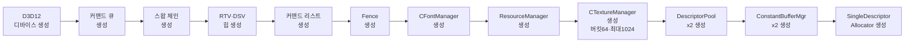
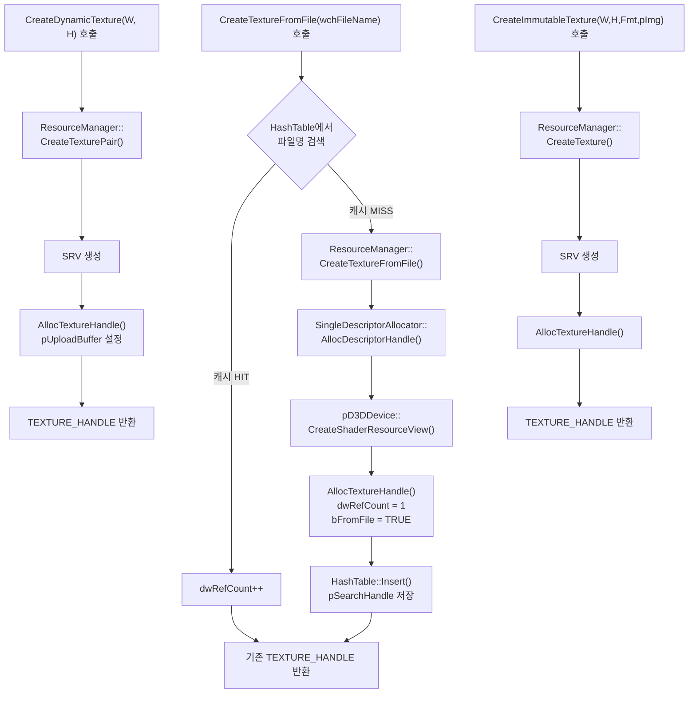
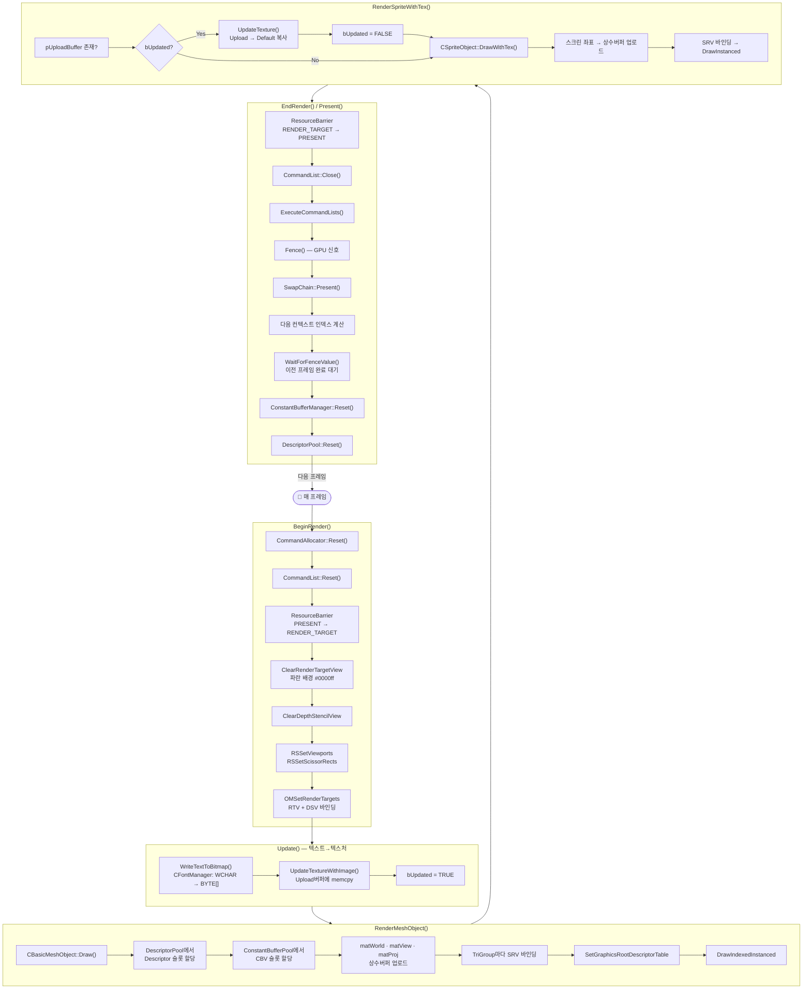
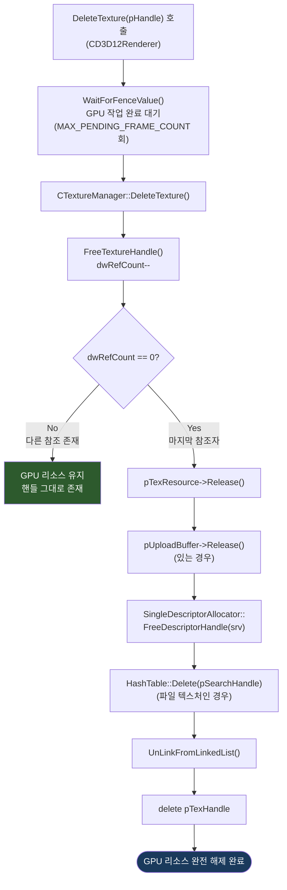

# Chapter 16 vs Chapter 15 상세 비교

## 개요

| 항목 | Chapter 15 (TextToTexture) | Chapter 16 (TextureManager) |
|------|---------------------------|------------------------------|
| 핵심 주제 | 텍스트를 텍스처에 렌더링 | 텍스처 전담 관리 클래스 도입 |
| 신규 파일 | 없음 | `TextureManager.h`, `TextureManager.cpp` |
| 텍스처 관리 위치 | `CD3D12Renderer` 내부 | `CTextureManager` 별도 클래스 |
| 텍스처 중복 로드 | 불가 (매번 새로 생성) | **해시 테이블 캐싱**으로 재사용 |
| 참조 카운팅 | 없음 | `dwRefCount` 기반 관리 |

---

## 1. 신규 파일: TextureManager.h / TextureManager.cpp

Chapter 16에서 가장 핵심적인 변경은 `CTextureManager` 클래스의 도입이다.

### TextureManager.h (신규)

```cpp
// Chapter 16 전용
class CTextureManager
{
    CD3D12Renderer*        m_pRenderer = nullptr;
    CD3D12ResourceManager* m_pResourceManager = nullptr;
    CHashTable*            m_pHashTable = nullptr;   // ← 파일명 기반 캐시

    SORT_LINK* m_pTexLinkHead = nullptr;
    SORT_LINK* m_pTexLinkTail = nullptr;

    TEXTURE_HANDLE* AllocTextureHandle();
    DWORD           FreeTextureHandle(TEXTURE_HANDLE* pTexHandle);  // 반환값: 남은 refCount
    void            Cleanup();
public:
    BOOL            Initialize(CD3D12Renderer* pRenderer,
                               DWORD dwMaxBucketNum, DWORD dwMaxFileNum);
    TEXTURE_HANDLE* CreateTextureFromFile(const WCHAR* wchFileName);
    TEXTURE_HANDLE* CreateDynamicTexture(UINT TexWidth, UINT TexHeight);
    TEXTURE_HANDLE* CreateImmutableTexture(UINT TexWidth, UINT TexHeight,
                                           DXGI_FORMAT format, const BYTE* pInitImage);
    void            DeleteTexture(TEXTURE_HANDLE* pTexHandle);

    CTextureManager();
    ~CTextureManager();
};
```

---

## 2. typedef.h — TEXTURE_HANDLE 구조체 변경

Chapter 15와 16 모두 같은 구조체 이름을 사용하지만 필드가 다르다.

### Chapter 15

```cpp
struct TEXTURE_HANDLE
{
    ID3D12Resource*             pTexResource;
    ID3D12Resource*             pUploadBuffer;
    D3D12_CPU_DESCRIPTOR_HANDLE srv;
    BOOL    bUpdated;
    SORT_LINK Link;
};
```

### Chapter 16 (추가 필드 강조)

```cpp
struct TEXTURE_HANDLE
{
    ID3D12Resource*             pTexResource;
    ID3D12Resource*             pUploadBuffer;
    D3D12_CPU_DESCRIPTOR_HANDLE srv;
    BOOL    bUpdated;
    BOOL    bFromFile;       // ← [NEW] 파일에서 로드된 텍스처 여부
    DWORD   dwRefCount;      // ← [NEW] 참조 카운트
    void*   pSearchHandle;   // ← [NEW] 해시 테이블 검색 핸들
    SORT_LINK Link;
};
```

**추가 필드 설명:**

| 필드 | 설명 |
|------|------|
| `bFromFile` | `CreateTextureFromFile()`로 생성된 텍스처 식별 |
| `dwRefCount` | 동일 텍스처를 여러 오브젝트가 공유할 때 참조 횟수 추적 |
| `pSearchHandle` | `CHashTable::Insert()` 반환값 저장, 삭제 시 `HashTable::Delete()` 에 사용 |

---

## 3. D3D12Renderer.h 변경

### 클래스 전방 선언 추가 (Chapter 16)

```cpp
// Chapter 15
class CFontManager;
// (CTextureManager 없음)

// Chapter 16
class CFontManager;
class CTextureManager;  // ← [NEW]
```

### 멤버 변수 변경

| Chapter 15 | Chapter 16 |
|---|---|
| `CFontManager* m_pFontManager` | `CFontManager* m_pFontManager` |
| `SORT_LINK* m_pTexLinkHead` ← 렌더러가 직접 관리 | **제거됨** |
| `SORT_LINK* m_pTexLinkTail` ← 렌더러가 직접 관리 | **제거됨** |
| — | `CTextureManager* m_pTextureManager = nullptr` ← **[NEW]** |

### Private 메서드 변경

```cpp
// Chapter 15 (CD3D12Renderer 내부)
TEXTURE_HANDLE* AllocTextureHandle();             // 텍스처 핸들 할당
void            FreeTextureHandle(TEXTURE_HANDLE* pTexHandle);  // 해제

// Chapter 16
// 위 두 메서드 제거됨 → CTextureManager로 이전
```

---

## 4. D3D12Renderer.cpp 변경

### 4-1. #include 추가

```cpp
// Chapter 15
#include "ConstantBufferManager.h"
#include "D3D12Renderer.h"

// Chapter 16
#include "ConstantBufferManager.h"
#include "TextureManager.h"   // ← [NEW]
#include "D3D12Renderer.h"
```

### 4-2. Initialize() — TextureManager 생성 추가

```cpp
// Chapter 15
m_pResourceManager = new CD3D12ResourceManager;
m_pResourceManager->Initialize(m_pD3DDevice);
// TextureManager 없음

// Chapter 16
m_pResourceManager = new CD3D12ResourceManager;
m_pResourceManager->Initialize(m_pD3DDevice);

m_pTextureManager = new CTextureManager;          // ← [NEW]
m_pTextureManager->Initialize(this, 1024 / 16, 1024);
// dwMaxBucketNum = 64, dwMaxFileNum = 1024
```

### 4-3. CreateDynamicTexture() — 완전히 위임

```cpp
// Chapter 15 (렌더러가 직접 GPU 리소스 생성)
void* CD3D12Renderer::CreateDynamicTexture(UINT TexWidth, UINT TexHeight)
{
    TEXTURE_HANDLE* pTexHandle = nullptr;
    ID3D12Resource* pTexResource = nullptr;
    ID3D12Resource* pUploadBuffer = nullptr;
    D3D12_CPU_DESCRIPTOR_HANDLE srv = {};
    DXGI_FORMAT TexFormat = DXGI_FORMAT_R8G8B8A8_UNORM;

    if (m_pResourceManager->CreateTexturePair(&pTexResource, &pUploadBuffer, TexWidth, TexHeight, TexFormat))
    {
        D3D12_SHADER_RESOURCE_VIEW_DESC SRVDesc = {};
        // ... SRVDesc 설정 ...
        if (m_pSingleDescriptorAllocator->AllocDescriptorHandle(&srv))
        {
            m_pD3DDevice->CreateShaderResourceView(pTexResource, &SRVDesc, srv);
            pTexHandle = AllocTextureHandle();
            pTexHandle->pTexResource  = pTexResource;
            pTexHandle->pUploadBuffer = pUploadBuffer;
            pTexHandle->srv           = srv;
        }
        // ... 실패 처리 ...
    }
    return pTexHandle;
}

// Chapter 16 (단 한 줄로 위임)
void* CD3D12Renderer::CreateDynamicTexture(UINT TexWidth, UINT TexHeight)
{
    TEXTURE_HANDLE* pTexHandle = m_pTextureManager->CreateDynamicTexture(TexWidth, TexHeight);
    return pTexHandle;
}
```

### 4-4. CreateTiledTexture() — 위임

```cpp
// Chapter 15 (렌더러가 직접 처리)
// 타일 이미지 생성 후 ...
if (m_pResourceManager->CreateTexture(&pTexResource, TexWidth, TexHeight, TexFormat, pImage))
{
    // SRV 생성, AllocTextureHandle(), 핸들 채우기 ...
}
free(pImage);
return pTexHandle;

// Chapter 16 (이미지 생성 후 TextureManager에 위임)
// 타일 이미지 생성 후 ...
TEXTURE_HANDLE* pTexHandle =
    m_pTextureManager->CreateImmutableTexture(TexWidth, TexHeight, TexFormat, pImage);  // ← [NEW]
free(pImage);
return pTexHandle;
```

### 4-5. CreateTextureFromFile() — 완전히 위임

```cpp
// Chapter 15 (렌더러가 직접 파일 로드 + SRV 생성)
void* CD3D12Renderer::CreateTextureFromFile(const WCHAR* wchFileName)
{
    ID3D12Resource* pTexResource = nullptr;
    D3D12_CPU_DESCRIPTOR_HANDLE srv = {};
    D3D12_RESOURCE_DESC desc = {};
    if (m_pResourceManager->CreateTextureFromFile(&pTexResource, &desc, wchFileName))
    {
        // SRVDesc 설정, AllocDescriptorHandle, CreateSRV, AllocTextureHandle ...
    }
    return pTexHandle;
}

// Chapter 16 (단 한 줄로 위임 + 캐싱 자동)
void* CD3D12Renderer::CreateTextureFromFile(const WCHAR* wchFileName)
{
    TEXTURE_HANDLE* pTexHandle = m_pTextureManager->CreateTextureFromFile(wchFileName);
    return pTexHandle;
}
```

### 4-6. DeleteTexture() — 위임

```cpp
// Chapter 15 (직접 GPU 리소스 해제)
void CD3D12Renderer::DeleteTexture(void* pHandle)
{
    for (DWORD i = 0; i < MAX_PENDING_FRAME_COUNT; i++)
        WaitForFenceValue(m_pui64LastFenceValue[i]);

    TEXTURE_HANDLE* pTexHandle = (TEXTURE_HANDLE*)pHandle;
    if (pTexHandle->pTexResource)   pTexHandle->pTexResource->Release();
    if (pTexHandle->pUploadBuffer)  pTexHandle->pUploadBuffer->Release();
    m_pSingleDescriptorAllocator->FreeDescriptorHandle(pTexHandle->srv);
    FreeTextureHandle(pTexHandle);
}

// Chapter 16 (TextureManager에 위임 → ref count 감소)
void CD3D12Renderer::DeleteTexture(void* pTexHandle)
{
    for (DWORD i = 0; i < MAX_PENDING_FRAME_COUNT; i++)
        WaitForFenceValue(m_pui64LastFenceValue[i]);

    m_pTextureManager->DeleteTexture((TEXTURE_HANDLE*)pTexHandle);  // ← refCount 감소
}
```

### 4-7. AllocTextureHandle() / FreeTextureHandle() 제거

```cpp
// Chapter 15에만 존재 (Chapter 16에서 제거됨)
TEXTURE_HANDLE* CD3D12Renderer::AllocTextureHandle()
{
    TEXTURE_HANDLE* pTexHandle = new TEXTURE_HANDLE;
    memset(pTexHandle, 0, sizeof(TEXTURE_HANDLE));
    pTexHandle->Link.pItem = pTexHandle;
    LinkToLinkedListFIFO(&m_pTexLinkHead, &m_pTexLinkTail, &pTexHandle->Link);
    return pTexHandle;
}
void CD3D12Renderer::FreeTextureHandle(TEXTURE_HANDLE* pTexHandle)
{
    UnLinkFromLinkedList(&m_pTexLinkHead, &m_pTexLinkTail, &pTexHandle->Link);
    delete pTexHandle;
}
```

---

## 5. TextureManager.cpp — 핵심 구현 상세

### 5-1. Initialize()

```cpp
BOOL CTextureManager::Initialize(CD3D12Renderer* pRenderer,
                                  DWORD dwMaxBucketNum, DWORD dwMaxFileNum)
{
    m_pRenderer        = pRenderer;
    m_pResourceManager = pRenderer->INL_GetResourceManager();

    m_pHashTable = new CHashTable;
    // 키: 파일 경로 문자열(WCHAR), 최대 1024개 항목, 64개 버킷
    m_pHashTable->Initialize(dwMaxBucketNum, _MAX_PATH * sizeof(WCHAR), dwMaxFileNum);
    return TRUE;
}
```

### 5-2. CreateTextureFromFile() — 캐싱 핵심 로직

```cpp
TEXTURE_HANDLE* CTextureManager::CreateTextureFromFile(const WCHAR* wchFileName)
{
    TEXTURE_HANDLE* pTexHandle = nullptr;
    DWORD dwKeySize = (DWORD)wcslen(wchFileName) * sizeof(WCHAR);

    // ① 해시 테이블에서 파일명으로 검색
    if (m_pHashTable->Select((void**)&pTexHandle, 1, wchFileName, dwKeySize))
    {
        // ② 이미 로드된 텍스처 → 참조 카운트만 증가하고 반환
        pTexHandle->dwRefCount++;
    }
    else
    {
        // ③ 처음 로드 → GPU 리소스 생성 + SRV 생성
        if (m_pResourceManager->CreateTextureFromFile(&pTexResource, &desc, wchFileName))
        {
            // SRV 생성 ...
            pTexHandle = AllocTextureHandle();
            pTexHandle->pTexResource = pTexResource;
            pTexHandle->bFromFile    = TRUE;
            pTexHandle->srv          = srv;

            // ④ 해시 테이블에 등록 (이후 검색 가능)
            pTexHandle->pSearchHandle =
                m_pHashTable->Insert((void*)pTexHandle, wchFileName, dwKeySize);
        }
    }
    return pTexHandle;
}
```

### 5-3. FreeTextureHandle() — 참조 카운팅 해제

```cpp
DWORD CTextureManager::FreeTextureHandle(TEXTURE_HANDLE* pTexHandle)
{
    if (!pTexHandle->dwRefCount)
        __debugbreak();  // 이미 0인데 해제 시도 = 버그

    DWORD ref_count = --pTexHandle->dwRefCount;

    if (!ref_count)  // ← 마지막 참조자가 해제할 때만 GPU 리소스 실제 해제
    {
        if (pTexHandle->pTexResource)   pTexHandle->pTexResource->Release();
        if (pTexHandle->pUploadBuffer)  pTexHandle->pUploadBuffer->Release();
        if (pTexHandle->srv.ptr)
            pSingleDescriptorAllocator->FreeDescriptorHandle(pTexHandle->srv);

        if (pTexHandle->pSearchHandle)
            m_pHashTable->Delete(pTexHandle->pSearchHandle);  // 캐시에서 제거

        UnLinkFromLinkedList(&m_pTexLinkHead, &m_pTexLinkTail, &pTexHandle->Link);
        delete pTexHandle;
    }
    return ref_count;
}
```

---

## 6. 변경 사항 요약표

| 파일 | Chapter 15 | Chapter 16 | 변경 유형 |
|------|-----------|-----------|----------|
| `TextureManager.h` | 없음 | 신규 | **추가** |
| `TextureManager.cpp` | 없음 | 신규 | **추가** |
| `typedef.h` | `TEXTURE_HANDLE` 5필드 | `TEXTURE_HANDLE` 8필드 | **확장** |
| `D3D12Renderer.h` | `m_pTexLinkHead/Tail` 멤버 | `m_pTextureManager` 멤버 | **교체** |
| `D3D12Renderer.h` | `AllocTextureHandle()` 비공개 메서드 | 제거됨 | **이전** |
| `D3D12Renderer.cpp` | 텍스처 생성/삭제 직접 구현 | TextureManager에 위임 | **리팩터링** |
| `D3D12Renderer.cpp` | `AllocTextureHandle/FreeTextureHandle` 구현 | 제거됨 | **이전** |

---

## 7. 렌더링 파이프라인 Mermaid Flowchart

### 7-1a. 앱 오브젝트 생성 순서


### 7-1b. CD3D12Renderer::Initialize() 내부 순서



---

### 7-2. CTextureManager 텍스처 생성 및 캐싱 흐름



---

### 7-3. 프레임 렌더링 루프 흐름



---

### 7-4. 텍스처 삭제 및 참조 카운팅 흐름



---

## 8. 아키텍처 변화 핵심 요약

### Chapter 15: 모놀리식 텍스처 관리

```
CD3D12Renderer
├── AllocTextureHandle()    ← 직접 관리
├── FreeTextureHandle()     ← 직접 관리
├── m_pTexLinkHead/Tail     ← 직접 연결 리스트
├── CreateDynamicTexture()  ← 내부에서 GPU 리소스 생성
├── CreateTiledTexture()    ← 내부에서 GPU 리소스 생성
├── CreateTextureFromFile() ← 내부에서 파일 로드
└── DeleteTexture()         ← 직접 GPU 리소스 해제
```

### Chapter 16: 책임 분리 (SRP 적용)

```
CD3D12Renderer
├── m_pTextureManager       ← 텍스처 관리 위임
├── CreateDynamicTexture()  → m_pTextureManager->CreateDynamicTexture()
├── CreateTiledTexture()    → m_pTextureManager->CreateImmutableTexture()
├── CreateTextureFromFile() → m_pTextureManager->CreateTextureFromFile()
└── DeleteTexture()         → m_pTextureManager->DeleteTexture()

CTextureManager (NEW)
├── CHashTable              ← 파일명 키 캐시 (중복 로드 방지)
├── AllocTextureHandle()    ← 렌더러에서 이전
├── FreeTextureHandle()     ← 참조 카운팅 추가
├── CreateTextureFromFile() ← 해시 조회 → 캐시 히트 시 refCount++
├── CreateDynamicTexture()  ← 동적 텍스처 생성
├── CreateImmutableTexture()← 불변 텍스처 생성 (신규 메서드)
└── DeleteTexture()         ← refCount 0 시에만 GPU 리소스 실제 해제
```

### 개선된 점

1. **중복 로드 방지**: 동일 파일명의 텍스처를 `CreateTextureFromFile()`로 여러 번 호출해도 GPU 리소스는 1개만 생성되고 `dwRefCount`만 증가한다.
2. **안전한 해제**: `DeleteTexture()` 후에도 다른 오브젝트가 참조 중이면 GPU 리소스가 유지된다.
3. **관심사 분리**: `CD3D12Renderer`는 더 이상 텍스처 생명주기를 직접 관리하지 않는다.
4. **확장성**: `CTextureManager`는 독립적으로 교체하거나 확장할 수 있다.
