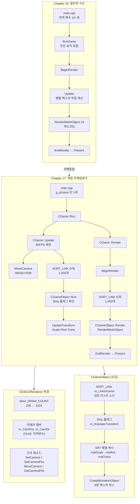
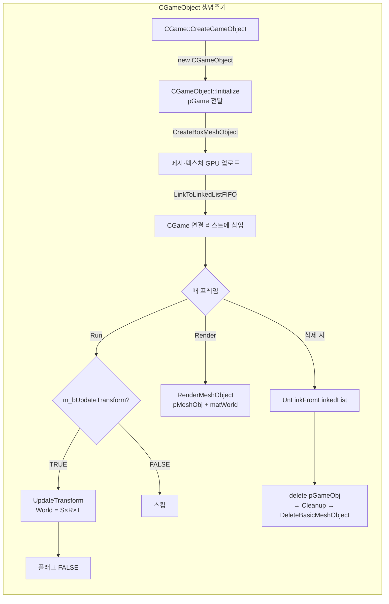

# Chapter 17 vs Chapter 16 코드 비교 분석

## 개요

| 항목 | Chapter 16 (TextureManager) | Chapter 17 (GameFrameWork) |
|------|-----------------------------|-----------------------------|
| 핵심 주제 | 텍스처 매니저 완성 + 다양한 렌더링 | **게임 프레임워크 도입** |
| 아키텍처 | 절차적 (전역 변수 + 전역 함수) | 객체지향 (CGame + CGameObject) |
| 렌더링 오브젝트 수 | 3개 고정 (하드코딩) | 1,000개 동적 생성 |
| 카메라 제어 | 없음 (정적 카메라) | WASD + Shift 키보드 이동 |
| 신규 파일 | 없음 | `Game.h/cpp`, `GameObject.h/cpp` |
| `MAX_DRAW_COUNT_PER_FRAME` | 256 | **1024** |

---

## 1. 아키텍처 변화: 절차적 → 게임 프레임워크

### Chapter 16: 전역 변수 기반 절차적 구조

```cpp
// main.cpp (Ch16)
CD3D12Renderer* g_pRenderer = nullptr;
void* g_pMeshObj0 = nullptr;
void* g_pMeshObj1 = nullptr;
void* g_pSpriteObjCommon = nullptr;
float g_fRot0 = 0.0f;
// ...수십 개의 전역 변수

void RunGame() { /* BeginRender + Update + Render + EndRender 모두 여기서 */ }
void Update()  { /* 회전 행렬, 텍스처 업데이트 모두 여기서 */ }
```

### Chapter 17: CGame + CGameObject 클래스 계층

```cpp
// main.cpp (Ch17)
CGame* g_pGame = nullptr;  // 전역 변수는 이 하나뿐!

// 게임 루프
g_pGame->Run();            // 프레임마다 호출
```

---

## 2. 신규 파일: Game.h / Game.cpp

### CGame 클래스

**역할**: 게임 전체를 총괄하는 최상위 매니저. 렌더러를 소유하고, 모든 게임 오브젝트의 생명주기를 관리하며, 게임 루프(Update + Render)를 구동한다.

```cpp
// Game.h
class CGame
{
    CD3D12Renderer* m_pRenderer;   // 렌더러 소유
    HWND            m_hWnd;        // 윈도우 핸들

    // 동적 텍스트 렌더링용
    BYTE*  m_pTextImage;           // CPU 텍스처 버퍼 (FPS 표시)
    UINT   m_TextImageWidth;       // 512
    UINT   m_TextImageHeight;      // 256
    void*  m_pTextTexTexHandle;    // GPU 텍스처 핸들
    void*  m_pFontObj;             // 폰트 객체 핸들

    // 카메라 이동 상태
    BOOL   m_bShiftKeyDown;        // Shift 키 눌림 여부 (Y축 이동 전환)
    float  m_CamOffsetX;           // 프레임당 카메라 X 이동량
    float  m_CamOffsetY;           // 프레임당 카메라 Y 이동량
    float  m_CamOffsetZ;           // 프레임당 카메라 Z 이동량

    // 게임 오브젝트 연결 리스트
    SORT_LINK* m_pGameObjLinkHead; // 리스트 헤드 포인터
    SORT_LINK* m_pGameObjLinkTail; // 리스트 테일 포인터

    // FPS 계산
    ULONGLONG m_PrvFrameCheckTick; // 마지막 FPS 측정 시각 (ms)
    ULONGLONG m_PrvUpdateTick;     // 마지막 Update 시각 (60FPS 제한용)
    DWORD     m_FrameCount;        // 현재 FPS 구간 프레임 수
    DWORD     m_FPS;               // 계산된 FPS
    WCHAR     m_wchText[64];       // 이전 텍스트 (변경 감지용)
};
```

#### CGame 메소드 상세

| 메소드 | 인자 | 목적 |
|--------|------|------|
| `Initialize(hWnd, bEnableDebugLayer, bEnableGBV)` | `hWnd`: 렌더링 대상 윈도우<br>`bEnableDebugLayer`: D3D12 디버그 레이어 활성화<br>`bEnableGBV`: GPU 기반 유효성 검사 활성화 | 렌더러 생성, 1,000개 게임 오브젝트를 랜덤 위치/회전으로 초기화 |
| `Run()` | 없음 | 매 프레임 호출. `Update()` + `Render()` 순서로 실행하고 FPS 측정 |
| `Update(CurTick)` | `CurTick`: `GetTickCount64()` 반환값 (ms 단위) | 16ms 간격(~60FPS)으로 카메라 이동, 모든 오브젝트 `Run()`, FPS 텍스트 갱신 |
| `Render()` | 없음 | BeginRender → 모든 오브젝트 `Render()` → 텍스트 스프라이트 렌더 → EndRender → Present |
| `CreateGameObject()` | 없음 | `CGameObject` 힙 할당 → `Initialize()` → 연결 리스트 FIFO 삽입 → 포인터 반환 |
| `DeleteGameObject(pGameObj)` | `pGameObj`: 삭제할 오브젝트 포인터 | 연결 리스트에서 제거 후 `delete` |
| `DeleteAllGameObjects()` | 없음 | 리스트 헤드에서 순서대로 전체 삭제 |
| `OnKeyDown(nChar, uiScanCode)` | `nChar`: 가상 키 코드 (VK_SHIFT, 'W', 'S', 'A', 'D')<br>`uiScanCode`: 하드웨어 스캔 코드 | Shift 상태 기록, WASD 키에 따라 `m_CamOffset*` 설정 |
| `OnKeyUp(nChar, uiScanCode)` | 동일 | `m_CamOffset*`을 0으로 초기화 (이동 정지) |
| `UpdateWindowSize(dwBackBufferWidth, dwBackBufferHeight)` | 백 버퍼 새 해상도 | 렌더러에 해상도 변경 전달 |
| `INL_GetRenderer()` | 없음 | 렌더러 포인터 반환 (CGameObject가 사용) |

---

## 3. 신규 파일: GameObject.h / GameObject.cpp

### CGameObject 클래스

**역할**: 씬에 배치되는 개별 3D 오브젝트. 위치/스케일/회전 트랜스폼을 관리하고, 메시를 소유하며, 매 프레임 World 행렬을 계산해 렌더러에 넘긴다.

```cpp
// GameObject.h
class CGameObject
{
    CGame*           m_pGame;      // 소유자 CGame (INL_GetRenderer 접근용)
    CD3D12Renderer*  m_pRenderer;  // 렌더러 직접 참조 (렌더 최적화)
    void*            m_pMeshObj;   // 렌더러가 관리하는 메시 핸들 (void* 추상화)

    // 트랜스폼 데이터
    XMVECTOR m_Scale;              // (sx, sy, sz, 0)
    XMVECTOR m_Pos;                // (x, y, z, 0)
    float    m_fRotY;              // Y축 회전각 (라디안)

    // 캐시된 행렬 (매 프레임 재계산 방지)
    XMMATRIX m_matScale;           // XMMatrixScaling(sx, sy, sz)
    XMMATRIX m_matRot;             // XMMatrixRotationY(fRotY)
    XMMATRIX m_matTrans;           // XMMatrixTranslation(x, y, z)
    XMMATRIX m_matWorld;           // Scale x Rot x Trans (최종 World 행렬)
    BOOL     m_bUpdateTransform;   // Dirty 플래그: TRUE이면 UpdateTransform 필요

public:
    SORT_LINK m_LinkInGame;        // 연결 리스트 노드 (CGame의 오브젝트 목록에 삽입)
};
```

#### SORT_LINK 구조체 (Util/LinkedList.h)

```cpp
struct SORT_LINK {
    SORT_LINK* pPrv;   // 이전 노드
    SORT_LINK* pNext;  // 다음 노드
    void*      pItem;  // 실제 오브젝트 포인터 (this)
};
```
`CGameObject`가 `SORT_LINK m_LinkInGame`을 **멤버로 직접 포함**하므로 별도 힙 할당 없이 연결 리스트에 참여한다.

#### CGameObject 메소드 상세

| 메소드 | 인자 | 목적 |
|--------|------|------|
| `Initialize(pGame)` | `pGame`: 소유자 CGame 포인터 | 렌더러 참조 취득, 박스 메시 생성 |
| `SetPosition(x, y, z)` | 월드 좌표 (미터 단위) | `m_Pos` 갱신 + `XMMatrixTranslation`으로 Translation 행렬 캐시, Dirty 플래그 설정 |
| `SetScale(x, y, z)` | 각 축 스케일 배율 | `m_Scale` 갱신 + `XMMatrixScaling`으로 Scale 행렬 캐시, Dirty 플래그 설정 |
| `SetRotationY(fRotY)` | Y축 회전각 (라디안) | `m_fRotY` 갱신 + `XMMatrixRotationY`로 Rotation 행렬 캐시, Dirty 플래그 설정 |
| `Run()` | 없음 | Dirty 플래그(`m_bUpdateTransform`)가 TRUE일 때만 `UpdateTransform()` 호출 |
| `UpdateTransform()` | 없음 | `m_matWorld = m_matScale × m_matRot × m_matTrans` (SRT 순서) |
| `Render()` | 없음 | `m_pRenderer->RenderMeshObject(m_pMeshObj, &m_matWorld)` 호출 |
| `CreateBoxMeshObject()` | 없음 | 6면 텍스처가 다른 0.25m 박스 메시 생성 (tex_00~05.dds) |
| `CreateQuadMesh()` | 없음 | 4정점 사각형 메시 생성 (tex_06.dds) — 현재 미사용 (향후 확장용) |
| `Cleanup()` | 없음 | `m_pRenderer->DeleteBasicMeshObject()` 호출로 메시 해제 |

#### World 행렬 계산 (SRT 순서)

$$\mathbf{M}_{world} = \mathbf{M}_{scale} \times \mathbf{M}_{rot} \times \mathbf{M}_{trans}$$

이 순서로 곱하면 오브젝트 자신의 중심을 기준으로 스케일 → 회전 → 평행이동이 적용된다.

---

## 4. D3D12Renderer 변경사항

### 4-1. MAX_DRAW_COUNT_PER_FRAME: 256 → 1024

```cpp
// Ch16
static const UINT MAX_DRAW_COUNT_PER_FRAME = 256;

// Ch17
static const UINT MAX_DRAW_COUNT_PER_FRAME = 1024;
```

이 값은 프레임당 DescriptorPool과 ConstantBufferPool의 할당 단위를 결정한다. 1,000개 오브젝트를 렌더링하려면 최소 1,000개 상수 버퍼 슬롯이 필요하므로 확장했다.

### 4-2. 카메라 멤버 변수 추가

```cpp
// Ch16: InitCamera()에서 지역 변수로만 사용
void CD3D12Renderer::InitCamera() {
    XMVECTOR eyePos = XMVectorSet(0.0f, 0.0f, -1.0f, 1.0f); // 지역 변수
    XMVECTOR eyeDir = XMVectorSet(0.0f, 0.0f, 1.0f, 0.0f);  // 지역 변수
    m_matView = XMMatrixLookToLH(eyePos, eyeDir, upDir);
    // 이후 카메라 위치/방향 변경 불가
}

// Ch17: 클래스 멤버로 저장 → 런타임 변경 가능
class CD3D12Renderer {
    XMVECTOR m_CamPos;  // 카메라 위치 (동적 변경 가능)
    XMVECTOR m_CamDir;  // 카메라 방향 (동적 변경 가능)
};
```

### 4-3. 카메라 제어 메소드 추가

| 메소드 | 인자 | 목적 |
|--------|------|------|
| `SetCamera(pCamPos, pCamDir, pCamUp)` | `pCamPos`: 카메라 월드 위치 벡터<br>`pCamDir`: 카메라가 바라보는 방향 벡터<br>`pCamUp`: 카메라 위쪽 방향 벡터 (보통 Y축) | `XMMatrixLookToLH`로 View 행렬, `XMMatrixPerspectiveFovLH`로 Projection 행렬 계산. 모든 카메라 설정 함수의 공통 구현부 |
| `SetCameraPos(x, y, z)` | 새 카메라 위치 (절대값) | `m_CamPos` 업데이트 후 `SetCamera()` 호출 |
| `MoveCamera(x, y, z)` | 이동 델타값 (상대값) | `m_CamPos += delta` 후 `SetCamera()` 호출 |
| `GetCameraPos(pfOutX, pfOutY, pfOutZ)` | 출력 포인터 3개 | 현재 카메라 위치를 float으로 반환 |

`InitCamera()` 리팩토링:

```cpp
// Ch17 InitCamera: 멤버 변수에 저장하고 SetCamera()에 위임
void CD3D12Renderer::InitCamera() {
    m_CamPos = XMVectorSet(0.0f, 0.0f, -1.0f, 1.0f);
    m_CamDir = XMVectorSet(0.0f, 0.0f,  1.0f, 0.0f);
    XMVECTOR Up = XMVectorSet(0.0f, 1.0f, 0.0f, 0.0f);
    SetCamera(&m_CamPos, &m_CamDir, &Up);  // 공통 함수 사용
}
```

---

## 5. main.cpp 변경사항

### Ch16: 많은 전역 변수, WndProc에 키보드 입력 없음

```cpp
// Ch16 main.cpp 전역 변수 (일부)
CD3D12Renderer* g_pRenderer = nullptr;
void* g_pMeshObj0 = nullptr;
void* g_pMeshObj1 = nullptr;
void* g_pSpriteObjCommon = nullptr;
void* g_pSpriteObj0 = nullptr;
// ... 10여 개 이상

// WndProc: WM_KEYDOWN/WM_KEYUP 처리 없음
// WM_SIZE: g_pRenderer->UpdateWindowSize() 직접 호출
```

### Ch17: 단일 CGame 전역 변수, 키보드 입력 위임

```cpp
// Ch17 main.cpp 전역 변수
CGame* g_pGame = nullptr;  // 단 하나!

// WndProc: 키보드 입력을 CGame에 위임
case WM_KEYDOWN:
    UINT uiScanCode = (0x00ff0000 & lParam) >> 16;
    UINT vkCode = MapVirtualKey(uiScanCode, MAPVK_VSC_TO_VK);
    if (!(lParam & 0x40000000))  // 키 반복(auto-repeat) 무시
        g_pGame->OnKeyDown(vkCode, uiScanCode);
    break;

case WM_KEYUP:
    g_pGame->OnKeyUp(vkCode, uiScanCode);
    break;

// WM_SIZE: g_pGame->UpdateWindowSize() 위임
```

### WM_KEYDOWN lParam 비트 구조 상세

Windows가 `WM_KEYDOWN` 메시지를 보낼 때 `lParam`에 키 상태 정보를 비트 필드로 담아 전달한다.

```
lParam (32비트) 구조:
 31  30  29  28~24  23~16    15     0~14
 [TR][PR][CT][미사용][ScanCode][Ext][RepeatCount]
```

| 비트 | 이름 | 값 | 의미 |
|------|------|----|------|
| 비트 31 | Transition state | 0=WM_KEYDOWN, 1=WM_KEYUP | 키 눌림/뗌 구분 |
| **비트 30** | **Previous key state** | **0=이전에 뗀 상태, 1=이전에도 눌린 상태** | **반복 전송 감지** |
| 비트 29 | Context code | ALT 눌림 여부 | |
| 비트 16~23 | **Scan code** | 하드웨어 키 번호 | |
| 비트 0~15 | Repeat count | 반복 횟수 | |

```cpp
// ① 하드웨어 스캔 코드 추출: 비트 16~23을 꺼냄
UINT uiScanCode = (0x00ff0000 & lParam) >> 16;
//                 ──────────  → 비트 23~16 마스킹
//                              >> 16       → 0번 비트 위치로 이동
```

- **스캔 코드(Scan Code)**: 키보드 하드웨어가 보내는 물리적 키 번호. 언어/레이아웃에 무관하게 물리적 위치만 나타낸다. 예) QWERTY의 'A' 위치 = 스캔 코드 0x1E (AZERTY 키보드에서도 동일 위치면 같은 값).

```cpp
// ② 스캔 코드 → 가상 키 코드 변환
UINT vkCode = MapVirtualKey(uiScanCode, MAPVK_VSC_TO_VK);
```

- **`MapVirtualKey(uCode, uMapType)`**:
  - `uCode`: 변환할 원본 코드
  - `uMapType`: 변환 방향 지정
    - `MAPVK_VSC_TO_VK` (1): **Scan Code → Virtual Key Code** (이 코드에서 사용)
    - `MAPVK_VK_TO_VSC` (0): Virtual Key → Scan Code
- **가상 키 코드(Virtual Key Code, VK)**: OS/언어 설정에 따라 정의된 논리적 키 번호. `VK_SHIFT`(0x10), `'A'`(0x41) 등 `VK_*` 상수로 표현. `OnKeyDown`에서 이 값으로 분기한다.

> **왜 스캔 코드를 먼저 꺼내서 다시 변환하는가?**  
> `wParam`에도 VK 코드가 있지만, 좌/우 Shift 등을 구분하거나 특수 키를 정확히 처리하려면 스캔 코드를 경유하는 방식이 더 신뢰성이 높기 때문이다.

```cpp
// ③ 키 반복(auto-repeat) 차단
if (!(lParam & 0x40000000))   // 비트 30이 0 = 이전에 뗀 상태 = 최초 누름
    g_pGame->OnKeyDown(vkCode, uiScanCode);
```

- 키를 꾹 누르고 있으면 Windows가 `WM_KEYDOWN`을 계속 반복 전송한다.
- 비트 30 = 1이면 "이전 프레임에도 눌려 있었다" = **반복 전송**이므로 무시.
- `!(lParam & 0x40000000)` 가 TRUE인 경우만 = 비트 30이 0 = **최초 누름** → `OnKeyDown` 1번만 호출.

### OnKeyDown / OnKeyUp 동작 원리

```cpp
// CGame::OnKeyDown — 키를 누른 순간 호출 (1번)
void CGame::OnKeyDown(UINT nChar, UINT uiScanCode) {
    switch (nChar) {
        case VK_SHIFT: m_bShiftKeyDown = TRUE;  break;
        case 'W':
            // Shift 상태에 따라 Z 이동 vs Y 이동 전환
            m_CamOffsetZ = m_bShiftKeyDown ? 0.0f : 0.05f;
            m_CamOffsetY = m_bShiftKeyDown ? 0.05f : 0.0f;
            break;
        case 'A': m_CamOffsetX = -0.05f; break;
        case 'D': m_CamOffsetX =  0.05f; break;
        // ...
    }
}

// CGame::OnKeyUp — 키를 뗀 순간 호출 (1번)
void CGame::OnKeyUp(UINT nChar, UINT uiScanCode) {
    switch (nChar) {
        case VK_SHIFT: m_bShiftKeyDown = FALSE; break;
        case 'W': m_CamOffsetZ = 0.0f; m_CamOffsetY = 0.0f; break;
        case 'A': m_CamOffsetX = 0.0f; break;
        // ...
    }
}
```

- **Offset 방식**: 키를 누르는 동안 `m_CamOffset*`에 이동량(0.05m/frame)을 저장.
- **매 프레임 `Update()`** 에서 Offset이 0이 아니면 `MoveCamera()`를 호출 → 카메라가 지속적으로 이동.
- 키를 떼면 Offset = 0 → 이동 정지. **상태(state) 기반 이동** 패턴.

```
키 누름  ────[OnKeyDown: Offset=0.05]────────────────[OnKeyUp: Offset=0.0]───→
프레임   →  Update→Move  →  Update→Move  →  Update→Move  →  Update→정지
```

### UpdateWindowSize 동작

```cpp
// WndProc WM_SIZE: 윈도우 크기 변경 시 호출
case WM_SIZE:
    RECT rect;
    GetClientRect(hWnd, &rect);
    DWORD dwWndWidth  = rect.right - rect.left;
    DWORD dwWndHeight = rect.bottom - rect.top;
    g_pGame->UpdateWindowSize(dwWndWidth, dwWndHeight);
```

`CGame::UpdateWindowSize` → `CD3D12Renderer::UpdateWindowSize` 순서로 위임되며, 렌더러 내부에서:

1. GPU 명령 완료 대기 (`Fence` + `WaitForFenceValue`)
2. 기존 RenderTarget / DepthStencil 해제
3. `SwapChain::ResizeBuffers` 로 백 버퍼 크기 변경
4. 새 크기로 RenderTargetView / DepthStencilView 재생성
5. Viewport / ScissorRect 업데이트
6. Projection 행렬 재계산 (종횡비 변경 반영)

---

## 6. 연결 리스트를 이용한 GameObjects 관리

```
CGame
  ├── m_pGameObjLinkHead ──→ [SORT_LINK] ──→ [SORT_LINK] ──→ ... ──→ nullptr
  │                              │                │
  │                           pItem            pItem
  │                              ↓                ↓
  │                        CGameObject      CGameObject
  └── m_pGameObjLinkTail ──────────────────────────→ [마지막 SORT_LINK]
```

- **SORT_LINK가 CGameObject 안에 멤버로 내장**: 별도 노드 할당 없이 오브젝트 자체가 리스트 노드가 됨 → 캐시 효율적
- **FIFO 삽입** (`LinkToLinkedListFIFO`): 생성 순서 유지
- **순회**: `pCur = m_pGameObjLinkHead` → `pCur = pCur->pNext` 반복

---

## 7. 게임 오브젝트 초기화 (1,000개)

```cpp
// CGame::Initialize() 중
const DWORD GAME_OBJ_COUNT = 1000;
for (DWORD i = 0; i < GAME_OBJ_COUNT; i++)
{
    CGameObject* pGameObj = CreateGameObject();
    if (pGameObj)
    {
        float x = (float)((rand() % 21) - 10);  // -10m ~ +10m
        float y = 0.0f;                           // 바닥 평면
        float z = (float)((rand() % 21) - 10);  // -10m ~ +10m
        pGameObj->SetPosition(x, y, z);

        float rad = (rand() % 181) * (3.1415f / 180.0f);  // 0° ~ 180°
        pGameObj->SetRotationY(rad);
    }
}
m_pRenderer->SetCameraPos(0.0f, 0.0f, -10.0f);  // 카메라를 뒤로 물림
```

---

## 8. Dirty 플래그 패턴 (Transform 최적화)

Ch17는 Transform 연산을 최적화하기 위해 Dirty 플래그 패턴을 도입한다.

```cpp
void CGameObject::SetPosition(float x, float y, float z) {
    m_matTrans = XMMatrixTranslation(x, y, z);
    m_bUpdateTransform = TRUE;  // Dirty 플래그 설정
}

void CGameObject::Run() {
    if (m_bUpdateTransform) {
        UpdateTransform();           // World 행렬 재계산
        m_bUpdateTransform = FALSE;  // 플래그 초기화
    }
    // 변경이 없으면 World 행렬 재계산 생략
}
```

이 예제에서는 초기화 시 한 번만 SetPosition/SetRotation을 호출하므로 실제 효과는 제한적이지만, 이후 챕터에서 오브젝트가 매 프레임 움직일 때 행렬 재계산 비용을 줄이는 패턴을 보여준다.

---

## 9. 핵심 변화 요약

| 구분 | Ch16 | Ch17 |
|------|------|------|
| 전역 상태 | 10+ 전역 변수 | `CGame*` 1개 |
| 오브젝트 수 | 3개 (하드코딩) | 1,000개 (동적) |
| 오브젝트 관리 | 없음 (전역 포인터) | 연결 리스트 (SORT_LINK) |
| 트랜스폼 | 행렬 즉시 계산 | Dirty 플래그 + 캐시 |
| 카메라 | 정적 | 동적 이동 (WASD+Shift) |
| 키보드 | 없음 | OnKeyDown/OnKeyUp |
| 코드 위치 | main.cpp 한 파일 | Game.cpp + GameObject.cpp 분리 |
| DescriptorPool 크기 | 256 draw | **1024 draw** |

---

## 10. 핵심 변화 Mermaid Flowchart




