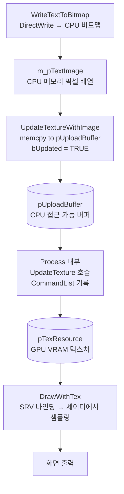
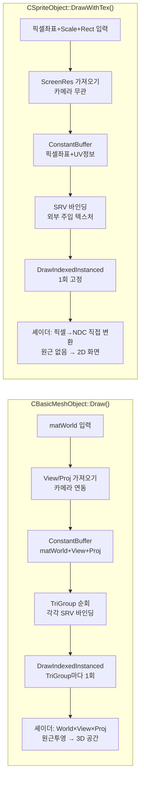

# BasicMeshObject vs SpriteObject 상세 비교

---

## 1. 한 줄 정의

| | `CBasicMeshObject` | `CSpriteObject` |
|---|---|---|
| 정의 | 임의의 3D 메시를 3D 월드 공간에 배치하는 오브젝트 | 고정된 사각형(quad)을 2D 화면 픽셀 좌표에 배치하는 오브젝트 |
| 용도 | 캐릭터, 나무, 건물 등 3D 모델 | UI, HUD, 텍스트 오버레이, 2D 이미지 |

---

## 2. 좌표계 / 셰이더

### BasicMeshObject — 3D 원근투영

```hlsl
// shBasicMesh.hlsl
cbuffer CONSTANT_BUFFER_DEFAULT : register(b0)
{
    matrix g_matWorld;   // 오브젝트 월드 위치/회전/스케일
    matrix g_matView;    // 카메라 뷰 행렬
    matrix g_matProj;    // 원근 투영 행렬 (FOV 45도)
};

PSInput VSMain(VSInput input)
{
    matrix matWorldViewProj = g_matWorld × g_matView × g_matProj;
    result.position = input.Pos × matWorldViewProj;
    // → 멀리 있으면 작게, 가까우면 크게 (원근감 O)
}
```

### SpriteObject — 2D 직교 변환

```hlsl
// shSprite.hlsl
cbuffer CONSTANT_BUFFER_SPRITE : register(b0)
{
    float2 g_ScreenRes;      // 화면 해상도 (픽셀 → NDC 변환용)
    float2 g_Pos;            // 화면 픽셀 좌표
    float2 g_Scale;          // 스케일
    float2 g_TexSize;        // 텍스처 전체 크기
    float2 g_TexSampePos;    // UV 클리핑 시작점
    float2 g_TexSampleSize;  // UV 클리핑 크기
    float  g_Z;              // 깊이값 (정렬용)
    float  g_Alpha;
};

PSInput VSMain(VSInput input)
{
    float2 scale  = (g_TexSize / g_ScreenRes) * g_Scale;
    float2 offset = (g_Pos / g_ScreenRes);
    float2 Pos    = input.Pos.xy * scale + offset;
    result.position = float4(Pos.xy * float2(2,-2) + float2(-1,1), g_Z, 1);
    // → 픽셀 좌표를 NDC(-1~1)로 직접 변환. 원근감 없음
}
```

---

## 3. 버텍스 / 인덱스 버퍼

### BasicMeshObject

```cpp
// 인스턴스마다 개별 버텍스 버퍼 소유 (non-static)
ID3D12Resource* m_pVertexBuffer;           // 각 인스턴스가 따로 가짐
INDEXED_TRI_GROUP* m_pTriGroupList;        // TriGroup 배열 (최대 8개)
```

- `BeginCreateMesh()` → `InsertIndexedTriList()` → `EndCreateMesh()` 로 런타임에 메시 데이터 직접 입력
- TriGroup마다 다른 인덱스 버퍼 + 다른 텍스처 → **하나의 메시에 여러 재질** 가능

```
BasicMeshObject 메모리 구조:
┌─────────────────┐
│  VertexBuffer   │  ← 공유 버텍스 (모든 TriGroup이 같은 버텍스 사용)
├─────────────────┤
│  TriGroup[0]    │  IndexBuffer + Texture A
│  TriGroup[1]    │  IndexBuffer + Texture B
│  TriGroup[2]    │  IndexBuffer + Texture C
│  ...            │  (최대 8개)
└─────────────────┘
```

### TriGroup의 구성 요소

```cpp
struct INDEXED_TRI_GROUP
{
    ID3D12Resource*          pIndexBuffer;    // 인덱스 버퍼 (GPU 메모리)
    D3D12_INDEX_BUFFER_VIEW  IndexBufferView; // 인덱스 버퍼 뷰 (오프셋, 크기, 포맷)
    DWORD                    dwTriCount;      // 삼각형 개수
    TEXTURE_HANDLE*          pTexHandle;      // 이 그룹에 쓸 텍스처
};
```

**TriGroup = "같은 텍스처를 쓰는 삼각형들의 묶음"** 입니다.  
버텍스(점 데이터)는 오브젝트 전체가 `m_pVertexBuffer` 하나를 공유하고,  
인덱스(어떤 버텍스를 연결할지)만 TriGroup마다 따로 있습니다.

#### SRV는 텍스처 없이 가능한가?

**현재 코드에서는 불가능합니다.** `Draw()` 내부를 보면:

```cpp
TEXTURE_HANDLE* pTexHandle = pTriGroup->pTexHandle;
if (pTexHandle)
{
    CopyDescriptorsSimple(1, Dest, pTexHandle->srv, ...);
}
else
{
    __debugbreak();   // ← 텍스처 없으면 즉시 중단
}
```

`pTexHandle`이 null이면 프로그램이 멈춥니다.  
이 코드에서 `BasicMeshObject`의 TriGroup은 **반드시 텍스처가 필요**합니다.  
(텍스처 없이 버텍스 컬러만 쓰려면 셰이더와 RootSignature를 별도로 만들어야 합니다.)

### SpriteObject

```cpp
// 모든 인스턴스가 공유 (static)
static ID3D12Resource* m_pVertexBuffer;
static ID3D12Resource* m_pIndexBuffer;
```

- 버텍스가 코드에 하드코딩된 고정 quad:

```cpp
// InitMesh()에서 딱 한 번만 생성
BasicVertex Vertices[] =
{
    { {0,1,0}, {1,1,1,1}, {0,1} },   // 좌하
    { {0,0,0}, {1,1,1,1}, {0,0} },   // 좌상
    { {1,0,0}, {1,1,1,1}, {1,0} },   // 우상
    { {1,1,0}, {1,1,1,1}, {1,1} },   // 우하
};
WORD Indices[] = { 0,1,2, 0,2,3 };   // 삼각형 2개 = 사각형 1개
```

모든 스프라이트가 이 사각형 하나를 공유하고, **위치/크기/UV는 상수 버퍼로만 제어**합니다.

---

## 4. 상수 버퍼 (Constant Buffer)

| | `CONSTANT_BUFFER_DEFAULT` | `CONSTANT_BUFFER_SPRITE` |
|---|---|---|
| 내용 | matWorld, matView, matProj | ScreenRes, Pos, Scale, TexSize, TexSampePos, TexSampleSize, Z, Alpha |
| 행렬 | 3개 4×4 행렬 (192 bytes) | 없음 (float2 여러 개) |
| 카메라 | View/Proj 행렬 포함 → 카메라 이동에 반응 | 화면 해상도만 → 카메라 이동에 무관 |

---

## 5. 텍스처 처리 방식

### BasicMeshObject

```cpp
// TriGroup 초기화 시 파일에서 로드 → 고정
pTriGroup->pTexHandle = CreateTextureFromFile(wchTexFileName);

// Draw 시 TriGroup별로 SRV 바인딩
for (DWORD i = 0; i < m_dwTriGroupCount; i++)
{
    CopyDescriptorsSimple(1, Dest, pTriGroup->pTexHandle->srv, ...);
    pCommandList->DrawIndexedInstanced(...);
}
```

### SpriteObject + TEXTURE_HANDLE 구조

`TEXTURE_HANDLE`은 텍스처의 종류(파일/동적)를 구분하는 핵심 필드를 가집니다:

```cpp
struct TEXTURE_HANDLE
{
    ID3D12Resource* pTexResource;    // GPU 텍스처 리소스 (VRAM)
    ID3D12Resource* pUploadBuffer;   // CPU→GPU 업로드용 버퍼
                                     // ← 동적 텍스처만 존재, 파일 텍스처는 nullptr
    D3D12_CPU_DESCRIPTOR_HANDLE srv; // 셰이더에 바인딩할 SRV
    BOOL  bUpdated;                  // CPU에서 내용이 바뀌었는지 플래그
    BOOL  bFromFile;                 // 파일 로드 여부
    DWORD dwRefCount;
};
```

| | `pUploadBuffer` | `bUpdated` |
|---|---|---|
| 파일 로드 텍스처 | `nullptr` | 항상 FALSE |
| 동적 텍스처 (DynamicTexture) | 존재 | 내용 변경 시 TRUE |

---

### 폰트 텍스트가 화면에 나오는 전체 경로

텍스트를 화면에 그리는 것은 **"CPU에서 픽셀을 직접 그려서 GPU 텍스처에 올리는"** 방식입니다.

```
[1] 초기화 시
    m_pFontObj       = CreateFontObject(L"Tahoma", 18.0f)
                         └─ DirectWrite IDWriteTextFormat 생성

    m_pTextImage     = malloc(512 × 256 × 4)
                         └─ CPU 메모리 비트맵 버퍼 (RGBA 배열)

    m_pTextTexHandle = CreateDynamicTexture(512, 256)
                         └─ GPU 텍스처 + pUploadBuffer 모두 생성
                         └─ pUploadBuffer != nullptr  ← 동적 텍스처 표시

[2] Update() - 텍스트 변경 감지 시
    memset(m_pTextImage, 0, ...)
                         └─ CPU 비트맵 클리어

    WriteTextToBitmap(m_pTextImage, ..., m_pFontObj, wchTxt, ...)
                         └─ DirectWrite + Direct2D로 CPU 메모리에 글자 픽셀 렌더링
                         └─ m_pTextImage 배열에 RGBA 픽셀값이 채워짐

    UpdateTextureWithImage(m_pTextTexHandle, m_pTextImage, ...)
                         └─ pUploadBuffer->Map() → memcpy → Unmap
                         └─ bUpdated = TRUE  ← "GPU에 올려야 함" 표시

[3] Render() - 큐 Add
    RenderSpriteWithTex(..., m_pTextTexHandle)
                         └─ RENDER_ITEM{pTexHandle = m_pTextTexHandle} 큐에 추가

[4] EndRender() → Process()
    if (pTexHandle->pUploadBuffer && pTexHandle->bUpdated)
        UpdateTexture(pD3DDevice, pCommandList,
                      pTexHandle->pTexResource,
                      pTexHandle->pUploadBuffer)
                         └─ CommandList에 CopyTextureRegion 기록
                         └─ pUploadBuffer(CPU측) → pTexResource(GPU VRAM) 복사 명령

    pTexHandle->bUpdated = FALSE
    pSpriteObj->DrawWithTex(pCommandList, ..., pTexHandle)
                         └─ SRV 바인딩 + DrawIndexedInstanced 기록
```



---

## 6. RootSignature / Descriptor 구조

### BasicMeshObject

```
RootParameter[0] : CBV (오브젝트당 1개) ← 상수 버퍼
RootParameter[1] : SRV (TriGroup당 1개) ← 텍스처

DescriptorTable 레이아웃:
| CBV | SRV(TriGroup0) | SRV(TriGroup1) | ... | SRV(TriGroup7) |
  1개        최대 8개
→ 오브젝트당 최대 9개 디스크립터
```

### SpriteObject

```
RootParameter[0] : CBV + SRV 묶음 (항상 2개)

DescriptorTable 레이아웃:
| CBV | SRV |
  항상 고정 2개
```

---

## 7. Draw 함수 비교

```cpp
// BasicMeshObject
void Draw(ID3D12GraphicsCommandList* pCommandList,
          const XMMATRIX* pMatWorld);      // 월드 행렬만 받음

// SpriteObject
void Draw(ID3D12GraphicsCommandList* pCommandList,
          const XMFLOAT2* pPos,            // 픽셀 좌표
          const XMFLOAT2* pScale,          // 스케일
          float Z);                        // 깊이

void DrawWithTex(ID3D12GraphicsCommandList* pCommandList,
                 const XMFLOAT2* pPos,
                 const XMFLOAT2* pScale,
                 const RECT* pRect,        // UV 클리핑 영역
                 float Z,
                 TEXTURE_HANDLE* pTexHandle); // 외부 텍스처 주입
```

`CSpriteObject::Draw()`는 내부적으로 인스턴스에 저장된 `m_pTexHandle`로 `DrawWithTex()`를 호출하는 래퍼입니다.

---

## 8. 전체 비교 요약표

| 항목 | `CBasicMeshObject` | `CSpriteObject` |
|------|-------------------|-----------------|
| 공간 | 3D 월드 공간 | 2D 화면 픽셀 공간 |
| 투영 | 원근투영 (카메라 영향 O) | 직교변환 (카메라 영향 X) |
| 메시 형태 | 자유로운 임의 메시 | 고정 사각형(quad) |
| 버텍스 버퍼 | 인스턴스마다 개별 소유 | 모든 인스턴스 공유 (static) |
| 재질 | TriGroup 단위 다중 재질 (최대 8개) | 단일 텍스처 |
| 텍스처 교체 | 불가 (초기화 시 고정) | 매 Draw마다 교체 가능 |
| 동적 텍스처 | 미지원 | 지원 (CPU에서 매 프레임 업로드) |
| UV 클리핑 | 없음 | RECT로 텍스처 일부만 샘플링 가능 |
| 상수 버퍼 | World+View+Proj 행렬 | 화면 해상도+픽셀좌표+스케일 등 |
| 셰이더 파일 | `shBasicMesh.hlsl` | `shSprite.hlsl` |
| 디스크립터 수 | 최대 9개 (CBV 1 + SRV×8) | 고정 2개 (CBV + SRV) |
| 대표 사용 예 | 3D 오브젝트(나무, 캐릭터) | HUD, FPS 텍스트, UI 이미지 |

---

## 9. Mermaid — 렌더링 파이프라인 비교


