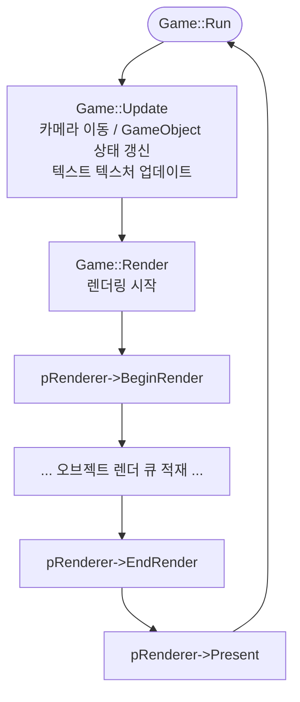
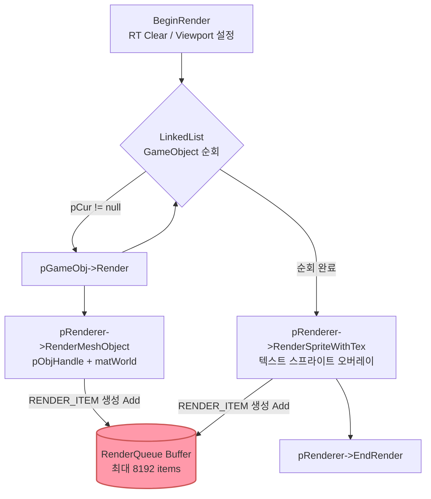
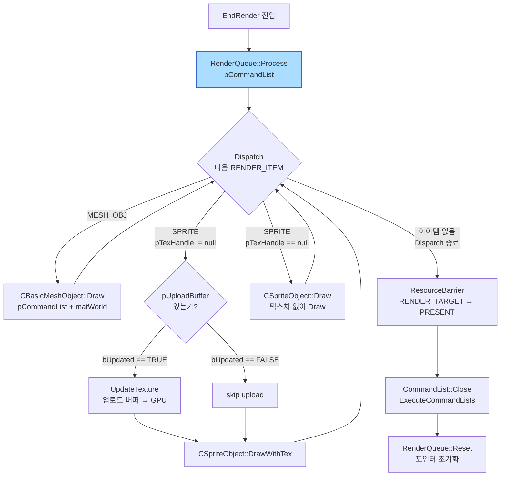
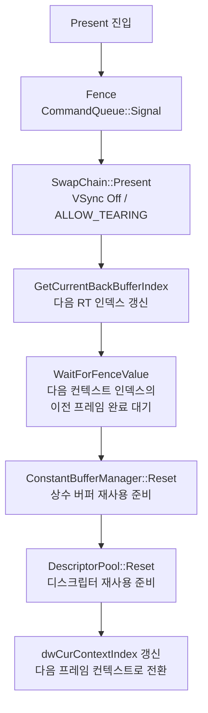

# Chapter 17 → Chapter 18 코드 비교 분석

## 전체 개요

Chapter 17 (`17_GameFrameWork`)은 렌더링 함수가 호출될 때 **즉시(Immediate)** GPU 커맨드를 Command List에 기록하는 구조입니다.
Chapter 18 (`18_RenderQueue`)은 **렌더 큐(Deferred Queue)** 패턴을 도입하여, 렌더링 요청을 일단 큐에 쌓아두고 프레임 끝(`EndRender`)에 일괄 처리하는 구조로 전환합니다.

---

## 파일 변경 요약

| 구분 | 파일 | 변경 내용 |
|------|------|-----------|
| **신규** | `RenderQueue.h` | 렌더 아이템 구조체 및 `CRenderQueue` 클래스 선언 |
| **신규** | `RenderQueue.cpp` | `CRenderQueue` 구현 |
| **수정** | `D3D12Renderer.h` | `CRenderQueue` 전방선언 및 멤버 추가 |
| **수정** | `D3D12Renderer.cpp` | 렌더 함수들을 즉시 Draw → 큐 추가 방식으로 변경, `EndRender`에 Process/Reset 추가 |
| **동일** | `Game.cpp`, `Game.h`, `GameObject.cpp` 외 나머지 | 변경 없음 |

---

## 신규 파일 상세

### `RenderQueue.h`

#### 열거형 `RENDER_ITEM_TYPE`

```cpp
enum RENDER_ITEM_TYPE {
    RENDER_ITEM_TYPE_MESH_OBJ,   // BasicMeshObject 렌더 요청
    RENDER_ITEM_TYPE_SPRITE      // SpriteObject 렌더 요청
};
```

렌더 큐에 담길 아이템의 종류를 구분하는 열거형. `Process()` 내 switch 분기에 사용.

---

#### 구조체 `RENDER_MESH_OBJ_PARAM`

```cpp
struct RENDER_MESH_OBJ_PARAM {
    XMMATRIX matWorld;   // 오브젝트의 월드 변환 행렬
};
```

- `matWorld` : 해당 메시 오브젝트를 월드 공간에 배치하기 위한 4×4 행렬.
  - Chapter 17에서는 `RenderMeshObject(void*, const XMMATRIX*)` 호출 시 즉시 Draw에 전달됐으나, ch18에서는 이 구조체에 복사되어 큐에 저장.

---

#### 구조체 `RENDER_SPRITE_PARAM`

```cpp
struct RENDER_SPRITE_PARAM {
    int   iPosX;       // 화면 좌측 기준 X 픽셀 좌표
    int   iPosY;       // 화면 상단 기준 Y 픽셀 좌표
    float fScaleX;     // X 방향 스케일 배율
    float fScaleY;     // Y 방향 스케일 배율
    RECT  Rect;        // UV 클리핑 사각형 (bUseRect가 TRUE일 때만 유효)
    BOOL  bUseRect;    // Rect 사용 여부 플래그
    float Z;           // 깊이값 (렌더링 순서 제어용)
    void* pTexHandle;  // 텍스처 핸들 포인터 (nullptr이면 텍스처 없이 Draw)
};
```

스프라이트 렌더링에 필요한 모든 파라미터를 묶은 구조체. 텍스처 유무에 따라 `DrawWithTex` / `Draw` 로 분기 처리.

---

#### 구조체 `RENDER_ITEM`

```cpp
struct RENDER_ITEM {
    RENDER_ITEM_TYPE Type;       // 아이템 종류
    void*            pObjHandle; // 대상 오브젝트 포인터 (CBasicMeshObject 또는 CSpriteObject)
    union {
        RENDER_MESH_OBJ_PARAM  MeshObjParam;
        RENDER_SPRITE_PARAM    SpriteParam;
    };
};
```

렌더 큐의 기본 단위. `union`을 사용하여 메시/스프라이트 파라미터를 같은 메모리 공간에 공유 → 메모리 절약.

---

#### 클래스 `CRenderQueue`

```cpp
class CRenderQueue {
    CD3D12Renderer* m_pRenderer;          // 렌더러 참조 (Device 접근용)
    char*           m_pBuffer;            // 아이템 저장 flat 버퍼
    DWORD           m_dwMaxBufferSize;    // 버퍼 최대 크기 (바이트)
    DWORD           m_dwAllocatedSize;    // 현재 채워진 크기 (write 포인터 역할)
    DWORD           m_dwReadBufferPos;    // Dispatch 읽기 위치 (read 포인터 역할)

    const RENDER_ITEM* Dispatch();        // 내부: 다음 아이템 포인터 반환
    void Cleanup();                       // 소멸자에서 호출

public:
    BOOL  Initialize(CD3D12Renderer*, DWORD dwMaxItemNum);
    BOOL  Add(const RENDER_ITEM*);
    DWORD Process(ID3D12GraphicsCommandList*);
    void  Reset();
};
```

---

### `RenderQueue.cpp` — 메서드 상세

#### `Initialize(CD3D12Renderer* pRenderer, DWORD dwMaxItemNum)`

| 파라미터 | 설명 |
|----------|------|
| `pRenderer` | 소유 렌더러. `Process()` 내에서 `INL_GetD3DDevice()`로 Device 얻기 위해 참조 |
| `dwMaxItemNum` | 큐에 넣을 수 있는 최대 `RENDER_ITEM` 개수. `sizeof(RENDER_ITEM) × dwMaxItemNum` 만큼 `malloc` |

**의도** : 고정 크기 flat 버퍼를 미리 할당해 동적 할당 오버헤드 없이 아이템을 추가할 수 있도록 초기화.

---

#### `Add(const RENDER_ITEM* pItem)` → `BOOL`

```cpp
BOOL CRenderQueue::Add(const RENDER_ITEM* pItem) {
    if (m_dwAllocatedSize + sizeof(RENDER_ITEM) > m_dwMaxBufferSize)
        goto lb_return;  // 버퍼 초과 시 실패
    memcpy(m_pBuffer + m_dwAllocatedSize, pItem, sizeof(RENDER_ITEM));
    m_dwAllocatedSize += sizeof(RENDER_ITEM);
    ...
}
```

| 파라미터 | 설명 |
|----------|------|
| `pItem` | 복사할 `RENDER_ITEM` 포인터. 값이 flat 버퍼에 `memcpy` 됨 |

**의도** : 프레임 중 게임 오브젝트가 `RenderMeshObject` / `RenderSprite` 등을 호출할 때마다 GPU 명령 대신 이 함수로 아이템을 적재. O(1) 삽입.

---

#### `Dispatch()` → `const RENDER_ITEM*` (private)

내부적으로 `m_dwReadBufferPos`를 앞으로 전진시키며 다음 아이템 포인터를 반환. `Process()`에서 반복 호출되는 단순 이터레이터.

---

#### `Process(ID3D12GraphicsCommandList* pCommandList)` → `DWORD`

| 파라미터 | 설명 |
|----------|------|
| `pCommandList` | GPU 드로우 커맨드를 기록할 커맨드 리스트 |
| **반환값** | 처리된 아이템 수 |

내부 동작:
1. `Dispatch()`로 아이템을 순차 꺼냄
2. `Type`에 따라 분기:
   - `RENDER_ITEM_TYPE_MESH_OBJ` → `CBasicMeshObject::Draw(pCommandList, &matWorld)`
   - `RENDER_ITEM_TYPE_SPRITE`:
     - `pTexHandle != nullptr` → `UpdateTexture` (동적 텍스처 변경 감지 후 업로드) + `CSpriteObject::DrawWithTex()`
     - `pTexHandle == nullptr` → `CSpriteObject::Draw()`

**의도** : 한 프레임 동안 쌓인 모든 렌더링 요청을 `EndRender()` 시점에 한 번에 Command List에 기록. 향후 정렬/컬링/멀티스레드 확장의 진입점이 됨.

---

#### `Reset()`

```cpp
void CRenderQueue::Reset() {
    m_dwAllocatedSize = 0;
    m_dwReadBufferPos = 0;
}
```

버퍼 데이터는 유지하되 포인터만 초기화 → 다음 프레임에 재사용. `EndRender()` 이후 호출.

---

## 수정된 파일 상세

### `D3D12Renderer.h`

**변경점 1 — `CRenderQueue` 전방 선언 추가**

```cpp
// ch17
class CTextureManager;

// ch18
class CTextureManager;
class CRenderQueue;           // ← 추가
```

**변경점 2 — 멤버 변수 추가**

```cpp
// ch17
CTextureManager* m_pTextureManager = nullptr;

// ch18
CTextureManager* m_pTextureManager = nullptr;
CRenderQueue*    m_pRenderQueue = nullptr;   // ← 추가
```

---

### `D3D12Renderer.cpp`

#### 1. include 추가

```cpp
// ch18만 추가
#include "RenderQueue.h"
```

---

#### 2. `Initialize()` — 렌더 큐 생성

```cpp
// ch17: 없음

// ch18: SingleDescriptorAllocator 초기화 이후 추가
m_pRenderQueue = new CRenderQueue;
m_pRenderQueue->Initialize(this, 8192);
```

- 최대 **8192개** 아이템을 수용할 수 있는 큐를 초기화.
- `8192 × sizeof(RENDER_ITEM)` 바이트의 flat 버퍼가 미리 `malloc` 됨.

---

#### 3. `RenderMeshObject()` — 즉시 Draw → 큐 Add

```cpp
// ch17: Command List에 즉시 Draw 호출
void CD3D12Renderer::RenderMeshObject(void* pMeshObjHandle, const XMMATRIX* pMatWorld) {
    ID3D12GraphicsCommandList* pCommandList = m_ppCommandList[m_dwCurContextIndex];
    CBasicMeshObject* pMeshObj = (CBasicMeshObject*)pMeshObjHandle;
    pMeshObj->Draw(pCommandList, pMatWorld);
}

// ch18: RENDER_ITEM을 만들어 큐에 추가만 함
void CD3D12Renderer::RenderMeshObject(void* pMeshObjHandle, const XMMATRIX* pMatWorld) {
    RENDER_ITEM item;
    item.Type = RENDER_ITEM_TYPE_MESH_OBJ;
    item.pObjHandle = pMeshObjHandle;
    item.MeshObjParam.matWorld = *pMatWorld;    // 행렬 값 복사
    if (!m_pRenderQueue->Add(&item))
        __debugbreak();
}
```

| 파라미터 | 설명 |
|----------|------|
| `pMeshObjHandle` | `CBasicMeshObject` 포인터 (void* 캐스트) |
| `pMatWorld` | 오브젝트 월드 행렬 포인터. 값이 `RENDER_ITEM`에 복사됨 |

---

#### 4. `RenderSpriteWithTex()` — 즉시 Draw → 큐 Add

```cpp
// ch17: UpdateTexture + DrawWithTex 즉시 호출
// ch18: RENDER_ITEM(SPRITE 타입)을 만들어 큐에 추가
void CD3D12Renderer::RenderSpriteWithTex(void* pSprObjHandle,
    int iPosX, int iPosY, float fScaleX, float fScaleY,
    const RECT* pRect, float Z, void* pTexHandle)
{
    RENDER_ITEM item;
    item.Type = RENDER_ITEM_TYPE_SPRITE;
    item.pObjHandle = pSprObjHandle;
    item.SpriteParam.iPosX = iPosX;
    item.SpriteParam.iPosY = iPosY;
    item.SpriteParam.fScaleX = fScaleX;
    item.SpriteParam.fScaleY = fScaleY;
    item.SpriteParam.bUseRect = (pRect != nullptr) ? TRUE : FALSE;
    item.SpriteParam.Rect = pRect ? *pRect : RECT{};
    item.SpriteParam.pTexHandle = pTexHandle;
    item.SpriteParam.Z = Z;
    if (!m_pRenderQueue->Add(&item))
        __debugbreak();
}
```

| 파라미터 | 설명 |
|----------|------|
| `pSprObjHandle` | `CSpriteObject` 포인터 |
| `iPosX`, `iPosY` | 화면 픽셀 좌표 |
| `fScaleX`, `fScaleY` | 스케일 배율 |
| `pRect` | UV 클리핑 영역 (nullptr 허용) → `bUseRect` 플래그로 큐에 기록 |
| `Z` | 깊이값 |
| `pTexHandle` | `TEXTURE_HANDLE*` 포인터 |

---

#### 5. `RenderSprite()` — 즉시 Draw → 큐 Add

```cpp
// ch17: pSpriteObj->Draw() 즉시 호출
// ch18: pTexHandle = nullptr, bUseRect = FALSE 로 RENDER_ITEM 생성 후 큐에 추가
```

텍스처 없는 스프라이트 렌더링도 동일한 `RENDER_ITEM_TYPE_SPRITE` 타입으로 큐에 추가.  
`Process()` 내부에서 `pTexHandle == nullptr` 분기로 `CSpriteObject::Draw()` 호출.

---

#### 6. `EndRender()` — 큐 Process 및 Reset 추가

```cpp
// ch17
void CD3D12Renderer::EndRender() {
    ID3D12GraphicsCommandList* pCommandList = m_ppCommandList[m_dwCurContextIndex];
    pCommandList->ResourceBarrier(1, &CD3DX12_RESOURCE_BARRIER::Transition(
        m_pRenderTargets[m_uiRenderTargetIndex],
        D3D12_RESOURCE_STATE_RENDER_TARGET, D3D12_RESOURCE_STATE_PRESENT));
    pCommandList->Close();
    ...
}

// ch18: ResourceBarrier 전에 Process, Close 후 Reset 추가
void CD3D12Renderer::EndRender() {
    ID3D12GraphicsCommandList* pCommandList = m_ppCommandList[m_dwCurContextIndex];

    // ★ 렌더링 큐에 쌓여있는 렌더링 요청을 한번에 처리
    m_pRenderQueue->Process(pCommandList);

    pCommandList->ResourceBarrier(1, &CD3DX12_RESOURCE_BARRIER::Transition(...));
    pCommandList->Close();
    ...
    m_pCommandQueue->ExecuteCommandLists(_countof(ppCommandLists), ppCommandLists);

    // ★ 다음 프레임을 위해 큐 초기화
    m_pRenderQueue->Reset();
}
```

**의도** :
- `Process()` : 큐에 쌓인 모든 아이템을 실제 Command List에 기록 (Draw 호출)
- `Reset()` : 다음 프레임에서 큐를 재사용할 수 있도록 포인터 초기화 (버퍼 free 없음)

---

#### 7. `Cleanup()` — 렌더 큐 해제 추가

```cpp
// ch18에서 추가 (WaitForFenceValue 루프 직후)
if (m_pRenderQueue) {
    delete m_pRenderQueue;
    m_pRenderQueue = nullptr;
}
```

---

## ch17 vs ch18 렌더링 흐름 비교

### Chapter 17 — 즉시(Immediate) 렌더링

```
Game::Render()
  └─ pGameObj->Render()                      (각 GameObject마다)
       └─ pRenderer->RenderMeshObject()
            └─ pMeshObj->Draw(pCommandList)   ← 즉시 Command List 기록
  └─ pRenderer->RenderSpriteWithTex()
       └─ pSpriteObj->DrawWithTex(...)        ← 즉시 Command List 기록
  └─ pRenderer->EndRender()
       └─ ResourceBarrier → Close → ExecuteCommandLists
```

### Chapter 18 — 지연(Deferred) 렌더링 큐

```
Game::Render()
  └─ pGameObj->Render()
       └─ pRenderer->RenderMeshObject()
            └─ m_pRenderQueue->Add(RENDER_ITEM)   ← 큐에 아이템 추가만
  └─ pRenderer->RenderSpriteWithTex()
       └─ m_pRenderQueue->Add(RENDER_ITEM)         ← 큐에 아이템 추가만
  └─ pRenderer->EndRender()
       ├─ m_pRenderQueue->Process(pCommandList)    ← 여기서 일괄 Draw
       │    ├─ pMeshObj->Draw(pCommandList)
       │    └─ pSpriteObj->DrawWithTex(...)
       ├─ ResourceBarrier → Close → ExecuteCommandLists
       └─ m_pRenderQueue->Reset()
```

---

## 전체 구조 Mermaid Flowchart

> 4개 파트로 분리하여 표시합니다.

---

### Part 1 — Game Loop 전체 흐름



---

### Part 2 — Game::Render 내부 (오브젝트 순회 → 큐 적재)



---

### Part 3 — EndRender 내부 (RenderQueue::Process 일괄 처리)



---

### Part 4 — Present 및 프레임 동기화



---

## 핵심 설계 의도 및 장점

| 항목 | ch17 (Immediate) | ch18 (RenderQueue) |
|------|-----------------|---------------------|
| Draw 호출 시점 | `RenderXxx()` 호출 즉시 | `EndRender()` 일괄 처리 |
| Command List 접근 | 각 오브젝트가 직접 | `CRenderQueue::Process()`만 |
| 정렬 가능성 | 없음 (호출 순서 = 렌더 순서) | `Process()` 전 정렬 삽입 가능 |
| 멀티스레드 확장 | 어려움 | 게임 스레드(Add) / 렌더 스레드(Process) 분리 용이 |
| 메모리 | 없음 (스택 파라미터) | `sizeof(RENDER_ITEM) × 8192` (flat 버퍼) |
| 동적 텍스처 업데이트 | `RenderSpriteWithTex` 내 즉시 | `Process()` 내부로 이동 (`bUpdated` 플래그 체크) |

렌더 큐는 이후 챕터(19 CommandListPool, 20 MultiThreadRender)에서 멀티스레드 렌더링으로 확장하기 위한 핵심 기반 구조입니다.
