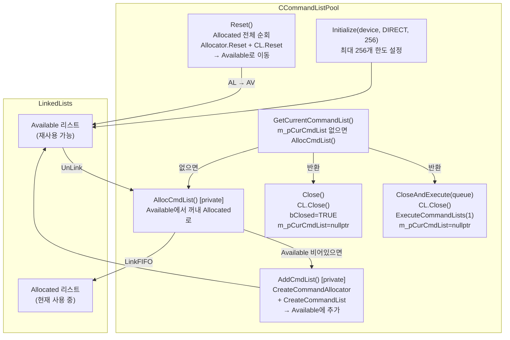
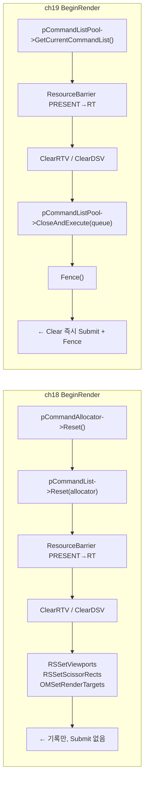
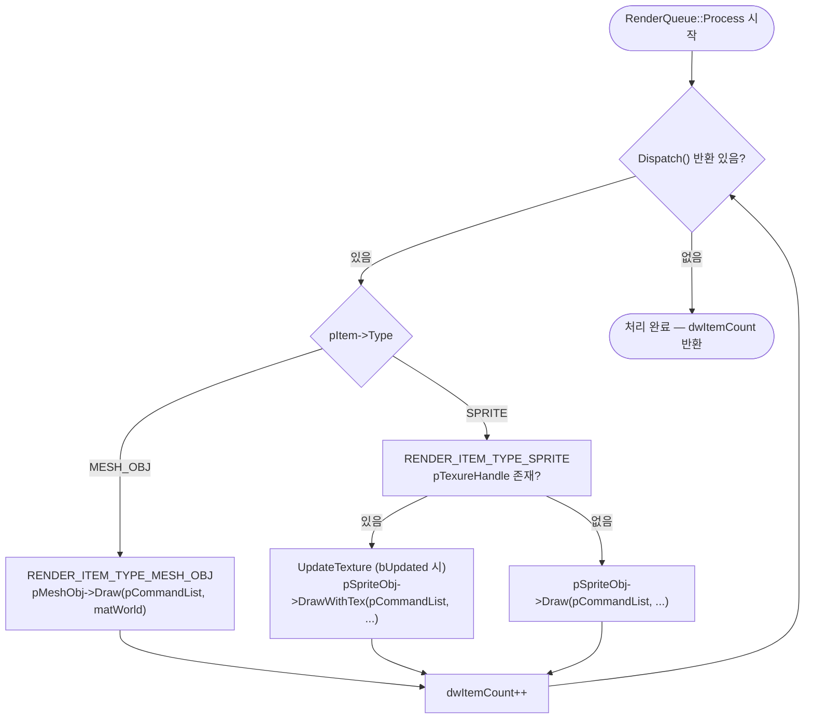
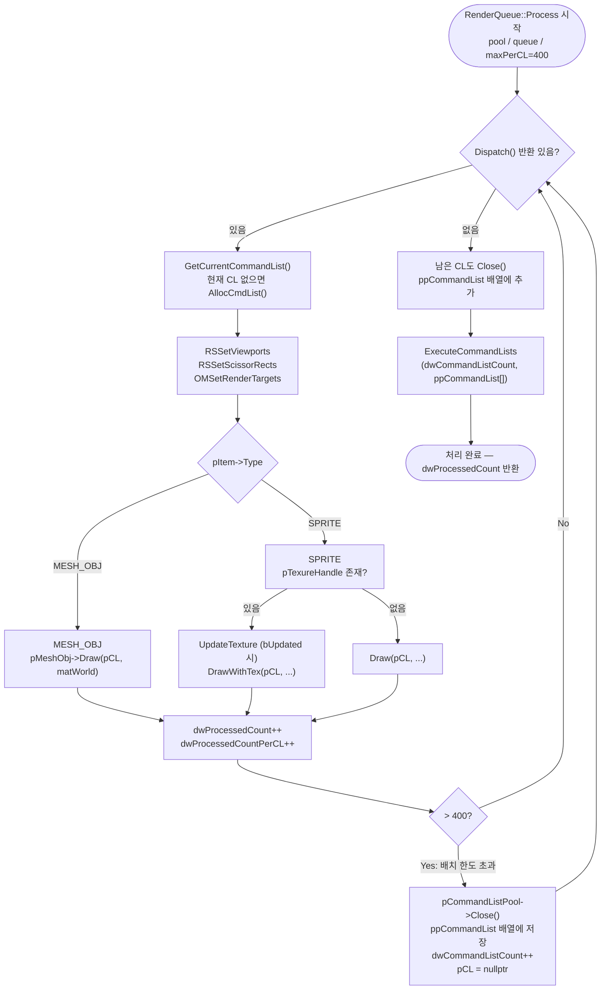
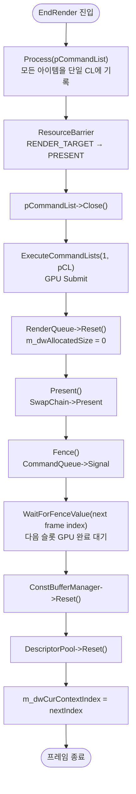
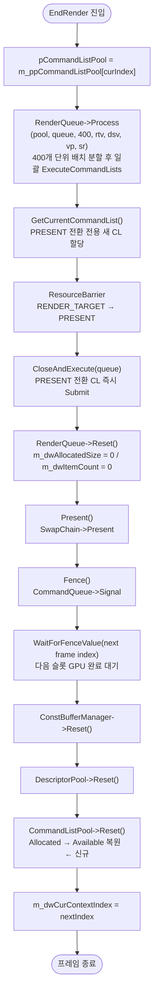

# Chapter 18 vs Chapter 19 비교 분석

## 전체 개요

| 항목 | ch18 RenderQueue | ch19 CommandListPool |
|------|-----------------|----------------------|
| 핵심 추가 | RenderQueue 도입 | CommandListPool 도입 |
| CommandList 수 | 프레임당 1개 고정 | 프레임당 N개 동적 할당 |
| CommandList 관리 | `ID3D12CommandAllocator* m_ppCommandAllocator[]` + `ID3D12GraphicsCommandList* m_ppCommandList[]` | `CCommandListPool* m_ppCommandListPool[]` |
| BeginRender | Clear 기록 → EndRender에서 한 번에 Submit | Clear 즉시 CloseAndExecute → Fence |
| EndRender | Process(pCommandList) — 1개 리스트 | Process(pool, queue, 400, ...) — 배치 Execute |
| MAX_DRAW_COUNT_PER_FRAME | 1024 | 4096 |
| GetCommandListCount() | 없음 | 추가 (디버그용) |

---

## 파일별 변경 사항

| 파일 | 상태 | 변경 내용 |
|------|------|-----------|
| `CommandListPool.h` | 🆕 신규 | CCommandListPool 클래스 선언 |
| `CommandListPool.cpp` | 🆕 신규 | CCommandListPool 구현 전체 |
| `D3D12Renderer.h` | ✏️ 수정 | CommandListPool 도입, 멤버·메서드 교체 |
| `D3D12Renderer.cpp` | ✏️ 수정 | Initialize/BeginRender/EndRender/Present 변경 |
| `RenderQueue.h` | ✏️ 수정 | `m_dwItemCount` 추가, 오버로드 `Process()` 선언 |
| `RenderQueue.cpp` | ✏️ 수정 | Add()에 카운터, 오버로드 `Process()` 구현 |
| 나머지 파일 | ✅ 동일 | BasicMeshObject, SpriteObject, DescriptorPool 등 무변경 |

---

## 1. 신규 파일: CommandListPool

### 1-1. `COMMAND_LIST` 구조체

```cpp
struct COMMAND_LIST {
    ID3D12CommandAllocator*    pDirectCommandAllocator;
    ID3D12GraphicsCommandList* pDirectCommandList;
    SORT_LINK  Link;   // 연결 리스트 노드
    BOOL       bClosed;
};
```

하나의 CommandAllocator + CommandList 쌍. `SORT_LINK`를 통해 두 개의 연결 리스트(Allocated / Available)에 연결됩니다.

### 1-2. `CCommandListPool` 클래스 멤버

| 멤버 | 의미 |
|------|------|
| `m_dwMaxCmdListNum` | 생성 가능한 최대 CommandList 개수 |
| `m_dwTotalCmdNum` | 현재까지 생성된 누적 수 |
| `m_dwAllocatedCmdNum` | 현재 사용 중(Allocated 리스트) 수 |
| `m_dwAvailableCmdNum` | 반납 대기(Available 리스트) 수 |
| `m_pCurCmdList` | 현재 기록 중인 COMMAND_LIST 포인터 |
| `m_pAlloated*Head/Tail` | 사용 중 리스트의 head/tail |
| `m_pAvailable*Head/Tail` | 사용 가능 리스트의 head/tail |

---

### 1-3. CCommandListPool 메서드 상세

#### `Initialize(pDevice, type, dwMaxCommandListNum)`
```cpp
BOOL Initialize(ID3D12Device* pDevice,
                D3D12_COMMAND_LIST_TYPE type,
                DWORD dwMaxCommandListNum);
```
| 인수 | 설명 |
|------|------|
| `pDevice` | D3D12 디바이스 |
| `type` | CommandList 타입 (`D3D12_COMMAND_LIST_TYPE_DIRECT` 등) |
| `dwMaxCommandListNum` | 풀 최대 크기 (최소 2 이상, 미만이면 `__debugbreak`) |

**의도**: 최대 상한만 설정. 실제 CommandAllocator/List 생성은 필요할 때 `AddCmdList()`에서 lazy하게 수행.

---

#### `AddCmdList()` (private)
```cpp
BOOL AddCmdList();
```
- `m_dwTotalCmdNum >= m_dwMaxCmdListNum`이면 `__debugbreak` (디버그 모드)
- `CreateCommandAllocator` + `CreateCommandList` 한 쌍 생성
- Available 리스트 꼬리에 삽입(`LinkToLinkedListFIFO`)
- `m_dwTotalCmdNum++`, `m_dwAvailableCmdNum++`

**의도**: 풀이 소진되면 동적으로 CommandAllocator/List를 추가 생성. 최대 상한 초과 방지.

---

#### `AllocCmdList()` (private)
```cpp
COMMAND_LIST* AllocCmdList();
```
1. Available 리스트가 비어 있으면 `AddCmdList()` 호출
2. Available 리스트 head에서 꺼냄 (`UnLinkFromLinkedList`)
3. Allocated 리스트 꼬리에 붙임 (`LinkToLinkedListFIFO`)
4. `m_dwAvailableCmdNum--`, `m_dwAllocatedCmdNum++`

**의도**: O(1) 할당. FIFO 순서로 관리해 재사용 시 GPU가 이미 완료된 CommandAllocator를 재사용하도록 유도.

---

#### `GetCurrentCommandList()`
```cpp
ID3D12GraphicsCommandList* GetCurrentCommandList();
```
- `m_pCurCmdList`가 없으면 `AllocCmdList()` 호출
- 현재 기록 중인 CommandList 반환

**의도**: 호출자가 CommandList 내부 구조를 알 필요 없이, 단순히 "지금 쓸 수 있는 CommandList"를 얻는 인터페이스.

---

#### `Close()`
```cpp
void Close();
```
- `m_pCurCmdList->pDirectCommandList->Close()`
- `m_pCurCmdList->bClosed = TRUE`
- `m_pCurCmdList = nullptr` (다음 호출 시 새 항목 할당)

**의도**: 기록 완료 표시만 하고 GPU Submit은 나중에 일괄 처리(배치 Execute용).

---

#### `CloseAndExecute(pCommandQueue)`
```cpp
void CloseAndExecute(ID3D12CommandQueue* pCommandQueue);
```
- Close 후 즉시 `ExecuteCommandLists(1, ...)` 호출
- `m_pCurCmdList = nullptr`

**의도**: Clear처럼 단독으로 즉시 제출해야 할 CommandList에 사용.

---

#### `Reset()`
```cpp
void Reset();
```
Allocated 리스트의 모든 항목을 순회:
1. `pDirectCommandAllocator->Reset()` — GPU가 완료된 기록 버퍼 재사용
2. `pDirectCommandList->Reset(allocator, nullptr)` — 새 기록 준비
3. `bClosed = FALSE`
4. Available 리스트로 이동

**의도**: 프레임 끝 `Present()` 이후 다음 프레임을 위해 호출. 이전 GPU 작업이 Fence로 완료 보장된 뒤 호출해야 안전.

---

## 2. D3D12Renderer.h 변경

### 삭제된 멤버/메서드

```cpp
// ch18 — 삭제
ID3D12CommandAllocator* m_ppCommandAllocator[MAX_PENDING_FRAME_COUNT];
ID3D12GraphicsCommandList* m_ppCommandList[MAX_PENDING_FRAME_COUNT];

void CreateCommandList();    // private
void CleanupCommandList();   // private
```

### 추가된 멤버/메서드

```cpp
// ch19 — 추가
#define USE_MULTILPE_COMMAND_LIST
class CCommandListPool;   // forward declaration

CCommandListPool* m_ppCommandListPool[MAX_PENDING_FRAME_COUNT];

// public
DWORD GetCommandListCount();
```

### 상수 변경

| 상수 | ch18 | ch19 |
|------|------|------|
| `MAX_DRAW_COUNT_PER_FRAME` | 1024 | 4096 |

---

## 3. D3D12Renderer.cpp 변경

### 3-1. `Initialize()` — CommandList 초기화 방식 변경

**ch18**:
```cpp
CreateCommandList();   // 고정 2개 Allocator + List 직접 생성
```

**ch19**:
```cpp
// CreateCommandList() 호출 삭제
// 대신 루프에서 CommandListPool 생성
for (DWORD i = 0; i < MAX_PENDING_FRAME_COUNT; i++) {
    m_ppCommandListPool[i] = new CCommandListPool;
    m_ppCommandListPool[i]->Initialize(m_pD3DDevice,
        D3D12_COMMAND_LIST_TYPE_DIRECT, 256);
    // ... DescriptorPool, ConstBufferManager 동일
}
```

`Initialize(device, DIRECT, 256)` — 최대 256개 CommandList까지 동적 확장 가능한 풀 초기화.

---

### 3-2. `BeginRender()` — Clear 즉시 Submit으로 변경

**ch18** (기록만, Submit은 EndRender에서):
```cpp
// Reset + Record
pCommandAllocator->Reset();
pCommandList->Reset(pCommandAllocator, nullptr);
pCommandList->ResourceBarrier(...PRESENT→RENDER_TARGET);
pCommandList->ClearRenderTargetView(...);
pCommandList->ClearDepthStencilView(...);
pCommandList->RSSetViewports(...);
pCommandList->RSSetScissorRects(...);
pCommandList->OMSetRenderTargets(...);
// ← 여기서 Close/Execute 없음. EndRender에서 Submit
```

**ch19** (Pool에서 리스트 가져와 Clear → 즉시 CloseAndExecute):
```cpp
CCommandListPool* pCommandListPool = m_ppCommandListPool[m_dwCurContextIndex];
ID3D12GraphicsCommandList* pCommandList = pCommandListPool->GetCurrentCommandList();

pCommandList->ResourceBarrier(...PRESENT→RENDER_TARGET);
pCommandList->ClearRenderTargetView(...);
pCommandList->ClearDepthStencilView(...);

pCommandListPool->CloseAndExecute(m_pCommandQueue);  // ← 즉시 제출
Fence();  // ← Fence도 여기서 호출
```

**핵심 변경점**: BeginRender에서 Clear 전용 CommandList를 즉시 제출하고 Fence를 호출.  
RenderItem CommandList들과 Clear CommandList를 완전히 분리.  
ch18에서는 RSSetViewports/OMSetRenderTargets가 BeginRender에서 기록됐지만,  
ch19에서는 `RenderQueue::Process()` 내부에서 아이템마다 설정.

---

### 3-3. `EndRender()` — 멀티 CommandList 배치 처리

**ch18**:
```cpp
ID3D12GraphicsCommandList* pCommandList = m_ppCommandList[m_dwCurContextIndex];
m_pRenderQueue->Process(pCommandList);              // 단일 CL
pCommandList->ResourceBarrier(...→PRESENT);
pCommandList->Close();
m_pCommandQueue->ExecuteCommandLists(1, ...);      // 한 번에 1개 Submit
m_pRenderQueue->Reset();
```

**ch19**:
```cpp
CCommandListPool* pCommandListPool = m_ppCommandListPool[m_dwCurContextIndex];

#ifdef USE_MULTILPE_COMMAND_LIST
    // 400개 단위로 CL을 쪼개서 Close 후 일괄 Execute
    m_pRenderQueue->Process(pCommandListPool, m_pCommandQueue,
                            400, rtvHandle, dsvHandle,
                            &m_Viewport, &m_ScissorRect);
#else
    // (DWORD)(-1) = 사실상 전부 한 CL
    m_pRenderQueue->Process(pCommandListPool, m_pCommandQueue,
                            (DWORD)(-1), rtvHandle, dsvHandle,
                            &m_Viewport, &m_ScissorRect);
#endif

// PRESENT 전환 CommandList 별도
ID3D12GraphicsCommandList* pCommandList = pCommandListPool->GetCurrentCommandList();
pCommandList->ResourceBarrier(...RENDER_TARGET→PRESENT);
pCommandListPool->CloseAndExecute(m_pCommandQueue);

m_pRenderQueue->Reset();
```

**의도**: 4096개 아이템을 400개씩 10개 CommandList로 분할 → `ExecuteCommandLists(10, ...)` 한 번 호출. 멀티스레드 확장의 사전 구조.

---

### 3-4. `Present()` — CommandListPool Reset 추가

**ch18**:
```cpp
m_ppConstBufferManager[dwNextContextIndex]->Reset();
m_ppDescriptorPool[dwNextContextIndex]->Reset();
// CommandList Reset 없음 (다음 BeginRender에서 수동 Reset)
m_dwCurContextIndex = dwNextContextIndex;
```

**ch19**:
```cpp
m_ppConstBufferManager[dwNextContextIndex]->Reset();
m_ppDescriptorPool[dwNextContextIndex]->Reset();
m_ppCommandListPool[dwNextContextIndex]->Reset();  // ← 추가
m_dwCurContextIndex = dwNextContextIndex;
```

`CommandListPool::Reset()`이 Allocated 리스트의 모든 항목을 Available로 복원해, 다음 프레임에 재사용.

---

### 3-5. 신규 메서드: `GetCommandListCount()`

```cpp
DWORD CD3D12Renderer::GetCommandListCount()
{
    DWORD dwCommandListCount = 0;
    for (DWORD i = 0; i < MAX_PENDING_FRAME_COUNT; i++)
        dwCommandListCount += m_ppCommandListPool[i]->GetTotalCmdListNum();
    return dwCommandListCount;
}
```

| 반환값 | 의미 |
|--------|------|
| `DWORD` | 전체 프레임 슬롯에 생성된 CommandList 총 누적 수 |

**의도**: 런타임에 몇 개의 CommandList가 실제로 생성됐는지 확인하는 디버그/프로파일링용.

---

## 4. RenderQueue 변경

### 4-1. RenderQueue.h — 멤버 추가, 오버로드 선언

**ch18 → ch19 차이**:
```cpp
// 추가된 멤버
DWORD m_dwItemCount = 0;   // 현재 큐에 쌓인 아이템 수

// forward declaration 추가
class CCommandListPool;

// 오버로드 Process 추가
DWORD Process(CCommandListPool* pCommandListPool,
              ID3D12CommandQueue* pCommandQueue,
              DWORD dwProcessCountPerCommandList,
              D3D12_CPU_DESCRIPTOR_HANDLE rtv,
              D3D12_CPU_DESCRIPTOR_HANDLE dsv,
              const D3D12_VIEWPORT* pViewport,
              const D3D12_RECT* pScissorRect);
```

---

### 4-2. RenderQueue.cpp — `Add()` 변경

**ch18**:
```cpp
m_dwAllocatedSize += sizeof(RENDER_ITEM);
bResult = TRUE;
```

**ch19**:
```cpp
m_dwAllocatedSize += sizeof(RENDER_ITEM);
m_dwItemCount++;        // ← 추가
bResult = TRUE;
```

**의도**: 큐에 몇 개 쌓였는지 추적. 배치 분할 시 처리 카운트 관리에 사용.

---

### 4-3. RenderQueue.cpp — 기존 `Process(pCommandList)` 소수 변경

**ch18**: 처리 후 반환값만 있음  
**ch19**: 처리 후 `m_dwItemCount = 0` 추가 (카운터 초기화)

---

### 4-4. RenderQueue.cpp — 오버로드 `Process()` 신규 구현

```cpp
DWORD Process(CCommandListPool* pCommandListPool,
              ID3D12CommandQueue* pCommandQueue,
              DWORD dwProcessCountPerCommandList,   // 배치 크기
              D3D12_CPU_DESCRIPTOR_HANDLE rtv,
              D3D12_CPU_DESCRIPTOR_HANDLE dsv,
              const D3D12_VIEWPORT* pViewport,
              const D3D12_RECT* pScissorRect)
```

| 인수 | 설명 |
|------|------|
| `pCommandListPool` | 현재 프레임의 CommandListPool |
| `pCommandQueue` | GPU Submit 대상 CommandQueue |
| `dwProcessCountPerCommandList` | 배치 당 처리 아이템 수 (400 또는 (DWORD)(-1)) |
| `rtv` | 렌더 타겟 CPU 핸들 |
| `dsv` | 뎁스 스텐실 CPU 핸들 |
| `pViewport` | 뷰포트 포인터 |
| `pScissorRect` | 시저 렉트 포인터 |

#### 내부 동작 흐름

```
while (아이템 존재) {
    pCommandList = pCommandListPool->GetCurrentCommandList()
    pCommandList->RSSetViewports / RSSetScissorRects / OMSetRenderTargets  // 매 아이템마다
    switch (MESH_OBJ / SPRITE) → Draw(...)
    dwProcessedCountPerCommandList++

    if (dwProcessedCountPerCommandList > dwProcessCountPerCommandList) {
        pCommandListPool->Close()          // Execute 없이 기록만 종료
        ppCommandList[n] = pCommandList    // 배열에 보관
        dwCommandListCount++
        pCommandList = nullptr             // 다음 이터레이션에서 새 CL 할당
        dwProcessedCountPerCommandList = 0
    }
}
// 남은 아이템 처리 후 Close

if (dwCommandListCount > 0)
    pCommandQueue->ExecuteCommandLists(dwCommandListCount, ppCommandList)  // 일괄 Submit
```

**핵심**: 
- 배치마다 `Close()`만 하고 Execute는 모든 배치 완료 후 `ExecuteCommandLists(N, ...)` 1번
- `ppCommandList[64]` 배열에 최대 64개 CommandList 수집 가능
- `RSSetViewports/OMSetRenderTargets`가 **아이템마다** 반복 설정 (ch18은 BeginRender에서 1번만)

---

## 5. Mermaid Flowchart (4 Part)

### Part 1: CommandListPool 내부 구조 및 생명주기



---

### Part 2: 프레임 시작 — BeginRender 비교



---

### Part 3-A: 프레임 렌더 — ch18 RenderQueue::Process (단일 CommandList)



---

### Part 3-B: 프레임 렌더 — ch19 RenderQueue::Process (멀티 CommandList 배치)



---

### Part 4-A: 프레임 종료 — ch18 EndRender + Present



---

### Part 4-B: 프레임 종료 — ch19 EndRender + Present



---

## 6. 설계 의도 요약

| 변경 | 이유 |
|------|------|
| CommandAllocator/List 직접 관리 → CommandListPool | 향후 멀티스레드 렌더링에서 각 스레드가 독립적인 CL을 할당받도록 확장하기 위한 기반 |
| BeginRender에서 Clear 즉시 Submit + Fence | Clear CommandList와 RenderItem CommandList를 분리. GPU가 Clear를 먼저 처리하도록 보장 |
| Process()를 배치 분할 (400개 단위) | CommandList 하나당 부하를 줄이고, 미래에 스레드별로 Process()를 병렬 호출하는 구조로 전환 가능 |
| RSSetViewports/OMSetRenderTargets를 아이템마다 반복 | CL이 어디서 시작하든 상태가 올바르게 설정되도록 각 배치 시작 시 상태 재설정 |
| ExecuteCommandLists(N, ...) 일괄 | 여러 CL을 Submit할 때 드라이버 오버헤드를 줄이고, GPU가 내부적으로 병렬 실행 최적화 가능 |
| MAX_DRAW_COUNT_PER_FRAME 1024 → 4096 | CommandList 분할로 단일 CL 부담이 줄었으니 총 Draw 용량을 늘림 |
| GetCommandListCount() 추가 | 실제로 몇 개의 CL이 생성됐는지 런타임에 모니터링 (디버그/튜닝) |
