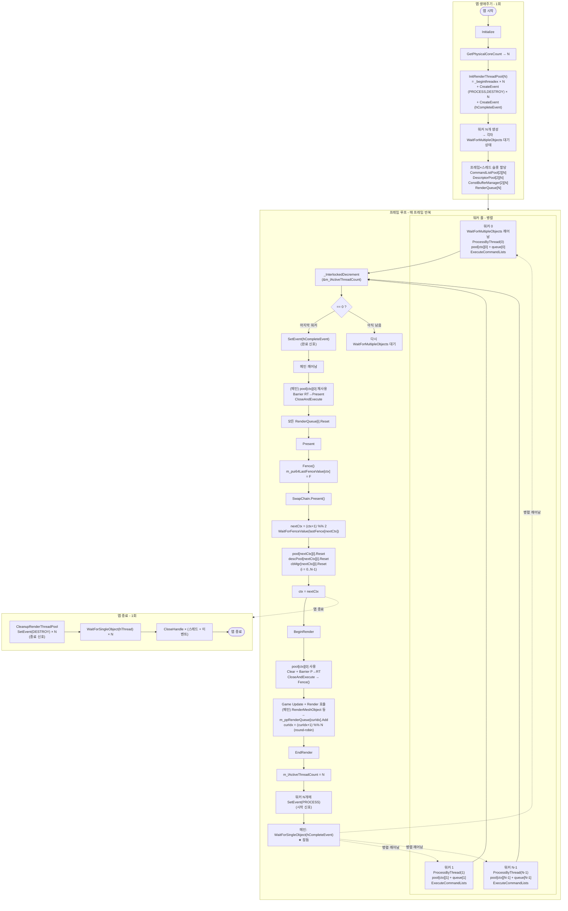
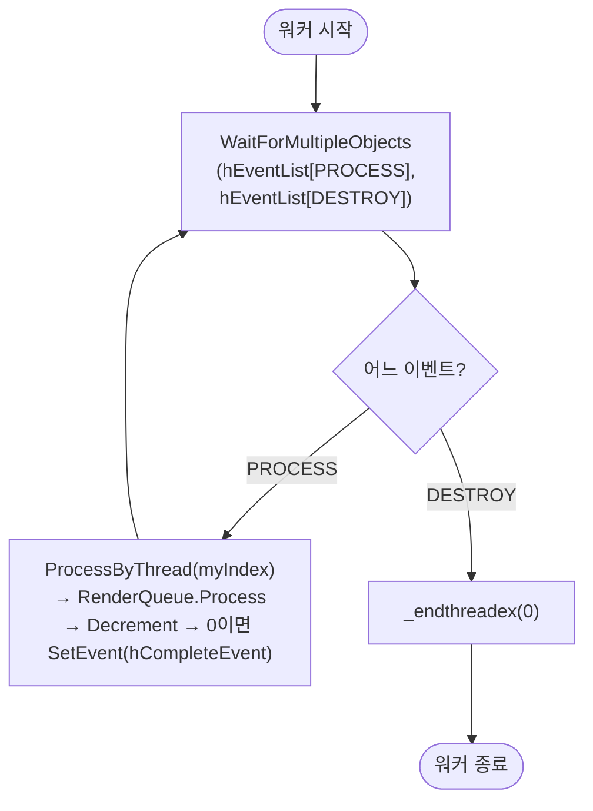
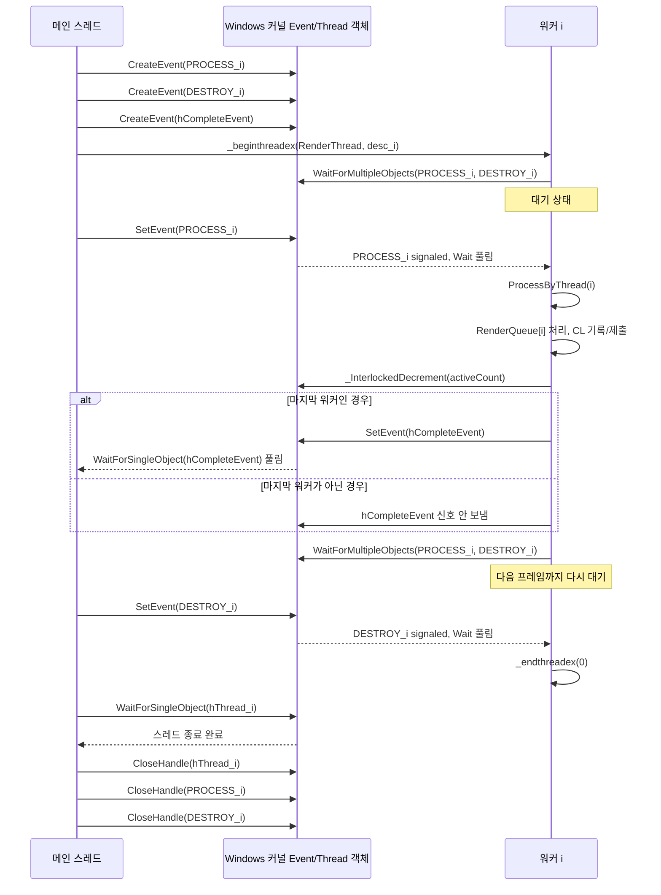
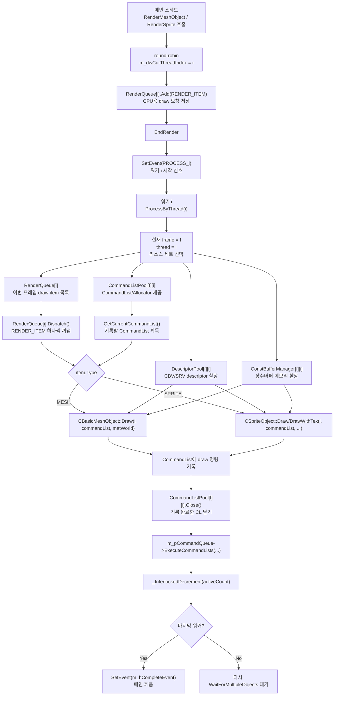
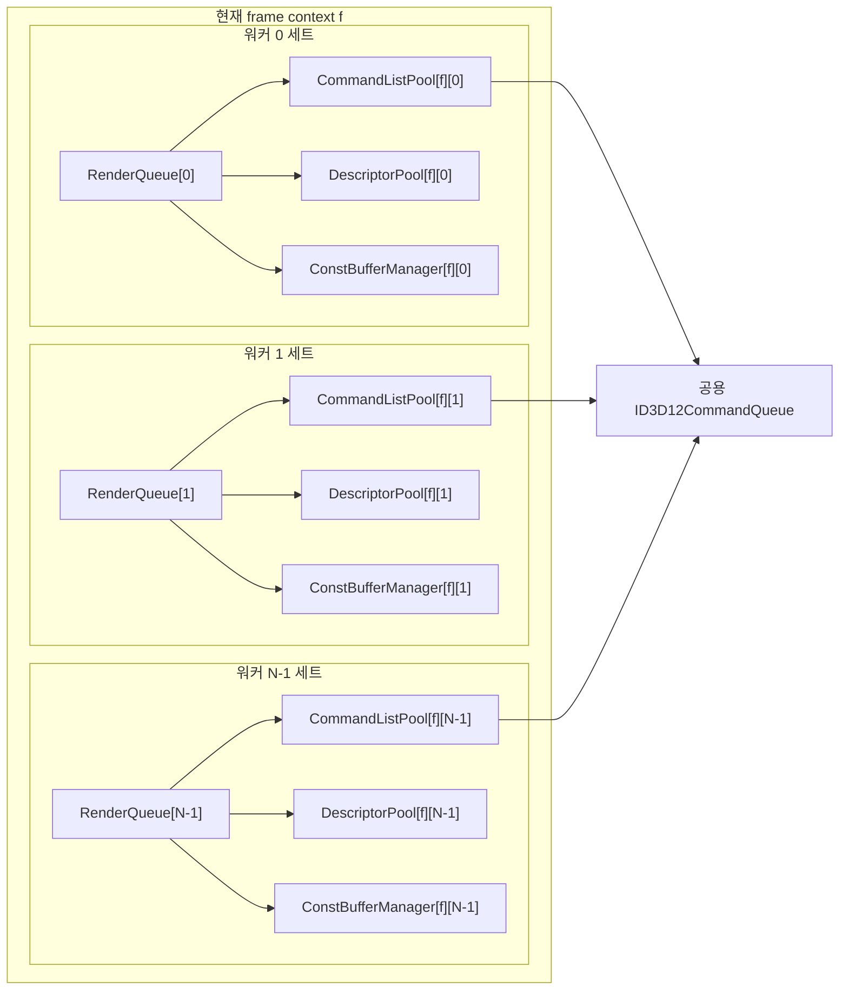
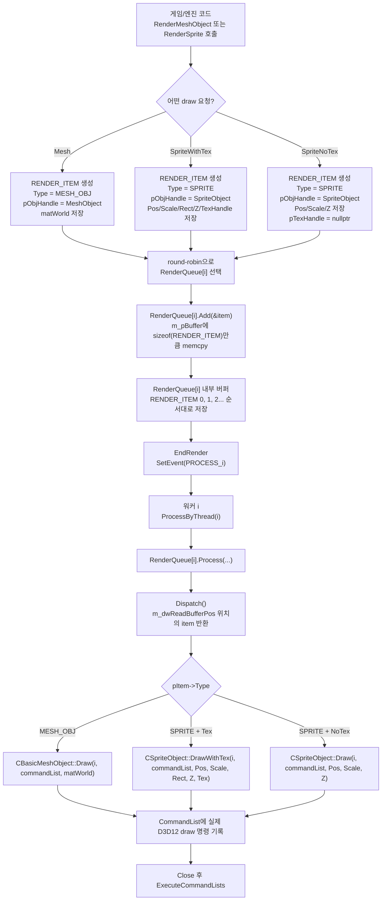
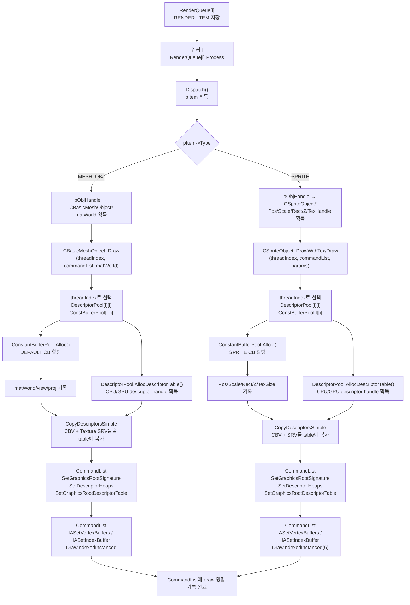
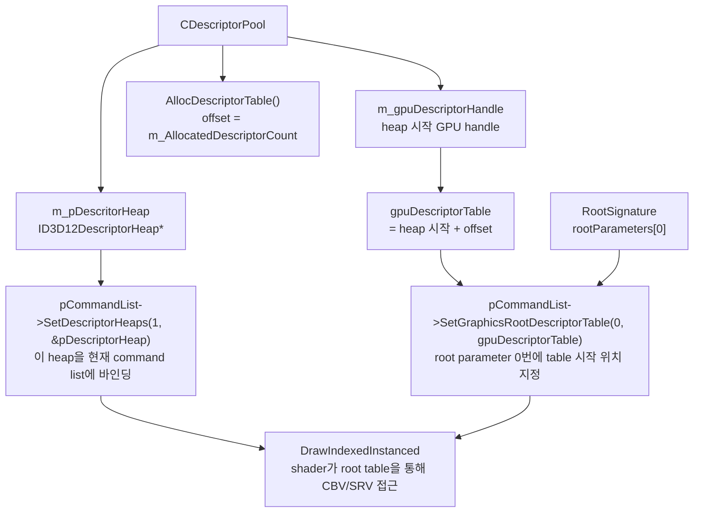

# Chapter 20 – MultiThreadRender Q&A

이 문서는 chapter 20에서 다룬/다룰 질문들을 정리합니다.  
(chapter 19에서 만든 CommandListPool 구조 + 워커 스레드 풀의 조합을 다룹니다.)

---

## Q1. `m_ppRenderQueue`는 왜 `[프레임][스레드]` 가 아니라 `[스레드]` 한 차원, 즉 N개만 할당하나?

`m_ppCommandListPool` / `m_ppDescriptorPool` / `m_ppConstBufferManager`는 모두 `[프레임][스레드]` 2차원으로 `2 × N` 개를 할당합니다. 그런데 `m_ppRenderQueue`는 `[스레드]`만 있어서 `N`개입니다.

### 핵심 이유: GPU가 보는 자원이 아니기 때문

| 종류 | 누가 읽나 | 언제까지 살아있어야 하나 | 다중 인스턴스 필요 |
|---|---|---|---|
| `CommandListPool` (CL + Allocator) | **GPU** | 해당 프레임의 GPU 실행이 끝날 때까지 | O (프레임당 1세트) |
| `DescriptorPool` (GPU descriptor heap) | **GPU** | GPU가 SetDescriptorHeaps로 참조 중인 동안 | O |
| `ConstantBufferManager` (업로드 힙) | **GPU** | GPU가 CBV로 읽는 동안 | O |
| `RenderQueue` (단순 CPU 메모리 버퍼) | **CPU만** | 메인이 채우고 워커가 즉시 비움 → 1프레임 내 완결 | X |

### RenderQueue의 수명

```
[Frame N]
 BeginRender
   ↓
 (메인) RenderMeshObject() 호출들
   → m_ppRenderQueue[i]->Add()        // 메인이 채움
   ↓
 EndRender
   → 워커들이 m_ppRenderQueue[i]->Process()  // 워커가 읽고 CL에 기록
   → m_ppRenderQueue[i]->Reset()             // 즉시 비움
   ↓
 Present (다음 프레임 시작 전에 큐는 이미 비어있음)
```

`Process()`가 끝나는 시점에서 `RenderQueue`의 내용은 모두 **CommandList에 기록되어 있으므로** 더 이상 큐 자체가 필요 없습니다. GPU는 CL만 보지 RenderQueue 버퍼는 안 봅니다.

반면 CommandListPool은:
- 프레임 N의 CL이 **GPU 실행 중**일 때
- 메인은 프레임 N+1의 CL을 **새로 기록**해야 하므로
- 두 세트 (`[0]`, `[1]`)가 동시에 살아있어야 합니다 → 2배 필요.

### 정리

- 프레임 인덱스를 둬야 하는 이유는 **CPU/GPU 병렬성**(CPU가 N+1을 기록하는 동안 GPU가 N을 실행)을 위함.
- RenderQueue는 **같은 프레임의 CPU 단계 안에서만** 살았다 죽기 때문에 프레임 차원이 필요 없음.
- 스레드 차원만 필요한 이유는 **여러 워커가 동시에 자기 큐에 접근**해야 락 없이 안전하기 때문.

---

## Q2. 스레드는 언제/어떻게 만들고, 신호는 언제/어떻게 보내고, 어떻게 종료하나? (프레임 차원도 포함된 mermaid)

### 라이프사이클 한 줄 요약

| 단계 | 시점 | 주체 | 도구 |
|---|---|---|---|
| **생성** | `Initialize()` 단 1회 | 메인 | `_beginthreadex`, `CreateEvent` |
| **시작 신호** | 매 프레임 `EndRender()` | 메인 → 각 워커 | `SetEvent(PROCESS)` |
| **완료 신호** | 매 프레임, 마지막 워커가 | 워커 → 메인 | `SetEvent(m_hCompleteEvent)` |
| **종료 신호** | 종료 시 1회 | 메인 → 각 워커 | `SetEvent(DESTROY)` |
| **회수** | 종료 시 1회 | 메인 | `WaitForSingleObject(hThread)` + `CloseHandle` |

### 코드 위치 매핑

| 동작 | 함수 |
|---|---|
| 스레드 생성 | `InitRenderThreadPool(N)` (Initialize에서 1회 호출) |
| 매 프레임 시작 신호 | `EndRender()` 안의 `SetEvent(... PROCESS)` 루프 |
| 매 프레임 완료 신호 | `ProcessByThread()` 끝의 `_InterlockedDecrement` → 0이면 `SetEvent(hCompleteEvent)` |
| 종료 신호 | `CleanupRenderThreadPool()` 안의 `SetEvent(... DESTROY)` |
| 워커 본체 | `RenderThread()` 의 `WaitForMultipleObjects` 루프 |

### 프레임을 고려한 통합 Mermaid Flowchart



**워커 입장에서 본 루프 (RenderThread.cpp)**



### 신호 종류 정리

- **메인 → 워커**: 워커마다 `hEventList[PROCESS]`, `hEventList[DESTROY]` 2개. 둘 다 auto-reset.
- **워커 → 메인**: 공용 `m_hCompleteEvent` 1개. auto-reset. 마지막 워커만 SetEvent.
- 카운터(`m_lActiveThreadCount`)는 “누가 마지막인지”를 atomic하게 결정하기 위한 보조 수단.

---

## Q3. 라운드로빈(`m_dwCurThreadIndex = (m_dwCurThreadIndex+1) % N`)은 왜 하는가?

```cpp
if (!m_ppRenderQueue[m_dwCurThreadIndex]->Add(&item))
    __debugbreak();
m_dwCurThreadIndex = (m_dwCurThreadIndex + 1) % m_dwRenderThreadCount;
```

### 목적: 워커 간 부하 균등 분산

- 큐가 N개이고 워커도 N개입니다.
- 만약 한 큐에만 모두 넣으면 → 그 워커 1명만 일하고 나머지 N-1명은 빈 큐를 Process하고 즉시 끝남.
- 결국 **싱글스레드와 동일**한 성능이 되어 멀티스레드의 의미가 사라집니다.

### 왜 round-robin이 가장 간단한가

- 메인스레드 1명만 분배자이므로 **락이 필요 없음**.
- 단순 모듈로 연산 → O(1).
- 호출 순서대로 0, 1, 2, …, N-1, 0, 1, … → 큐 길이가 균일.
- 아이템마다 “비용이 비슷하다”고 가정한 단순 정책. (실제로는 무거운 메시 vs 가벼운 스프라이트가 섞일 수 있지만, ch20에서는 그 정도 휴리스틱은 안 다룸.)

### 대안과 비교

| 정책 | 단점 |
|---|---|
| 한 큐에 다 넣고 워커들이 동적으로 가져가기 | 큐 자체에 락 필요, 캐시 라인 경쟁 |
| 객체 종류별 분류 | 분류 비용 + 워커별 부하 편차 |
| **round-robin (채택)** | 단순, 락 없음, 부하 ≈ 균등 |

---

## Q4. `_InterlockedDecrement`는 무엇인가?

```cpp
LONG lCurCount = _InterlockedDecrement(&m_lActiveThreadCount);
if (0 == lCurCount)
    SetEvent(m_hCompleteEvent);
```

### 정의

Windows/MSVC 컴파일러 intrinsic으로, **32-bit LONG 값을 원자적(atomic)으로 1 감소시키고 감소 후의 값을 반환**합니다.

- 헤더: `<intrin.h>` (자동 포함됨)
- 대응되는 함수: `InterlockedDecrement(&v)` (Windows API)
- 내부적으로 x86/x64에서는 `lock dec` / `lock xadd` 같은 LOCK prefix 명령어 사용.

### 왜 원자성이 필요한가

여러 워커가 거의 동시에 끝날 수 있습니다.

```
일반 -- 일반 -- 코드 -- "count = count - 1"
워커 A: read count(=2), compute 1, write 1
워커 B:                read count(=2), compute 1, write 1   ← race!
```

→ 결과가 1이 되어 count가 “마지막을 못 알아챔”. 또는 0이 두 번 보일 수도 있음.

`_InterlockedDecrement`는 read-modify-write 전체를 CPU 수준에서 한 덩어리로 보장합니다.  
정확히 **단 한 명의 워커만** 반환값 0을 보게 됩니다 → 그가 “마지막”이고, 그가 메인을 깨웁니다.

### `volatile` 선언과의 관계

```cpp
LONG volatile m_lActiveThreadCount;
```

`volatile`은 컴파일러가 이 변수에 대한 읽기/쓰기를 옵티마이저가 임의로 캐싱/제거하지 못하게 합니다. `_InterlockedDecrement`와 함께 써야 멀티스레드에서 안전한 동시 접근이 됩니다.

### 변형들

- `_InterlockedIncrement` — 1 증가
- `_InterlockedExchange` — 원자 대입
- `_InterlockedCompareExchange` — CAS

---

## Q5. 왜 “마지막 1명이 깨운 다음” `CloseAndExecute`(Present barrier)는 메인 스레드만 하나?

EndRender의 마지막 단계를 보면:

```cpp
WaitForSingleObject(m_hCompleteEvent, INFINITE);   // 워커들 다 끝남

// ↓↓↓ 메인이 직접 ↓↓↓
CCommandListPool* pCommandListPool = m_ppCommandListPool[m_dwCurContextIndex][0];
ID3D12GraphicsCommandList* pCommandList = pCommandListPool->GetCurrentCommandList();
pCommandList->ResourceBarrier(1, &CD3DX12_RESOURCE_BARRIER::Transition(
    m_pRenderTargets[m_uiRenderTargetIndex],
    D3D12_RESOURCE_STATE_RENDER_TARGET, D3D12_RESOURCE_STATE_PRESENT));
pCommandListPool->CloseAndExecute(m_pCommandQueue);
```

### 이유 1: GPU 실행 순서 = `ExecuteCommandLists` 호출 순서

`ID3D12CommandQueue::ExecuteCommandLists`에 제출된 CL은 **제출된 순서대로** GPU가 실행합니다.  
Present barrier(`RENDER_TARGET → PRESENT`)는 **모든 draw 후**에 와야 합니다.

만약 워커들이 draw CL을 제출하는 동시에 어떤 워커가 barrier CL을 끼워 넣으면, 다른 워커의 draw CL이 그보다 늦게 제출돼서 “Present 상태인 RT에 그리려는” 위반이 발생할 수 있습니다.

→ **모든 워커 제출이 끝났음이 확실해진 뒤** barrier를 제출해야 합니다. 그 “확실해지는 시점”이 바로 메인이 `m_hCompleteEvent`로 깨어난 직후입니다.

### 이유 2: 직렬화 지점이 명확해야 안전

- 워커들은 각자 자기 Pool/Queue를 쓰지만 `m_pCommandQueue`는 **공유**합니다.
- `ID3D12CommandQueue::ExecuteCommandLists` 자체는 thread-safe하지만, **순서 보장은 “호출 순서” 뿐**.
- 메인이 단일 스레드로 마지막 제출을 하면 순서가 자명해집니다. (다른 어떤 워커도 이 시점 이후에 제출하지 않음.)

### 이유 3: `pool[ctx][0]` 재사용 — 자원 소유권 단순화

- `BeginRender`도 `pool[ctx][0]`를 메인이 씀 (Clear + Barrier P→RT).
- `EndRender`의 마지막 barrier도 메인이 같은 `pool[ctx][0]`를 씀.
- 그 사이에 워커 0이 같은 풀로 draw CL을 기록·제출.
- “이 풀의 현재 사용자는 누구인가”를 단일 스레드로만 들고 다니면 race가 없습니다.

만약 워커가 barrier를 처리하게 하면, 워커가 자기 풀(`pool[ctx][i]`)에 barrier를 넣어야 하는데, 그건 메인의 Clear 처리(또는 `pool[ctx][0]`)와 풀이 달라서 “언제 끝났는지” 추가 동기화가 필요합니다.

### 이유 4: 워커는 알고리즘적으로 “draw 만 한다”는 역할 분리

| 역할 | 누가 |
|---|---|
| 프레임 셋업 (Clear, Barrier P→RT) | 메인 |
| draw 기록 + 제출 (대량 작업) | 워커들 (병렬) |
| 프레임 마무리 (Barrier RT→P) + Present | 메인 |

워커는 “병렬화로 이득 보는 부분”만 담당하고, 1회성 셋업/마무리는 메인이 합니다.

### 정리

“마지막 1명이 깨운다 = 모든 워커 제출 끝 보장”  
→ 그 시점에 메인이 **순서가 보장된 단일 제출자**로서 barrier CL을 마지막에 제출해야 GPU가 draw → barrier → Present 순서를 정확히 보게 됩니다.

---
## Q6. RenderQueue에 어떤 데이터가 들어가나?

### `RENDER_ITEM` 구조체 (RenderQueue.h)

```cpp
enum RENDER_ITEM_TYPE { RENDER_ITEM_TYPE_MESH_OBJ, RENDER_ITEM_TYPE_SPRITE };

struct RENDER_MESH_OBJ_PARAM { XMMATRIX matWorld; };

struct RENDER_SPRITE_PARAM {
    int   iPosX, iPosY;
    float fScaleX, fScaleY;
    RECT  Rect;
    BOOL  bUseRect;
    float Z;
    void* pTexHandle;   // nullptr이면 기본 텍스처
};

struct RENDER_ITEM {
    RENDER_ITEM_TYPE Type;       // MESH_OBJ or SPRITE
    void*            pObjHandle; // CBasicMeshObject* or CSpriteObject*
    union {
        RENDER_MESH_OBJ_PARAM MeshObjParam;
        RENDER_SPRITE_PARAM   SpriteParam;
    };
};
```

| Type | 쓰이는 파라미터 | 내용 |
|---|---|---|
| `MESH_OBJ` | `MeshObjParam.matWorld` | 월드 변환 행렬 (4×4 XMMATRIX) |
| `SPRITE` | `SpriteParam.*` | 화면 좌표(X,Y), 스케일, UV Rect, 깊이 Z, 텍스처 핸들 |

### 내부 구현: 단순 선형 버퍼

```cpp
// Initialize
m_pBuffer = (char*)malloc(sizeof(RENDER_ITEM) * dwMaxItemNum);  // 8192개

// Add  →  memcpy 한 번
memcpy(m_pBuffer + m_dwAllocatedSize, pItem, sizeof(RENDER_ITEM));
m_dwAllocatedSize += sizeof(RENDER_ITEM);

// Dispatch  →  포인터 전진
pItem = (const RENDER_ITEM*)(m_pBuffer + m_dwReadBufferPos);
m_dwReadBufferPos += sizeof(RENDER_ITEM);
```

- 동적 할당 없음. `Add`는 `memcpy`, `Dispatch`는 포인터 이동.
- `Reset()`시 `m_dwAllocatedSize`, `m_dwReadBufferPos`를 0으로 돌려 재사용.
- `Process()` 안에서 `Dispatch()`로 꺼낸 아이템을 타입에 따라  
  `pMeshObj->Draw(threadIndex, ...)` 또는 `pSpriteObj->DrawWithTex(threadIndex, ...)` 로 분기.

---

## Q7. `SetEvent`, `WaitForSingleObject`, `CloseHandle`은 어떻게 상호작용 하는가?

### Event 객체의 상태 모델

Event는 **"signaled / non-signaled"** 두 상태를 갖는 커널 객체입니다.

```
CreateEvent(secAttr, bManualReset, bInitialState, name)
```

- `bManualReset = FALSE` → **auto-reset**: `SetEvent` 후 대기자 1명이 풀리면 자동으로 non-signaled 복귀
- `bManualReset = TRUE` → **manual-reset**: `ResetEvent` 호출 전까지 계속 signaled 유지

ch20은 전부 `CreateEvent(nullptr, FALSE, FALSE, nullptr)` — **auto-reset** 이벤트를 씁니다.

### 세 함수의 역할

| 함수 | 역할 |
|---|---|
| `SetEvent(hEvent)` | 이벤트를 **signaled 상태로 전환**, 대기 중인 스레드가 있으면 즉시 깨움 |
| `WaitForSingleObject(hEvent, timeout)` | 이벤트가 signaled 될 때까지 **현재 스레드를 블록**. signaled 감지 시 auto-reset이면 자동 non-signaled 복귀 |
| `CloseHandle(hEvent)` | 해당 프로세스의 **핸들 참조를 해제**. 모든 핸들이 닫혀야 커널 객체 소멸 |

### 상호작용 타임라인

```
스레드 A (대기자)                      스레드 B (신호자)
─────────────────────────────────────────────────────────
WaitForSingleObject(hEvent, INFINITE)
  → 이벤트 non-signaled → 블록됨 (CPU 안 씀, 커널이 재워 놓음)
                                       SetEvent(hEvent)
                                         → 상태 signaled
                                         → OS가 A를 깨움
                                         → auto-reset: 상태 다시 non-signaled
A가 깨어남
  WAIT_OBJECT_0 반환 (이벤트는 이미 non-signaled)
```

`SetEvent`를 먼저 호출 후 `Wait`하면 → 대기자가 없어도 이벤트가 잠시 signaled 상태로 남고, 이후 `Wait` 호출이 즉시 통과합니다 (auto-reset이면 통과 직후 non-signaled).

### ch20 실제 사용 패턴 3가지

**패턴 A — 메인 → 워커 (PROCESS)**
```cpp
// 메인 (EndRender)
SetEvent(m_pThreadDescList[i].hEventList[RENDER_THREAD_EVENT_TYPE_PROCESS]);

// 워커 (RenderThread)
// WaitForMultipleObjects = WaitForSingleObject의 다중 이벤트 버전
// FALSE = 하나라도 signaled되면 리턴
DWORD dw = WaitForMultipleObjects(2, hEventList, FALSE, INFINITE);
```

**패턴 B — 워커 → 메인 (완료)**
```cpp
// 워커 (ProcessByThread) — 마지막 워커만 신호
if (_InterlockedDecrement(&m_lActiveThreadCount) == 0)
    SetEvent(m_hCompleteEvent);

// 메인 (EndRender)
WaitForSingleObject(m_hCompleteEvent, INFINITE);
```

**패턴 C — 메인 → 워커 (DESTROY) + 조인 + 해제**
```cpp
SetEvent(hEventList[RENDER_THREAD_EVENT_TYPE_DESTROY]); // 종료 요청
WaitForSingleObject(hThread, INFINITE);                  // 스레드 종료 대기
CloseHandle(hThread);                                    // 스레드 핸들 해제
CloseHandle(hEventList[0]);                              // PROCESS 이벤트 핸들 해제
CloseHandle(hEventList[1]);                              // DESTROY 이벤트 핸들 해제
```

`CloseHandle(hThread)`는 스레드를 강제 종료하는 것이 **아님**.  
스레드는 이미 `_endthreadex(0)`으로 끝났고, 그 커널 객체에 대한 **내 핸들을 반납**하는 것.  
`WaitForSingleObject(hThread)`가 종료 완료를 기다리고, `CloseHandle`은 그 후 자원 정리.

### CloseHandle과 커널 객체 소멸

```
CreateEvent  → 커널 객체 생성, 참조 카운트 = 1
CloseHandle  → 참조 카운트 -= 1
                카운트 = 0이면 커널 객체 소멸
```

`CloseHandle`을 빠뜨리면 **핸들 누수(handle leak)** 발생.  
프로세스 종료 시 OS가 강제 정리하지만, 장기 실행 프로그램에서는 문제가 됩니다.

### 한 줄 정리

- `SetEvent` = 문 열기
- `WaitForSingleObject` = 문이 열릴 때까지 서 있기 (자동문이면 통과 후 다시 닫힘)
- `CloseHandle` = 문 자체를 없애기 (모든 참조자가 닫으면 커널 객체 소멸)

---

## Q8. `_InterlockedDecrement`는 모든 워커가 호출하는데, `SetEvent(m_hCompleteEvent)`는 딱 1명만 하는가?

맞습니다. 정확히 **딱 1개의 스레드만** `SetEvent`를 호출합니다.

`_InterlockedDecrement(&v)`는 감소 후의 **새 값을 반환**합니다.  
N개 스레드가 동시에 호출해도, CPU의 `lock` 명령어가 read-modify-write 전체를 직렬화하므로 반환값 `0`을 받는 스레드는 정확히 1개뿐입니다.

```
초기값: m_lActiveThreadCount = 3

워커 0: _InterlockedDecrement → 반환 2  (SetEvent 안 함)
워커 1: _InterlockedDecrement → 반환 1  (SetEvent 안 함)
워커 2: _InterlockedDecrement → 반환 0  (SetEvent 호출!) ← 딱 1명
```

세 감소가 거의 동시에 일어나도 순서가 직렬화되어 2, 1, 0이 각각 단 하나씩 반환됩니다.  
`0`을 보는 스레드는 오직 하나 → `SetEvent`도 오직 한 번.

### 일반 `--` 연산이었다면?

```
워커 0: read 3, compute 2       ─┐ 동시 실행
워커 1: read 3, compute 2       ─┘ (둘 다 3을 읽음)
워커 0: write 2
워커 1: write 2  ← 1이 아니라 2가 됨 → 0을 아무도 못 봄
```

→ `SetEvent`가 호출되지 않아 메인이 영원히 잠드는 **데드락** 발생.

`_InterlockedDecrement`의 존재 이유가 바로 이것입니다: "0을 딱 1번만, 딱 1명만 볼 수 있게" 보장.

---

## Q9. `CreateEvent`, `SetEvent`, `WaitForSingleObject`는 모두 Win32 API인가?

네, 셋 다 **Win32 API**입니다. `CloseHandle`도 마찬가지입니다.

| 함수 | 헤더 | 라이브러리 |
|---|---|---|
| `CreateEvent` | `<windows.h>` | `kernel32.lib` |
| `SetEvent` | `<windows.h>` | `kernel32.lib` |
| `WaitForSingleObject` | `<windows.h>` | `kernel32.lib` |
| `CloseHandle` | `<windows.h>` | `kernel32.lib` |

모두 `kernel32.dll`에 구현된 Windows 커널 동기화 API입니다.  
`<windows.h>` 하나만 include하면 전부 사용 가능하고, MSVC 프로젝트에서 `kernel32.lib`는 기본으로 링크됩니다.

### `_InterlockedDecrement`는 다르다

`_InterlockedDecrement`는 Win32 API가 **아니라** MSVC **컴파일러 intrinsic** (`<intrin.h>`)입니다.  
커널 호출(syscall) 없이 CPU 명령어(`lock xadd`) 한 줄로 처리됩니다.  
대응되는 Win32 API 버전은 언더스코어 없는 `InterlockedDecrement`이며, 동작은 동일합니다.

---

## Q10. `SetEvent`를 호출하자마자 `WaitForSingleObject`가 발동하는가?

아닙니다. 핵심은 `SetEvent`와 `WaitForSingleObject`가 **서로 다른 스레드**에서 호출된다는 점입니다.

워커 스레드는 `_beginthreadex`로 생성된 직후부터 이미 `WaitForMultipleObjects`에서 **블록 상태로 대기 중**입니다. 메인이 나중에 `SetEvent`를 호출하면, 이미 기다리고 있던 워커가 즉시 깨어납니다.

```
타임라인 (→ 시간 흐름)
────────────────────────────────────────────────────────────────
메인:  [InitRenderThreadPool]  ...  [EndRender]
                                     SetEvent(PROCESS) ──→ 워커 깨어남
                                     WaitForSingleObject(hCompleteEvent) → 메인 잠듬
                                                                            ↑ 깨어남
워커:  [스레드 시작]
        WaitForMultipleObjects ← 이미 대기 중
                                        깨어남 → ProcessByThread
                                        Decrement → 0
                                        SetEvent(hCompleteEvent) ──────────┘
```

### 두 패턴 정리

| 패턴 | SetEvent 호출자 | WaitFor 호출자 | 누가 먼저 기다리나 |
|---|---|---|---|
| PROCESS (시작) | 메인 | 워커 | **워커**가 먼저 대기 중 → 메인이 SetEvent |
| 완료 | 마지막 워커 | 메인 | **메인**이 먼저 대기 중 → 워커가 SetEvent |

### 메인이 SetEvent 직후 Wait을 걸어도 이상하지 않은 이유

```cpp
// 메인 EndRender
SetEvent(PROCESS_0)              // 워커0 깨움  (이벤트 A)
SetEvent(PROCESS_1)              // 워커1 깨움  (이벤트 A)
...
WaitForSingleObject(hCompleteEvent)  // ← 다른 이벤트(B)를 기다림
```

`SetEvent`와 `WaitForSingleObject`의 **대상 이벤트가 다릅니다.**  
- `SetEvent`로 보내는 건 각 워커의 `hEventList[PROCESS]` (이벤트 A들)  
- `WaitForSingleObject`로 기다리는 건 `m_hCompleteEvent` (이벤트 B)  

"N개 워커에게 일 시키고(A들을 signal), 다 끝나면 나를 깨워라(B를 기다림)"는 구조입니다.  
`SetEvent` = 보내는 것, `WaitForSingleObject` = 받는 것이며, 항상 서로 다른 스레드의 역할입니다.

---

## Q11. `SetEvent(handle)`의 handle은 특정 스레드에 결합된 것인가? `WaitForSingleObject`는 언제 풀리나?

### handle은 특정 스레드에 결합되어 있지 않다

Event 핸들은 **커널 Event 객체**를 가리키는 값일 뿐입니다. 스레드와 직접 결합되어 있지 않습니다.

```
커널 공간
┌─────────────────────────────────────────────┐
│  Event 객체 A  (signaled / non-signaled)     │
└─────────────────────────────────────────────┘
        ↑                    ↑
   메인이 가진 핸들       워커0이 가진 핸들
   (SetEvent 호출용)      (WaitFor 호출용)
```

같은 커널 객체를 가리키는 핸들이면 **누구든** `SetEvent`/`WaitForSingleObject` 호출 가능.  
"누가 기다리고 있는지"는 핸들이 아니라, `WaitForSingleObject`를 호출한 **스레드**가 결정합니다.

### ch20이 "특정 워커만" 깨울 수 있는 이유

워커마다 **개별 이벤트 객체**를 따로 만들었기 때문입니다.

```cpp
// InitRenderThreadPool — 워커 i마다 별도 이벤트 생성
m_pThreadDescList[i].hEventList[PROCESS] = CreateEvent(...);  // 워커i 전용

// 워커 i (RenderThread)
WaitForMultipleObjects(2, m_pThreadDescList[i].hEventList, ...); // 자기 이벤트만 대기

// 메인 (EndRender)
SetEvent(m_pThreadDescList[0].hEventList[PROCESS]); // 워커0 전용 이벤트 → 워커0만 깨어남
SetEvent(m_pThreadDescList[1].hEventList[PROCESS]); // 워커1 전용 이벤트 → 워커1만 깨어남
```

이벤트가 공유되지 않고 **워커마다 독립**되어 있어서 특정 워커만 깨울 수 있습니다.  
이벤트가 하나뿐이었다면 N명 중 누가 깨어날지 제어할 수 없습니다.

### `WaitForSingleObject`는 언제 풀리나?

두 가지 조건입니다:

| 조건 | 반환값 |
|---|---|
| 대기 중인 Event가 `SetEvent`로 signaled 상태가 됨 | `WAIT_OBJECT_0` (0) |
| 지정한 timeout 시간 초과 | `WAIT_TIMEOUT` |

ch20은 전부 `INFINITE`를 씁니다 → timeout 없음 → **`SetEvent`가 불릴 때만 풀립니다.**

```
WaitForSingleObject(hCompleteEvent, INFINITE)
                                    ↑
              SetEvent(hCompleteEvent) 호출 순간 즉시 풀림
              (auto-reset이면 풀리는 즉시 다시 non-signaled로 복귀)
```

### 정리

- `SetEvent(handle)` = "이 커널 객체를 signaled로" — 특정 스레드 지정이 아니라 **이벤트 객체 지정**
- 특정 워커만 깨우기 = 워커마다 **별도 이벤트**를 만들어서 그 핸들에만 `SetEvent`
- `WaitForSingleObject` 풀리는 조건 = `SetEvent`로 signaled가 되거나 timeout 초과 (ch20은 INFINITE이므로 SetEvent만)

---

## Q12. 스레드 생성, 하나의 스레드 작동, 하나의 스레드 종료를 `CreateEvent` / `SetEvent` / `WaitForSingleObject` 흐름으로 보면?

여기서는 **워커 1개**만 놓고 봅니다. 실제 코드는 이 과정을 `N`개 워커에 대해 반복합니다.

---

### 1단계: 스레드 생성 시점 - 이벤트를 먼저 만든다

`InitRenderThreadPool()`에서 워커 하나마다 이벤트 2개를 만듭니다.

```cpp
// 워커 i 전용 시작 이벤트
hEventList[RENDER_THREAD_EVENT_TYPE_PROCESS] = CreateEvent(nullptr, FALSE, FALSE, nullptr);

// 워커 i 전용 종료 이벤트
hEventList[RENDER_THREAD_EVENT_TYPE_DESTROY] = CreateEvent(nullptr, FALSE, FALSE, nullptr);

// 모든 워커 완료를 메인에게 알리는 공용 이벤트
m_hCompleteEvent = CreateEvent(nullptr, FALSE, FALSE, nullptr);
```

이때 아직 스레드가 일을 하는 것은 아닙니다.  
`CreateEvent`는 단지 **신호를 주고받을 커널 Event 객체를 준비**하는 단계입니다.

그 다음 워커 스레드를 생성합니다.

```cpp
hThread = (HANDLE)_beginthreadex(nullptr, 0, RenderThread, desc, 0, &threadID);
```

스레드가 시작되면 `RenderThread()`로 들어갑니다.

```cpp
while (1)
{
    DWORD eventIndex = WaitForMultipleObjects(2, hEventList, FALSE, INFINITE);
    ...
}
```

여기서 워커는 바로 **대기 상태**가 됩니다.  
아직 `SetEvent`가 오지 않았으므로 아무 일도 하지 않고 잠들어 있습니다.

```
메인:  CreateEvent(PROCESS)
       CreateEvent(DESTROY)
       _beginthreadex(RenderThread)

워커:  RenderThread 시작
       WaitForMultipleObjects(PROCESS, DESTROY)에서 잠듬
```

---

### 2단계: 하나의 스레드 작동 - PROCESS 이벤트로 깨운다

프레임의 `EndRender()`에서 메인이 워커에게 일을 시킵니다.

```cpp
SetEvent(worker_i.hEventList[RENDER_THREAD_EVENT_TYPE_PROCESS]);
```

이 순간 `PROCESS` 이벤트가 signaled 상태가 되고, 그 이벤트를 기다리던 워커 i의 `WaitForMultipleObjects`가 풀립니다.

```cpp
case RENDER_THREAD_EVENT_TYPE_PROCESS:
    pRenderer->ProcessByThread(dwThreadIndex);
    break;
```

워커는 `ProcessByThread(i)`를 실행합니다.

```cpp
void CD3D12Renderer::ProcessByThread(DWORD dwThreadIndex)
{
    CCommandListPool* pool = m_ppCommandListPool[m_dwCurContextIndex][dwThreadIndex];

    m_ppRenderQueue[dwThreadIndex]->Process(
        dwThreadIndex, pool, m_pCommandQueue, 400,
        rtvHandle, dsvHandle, &m_Viewport, &m_ScissorRect);

    LONG lCurCount = _InterlockedDecrement(&m_lActiveThreadCount);
    if (0 == lCurCount)
        SetEvent(m_hCompleteEvent);
}
```

작업 내용은:

1. 자기 스레드 번호에 맞는 `CommandListPool[frame][thread]` 선택
2. 자기 `RenderQueue[thread]`를 처리
3. CommandList 기록
4. `ExecuteCommandLists`로 GPU 큐에 제출
5. 끝나면 `m_lActiveThreadCount` 감소
6. 마지막 워커라면 `SetEvent(m_hCompleteEvent)`로 메인을 깨움

한편 메인은 워커들을 깨운 직후 이 이벤트를 기다립니다.

```cpp
WaitForSingleObject(m_hCompleteEvent, INFINITE);
```

즉 전체 흐름은:

```
메인:  SetEvent(worker_i.PROCESS)
       WaitForSingleObject(m_hCompleteEvent)에서 잠듬

워커:  WaitForMultipleObjects가 풀림
       ProcessByThread(i) 실행
       작업 완료
       마지막 워커면 SetEvent(m_hCompleteEvent)

메인:  WaitForSingleObject가 풀림
       Present barrier / Present 진행
```

중요한 점: 메인이 `SetEvent(PROCESS)` 후 바로 `WaitForSingleObject(m_hCompleteEvent)`를 호출하지만, **같은 이벤트를 기다리는 것이 아닙니다**.

| 호출 | 이벤트 | 의미 |
|---|---|---|
| `SetEvent(worker_i.PROCESS)` | 워커 i 전용 PROCESS 이벤트 | 워커 i를 깨워서 일 시작 |
| `WaitForSingleObject(m_hCompleteEvent)` | 공용 완료 이벤트 | 모든 워커가 끝날 때까지 메인 대기 |

---

### 3단계: 하나의 스레드 종료 - DESTROY 이벤트로 깨운 뒤 thread handle을 기다린다

프로그램 종료 시 `CleanupRenderThreadPool()`에서 워커에게 종료 신호를 보냅니다.

```cpp
SetEvent(worker_i.hEventList[RENDER_THREAD_EVENT_TYPE_DESTROY]);
```

워커는 평소처럼 `WaitForMultipleObjects`에서 기다리고 있다가 `DESTROY` 이벤트를 받습니다.

```cpp
case RENDER_THREAD_EVENT_TYPE_DESTROY:
    goto lb_exit;

lb_exit:
    _endthreadex(0);
    return 0;
```

메인은 종료 신호를 보낸 뒤, 진짜로 스레드가 끝날 때까지 스레드 핸들을 기다립니다.

```cpp
WaitForSingleObject(worker_i.hThread, INFINITE);
```

여기서 기다리는 대상은 Event가 아니라 **스레드 핸들**입니다.  
Windows에서 스레드 객체는 그 스레드 함수가 리턴하거나 `_endthreadex`로 끝나면 signaled 상태가 됩니다. 그래서 `WaitForSingleObject(hThread)`는 “이 스레드가 완전히 끝날 때까지 기다려라”라는 뜻입니다.

그 후 핸들을 닫습니다.

```cpp
CloseHandle(worker_i.hThread);
CloseHandle(worker_i.hEventList[PROCESS]);
CloseHandle(worker_i.hEventList[DESTROY]);
```

종료 흐름은:

```
메인:  SetEvent(worker_i.DESTROY)

워커:  WaitForMultipleObjects가 풀림
       DESTROY 분기
       _endthreadex(0)
       스레드 종료

메인:  WaitForSingleObject(worker_i.hThread)가 풀림
       CloseHandle(hThread)
       CloseHandle(PROCESS event)
       CloseHandle(DESTROY event)
```

---

### 하나의 워커 기준 전체 Mermaid



### 최종 요약

| 구간 | 메인 | 워커 | 기다리는 대상 |
|---|---|---|---|
| 생성 | `CreateEvent` 후 `_beginthreadex` | `WaitForMultipleObjects` 진입 | 워커는 PROCESS/DESTROY 이벤트 대기 |
| 작동 | `SetEvent(PROCESS)` 후 `WaitForSingleObject(hCompleteEvent)` | `ProcessByThread` 실행 후 마지막이면 `SetEvent(hCompleteEvent)` | 메인은 완료 이벤트 대기 |
| 종료 | `SetEvent(DESTROY)` 후 `WaitForSingleObject(hThread)` | `_endthreadex`로 종료 | 메인은 스레드 핸들 대기 |

---

## Q13. 종료 시 `WaitForSingleObject(hThread)` 후 `CloseHandle(hThread/PROCESS/DESTROY)`는 무슨 뜻인가?

질문한 코드 흐름은 `CleanupRenderThreadPool()` 안에 있습니다.

```cpp
SetEvent(m_pThreadDescList[i].hEventList[RENDER_THREAD_EVENT_TYPE_DESTROY]);

WaitForSingleObject(m_pThreadDescList[i].hThread, INFINITE);
CloseHandle(m_pThreadDescList[i].hThread);

CloseHandle(m_pThreadDescList[i].hEventList[RENDER_THREAD_EVENT_TYPE_PROCESS]);
CloseHandle(m_pThreadDescList[i].hEventList[RENDER_THREAD_EVENT_TYPE_DESTROY]);
```

이 순서는 네 단계입니다.

---

### 1. `SetEvent(DESTROY)` — 워커에게 “이제 종료해라”라고 깨운다

워커는 평소에 이렇게 자고 있습니다.

```cpp
WaitForMultipleObjects(
        RENDER_THREAD_EVENT_TYPE_COUNT,
        phEventList,
        FALSE,
        INFINITE);
```

여기서 `DESTROY` 이벤트를 signal하면 워커가 깨어납니다.

```cpp
SetEvent(hEventList[RENDER_THREAD_EVENT_TYPE_DESTROY]);
```

이건 스레드를 강제로 죽이는 API가 아닙니다.  
그저 “네가 기다리던 종료 이벤트가 왔다”라고 알려주는 것입니다.

---

### 2. 워커는 `DESTROY`를 받고 자기 스스로 종료한다

워커 쪽 코드는 이렇게 빠집니다.

```cpp
case RENDER_THREAD_EVENT_TYPE_DESTROY:
        goto lb_exit;

lb_exit:
        _endthreadex(0);
        return 0;
```

즉 워커 스레드가 스스로 정리하고 끝납니다.  
이 시점이 되어야 비로소 “스레드 함수가 종료됨” 상태입니다.

---

### 3. `WaitForSingleObject(hThread)` — 메인이 워커가 진짜 끝날 때까지 기다린다

```cpp
WaitForSingleObject(m_pThreadDescList[i].hThread, INFINITE);
```

여기서 기다리는 대상은 Event가 아니라 **스레드 핸들**입니다.

Windows에서 스레드 커널 객체는, 그 스레드가 아직 실행 중이면 non-signaled 상태이고, 스레드가 종료되면 signaled 상태가 됩니다.

| 대상 핸들 | 언제 `WaitForSingleObject`가 풀리나? |
|---|---|
| Event 핸들 | 누군가 `SetEvent(event)`를 호출하면 |
| Thread 핸들 | 해당 스레드 함수가 끝나면 (`return` 또는 `_endthreadex`) |

그래서 `WaitForSingleObject(hThread, INFINITE)`는 이런 뜻입니다.

> “종료 신호는 보냈지만, 실제로 워커가 끝났는지 확인할 때까지 메인은 기다려라.”

이걸 하지 않고 바로 이벤트 핸들을 닫으면, 워커가 아직 `WaitForMultipleObjects`나 종료 분기에서 그 핸들을 쓰고 있을 수도 있어서 위험합니다.

---

### 4. `CloseHandle(hThread)` — 스레드를 죽이는 게 아니라 “핸들 참조”를 반납한다

```cpp
CloseHandle(m_pThreadDescList[i].hThread);
```

이건 스레드를 종료시키는 함수가 아닙니다.  
스레드는 이미 3단계의 `WaitForSingleObject(hThread)`가 풀린 시점에 끝났습니다.

`CloseHandle(hThread)`는 단지:

> “이 스레드 커널 객체를 가리키던 내 핸들을 이제 닫겠다.”

라는 뜻입니다.

핸들을 닫지 않으면 스레드는 끝났어도, 스레드 커널 객체에 대한 핸들 리소스가 남아서 핸들 누수가 납니다.

---

### 5. `CloseHandle(PROCESS_i)`, `CloseHandle(DESTROY_i)` — 이벤트 객체 핸들도 반납한다

```cpp
CloseHandle(hEventList[RENDER_THREAD_EVENT_TYPE_PROCESS]);
CloseHandle(hEventList[RENDER_THREAD_EVENT_TYPE_DESTROY]);
```

이벤트도 `CreateEvent`로 만든 커널 객체입니다.  
따라서 더 이상 쓰지 않으면 핸들을 닫아야 합니다.

이 순서가 중요한 이유:

1. 먼저 `SetEvent(DESTROY)`로 워커를 깨움
2. `WaitForSingleObject(hThread)`로 워커가 완전히 끝났는지 확인
3. 워커가 더 이상 이벤트 핸들을 쓰지 않는 것이 확정됨
4. 그 다음 `CloseHandle(PROCESS/DESTROY)`로 이벤트 핸들 정리

---

### 전체 종료 흐름 그림

```text
메인                                      워커 i
──────────────────────────────────────────────────────────
SetEvent(DESTROY_i)
    종료 이벤트 signal  ───────────────────▶ WaitForMultipleObjects 풀림
                                                                                     DESTROY 분기
                                                                                     _endthreadex(0)
                                                                                     스레드 종료

WaitForSingleObject(hThread_i)
    워커 종료까지 대기
    스레드 종료되면 풀림 ◀────────────────── Thread 객체 signaled

CloseHandle(hThread_i)
    스레드 핸들 반납

CloseHandle(PROCESS_i)
CloseHandle(DESTROY_i)
    이벤트 핸들 반납
```

### 최종 요약

- `SetEvent(DESTROY_i)` = 워커에게 종료하라는 **신호**
- `WaitForSingleObject(hThread_i)` = 워커가 **진짜 종료될 때까지 대기**
- `CloseHandle(hThread_i)` = 끝난 스레드 객체에 대한 **내 핸들 반납**
- `CloseHandle(PROCESS_i/DESTROY_i)` = 더 이상 쓰지 않는 **이벤트 핸들 반납**
- `CloseHandle`은 절대 “종료”가 아니라 “정리”입니다.

---

## Q14. 종료 처리에서 `SetEvent(DESTROY)`, `WaitForSingleObject(hThread)`, `CloseHandle`의 실행 주체는 누구인가?

모두 **메인 스레드**가 실행합니다.  
워커 스레드가 직접 호출하는 것은 `WaitForMultipleObjects`와 `_endthreadex(0)`입니다.

---

### 종료 처리 주체 표

| 코드 | 실행 주체 | 대상 | 의미 |
|---|---|---|---|
| `SetEvent(DESTROY_i)` | **메인 스레드** | 워커 i의 종료 이벤트 | 워커 i에게 종료하라고 알림 |
| `WaitForMultipleObjects(...)` | **워커 i** | 자기 `PROCESS_i`, `DESTROY_i` 이벤트 | 시작/종료 신호를 기다림 |
| `_endthreadex(0)` | **워커 i** | 자기 자신 | 워커 스레드 함수 종료 |
| `WaitForSingleObject(hThread_i)` | **메인 스레드** | 워커 i의 스레드 핸들 | 워커 i가 진짜 끝날 때까지 기다림 |
| `CloseHandle(hThread_i)` | **메인 스레드** | 워커 i의 스레드 핸들 | 스레드 핸들 정리 |
| `CloseHandle(PROCESS_i)` | **메인 스레드** | 워커 i의 시작 이벤트 핸들 | 이벤트 핸들 정리 |
| `CloseHandle(DESTROY_i)` | **메인 스레드** | 워커 i의 종료 이벤트 핸들 | 이벤트 핸들 정리 |

---

### 1. `SetEvent(DESTROY_i)`의 주체는 메인인가?

네. `CleanupRenderThreadPool()`은 renderer 정리 과정에서 **메인 스레드**가 호출합니다.

```cpp
for (DWORD i = 0; i < m_dwRenderThreadCount; i++)
{
        SetEvent(m_pThreadDescList[i].hEventList[RENDER_THREAD_EVENT_TYPE_DESTROY]);
        ...
}
```

즉 메인이 워커 수만큼 반복하면서:

```text
메인 → 워커0 DESTROY 이벤트 SetEvent
메인 → 워커1 DESTROY 이벤트 SetEvent
메인 → 워커2 DESTROY 이벤트 SetEvent
...
```

이렇게 각 워커에게 종료 신호를 보냅니다.

중요한 점: `SetEvent(DESTROY_i)`는 스레드를 강제로 죽이는 것이 아니라, 워커가 기다리던 `DESTROY_i` 이벤트를 켜서 **워커가 스스로 종료 루트로 가게 만드는 것**입니다.

---

### 2. `WaitForSingleObject(hThread_i)`는 어떤 신호를 어디서 받나?

여기서 기다리는 대상은 Event가 아니라 **스레드 핸들**입니다.

```cpp
WaitForSingleObject(m_pThreadDescList[i].hThread, INFINITE);
```

Windows에서 스레드 객체는 다음 규칙을 가집니다.

```text
스레드가 실행 중   → hThread는 non-signaled
스레드가 종료됨     → hThread는 signaled
```

따라서 `WaitForSingleObject(hThread_i)`는 `SetEvent`로 풀리는 것이 아닙니다.  
워커 i가 `_endthreadex(0)`으로 끝나면 Windows 커널이 그 스레드 객체를 signaled 상태로 만들고, 그때 메인의 wait가 풀립니다.

```text
메인:   WaitForSingleObject(hThread_i)  ← hThread_i가 signaled 될 때까지 대기

워커 i: _endthreadex(0)
                ↓
커널:   hThread_i 상태를 signaled로 변경
                ↓
메인:   WaitForSingleObject가 풀림
```

즉 `hThread_i`의 신호는 워커가 직접 `SetEvent`로 보내는 것이 아니라, **스레드 종료를 감지한 Windows 커널이 자동으로 발생**시킵니다.

---

### 3. `CloseHandle(hThread_i)`의 실행 주체는?

**메인 스레드**입니다.

```cpp
CloseHandle(m_pThreadDescList[i].hThread);
```

메인이 `WaitForSingleObject(hThread_i)`로 “워커가 끝났다”는 것을 확인한 다음, 그 스레드 핸들을 닫습니다.

이건 스레드를 종료시키는 함수가 아니라:

```text
이제 이 스레드 커널 객체를 가리키는 내 핸들이 필요 없으니 반납한다
```

라는 뜻입니다.

---

### 4. `CloseHandle(PROCESS_i)`, `CloseHandle(DESTROY_i)`의 실행 주체는?

이것도 **메인 스레드**입니다.

```cpp
for (DWORD j = 0; j < RENDER_THREAD_EVENT_TYPE_COUNT; j++)
{
        CloseHandle(m_pThreadDescList[i].hEventList[j]);
        m_pThreadDescList[i].hEventList[j] = nullptr;
}
```

왜 메인이 닫냐면, 이 이벤트 핸들을 만든 주체가 메인이고, 수명도 renderer가 관리하기 때문입니다.  
워커는 그 이벤트를 **대기 대상으로 사용**만 합니다.

반드시 `WaitForSingleObject(hThread_i)` 이후에 닫아야 합니다.  
그래야 워커가 더 이상 `PROCESS_i`나 `DESTROY_i` 이벤트를 사용하지 않는다는 것이 확실합니다.

---

### 하나의 워커 종료 시점에서 주체별 흐름

```text
메인 스레드                                      워커 i                         Windows 커널
──────────────────────────────────────────────────────────────────────────────────────────
SetEvent(DESTROY_i)
    └─ DESTROY_i를 signaled로 만듦 ───────────────────────────────────────────────▶

                                                                                                WaitForMultipleObjects 풀림
                                                                                                DESTROY 분기 진입
                                                                                                _endthreadex(0)
                                                                                                                                                         hThread_i signaled

WaitForSingleObject(hThread_i)
    └─ hThread_i가 signaled라서 풀림 ◀────────────────────────────────────────────

CloseHandle(hThread_i)
CloseHandle(PROCESS_i)
CloseHandle(DESTROY_i)
```

### 최종 정리

- 종료를 지휘하는 주체는 **메인 스레드**
- 워커는 `DESTROY` 이벤트를 받고 **자기 자신을 종료**
- `WaitForSingleObject(hThread_i)`는 Event 신호가 아니라 **스레드 종료 신호**를 기다림
- `hThread_i`가 signaled 되는 것은 `SetEvent` 때문이 아니라 **워커가 끝났다고 Windows 커널이 알려주기 때문**
- `CloseHandle(...)` 호출 주체도 모두 **메인 스레드**

---

## Q15. `WaitForSingleObject(hThread)`가 `_endthreadex(0)` 후 풀리는 과정을 실제 코드 기반으로 보면?

질문한 흐름은 이 부분입니다.

```text
메인:   WaitForSingleObject(hThread_i)  ← hThread_i가 signaled 될 때까지 대기

워커 i: _endthreadex(0)
        ↓
커널:   hThread_i 상태를 signaled로 변경
        ↓
메인:   WaitForSingleObject가 풀림
```

이걸 실제 코드의 변수와 함수로 연결하면 아래와 같습니다.

---

### 1. `hThread_i`는 어디서 생기나?

`InitRenderThreadPool()`에서 `_beginthreadex`가 워커 스레드를 만들고, 그 스레드 핸들을 반환합니다.

```cpp
m_pThreadDescList[i].hThread = (HANDLE)_beginthreadex(
    nullptr,
    0,
    RenderThread,
    m_pThreadDescList + i,
    0,
    &uiThreadID);
```

여기서 중요한 것:

- `_beginthreadex(...)`는 실제 OS 스레드를 생성합니다.
- 새 스레드는 `RenderThread` 함수에서 시작합니다.
- 반환값은 그 스레드를 가리키는 **thread handle**입니다.
- 그 핸들을 `m_pThreadDescList[i].hThread`에 저장합니다.

즉 코드상 `hThread_i`는:

```cpp
m_pThreadDescList[i].hThread
```

입니다.

---

### 2. 워커 i는 어디서 실행되나?

`_beginthreadex`의 세 번째 인자가 `RenderThread`입니다.

```cpp
_beginthreadex(nullptr, 0, RenderThread, m_pThreadDescList + i, 0, &uiThreadID);
```

그래서 워커 i는 `RenderThread(void* pArg)` 함수에서 시작합니다.

```cpp
UINT WINAPI RenderThread(void* pArg)
{
    RENDER_THREAD_DESC* pDesc = (RENDER_THREAD_DESC*)pArg;
    CD3D12Renderer* pRenderer = pDesc->pRenderer;
    DWORD dwThreadIndex = pDesc->dwThreadIndex;
    const HANDLE* phEventList = pDesc->hEventList;

    while (1)
    {
        DWORD dwEventIndex = WaitForMultipleObjects(
            RENDER_THREAD_EVENT_TYPE_COUNT,
            phEventList,
            FALSE,
            INFINITE);

        switch (dwEventIndex)
        {
            case RENDER_THREAD_EVENT_TYPE_PROCESS:
                pRenderer->ProcessByThread(dwThreadIndex);
                break;
            case RENDER_THREAD_EVENT_TYPE_DESTROY:
                goto lb_exit;
        }
    }

lb_exit:
    _endthreadex(0);
    return 0;
}
```

평상시 워커는 `WaitForMultipleObjects`에서 잠들어 있습니다.

---

### 3. 메인이 종료 신호를 보내는 실제 코드

`CleanupRenderThreadPool()`에서 메인이 워커 i의 `DESTROY` 이벤트를 켭니다.

```cpp
SetEvent(m_pThreadDescList[i].hEventList[RENDER_THREAD_EVENT_TYPE_DESTROY]);
```

그러면 워커 i의 이 코드가 풀립니다.

```cpp
DWORD dwEventIndex = WaitForMultipleObjects(...);
```

그리고 반환값이 `RENDER_THREAD_EVENT_TYPE_DESTROY`가 됩니다.

```cpp
case RENDER_THREAD_EVENT_TYPE_DESTROY:
    goto lb_exit;
```

---

### 4. 워커가 `_endthreadex(0)`을 호출하면 무슨 일이 생기나?

워커는 `lb_exit`로 이동해서 종료합니다.

```cpp
lb_exit:
    _endthreadex(0);
    return 0;
```

이 순간 워커 스레드는 종료됩니다.  
스레드가 종료되면 Windows 커널은 그 스레드 객체를 **signaled 상태**로 바꿉니다.

이 signaled 상태가 바로 메인이 기다리던 `m_pThreadDescList[i].hThread`의 상태입니다.

주의: 여기서는 `SetEvent(hThread)` 같은 코드를 호출하지 않습니다.  
스레드 핸들은 Event 핸들이 아니므로 `SetEvent`로 깨우는 것이 아닙니다.  
스레드가 끝나면 커널이 자동으로 thread object를 signaled 상태로 바꿉니다.

---

### 5. 메인의 `WaitForSingleObject(hThread)`는 어디서 풀리나?

메인 코드는 이 부분입니다.

```cpp
WaitForSingleObject(m_pThreadDescList[i].hThread, INFINITE);
```

이 함수는 다음 조건을 기다립니다.

```text
m_pThreadDescList[i].hThread가 signaled 상태가 되는 것
```

그리고 `hThread`가 signaled 되는 조건은:

```text
해당 워커 스레드가 종료되는 것
```

즉 실제 연결은 이렇습니다.

```text
메인:
  WaitForSingleObject(m_pThreadDescList[i].hThread, INFINITE)
      ↓ 기다림

워커 i:
  RenderThread() 실행 중
  DESTROY 이벤트 받음
  goto lb_exit
  _endthreadex(0)
      ↓ 워커 스레드 종료

Windows 커널:
  "이 thread object는 종료되었다"
  m_pThreadDescList[i].hThread가 가리키는 thread object를 signaled로 변경
      ↓

메인:
  WaitForSingleObject(...) 반환
```

---

### 6. 이 코드에서 `hThread`와 `hEventList`는 서로 다르다

`RENDER_THREAD_DESC` 구조체를 보면 둘이 분리되어 있습니다.

```cpp
struct RENDER_THREAD_DESC
{
    CD3D12Renderer* pRenderer;
    DWORD dwThreadIndex;
    HANDLE hThread;       // 스레드 객체 핸들
    HANDLE hEventList[RENDER_THREAD_EVENT_TYPE_COUNT]; // PROCESS/DESTROY 이벤트 핸들
};
```

| 핸들 | 생성 함수 | 기다리는 의미 |
|---|---|---|
| `hEventList[PROCESS]` | `CreateEvent` | 워커에게 일 시작 신호 |
| `hEventList[DESTROY]` | `CreateEvent` | 워커에게 종료 요청 신호 |
| `hThread` | `_beginthreadex` | 워커 스레드 자체가 끝났는지 확인 |

그래서 종료 시 두 종류의 wait가 다르게 쓰입니다.

```cpp
// 워커 내부: 이벤트를 기다림
WaitForMultipleObjects(..., hEventList, ...);

// 메인 내부: 스레드 종료를 기다림
WaitForSingleObject(m_pThreadDescList[i].hThread, INFINITE);
```

---

### 실제 코드 흐름 최종 정리

```cpp
// 1. 메인: 스레드 생성, hThread 저장
m_pThreadDescList[i].hThread = (HANDLE)_beginthreadex(
    nullptr, 0, RenderThread, m_pThreadDescList + i, 0, &uiThreadID);

// 2. 워커: RenderThread에서 이벤트 대기
DWORD dwEventIndex = WaitForMultipleObjects(..., phEventList, FALSE, INFINITE);

// 3. 메인: 종료 요청
SetEvent(m_pThreadDescList[i].hEventList[RENDER_THREAD_EVENT_TYPE_DESTROY]);

// 4. 워커: DESTROY 받고 종료
case RENDER_THREAD_EVENT_TYPE_DESTROY:
    goto lb_exit;

lb_exit:
    _endthreadex(0);
    return 0;

// 5. 메인: 워커 스레드 객체가 signaled 될 때까지 대기
WaitForSingleObject(m_pThreadDescList[i].hThread, INFINITE);

// 6. 메인: 이제 핸들 정리
CloseHandle(m_pThreadDescList[i].hThread);
```

한 줄로 말하면:

> `hThread`는 `_beginthreadex`가 준 "스레드 객체 핸들"이고, 그 스레드 함수 `RenderThread`가 `_endthreadex(0)`으로 끝나는 순간 Windows 커널이 `hThread`를 signaled로 만들기 때문에 메인의 `WaitForSingleObject(hThread)`가 풀립니다.

---

## Q16. 워커 스레드가 한창 실행 중인데 `DESTROY` 시그널을 보내면 어떻게 되는가?

바로 강제 종료되지 않습니다.  
이 코드에서 `SetEvent(DESTROY)`는 **인터럽트/강제 종료가 아니라 종료 요청 플래그를 켜는 것**에 가깝습니다.

워커가 `DESTROY`를 실제로 확인하는 위치는 오직 여기입니다.

```cpp
DWORD dwEventIndex = WaitForMultipleObjects(
    RENDER_THREAD_EVENT_TYPE_COUNT,
    phEventList,
    FALSE,
    INFINITE);

switch (dwEventIndex)
{
    case RENDER_THREAD_EVENT_TYPE_PROCESS:
        pRenderer->ProcessByThread(dwThreadIndex);
        break;
    case RENDER_THREAD_EVENT_TYPE_DESTROY:
        goto lb_exit;
}
```

즉 워커는 `WaitForMultipleObjects`에서 대기 중일 때만 `PROCESS`/`DESTROY` 이벤트를 감지합니다.

---

### 경우 1. 워커가 대기 중일 때 `DESTROY`를 보내면

```text
워커: WaitForMultipleObjects에서 잠듬
메인: SetEvent(DESTROY_i)
워커: 즉시 깨어남
워커: DESTROY 분기
워커: _endthreadex(0)
```

이 경우는 바로 종료됩니다.

---

### 경우 2. 워커가 `ProcessByThread()` 실행 중일 때 `DESTROY`를 보내면

```text
워커: ProcessByThread(i) 실행 중
      RenderQueue.Process
      CommandList 기록
      ExecuteCommandLists

메인: SetEvent(DESTROY_i)
      → DESTROY 이벤트는 signaled 상태가 됨
      → 하지만 워커는 지금 WaitForMultipleObjects 안에 없으므로 즉시 반응 못 함

워커: ProcessByThread(i) 끝남
워커: while 루프 처음으로 돌아감
워커: WaitForMultipleObjects 호출
      → 이미 DESTROY가 signaled 상태라 즉시 반환
워커: DESTROY 분기
워커: _endthreadex(0)
```

즉 실행 중인 작업을 중간에 끊지 않습니다.  
현재 `ProcessByThread()`를 끝까지 수행한 다음, 다음 대기 지점에서 `DESTROY`를 보고 종료합니다.

---

### 왜 이렇게 동작하나?

Win32 Event는 스레드를 강제로 중단시키는 인터럽트가 아닙니다.

```cpp
SetEvent(hDestroyEvent);
```

이 코드는 단지 Event 객체의 상태를 signaled로 바꿉니다.  
그 Event를 기다리는 `WaitForSingleObject` / `WaitForMultipleObjects`가 있을 때만 대기 상태가 풀립니다.

워커가 CPU에서 일반 코드를 실행 중이면:

```cpp
pRenderer->ProcessByThread(dwThreadIndex);
```

그 코드를 Windows가 갑자기 중단시키지 않습니다.  
이 구조는 **cooperative shutdown**입니다. 즉 “종료 요청을 보내고, 워커가 안전한 지점에 도달하면 스스로 종료”하는 방식입니다.

---

### 이 코드에서 안전한 이유

정상적인 종료 시점에는 보통 렌더 루프가 끝나고 워커들이 대기 상태일 때 `CleanupRenderThreadPool()`이 호출됩니다.

그래도 혹시 작업 중에 `DESTROY`가 들어오더라도:

1. 워커는 현재 `ProcessByThread()`를 끝까지 마침
2. 그 후 `WaitForMultipleObjects`로 돌아감
3. 이미 signaled된 `DESTROY` 이벤트를 즉시 감지
4. `_endthreadex(0)`으로 종료
5. 메인의 `WaitForSingleObject(hThread)`가 풀림

그래서 메인은 워커가 작업을 완전히 끝내고 종료할 때까지 기다립니다.

---

### 주의할 점

만약 `ProcessByThread()` 안에서 무한 루프나 데드락이 생기면, 워커는 `WaitForMultipleObjects`로 돌아오지 못합니다. 그러면 `DESTROY` 이벤트를 이미 보냈더라도 처리하지 못합니다.

그 경우 메인의 이 코드도 영원히 대기할 수 있습니다.

```cpp
WaitForSingleObject(m_pThreadDescList[i].hThread, INFINITE);
```

왜냐하면 워커가 `_endthreadex(0)`까지 도달하지 못하므로 `hThread`가 signaled 상태가 되지 않기 때문입니다.

---

### 최종 정리

- `SetEvent(DESTROY)`는 강제 종료가 아니라 **종료 요청**
- 워커가 대기 중이면 즉시 종료
- 워커가 작업 중이면 현재 작업을 마치고 다음 `WaitForMultipleObjects`에서 종료
- 이 방식은 안전한 cooperative shutdown
- 워커 작업이 끝나지 않는 버그가 있으면 메인의 `WaitForSingleObject(hThread)`도 풀리지 않음

---

## Q17. "워커가 `WaitForMultipleObjects` 안에 있다/없다"는 말은 무슨 뜻인가?

이 표현은 함수 호출 스택/실행 위치를 말합니다.  
즉 워커 스레드가 지금 어느 코드 줄에서 멈춰 있거나 실행 중인지를 뜻합니다.

워커의 전체 루프는 이렇게 생겼습니다.

```cpp
while (1)
{
    // A 지점: 여기서 잠들어 있음
    DWORD dwEventIndex = WaitForMultipleObjects(
        RENDER_THREAD_EVENT_TYPE_COUNT,
        phEventList,
        FALSE,
        INFINITE);

    switch (dwEventIndex)
    {
        case RENDER_THREAD_EVENT_TYPE_PROCESS:
            // B 지점: 여기서 실제 렌더 작업 실행
            pRenderer->ProcessByThread(dwThreadIndex);
            break;

        case RENDER_THREAD_EVENT_TYPE_DESTROY:
            // C 지점: 여기서 종료 루트
            goto lb_exit;
    }
}

lb_exit:
    _endthreadex(0);
    return 0;
```

---

### "WaitForMultipleObjects 안에 있다"의 의미

워커가 A 지점에서 멈춰 있다는 뜻입니다.

```cpp
DWORD dwEventIndex = WaitForMultipleObjects(...);
```

이 함수는 이벤트가 올 때까지 리턴하지 않습니다.  
즉 워커 스레드는 CPU를 쓰지 않고 Windows 커널에 의해 잠든 상태입니다.

```text
워커 실행 위치:

while (1)
{
    DWORD dwEventIndex = WaitForMultipleObjects(...);
                         ↑
                         지금 여기서 멈춰 있음
}
```

이때 메인이 `SetEvent(PROCESS)` 또는 `SetEvent(DESTROY)`를 하면, 바로 이 wait 함수가 풀립니다.

---

### "WaitForMultipleObjects 안에 없다"의 의미

워커가 A 지점에서 이미 깨어나서, B 지점의 실제 작업 코드를 실행 중이라는 뜻입니다.

```cpp
case RENDER_THREAD_EVENT_TYPE_PROCESS:
    pRenderer->ProcessByThread(dwThreadIndex);
    break;
```

예를 들면 지금 워커는 이런 코드 안쪽에 있을 수 있습니다.

```cpp
m_ppRenderQueue[dwThreadIndex]->Process(...);
```

또는 더 안쪽에서:

```cpp
pMeshObj->Draw(dwThreadIndex, pCommandList, ...);
```

또는:

```cpp
pCommandQueue->ExecuteCommandLists(...);
```

즉 실행 위치가 `WaitForMultipleObjects`가 아니라 `ProcessByThread()` / `RenderQueue::Process()` / `Draw()` 같은 일반 함수 내부입니다.

```text
워커 실행 위치:

while (1)
{
    WaitForMultipleObjects(...);   // 이미 지나감

    switch (...)
    {
        case PROCESS:
            pRenderer->ProcessByThread(dwThreadIndex);
            //                         ↑
            //                         지금 여기 안쪽 실행 중
            break;
    }
}
```

이 상태에서는 `SetEvent(DESTROY)`가 와도 워커가 즉시 이 코드를 중단하지 않습니다.  
왜냐하면 이벤트를 확인하는 코드는 `WaitForMultipleObjects` 호출뿐인데, 지금은 그 함수를 실행 중이지 않기 때문입니다.

---

### 비유 없이 코드 실행 흐름으로만 보면

#### 1. 워커가 대기 중인 상태

```text
워커 위치 = WaitForMultipleObjects(...)
메인: SetEvent(DESTROY)
결과: WaitForMultipleObjects가 바로 반환 → DESTROY switch로 감
```

#### 2. 워커가 작업 중인 상태

```text
워커 위치 = ProcessByThread(...)
메인: SetEvent(DESTROY)
결과: DESTROY 이벤트는 signaled 상태가 됨
      하지만 워커는 ProcessByThread를 계속 실행
      ProcessByThread가 끝난 뒤 while 처음으로 돌아감
      다시 WaitForMultipleObjects 호출
      이미 DESTROY가 signaled라 즉시 반환
      DESTROY switch로 감
```

---

### 왜 이벤트가 작업 중인 코드를 끊지 못하나?

Win32 Event는 “기다리는 함수”를 깨우는 동기화 객체입니다.  
실행 중인 일반 C++ 함수를 강제로 끊는 장치가 아닙니다.

이 코드는 이벤트를 확인하는 지점이 하나뿐입니다.

```cpp
WaitForMultipleObjects(...);
```

따라서 워커가 이 함수에 도달해야 `PROCESS`인지 `DESTROY`인지 확인할 수 있습니다.  
`ProcessByThread()` 안쪽에는 `DESTROY` 이벤트를 중간중간 검사하는 코드가 없습니다.

---

### 최종 정리

- "WaitForMultipleObjects 안에 있다" = 워커가 이벤트를 기다리며 잠들어 있는 상태
- "WaitForMultipleObjects 안에 없다" = 워커가 이미 깨어나 `ProcessByThread()` 같은 작업 코드를 실행 중인 상태
- `SetEvent`는 wait 중인 스레드는 깨우지만, 이미 실행 중인 C++ 코드를 강제로 끊지는 않음
- 그래서 작업 중 `DESTROY`가 오면, 워커는 현재 작업을 끝내고 다음 wait 지점에서 종료함

---

## Q18. ConstantBufferPool과 DescriptorPool은 어느 타이밍에 스레드별로 할당되는가?

결론부터 말하면, ConstantBuffer/Descriptor Pool은 **스레드가 일을 시작할 때마다 새로 만드는 것이 아닙니다.**  
`Initialize()` 중에 미리 `프레임 슬롯 × 스레드 수` 만큼 전부 만들어 둡니다.

---

### 1. 스레드 수를 먼저 정한다

`Initialize()`에서 물리 코어 수를 얻고, 그것을 렌더 스레드 수로 씁니다.

```cpp
DWORD dwPhysicalCoreCount = 0;
DWORD dwLogicalCoreCount = 0;
GetPhysicalCoreCount(&dwPhysicalCoreCount, &dwLogicalCoreCount);

m_dwRenderThreadCount = dwPhysicalCoreCount;
if (m_dwRenderThreadCount > MAX_RENDER_THREAD_COUNT)
    m_dwRenderThreadCount = MAX_RENDER_THREAD_COUNT;
```

즉 `N = m_dwRenderThreadCount`가 먼저 정해집니다.

---

### 2. 워커 스레드를 만든다

멀티스레드 모드에서는 스레드 풀을 만듭니다.

```cpp
#ifdef USE_MULTI_THREAD
InitRenderThreadPool(m_dwRenderThreadCount);
#endif
```

여기서 워커 스레드 N개와 이벤트들이 만들어집니다.  
하지만 이 시점에 ConstantBuffer/Descriptor Pool이 만들어지는 것은 아닙니다.

---

### 3. 그 다음 `[프레임][스레드]` 단위로 Pool을 전부 할당한다

바로 다음 코드에서 2중 루프를 돕니다.

```cpp
for (DWORD i = 0; i < MAX_PENDING_FRAME_COUNT; i++)
{
    for (DWORD j = 0; j < m_dwRenderThreadCount; j++)
    {
        m_ppCommandListPool[i][j] = new CCommandListPool;
        m_ppCommandListPool[i][j]->Initialize(m_pD3DDevice, D3D12_COMMAND_LIST_TYPE_DIRECT, 256);

        m_ppDescriptorPool[i][j] = new CDescriptorPool;
        m_ppDescriptorPool[i][j]->Initialize(
            m_pD3DDevice,
            MAX_DRAW_COUNT_PER_FRAME * CBasicMeshObject::MAX_DESCRIPTOR_COUNT_FOR_DRAW);

        m_ppConstBufferManager[i][j] = new CConstantBufferManager;
        m_ppConstBufferManager[i][j]->Initialize(m_pD3DDevice, MAX_DRAW_COUNT_PER_FRAME);
    }
}
```

여기서:

- `i` = frame context index (`0` 또는 `1`)  
- `j` = render thread index (`0` ~ `N-1`)  

즉 다음 형태로 미리 만들어집니다.

```text
CommandListPool[0][0], DescriptorPool[0][0], ConstBufferManager[0][0]
CommandListPool[0][1], DescriptorPool[0][1], ConstBufferManager[0][1]
...
CommandListPool[1][0], DescriptorPool[1][0], ConstBufferManager[1][0]
CommandListPool[1][1], DescriptorPool[1][1], ConstBufferManager[1][1]
...
```

만약 `MAX_PENDING_FRAME_COUNT = 2`, `m_dwRenderThreadCount = 8`이면:

```text
DescriptorPool      2 × 8 = 16개
ConstBufferManager  2 × 8 = 16개
CommandListPool     2 × 8 = 16개
```

---

### 4. RenderQueue는 별도로 스레드 수만큼만 만든다

바로 뒤에서 RenderQueue는 `N`개만 만듭니다.

```cpp
for (DWORD i = 0; i < m_dwRenderThreadCount; i++)
{
    m_ppRenderQueue[i] = new CRenderQueue;
    m_ppRenderQueue[i]->Initialize(this, 8192);
}
```

RenderQueue는 CPU 임시 명령 버퍼라서 `[프레임][스레드]`가 아니라 `[스레드]`만 필요합니다.  
반면 ConstantBuffer/Descriptor/CommandList는 GPU가 프레임 지연 상태에서 참조할 수 있으므로 `[프레임][스레드]`가 필요합니다.

---

### 5. 실제 사용할 때는 `현재 프레임 + 현재 워커 인덱스`로 선택한다

워커가 렌더링할 때 `ProcessByThread(dwThreadIndex)`가 호출됩니다.

```cpp
void CD3D12Renderer::ProcessByThread(DWORD dwThreadIndex)
{
    CCommandListPool* pCommandListPool =
        m_ppCommandListPool[m_dwCurContextIndex][dwThreadIndex];

    m_ppRenderQueue[dwThreadIndex]->Process(
        dwThreadIndex,
        pCommandListPool,
        m_pCommandQueue,
        400,
        rtvHandle,
        dsvHandle,
        &m_Viewport,
        &m_ScissorRect);
}
```

여기서 `dwThreadIndex`가 계속 아래로 전달됩니다.

```cpp
pMeshObj->Draw(dwThreadIndex, pCommandList, ...);
pSpriteObj->DrawWithTex(dwThreadIndex, pCommandList, ...);
```

그리고 객체의 `Draw()` 안에서 renderer에게 자기 스레드용 Pool을 요청합니다.

```cpp
CDescriptorPool* pDescriptorPool = m_pRenderer->INL_GetDescriptorPool(dwThreadIndex);
CSimpleConstantBufferPool* pConstantBufferPool =
    m_pRenderer->GetConstantBufferPool(CONSTANT_BUFFER_TYPE_DEFAULT, dwThreadIndex);
```

renderer의 getter는 현재 프레임과 스레드 인덱스로 선택합니다.

```cpp
CDescriptorPool* INL_GetDescriptorPool(DWORD dwThreadIndex)
{
    return m_ppDescriptorPool[m_dwCurContextIndex][dwThreadIndex];
}

CSimpleConstantBufferPool* CD3D12Renderer::GetConstantBufferPool(
    CONSTANT_BUFFER_TYPE type,
    DWORD dwThreadIndex)
{
    CConstantBufferManager* pConstBufferManager =
        m_ppConstBufferManager[m_dwCurContextIndex][dwThreadIndex];

    return pConstBufferManager->GetConstantBufferPool(type);
}
```

즉 워커 3번이 프레임 context 1에서 그리는 중이면:

```text
DescriptorPool      = m_ppDescriptorPool[1][3]
ConstBufferManager  = m_ppConstBufferManager[1][3]
CommandListPool     = m_ppCommandListPool[1][3]
RenderQueue         = m_ppRenderQueue[3]
```

---

### 6. 프레임이 바뀔 때는 다음 frame context의 모든 스레드 슬롯을 Reset한다

`Present()`에서 다음 frame context를 정하고, 그 context의 모든 스레드별 Pool을 reset합니다.

```cpp
DWORD dwNextContextIndex = (m_dwCurContextIndex + 1) % MAX_PENDING_FRAME_COUNT;
WaitForFenceValue(m_pui64LastFenceValue[dwNextContextIndex]);

for (DWORD i = 0; i < m_dwRenderThreadCount; i++)
{
    m_ppConstBufferManager[dwNextContextIndex][i]->Reset();
    m_ppDescriptorPool[dwNextContextIndex][i]->Reset();
    m_ppCommandListPool[dwNextContextIndex][i]->Reset();
}

m_dwCurContextIndex = dwNextContextIndex;
```

여기서 `WaitForFenceValue`가 중요한 이유는, 그 frame context의 리소스를 GPU가 아직 쓰고 있을 수 있기 때문입니다.  
GPU가 다 썼다는 것이 확인된 다음에만 그 context의 ConstantBuffer/Descriptor/CommandList Pool을 재사용합니다.

---

### 전체 흐름 요약

```text
Initialize
  ├─ 스레드 수 N 결정
  ├─ 워커 스레드 N개 생성
  ├─ for frame in 0..1
  │    └─ for thread in 0..N-1
  │         ├─ CommandListPool[frame][thread] 생성
  │         ├─ DescriptorPool[frame][thread] 생성
  │         └─ ConstBufferManager[frame][thread] 생성
  └─ RenderQueue[thread]는 N개만 생성

Frame 실행 중
  ├─ 메인이 RenderQueue[thread]에 item 분배
  ├─ 워커 thread가 ProcessByThread(thread) 실행
  ├─ 현재 frame = m_dwCurContextIndex
  └─ Draw 내부에서 DescriptorPool[frame][thread], ConstBufferManager[frame][thread] 사용

Present
  ├─ nextFrame 계산
  ├─ WaitForFenceValue(lastFence[nextFrame])
  ├─ DescriptorPool[nextFrame][all threads] Reset
  ├─ ConstBufferManager[nextFrame][all threads] Reset
  └─ CommandListPool[nextFrame][all threads] Reset
```

---

### 왜 스레드별로 나누나?

멀티스레드에서 여러 워커가 동시에 `Draw()`를 호출하면, ConstantBuffer와 Descriptor를 동시에 할당합니다.

만약 Pool이 하나뿐이면:

```text
워커0: Descriptor 하나 주세요
워커1: Descriptor 하나 주세요
워커2: ConstantBuffer 하나 주세요
```

이 요청들이 동시에 들어와서 내부 offset/cursor를 건드리므로 lock이 필요합니다.  
ch20은 lock을 두는 대신 스레드별 Pool을 나눕니다.

```text
워커0 → DescriptorPool[frame][0], ConstBufferManager[frame][0]
워커1 → DescriptorPool[frame][1], ConstBufferManager[frame][1]
워커2 → DescriptorPool[frame][2], ConstBufferManager[frame][2]
```

그래서 각 워커가 자기 Pool만 건드리고, 서로의 cursor를 건드리지 않습니다.

---

### 최종 정리

- ConstantBuffer/Descriptor Pool은 워커가 실행될 때마다 만드는 것이 아님
- `Initialize()`에서 `프레임 수(2) × 스레드 수(N)` 만큼 미리 생성
- 실제 `Draw()` 시점에는 `m_dwCurContextIndex`와 `dwThreadIndex`로 자기 Pool을 선택
- 프레임 전환 시 `Present()`에서 다음 frame context의 모든 스레드별 Pool을 reset
- 스레드별로 나누는 이유는 동시에 할당해도 lock 없이 안전하게 하려는 것

---

## Q19. 같은 워커 스레드에서 `DescriptorPool`, `ConstantBufferManager`, `CommandListPool`, `RenderQueue`가 끼리끼리 동작하는가? 각자의 역할은?

네. 정확히는 **같은 `dwThreadIndex`를 가진 것들끼리 한 세트처럼 동작**합니다.

예를 들어 현재 프레임 context가 `1`, 워커 인덱스가 `3`이면 워커 3번은 아래 것들을 사용합니다.

```text
RenderQueue[3]
CommandListPool[1][3]
DescriptorPool[1][3]
ConstBufferManager[1][3]
```

즉 워커 3번은 워커 0, 1, 2번의 Pool을 건드리지 않습니다.  
각 워커가 자기 번호의 리소스만 사용하므로 lock 없이 병렬 기록이 가능합니다.

---

### 1. 네 객체의 역할

| 객체 | 인덱스 구조 | 주체 | 역할 |
|---|---|---|---|
| `RenderQueue[thread]` | `[스레드]` | 메인이 채우고 워커가 읽음 | 이번 프레임에 그릴 `RENDER_ITEM` 목록 저장 |
| `CommandListPool[frame][thread]` | `[프레임][스레드]` | 워커가 사용 | CommandList / CommandAllocator를 빌려주고 Close/Execute 준비 |
| `DescriptorPool[frame][thread]` | `[프레임][스레드]` | Draw 내부에서 사용 | CBV/SRV 같은 descriptor를 이번 draw에 필요한 만큼 할당 |
| `ConstBufferManager[frame][thread]` | `[프레임][스레드]` | Draw 내부에서 사용 | 월드행렬/스프라이트 정보 같은 ConstantBuffer 메모리 할당 |

---

### 2. `RenderQueue`의 역할

`RenderQueue`는 아직 GPU 명령이 아닙니다.  
그냥 “나중에 이 객체를 이런 파라미터로 그려라”라는 CPU 쪽 목록입니다.

```cpp
RENDER_ITEM item;
item.Type = RENDER_ITEM_TYPE_MESH_OBJ;
item.pObjHandle = pMeshObjHandle;
item.MeshObjParam.matWorld = *pMatWorld;

m_ppRenderQueue[m_dwCurThreadIndex]->Add(&item);
```

메인은 draw 호출이 들어올 때마다 round-robin으로 `RenderQueue[0]`, `RenderQueue[1]`, ..., `RenderQueue[N-1]`에 분배합니다.

```text
RenderMeshObject 호출 1 → RenderQueue[0]
RenderMeshObject 호출 2 → RenderQueue[1]
RenderMeshObject 호출 3 → RenderQueue[2]
...
```

---

### 3. `CommandListPool`의 역할

워커가 자기 `RenderQueue`를 처리할 때 CommandList가 필요합니다.

```cpp
CCommandListPool* pCommandListPool =
    m_ppCommandListPool[m_dwCurContextIndex][dwThreadIndex];
```

`CommandListPool`은:

- CommandList를 빌려줌 (`GetCurrentCommandList`)
- 일정 개수의 draw를 기록하면 닫음 (`Close`)
- 마지막에 모인 CommandList들을 queue에 제출할 수 있게 함

즉 `RenderQueue`의 아이템들을 **진짜 D3D12 CommandList 기록**으로 바꾸는 작업에 쓰입니다.

---

### 4. `DescriptorPool`의 역할

Draw 내부에서 Shader Resource View(SRV), Constant Buffer View(CBV) 같은 descriptor가 필요합니다.

예: 메시 draw 쪽에서는 자기 thread index로 DescriptorPool을 가져옵니다.

```cpp
CDescriptorPool* pDescriptorPool =
    m_pRenderer->INL_GetDescriptorPool(dwThreadIndex);
```

renderer는 현재 프레임 + 워커 번호로 선택합니다.

```cpp
return m_ppDescriptorPool[m_dwCurContextIndex][dwThreadIndex];
```

즉 워커 3번의 draw는 `DescriptorPool[curFrame][3]`에서 descriptor를 할당합니다.  
워커 2번의 descriptor cursor와 충돌하지 않습니다.

---

### 5. `ConstantBufferManager`의 역할

Draw마다 shader에 넘길 상수 데이터가 있습니다.

예를 들면:

- 메시 월드 행렬
- 카메라/view/projection 관련 상수
- 스프라이트 위치/스케일/Z 등

이 데이터는 GPU가 읽을 수 있는 ConstantBuffer 메모리에 복사되어야 합니다.

```cpp
CSimpleConstantBufferPool* pConstantBufferPool =
    m_pRenderer->GetConstantBufferPool(CONSTANT_BUFFER_TYPE_DEFAULT, dwThreadIndex);
```

renderer 내부에서는 역시 현재 프레임 + 워커 번호로 선택합니다.

```cpp
CConstantBufferManager* pConstBufferManager =
    m_ppConstBufferManager[m_dwCurContextIndex][dwThreadIndex];
```

즉 워커 3번은 `ConstBufferManager[curFrame][3]`의 내부 offset만 증가시킵니다.  
다른 워커와 같은 offset을 동시에 건드리지 않습니다.

---

### 6. 왜 `RenderQueue`만 `[frame][thread]`가 아닌가?

이 부분이 중요합니다.

```text
RenderQueue[thread]
CommandListPool[frame][thread]
DescriptorPool[frame][thread]
ConstBufferManager[frame][thread]
```

`RenderQueue`는 CPU가 이번 프레임에서만 잠깐 쓰는 임시 목록입니다.

```text
메인이 채움 → 워커가 읽음 → CommandList로 변환 → Reset
```

GPU는 `RenderQueue`를 보지 않습니다.  
그래서 프레임 지연을 고려해 2벌 만들 필요가 없습니다.

반면 `CommandListPool`, `DescriptorPool`, `ConstBufferManager`는 GPU가 나중에 읽거나 실행할 수 있습니다.

```text
CPU는 다음 프레임을 준비 중
GPU는 이전 프레임의 CommandList / Descriptor / ConstantBuffer를 아직 사용 중
```

그래서 이 셋은 `[frame][thread]` 구조가 필요합니다.

---

### 7. 워커 하나 기준 Mermaid Flowchart

아래는 `dwThreadIndex = i`, `m_dwCurContextIndex = f`일 때 한 워커가 자기 리소스 세트를 쓰는 흐름입니다.



---

### 8. 프레임 전체에서 보면



각 워커는 자기 세트 안에서만 움직입니다.  
마지막 제출 대상인 `ID3D12CommandQueue`만 공용입니다.

---

### 최종 정리

- 네, 같은 워커 번호끼리 끼리끼리 동작합니다.
- `RenderQueue[i]`는 워커 i가 처리할 draw 요청 목록입니다.
- `CommandListPool[f][i]`는 워커 i가 CommandList를 기록하기 위한 Pool입니다.
- `DescriptorPool[f][i]`는 워커 i의 Draw가 descriptor를 할당하는 공간입니다.
- `ConstBufferManager[f][i]`는 워커 i의 Draw가 ConstantBuffer를 할당하는 공간입니다.
- `f`는 현재 frame context, `i`는 worker/thread index입니다.
- 이렇게 분리해서 여러 워커가 동시에 Draw를 기록해도 내부 cursor/offset 충돌이 없습니다.

---

## Q20. RenderQueue는 어떻게 구성되어 있고, Draw를 위해 어떤 데이터들이 들어가는가?

RenderQueue는 한마디로 **아직 CommandList가 아닌 CPU 쪽 draw 요청 목록**입니다.

즉 `RenderMeshObject()`나 `RenderSprite()`가 호출되었을 때 바로 Draw하지 않고, “나중에 워커 스레드가 이걸 그려라”라는 정보를 `RENDER_ITEM`으로 저장해 둡니다.

---

### 1. RenderQueue 클래스 내부 구성

`RenderQueue.h`의 멤버는 다음과 같습니다.

```cpp
class CRenderQueue
{
    CD3D12Renderer* m_pRenderer = nullptr;
    char* m_pBuffer = nullptr;
    DWORD m_dwMaxBufferSize = 0;
    DWORD m_dwAllocatedSize = 0;
    DWORD m_dwReadBufferPos = 0;
    DWORD m_dwItemCount = 0;

    const RENDER_ITEM* Dispatch();
    void Cleanup();

public:
    BOOL Initialize(CD3D12Renderer* pRenderer, DWORD dwMaxItemNum);
    BOOL Add(const RENDER_ITEM* pItem);
    DWORD Process(DWORD dwThreadIndex, CCommandListPool* pCommandListPool, ...);
    void Reset();
};
```

각 멤버 역할:

| 멤버 | 역할 |
|---|---|
| `m_pRenderer` | Renderer 접근용 포인터. Texture update나 device 접근 등에 사용 |
| `m_pBuffer` | `RENDER_ITEM`들을 저장하는 선형 메모리 버퍼 |
| `m_dwMaxBufferSize` | 버퍼 최대 크기. `sizeof(RENDER_ITEM) * dwMaxItemNum` |
| `m_dwAllocatedSize` | 현재까지 Add로 쌓인 byte 크기. 다음 item이 들어갈 위치 |
| `m_dwReadBufferPos` | Dispatch가 다음에 읽을 byte 위치 |
| `m_dwItemCount` | 쌓인 item 개수 |

`Initialize()`에서 버퍼를 한 번 크게 잡습니다.

```cpp
BOOL CRenderQueue::Initialize(CD3D12Renderer* pRenderer, DWORD dwMaxItemNum)
{
    m_pRenderer = pRenderer;
    m_dwMaxBufferSize = sizeof(RENDER_ITEM) * dwMaxItemNum;
    m_pBuffer = (char*)malloc(m_dwMaxBufferSize);
    memset(m_pBuffer, 0, m_dwMaxBufferSize);

    return TRUE;
}
```

ch20에서는 renderer 초기화 때 이렇게 8192개짜리 큐를 스레드 수만큼 만듭니다.

```cpp
for (DWORD i = 0; i < m_dwRenderThreadCount; i++)
{
    m_ppRenderQueue[i] = new CRenderQueue;
    m_ppRenderQueue[i]->Initialize(this, 8192);
}
```

---

### 2. RenderQueue에 들어가는 단위: `RENDER_ITEM`

RenderQueue에 들어가는 데이터 한 개는 `RENDER_ITEM`입니다.

```cpp
enum RENDER_ITEM_TYPE
{
    RENDER_ITEM_TYPE_MESH_OBJ,
    RENDER_ITEM_TYPE_SPRITE
};

struct RENDER_MESH_OBJ_PARAM
{
    XMMATRIX matWorld;
};

struct RENDER_SPRITE_PARAM
{
    int iPosX;
    int iPosY;
    float fScaleX;
    float fScaleY;
    RECT Rect;
    BOOL bUseRect;
    float Z;
    void* pTexHandle;
};

struct RENDER_ITEM
{
    RENDER_ITEM_TYPE Type;
    void* pObjHandle;
    union
    {
        RENDER_MESH_OBJ_PARAM MeshObjParam;
        RENDER_SPRITE_PARAM SpriteParam;
    };
};
```

즉 공통으로는:

| 필드 | 의미 |
|---|---|
| `Type` | 메시인지 스프라이트인지 구분 |
| `pObjHandle` | 실제 그릴 객체 포인터. 메시라면 `CBasicMeshObject*`, 스프라이트라면 `CSpriteObject*` |

그리고 타입별 추가 데이터가 `union`으로 들어갑니다.

---

### 3. 메시 Draw 요청에는 어떤 데이터가 들어가나?

메시 렌더 요청은 `CD3D12Renderer::RenderMeshObject()`에서 만들어집니다.

```cpp
void CD3D12Renderer::RenderMeshObject(void* pMeshObjHandle, const XMMATRIX* pMatWorld)
{
    RENDER_ITEM item;
    item.Type = RENDER_ITEM_TYPE_MESH_OBJ;
    item.pObjHandle = pMeshObjHandle;
    item.MeshObjParam.matWorld = *pMatWorld;

    if (!m_ppRenderQueue[m_dwCurThreadIndex]->Add(&item))
        __debugbreak();

    m_dwCurThreadIndex++;
    m_dwCurThreadIndex = m_dwCurThreadIndex % m_dwRenderThreadCount;
}
```

메시에 들어가는 데이터:

| 데이터 | 의미 |
|---|---|
| `Type = RENDER_ITEM_TYPE_MESH_OBJ` | 이 item은 메시 draw 요청 |
| `pObjHandle = pMeshObjHandle` | 어떤 `CBasicMeshObject`를 그릴지 |
| `MeshObjParam.matWorld` | 그 메시의 월드 변환 행렬 |

즉 메시 draw 요청은:

```text
"이 MeshObject를 이 WorldMatrix로 그려라"
```

라는 정보입니다.

---

### 4. 텍스처 있는 스프라이트 Draw 요청에는 어떤 데이터가 들어가나?

텍스처 있는 스프라이트는 `RenderSpriteWithTex()`에서 만들어집니다.

```cpp
void CD3D12Renderer::RenderSpriteWithTex(
    void* pSprObjHandle,
    int iPosX,
    int iPosY,
    float fScaleX,
    float fScaleY,
    const RECT* pRect,
    float Z,
    void* pTexHandle)
{
    RENDER_ITEM item;
    item.Type = RENDER_ITEM_TYPE_SPRITE;
    item.pObjHandle = pSprObjHandle;
    item.SpriteParam.iPosX = iPosX;
    item.SpriteParam.iPosY = iPosY;
    item.SpriteParam.fScaleX = fScaleX;
    item.SpriteParam.fScaleY = fScaleY;

    if (pRect)
    {
        item.SpriteParam.bUseRect = TRUE;
        item.SpriteParam.Rect = *pRect;
    }
    else
    {
        item.SpriteParam.bUseRect = FALSE;
        item.SpriteParam.Rect = {};
    }

    item.SpriteParam.pTexHandle = pTexHandle;
    item.SpriteParam.Z = Z;

    m_ppRenderQueue[m_dwCurThreadIndex]->Add(&item);
    m_dwCurThreadIndex = (m_dwCurThreadIndex + 1) % m_dwRenderThreadCount;
}
```

텍스처 스프라이트에 들어가는 데이터:

| 데이터 | 의미 |
|---|---|
| `Type = RENDER_ITEM_TYPE_SPRITE` | 이 item은 스프라이트 draw 요청 |
| `pObjHandle = pSprObjHandle` | 어떤 `CSpriteObject`를 그릴지 |
| `iPosX`, `iPosY` | 화면 위치 |
| `fScaleX`, `fScaleY` | 스프라이트 크기 배율 |
| `bUseRect` | `Rect`를 사용할지 여부 |
| `Rect` | 텍스처에서 잘라 쓸 영역 또는 스프라이트 rect |
| `Z` | 깊이값 |
| `pTexHandle` | 사용할 텍스처 핸들 |

즉 텍스처 스프라이트 draw 요청은:

```text
"이 SpriteObject를 이 위치/스케일/Z/Rect/Texture로 그려라"
```

라는 정보입니다.

---

### 5. 텍스처 없는 스프라이트 Draw 요청에는 어떤 데이터가 들어가나?

`RenderSprite()`는 텍스처 핸들이 없는 버전입니다.

```cpp
void CD3D12Renderer::RenderSprite(
    void* pSprObjHandle,
    int iPosX,
    int iPosY,
    float fScaleX,
    float fScaleY,
    float Z)
{
    RENDER_ITEM item;
    item.Type = RENDER_ITEM_TYPE_SPRITE;
    item.pObjHandle = pSprObjHandle;
    item.SpriteParam.iPosX = iPosX;
    item.SpriteParam.iPosY = iPosY;
    item.SpriteParam.fScaleX = fScaleX;
    item.SpriteParam.fScaleY = fScaleY;
    item.SpriteParam.bUseRect = FALSE;
    item.SpriteParam.Rect = {};
    item.SpriteParam.pTexHandle = nullptr;
    item.SpriteParam.Z = Z;

    m_ppRenderQueue[m_dwCurThreadIndex]->Add(&item);
    m_dwCurThreadIndex = (m_dwCurThreadIndex + 1) % m_dwRenderThreadCount;
}
```

텍스처 없는 스프라이트는 `pTexHandle = nullptr`입니다.  
나중에 `Process()`에서 이 값이 `nullptr`이면 `DrawWithTex()`가 아니라 `Draw()`로 갑니다.

---

### 6. Add는 데이터를 어떻게 저장하나?

`Add()`는 `RENDER_ITEM`을 포인터로 받아서 큐 내부 버퍼에 통째로 복사합니다.

```cpp
BOOL CRenderQueue::Add(const RENDER_ITEM* pItem)
{
    if (m_dwAllocatedSize + sizeof(RENDER_ITEM) > m_dwMaxBufferSize)
        goto lb_return;

    char* pDest = m_pBuffer + m_dwAllocatedSize;
    memcpy(pDest, pItem, sizeof(RENDER_ITEM));
    m_dwAllocatedSize += sizeof(RENDER_ITEM);
    m_dwItemCount++;
    return TRUE;
}
```

즉 RenderQueue는 `std::vector` 같은 컨테이너가 아니라:

```text
char* 버퍼에 RENDER_ITEM 크기만큼 순서대로 memcpy해서 쌓는 구조
```

입니다.

```text
m_pBuffer
┌───────────────┬───────────────┬───────────────┬───────────────┐
│ RENDER_ITEM 0 │ RENDER_ITEM 1 │ RENDER_ITEM 2 │ ...           │
└───────────────┴───────────────┴───────────────┴───────────────┘
                ↑
       m_dwAllocatedSize는 다음으로 쓸 위치
```

---

### 7. Dispatch는 데이터를 어떻게 꺼내나?

워커가 `Process()`를 실행하면 `Dispatch()`로 item을 하나씩 꺼냅니다.

```cpp
const RENDER_ITEM* CRenderQueue::Dispatch()
{
    if (m_dwReadBufferPos + sizeof(RENDER_ITEM) > m_dwAllocatedSize)
        return nullptr;

    const RENDER_ITEM* pItem =
        (const RENDER_ITEM*)(m_pBuffer + m_dwReadBufferPos);

    m_dwReadBufferPos += sizeof(RENDER_ITEM);
    return pItem;
}
```

`Dispatch()`는 복사하지 않고, 내부 버퍼 안의 `RENDER_ITEM*`를 반환합니다.  
그리고 `m_dwReadBufferPos`만 다음 item 위치로 이동합니다.

---

### 8. Process에서 RenderQueue 데이터가 실제 Draw로 바뀌는 지점

`Process()`는 `Dispatch()`로 꺼낸 item의 `Type`을 보고 분기합니다.

```cpp
while (pItem = Dispatch())
{
    pCommandList = pCommandListPool->GetCurrentCommandList();
    pCommandList->RSSetViewports(1, pViewport);
    pCommandList->RSSetScissorRects(1, pScissorRect);
    pCommandList->OMSetRenderTargets(1, &rtv, FALSE, &dsv);

    switch (pItem->Type)
    {
        case RENDER_ITEM_TYPE_MESH_OBJ:
        {
            CBasicMeshObject* pMeshObj = (CBasicMeshObject*)pItem->pObjHandle;
            pMeshObj->Draw(dwThreadIndex, pCommandList, &pItem->MeshObjParam.matWorld);
        }
        break;

        case RENDER_ITEM_TYPE_SPRITE:
        {
            CSpriteObject* pSpriteObj = (CSpriteObject*)pItem->pObjHandle;
            TEXTURE_HANDLE* pTexureHandle = (TEXTURE_HANDLE*)pItem->SpriteParam.pTexHandle;

            if (pTexureHandle)
                pSpriteObj->DrawWithTex(dwThreadIndex, pCommandList, ...);
            else
                pSpriteObj->Draw(dwThreadIndex, pCommandList, ...);
        }
        break;
    }
}
```

즉 RenderQueue의 데이터는 최종적으로:

```text
RENDER_ITEM → 객체 포인터 복원 → Draw 함수 호출 → CommandList 기록
```

으로 변환됩니다.

---

### 9. 전체 흐름 Mermaid



---

### 최종 정리

- RenderQueue는 GPU 명령 큐가 아니라 CPU 쪽 `RENDER_ITEM` 저장소입니다.
- 내부는 `char* m_pBuffer` 선형 버퍼입니다.
- `Add()`는 `RENDER_ITEM`을 `memcpy`로 버퍼에 쌓습니다.
- `Dispatch()`는 버퍼에서 `RENDER_ITEM` 포인터를 하나씩 꺼냅니다.
- 메시 item에는 객체 포인터와 world matrix가 들어갑니다.
- 스프라이트 item에는 객체 포인터, 위치, 스케일, rect 사용 여부, rect, Z, texture handle이 들어갑니다.
- `Process()`에서 item type에 따라 `CBasicMeshObject::Draw`, `CSpriteObject::DrawWithTex`, `CSpriteObject::Draw`로 바뀝니다.
- 이 Draw 함수들이 실제 CommandList에 D3D12 명령을 기록합니다.

---

## Q21. `Draw()` 안에서 `RENDER_ITEM`, DescriptorPool, ConstantBufferPool이 어떻게 연결되어 CommandList까지 가는가?

Q20은 RenderQueue에 어떤 데이터가 들어가는지까지 봤습니다.  
이번에는 그 `RENDER_ITEM`이 `Draw()` 안에서 **DescriptorPool / ConstantBufferPool / CommandList**와 어떻게 연결되는지 봅니다.

핵심 흐름은 다음입니다.

```text
RENDER_ITEM
  → 객체 포인터 복원
  → 객체의 Draw(dwThreadIndex, commandList, draw params) 호출
  → Draw 안에서 DescriptorPool[frame][thread] 선택
  → Draw 안에서 ConstantBufferPool[frame][thread] 선택
  → CB 메모리 할당 + 값 기록
  → DescriptorTable 할당 + CBV/SRV 복사
  → CommandList에 RootSignature / DescriptorHeap / RootDescriptorTable / DrawIndexed 기록
```

---

### 1. RenderQueue::Process가 `RENDER_ITEM`을 꺼내 CommandList와 함께 Draw에 넘긴다

워커 i는 `RenderQueue[i]`를 처리합니다.

```cpp
while (pItem = Dispatch())
{
    pCommandList = pCommandListPool->GetCurrentCommandList();
    pCommandList->RSSetViewports(1, pViewport);
    pCommandList->RSSetScissorRects(1, pScissorRect);
    pCommandList->OMSetRenderTargets(1, &rtv, FALSE, &dsv);

    switch (pItem->Type)
    {
        case RENDER_ITEM_TYPE_MESH_OBJ:
        {
            CBasicMeshObject* pMeshObj = (CBasicMeshObject*)pItem->pObjHandle;
            pMeshObj->Draw(dwThreadIndex, pCommandList, &pItem->MeshObjParam.matWorld);
        }
        break;
    }
}
```

여기서 이미 중요한 연결이 3개 만들어집니다.

| 전달값 | 의미 |
|---|---|
| `dwThreadIndex` | 어느 워커의 Pool을 쓸지 결정하는 번호 |
| `pCommandList` | 실제 D3D12 명령을 기록할 대상 |
| `pItem->...` | RenderQueue에 저장되어 있던 draw 파라미터 |

즉 `RENDER_ITEM`은 직접 GPU에 가는 것이 아니라, `Draw()` 호출에 필요한 인자로 풀립니다.

---

### 2. Mesh Draw에서 Pool을 고르는 코드

`CBasicMeshObject::Draw()` 시작 부분입니다.

```cpp
void CBasicMeshObject::Draw(
    DWORD dwThreadIndex,
    ID3D12GraphicsCommandList* pCommandList,
    const XMMATRIX* pMatWorld)
{
    ID3D12Device5* pD3DDeivce = m_pRenderer->INL_GetD3DDevice();
    UINT srvDescriptorSize = m_pRenderer->INL_GetSrvDescriptorSize();

    CDescriptorPool* pDescriptorPool =
        m_pRenderer->INL_GetDescriptorPool(dwThreadIndex);

    ID3D12DescriptorHeap* pDescriptorHeap =
        pDescriptorPool->INL_GetDescriptorHeap();

    CSimpleConstantBufferPool* pConstantBufferPool =
        m_pRenderer->GetConstantBufferPool(CONSTANT_BUFFER_TYPE_DEFAULT, dwThreadIndex);
```

여기서 `dwThreadIndex`가 핵심입니다.

```cpp
INL_GetDescriptorPool(dwThreadIndex)
→ m_ppDescriptorPool[m_dwCurContextIndex][dwThreadIndex]

GetConstantBufferPool(..., dwThreadIndex)
→ m_ppConstBufferManager[m_dwCurContextIndex][dwThreadIndex]
```

즉 워커 3번이 Draw를 호출했다면:

```text
DescriptorPool      = DescriptorPool[curFrame][3]
ConstantBufferPool  = ConstBufferManager[curFrame][3] 내부의 DEFAULT pool
CommandList         = CommandListPool[curFrame][3]에서 받은 commandList
```

---

### 3. ConstantBufferPool은 “이번 draw 전용 CB 메모리”를 준다

Mesh Draw에서는 constant buffer를 이렇게 할당합니다.

```cpp
CB_CONTAINER* pCB = pConstantBufferPool->Alloc();
CONSTANT_BUFFER_DEFAULT* pConstantBufferDefault =
    (CONSTANT_BUFFER_DEFAULT*)pCB->pSystemMemAddr;
```

그리고 RenderQueue에서 넘어온 `matWorld`와 renderer의 view/proj를 CB에 씁니다.

```cpp
m_pRenderer->GetViewProjMatrix(
    &pConstantBufferDefault->matView,
    &pConstantBufferDefault->matProj);

pConstantBufferDefault->matWorld = XMMatrixTranspose(*pMatWorld);
```

즉 `RENDER_ITEM.MeshObjParam.matWorld`는 여기서 GPU가 읽을 constant buffer 데이터가 됩니다.

```text
RENDER_ITEM.matWorld
  → Draw 인자 pMatWorld
  → pConstantBufferDefault->matWorld
  → pCB->CBVHandle을 통해 shader에서 읽힘
```

---

### 4. DescriptorPool은 “이번 draw 전용 descriptor table”을 준다

Mesh Draw에서는 필요한 descriptor 개수를 계산합니다.

```cpp
DWORD dwRequiredDescriptorCount =
    DESCRIPTOR_COUNT_PER_OBJ +
    (m_dwTriGroupCount * DESCRIPTOR_COUNT_PER_TRI_GROUP);
```

그리고 DescriptorPool에서 descriptor table 영역을 할당합니다.

```cpp
CD3DX12_GPU_DESCRIPTOR_HANDLE gpuDescriptorTable = {};
CD3DX12_CPU_DESCRIPTOR_HANDLE cpuDescriptorTable = {};

pDescriptorPool->AllocDescriptorTable(
    &cpuDescriptorTable,
    &gpuDescriptorTable,
    dwRequiredDescriptorCount);
```

여기서 두 handle의 의미:

| 핸들 | CPU/GPU | 용도 |
|---|---|---|
| `cpuDescriptorTable` | CPU descriptor handle | CPU가 descriptor를 복사해 넣는 위치 |
| `gpuDescriptorTable` | GPU descriptor handle | CommandList가 shader에 바인딩할 시작 위치 |

---

### 5. CBV/SRV를 descriptor table에 복사한다

먼저 이번 draw의 constant buffer CBV를 descriptor table에 복사합니다.

```cpp
CD3DX12_CPU_DESCRIPTOR_HANDLE Dest(
    cpuDescriptorTable,
    BASIC_MESH_DESCRIPTOR_INDEX_PER_OBJ_CBV,
    srvDescriptorSize);

pD3DDeivce->CopyDescriptorsSimple(
    1,
    Dest,
    pCB->CBVHandle,
    D3D12_DESCRIPTOR_HEAP_TYPE_CBV_SRV_UAV);
```

그 다음 tri-group별 texture SRV를 descriptor table에 복사합니다.

```cpp
for (DWORD i = 0; i < m_dwTriGroupCount; i++)
{
    INDEXED_TRI_GROUP* pTriGroup = m_pTriGroupList + i;
    TEXTURE_HANDLE* pTexHandle = pTriGroup->pTexHandle;

    pD3DDeivce->CopyDescriptorsSimple(
        1,
        Dest,
        pTexHandle->srv,
        D3D12_DESCRIPTOR_HEAP_TYPE_CBV_SRV_UAV);

    Dest.Offset(1, srvDescriptorSize);
}
```

결과적으로 descriptor table은 이런 모양이 됩니다.

```text
DescriptorTable
┌─────────────┬─────────────┬─────────────┬─────────────┐
│ per Obj CBV │ TriGroup0 SRV│ TriGroup1 SRV│ TriGroup2 SRV│ ...
└─────────────┴─────────────┴─────────────┴─────────────┘
```

---

### 6. CommandList에 descriptor heap과 root descriptor table을 기록한다

이제 Draw는 CommandList에 실제 D3D12 상태와 바인딩을 기록합니다.

```cpp
pCommandList->SetGraphicsRootSignature(m_pRootSignature);
pCommandList->SetDescriptorHeaps(1, &pDescriptorHeap);
pCommandList->SetPipelineState(m_pPipelineState);
pCommandList->IASetPrimitiveTopology(D3D_PRIMITIVE_TOPOLOGY_TRIANGLELIST);
pCommandList->IASetVertexBuffers(0, 1, &m_VertexBufferView);
```

그리고 descriptor table을 root parameter에 연결합니다.

```cpp
// root-param 0: per-object CBV
pCommandList->SetGraphicsRootDescriptorTable(0, gpuDescriptorTable);
```

tri-group별 texture descriptor table도 root parameter 1에 연결합니다.

```cpp
CD3DX12_GPU_DESCRIPTOR_HANDLE gpuDescriptorTableForTriGroup(
    gpuDescriptorTable,
    DESCRIPTOR_COUNT_PER_OBJ,
    srvDescriptorSize);

for (DWORD i = 0; i < m_dwTriGroupCount; i++)
{
    pCommandList->SetGraphicsRootDescriptorTable(1, gpuDescriptorTableForTriGroup);
    gpuDescriptorTableForTriGroup.Offset(1, srvDescriptorSize);

    INDEXED_TRI_GROUP* pTriGroup = m_pTriGroupList + i;
    pCommandList->IASetIndexBuffer(&pTriGroup->IndexBufferView);
    pCommandList->DrawIndexedInstanced(pTriGroup->dwTriCount * 3, 1, 0, 0, 0);
}
```

즉 최종적으로 `DrawIndexedInstanced`까지 CommandList에 기록됩니다.

---

### 7. Sprite Draw도 같은 구조다

`CSpriteObject::DrawWithTex()`도 구조는 동일합니다.

```cpp
CDescriptorPool* pDescriptorPool =
    m_pRenderer->INL_GetDescriptorPool(dwThreadIndex);

CSimpleConstantBufferPool* pConstantBufferPool =
    m_pRenderer->GetConstantBufferPool(CONSTANT_BUFFER_TYPE_SPRITE, dwThreadIndex);
```

Descriptor table을 할당합니다.

```cpp
pDescriptorPool->AllocDescriptorTable(
    &cpuDescriptorTable,
    &gpuDescriptorTable,
    DESCRIPTOR_COUNT_FOR_DRAW);
```

Constant buffer를 할당하고 RenderQueue에서 넘어온 값들을 채웁니다.

```cpp
CB_CONTAINER* pCB = pConstantBufferPool->Alloc();
CONSTANT_BUFFER_SPRITE* pConstantBufferSprite =
    (CONSTANT_BUFFER_SPRITE*)pCB->pSystemMemAddr;

pConstantBufferSprite->ScreenRes.x = (float)m_pRenderer->INL_GetScreenWidth();
pConstantBufferSprite->ScreenRes.y = (float)m_pRenderer->INL_GetScreenHeigt();
pConstantBufferSprite->Pos = *pPos;
pConstantBufferSprite->Scale = *pScale;
pConstantBufferSprite->TexSize.x = (float)TexWidth;
pConstantBufferSprite->TexSize.y = (float)TexHeight;
pConstantBufferSprite->TexSampePos.x = (float)pRect->left;
pConstantBufferSprite->TexSampePos.y = (float)pRect->top;
pConstantBufferSprite->TexSampleSize.x = (float)(pRect->right - pRect->left);
pConstantBufferSprite->TexSampleSize.y = (float)(pRect->bottom - pRect->top);
pConstantBufferSprite->Z = Z;
pConstantBufferSprite->Alpha = 1.0f;
```

CBV와 SRV를 descriptor table에 복사합니다.

```cpp
pD3DDeivce->CopyDescriptorsSimple(
    1,
    cbvDest,
    pCB->CBVHandle,
    D3D12_DESCRIPTOR_HEAP_TYPE_CBV_SRV_UAV);

if (srv.ptr)
{
    pD3DDeivce->CopyDescriptorsSimple(
        1,
        srvDest,
        srv,
        D3D12_DESCRIPTOR_HEAP_TYPE_CBV_SRV_UAV);
}
```

그리고 CommandList에 바인딩과 draw call을 기록합니다.

```cpp
pCommandList->SetGraphicsRootSignature(m_pRootSignature);
pCommandList->SetDescriptorHeaps(1, &pDescriptorHeap);
pCommandList->SetGraphicsRootDescriptorTable(0, gpuDescriptorTable);
pCommandList->SetPipelineState(m_pPipelineState);
pCommandList->IASetPrimitiveTopology(D3D_PRIMITIVE_TOPOLOGY_TRIANGLELIST);
pCommandList->IASetVertexBuffers(0, 1, &m_VertexBufferView);
pCommandList->IASetIndexBuffer(&m_IndexBufferView);
pCommandList->DrawIndexedInstanced(6, 1, 0, 0, 0);
```

---

### 8. 연결 관계를 한 줄씩 보면

Mesh:

```text
RenderQueue item
  Type = MESH_OBJ
  pObjHandle = CBasicMeshObject*
  matWorld

→ RenderQueue::Process
  pMeshObj->Draw(dwThreadIndex, pCommandList, &matWorld)

→ CBasicMeshObject::Draw
  DescriptorPool[curFrame][thread]에서 descriptor table 할당
  ConstantBufferPool[curFrame][thread]에서 CB 할당
  matWorld/view/proj를 CB에 기록
  CBV + texture SRV들을 descriptor table에 복사
  CommandList에 descriptor heap/table 바인딩
  DrawIndexedInstanced 기록
```

Sprite:

```text
RenderQueue item
  Type = SPRITE
  pObjHandle = CSpriteObject*
  Pos / Scale / Rect / Z / TexHandle

→ RenderQueue::Process
  pSpriteObj->DrawWithTex(...) 또는 Draw(...)

→ CSpriteObject::DrawWithTex
  DescriptorPool[curFrame][thread]에서 descriptor table 할당
  ConstantBufferPool[curFrame][thread]에서 sprite CB 할당
  Pos/Scale/Rect/Z/TexSize를 CB에 기록
  CBV + SRV를 descriptor table에 복사
  CommandList에 descriptor heap/table 바인딩
  DrawIndexedInstanced(6) 기록
```

---

### 9. Mermaid Flowchart



---

### 최종 정리

- `RENDER_ITEM`은 “무엇을 어떤 파라미터로 그릴지”를 담습니다.
- `RenderQueue::Process()`는 `RENDER_ITEM`을 꺼내 객체의 `Draw()`를 호출합니다.
- `Draw()`는 `dwThreadIndex`로 자기 스레드 전용 DescriptorPool/ConstantBufferPool을 선택합니다.
- ConstantBufferPool은 이번 draw 전용 상수 데이터 메모리를 줍니다.
- DescriptorPool은 이번 draw 전용 descriptor table 영역을 줍니다.
- Draw는 CBV/SRV를 descriptor table에 복사하고, 그 table의 GPU handle을 CommandList에 바인딩합니다.
- 마지막으로 `DrawIndexedInstanced`가 CommandList에 기록됩니다.

---

## Q22. `SetDescriptorHeaps`는 heap 공간 설정이고, `SetGraphicsRootDescriptorTable`에서 `gpuDescriptorTable`이 heap 공간으로 옮겨지는 것인가?

아닙니다. `gpuDescriptorTable`이 heap으로 **옮겨지는 것이 아닙니다.**  
정확히는 이미 DescriptorHeap 안에 만들어진 descriptor table의 **GPU 시작 주소(handle)를 root parameter에 바인딩**하는 것입니다.

---

### 먼저 descriptor는 언제 heap에 들어가나?

descriptor가 실제 heap 안으로 복사되는 시점은 `SetGraphicsRootDescriptorTable`이 아니라, 그 전에 호출하는 `CopyDescriptorsSimple()`입니다.

예를 들어 Mesh Draw에서는:

```cpp
pDescriptorPool->AllocDescriptorTable(
        &cpuDescriptorTable,
        &gpuDescriptorTable,
        dwRequiredDescriptorCount);
```

여기서 DescriptorPool이 shader-visible descriptor heap 안의 연속 영역을 잡아줍니다.

| 값 | 의미 |
|---|---|
| `cpuDescriptorTable` | CPU가 descriptor를 써 넣을 시작 위치 |
| `gpuDescriptorTable` | GPU/shader가 읽을 descriptor table 시작 위치 |

그 다음 CPU handle 쪽에 CBV/SRV descriptor를 복사합니다.

```cpp
pD3DDeivce->CopyDescriptorsSimple(
        1,
        Dest,
        pCB->CBVHandle,
        D3D12_DESCRIPTOR_HEAP_TYPE_CBV_SRV_UAV);
```

이 단계가 실제로:

```text
CBV/SRV descriptor → DescriptorHeap 안의 cpuDescriptorTable 위치에 복사
```

하는 단계입니다.

즉 descriptor table은 이미 이때 heap 안에 구성됩니다.

---

### `SetDescriptorHeaps`는 무엇을 하나?

```cpp
pCommandList->SetDescriptorHeaps(1, &pDescriptorHeap);
```

이 호출은 command list에:

```text
앞으로 shader-visible descriptor는 이 descriptor heap에서 찾을 것이다
```

라고 알려주는 것입니다.

즉 heap 전체를 GPU 파이프라인에 바인딩합니다.

비유 없이 말하면:

```text
현재 CommandList의 CBV/SRV/UAV descriptor heap = pDescriptorHeap
```

을 기록하는 명령입니다.

---

### `SetGraphicsRootDescriptorTable`은 무엇을 하나?

```cpp
pCommandList->SetGraphicsRootDescriptorTable(0, gpuDescriptorTable);
```

이 호출은 root parameter 0번에:

```text
현재 바인딩된 descriptor heap 안에서,
이 GPU descriptor handle 위치부터 descriptor table로 사용해라
```

라고 알려주는 것입니다.

즉 `gpuDescriptorTable`은 heap으로 옮겨지는 데이터가 아니라, **이미 heap 안에 있는 위치를 가리키는 GPU handle**입니다.

```text
DescriptorHeap
┌──────────────────────────────────────────────┐
│ ...                                          │
│ gpuDescriptorTable → [ CBV ][ SRV ][ SRV ]   │
│ ...                                          │
└──────────────────────────────────────────────┘

SetDescriptorHeaps(...)
    → 이 heap을 사용하겠다

SetGraphicsRootDescriptorTable(0, gpuDescriptorTable)
    → root parameter 0번은 저 위치부터 읽어라
```

---

### 두 함수의 차이

| 함수 | 하는 일 | 데이터 이동 여부 |
|---|---|---|
| `CopyDescriptorsSimple` | descriptor를 heap 안에 복사 | **있음** |
| `SetDescriptorHeaps` | 사용할 descriptor heap을 command list에 바인딩 | 없음 |
| `SetGraphicsRootDescriptorTable` | root parameter에 descriptor table 시작 GPU handle을 바인딩 | 없음 |

따라서 실제 복사는:

```cpp
CopyDescriptorsSimple(...)
```

에서 끝났고,

```cpp
SetDescriptorHeaps(...)
SetGraphicsRootDescriptorTable(...)
```

은 GPU가 그 descriptor들을 찾을 수 있도록 **주소/범위를 연결해주는 command 기록**입니다.

---

### Mesh Draw 기준 순서

```cpp
// 1. DescriptorPool에서 heap 내부 연속 공간을 할당받음
pDescriptorPool->AllocDescriptorTable(&cpuDescriptorTable, &gpuDescriptorTable, count);

// 2. CPU handle 위치에 CBV/SRV descriptor를 복사함
pD3DDeivce->CopyDescriptorsSimple(1, Dest, pCB->CBVHandle, ...);
pD3DDeivce->CopyDescriptorsSimple(1, Dest, pTexHandle->srv, ...);

// 3. CommandList에 사용할 descriptor heap을 설정함
pCommandList->SetDescriptorHeaps(1, &pDescriptorHeap);

// 4. Root parameter 0번이 gpuDescriptorTable부터 읽도록 설정함
pCommandList->SetGraphicsRootDescriptorTable(0, gpuDescriptorTable);

// 5. Draw 호출 시 shader가 root table을 통해 CBV/SRV를 읽음
pCommandList->DrawIndexedInstanced(...);
```

---

### 최종 정리

- `SetDescriptorHeaps`는 “이 descriptor heap을 사용하겠다”는 설정입니다.
- `SetGraphicsRootDescriptorTable`은 “root parameter N번은 이 GPU descriptor handle부터 descriptor table로 보라”는 설정입니다.
- `gpuDescriptorTable`이 heap으로 이동하는 것이 아닙니다.
- `gpuDescriptorTable`은 이미 heap 안에 잡힌 descriptor table의 시작 위치입니다.
- descriptor를 heap 안으로 실제 복사하는 것은 `CopyDescriptorsSimple()`입니다.

---

## Q23. DescriptorTable과 `SetDescriptorHeaps(1, &pDescriptorHeap)`는 어디에서 연결되는가? `SetGraphicsRootDescriptorTable(0, gpuDescriptorTable)`의 `0`은 무엇인가?

연결은 함수 호출 하나에서 명시적으로 보이는 것이 아니라, **둘 다 같은 `CDescriptorPool`에서 나온 값**이기 때문에 연결됩니다.

```cpp
CDescriptorPool* pDescriptorPool = m_pRenderer->INL_GetDescriptorPool(dwThreadIndex);

ID3D12DescriptorHeap* pDescriptorHeap =
    pDescriptorPool->INL_GetDescriptorHeap();

pDescriptorPool->AllocDescriptorTable(
    &cpuDescriptorTable,
    &gpuDescriptorTable,
    dwRequiredDescriptorCount);
```

여기서:

| 값 | 어디서 나왔나 | 의미 |
|---|---|---|
| `pDescriptorHeap` | `pDescriptorPool->INL_GetDescriptorHeap()` | 현재 Draw가 사용할 descriptor heap 객체 |
| `gpuDescriptorTable` | `pDescriptorPool->AllocDescriptorTable(...)` | 바로 그 heap 내부의 특정 시작 위치 |

즉 `pDescriptorHeap`와 `gpuDescriptorTable`은 남남이 아닙니다.  
`gpuDescriptorTable`은 `pDescriptorHeap` 안의 한 위치를 가리키는 GPU descriptor handle입니다.

---

### 1. DescriptorPool 내부에서 둘이 연결된다

`CDescriptorPool::Initialize()`에서 shader-visible descriptor heap을 만듭니다.

```cpp
D3D12_DESCRIPTOR_HEAP_DESC commonHeapDesc = {};
commonHeapDesc.NumDescriptors = m_MaxDescriptorCount;
commonHeapDesc.Type = D3D12_DESCRIPTOR_HEAP_TYPE_CBV_SRV_UAV;
commonHeapDesc.Flags = D3D12_DESCRIPTOR_HEAP_FLAG_SHADER_VISIBLE;

m_pD3DDevice->CreateDescriptorHeap(
    &commonHeapDesc,
    IID_PPV_ARGS(&m_pDescritorHeap));

m_cpuDescriptorHandle = m_pDescritorHeap->GetCPUDescriptorHandleForHeapStart();
m_gpuDescriptorHandle = m_pDescritorHeap->GetGPUDescriptorHandleForHeapStart();
```

여기서 `m_pDescritorHeap`가 진짜 descriptor heap 객체입니다.  
그리고 `m_gpuDescriptorHandle`은 그 heap의 시작 GPU handle입니다.

---

### 2. `AllocDescriptorTable()`은 같은 heap 안의 offset 위치를 반환한다

```cpp
BOOL CDescriptorPool::AllocDescriptorTable(
    D3D12_CPU_DESCRIPTOR_HANDLE* pOutCPUDescriptor,
    D3D12_GPU_DESCRIPTOR_HANDLE* pOutGPUDescriptor,
    UINT DescriptorCount)
{
    *pOutCPUDescriptor = CD3DX12_CPU_DESCRIPTOR_HANDLE(
        m_cpuDescriptorHandle,
        m_AllocatedDescriptorCount,
        m_srvDescriptorSize);

    *pOutGPUDescriptor = CD3DX12_GPU_DESCRIPTOR_HANDLE(
        m_gpuDescriptorHandle,
        m_AllocatedDescriptorCount,
        m_srvDescriptorSize);

    m_AllocatedDescriptorCount += DescriptorCount;
    return TRUE;
}
```

즉 `gpuDescriptorTable`은:

```text
m_pDescritorHeap의 GPU 시작 handle + 현재 할당 offset
```

입니다.

그래서 이 둘은 이렇게 연결됩니다.

```text
CDescriptorPool
┌─────────────────────────────────────────────┐
│ m_pDescritorHeap       ── heap 객체          │
│ m_gpuDescriptorHandle  ── 그 heap의 시작주소 │
│ m_AllocatedDescriptorCount ─ offset          │
└─────────────────────────────────────────────┘

INL_GetDescriptorHeap()
  → m_pDescritorHeap 반환

AllocDescriptorTable()
  → m_gpuDescriptorHandle + offset 반환
```

즉:

```cpp
pCommandList->SetDescriptorHeaps(1, &pDescriptorHeap);
```

로 바인딩한 heap과,

```cpp
pCommandList->SetGraphicsRootDescriptorTable(0, gpuDescriptorTable);
```

에 넣은 `gpuDescriptorTable`은 **같은 DescriptorPool의 같은 heap 기준 주소**입니다.

---

### 3. `SetDescriptorHeaps`와 `SetGraphicsRootDescriptorTable`의 관계

```cpp
pCommandList->SetDescriptorHeaps(1, &pDescriptorHeap);
pCommandList->SetGraphicsRootDescriptorTable(0, gpuDescriptorTable);
```

이 두 줄을 D3D12 관점에서 풀면:

```text
1. SetDescriptorHeaps
   "현재 command list에서 사용할 shader-visible CBV/SRV/UAV heap은 이것이다."

2. SetGraphicsRootDescriptorTable
   "root parameter 0번은, 현재 바인딩된 heap 안에서 gpuDescriptorTable 위치부터 읽어라."
```

따라서 `SetGraphicsRootDescriptorTable`은 독립적으로 아무 heap이나 가리키는 것이 아니라, 앞에서 `SetDescriptorHeaps`로 바인딩한 heap의 주소 체계 안에서 유효합니다.

---

### 4. `SetGraphicsRootDescriptorTable(0, gpuDescriptorTable)`의 `0`은 무엇인가?

앞의 `0`은 descriptor heap index가 아닙니다.  
**Root Signature의 root parameter index**입니다.

즉 root signature에 여러 root parameter가 있을 때, 그중 몇 번째 root parameter에 descriptor table을 연결할지 지정하는 번호입니다.

---

### 5. Mesh RootSignature에서 root parameter 0과 1

`CBasicMeshObject::InitRootSinagture()`를 보면 root parameter가 2개입니다.

```cpp
CD3DX12_DESCRIPTOR_RANGE rangesPerObj[1] = {};
rangesPerObj[0].Init(
    D3D12_DESCRIPTOR_RANGE_TYPE_CBV,
    1,
    0); // b0 : Constant Buffer View per Object

CD3DX12_DESCRIPTOR_RANGE rangesPerTriGroup[1] = {};
rangesPerTriGroup[0].Init(
    D3D12_DESCRIPTOR_RANGE_TYPE_SRV,
    1,
    0); // t0 : Shader Resource View per Tri-Group

CD3DX12_ROOT_PARAMETER rootParameters[2] = {};
rootParameters[0].InitAsDescriptorTable(
    _countof(rangesPerObj),
    rangesPerObj,
    D3D12_SHADER_VISIBILITY_ALL);

rootParameters[1].InitAsDescriptorTable(
    _countof(rangesPerTriGroup),
    rangesPerTriGroup,
    D3D12_SHADER_VISIBILITY_ALL);
```

따라서 Mesh에서는:

| root parameter index | 내용 | shader register |
|---|---|---|
| `0` | per-object CBV descriptor table | `b0` |
| `1` | tri-group texture SRV descriptor table | `t0` |

그래서 Draw에서 이렇게 씁니다.

```cpp
// root parameter 0번: per-object CBV table
pCommandList->SetGraphicsRootDescriptorTable(0, gpuDescriptorTable);

// root parameter 1번: tri-group SRV table
pCommandList->SetGraphicsRootDescriptorTable(1, gpuDescriptorTableForTriGroup);
```

즉 `0`은:

```text
rootParameters[0]에 바인딩하라
```

는 뜻입니다.

---

### 6. Sprite RootSignature에서는 root parameter가 0 하나뿐이다

`CSpriteObject::InitRootSinagture()`는 root parameter가 1개입니다.

```cpp
CD3DX12_DESCRIPTOR_RANGE ranges[2] = {};
ranges[0].Init(D3D12_DESCRIPTOR_RANGE_TYPE_CBV, 1, 0); // b0
ranges[1].Init(D3D12_DESCRIPTOR_RANGE_TYPE_SRV, 1, 0); // t0

CD3DX12_ROOT_PARAMETER rootParameters[1] = {};
rootParameters[0].InitAsDescriptorTable(
    _countof(ranges),
    ranges,
    D3D12_SHADER_VISIBILITY_ALL);
```

Sprite에서는 root parameter 0번 하나가 CBV와 SRV 둘 다 포함하는 descriptor table입니다.

```cpp
pCommandList->SetGraphicsRootDescriptorTable(0, gpuDescriptorTable);
```

여기서 `0`도 마찬가지로:

```text
rootParameters[0]에 이 descriptor table을 바인딩하라
```

는 뜻입니다.

---

### 7. 전체 연결 그림



---

### 최종 정리

- `DescriptorTable`과 `pDescriptorHeap`은 `CDescriptorPool` 내부에서 연결됩니다.
- `pDescriptorHeap`은 `CDescriptorPool`이 만든 heap 객체입니다.
- `gpuDescriptorTable`은 그 heap의 시작 GPU handle에서 offset을 더한 위치입니다.
- 따라서 `SetDescriptorHeaps`로 바인딩한 heap과 `SetGraphicsRootDescriptorTable`의 GPU handle은 같은 heap 기준입니다.
- `SetGraphicsRootDescriptorTable(0, ...)`의 `0`은 heap 번호가 아니라 **root parameter index**입니다.
- Mesh에서 root parameter 0은 per-object CBV, root parameter 1은 tri-group SRV입니다.
- Sprite에서 root parameter 0은 CBV + SRV를 담은 descriptor table입니다.

---

## Q24. 코드에서 `SetEvent(PROCESS)`를 호출한 순간 worker thread가 돌기 시작하는가?

코드 기준으로 보면 **맞습니다.**  
다만 표현을 정확히 하면, `SetEvent(PROCESS)` 순간 워커가 “무조건 그 나노초에 즉시 CPU를 점유한다”는 뜻은 아닙니다.  
정확히는 **워커가 기다리던 `WaitForMultipleObjects`가 풀리고, OS 스케줄러가 실행시키면 `ProcessByThread()`로 들어간다**는 뜻입니다.

---

### 1. 워커는 미리 생성되어 대기 중이다

워커 스레드는 `InitRenderThreadPool()`에서 미리 생성됩니다.

```cpp
m_pThreadDescList[i].hThread = (HANDLE)_beginthreadex(
    nullptr,
    0,
    RenderThread,
    m_pThreadDescList + i,
    0,
    &uiThreadID);
```

`_beginthreadex`의 세 번째 인자가 `RenderThread`이므로, 워커는 생성되자마자 `RenderThread()` 함수에서 시작합니다.

---

### 2. 워커는 `RenderThread()`에서 이벤트를 기다린다

`RenderThread.cpp`의 워커 루프입니다.

```cpp
UINT WINAPI RenderThread(void* pArg)
{
    RENDER_THREAD_DESC* pDesc = (RENDER_THREAD_DESC*)pArg;
    CD3D12Renderer* pRenderer = pDesc->pRenderer;
    DWORD dwThreadIndex = pDesc->dwThreadIndex;
    const HANDLE* phEventList = pDesc->hEventList;

    while (1)
    {
        DWORD dwEventIndex = WaitForMultipleObjects(
            RENDER_THREAD_EVENT_TYPE_COUNT,
            phEventList,
            FALSE,
            INFINITE);

        switch (dwEventIndex)
        {
            case RENDER_THREAD_EVENT_TYPE_PROCESS:
                pRenderer->ProcessByThread(dwThreadIndex);
                break;
            case RENDER_THREAD_EVENT_TYPE_DESTROY:
                goto lb_exit;
        }
    }
}
```

즉 워커는 평소에 여기서 잠들어 있습니다.

```cpp
WaitForMultipleObjects(..., phEventList, FALSE, INFINITE);
```

`phEventList`는 자기 자신의 이벤트 배열입니다.

```cpp
const HANDLE* phEventList = pDesc->hEventList;
```

그리고 `hEventList`의 인덱스는 enum 순서와 같습니다.

```cpp
enum RENDER_THREAD_EVENT_TYPE
{
    RENDER_THREAD_EVENT_TYPE_PROCESS, // 0
    RENDER_THREAD_EVENT_TYPE_DESTROY, // 1
    RENDER_THREAD_EVENT_TYPE_COUNT
};
```

---

### 3. 메인이 `SetEvent(PROCESS)`를 호출한다

`EndRender()`의 코드입니다.

```cpp
#ifdef USE_MULTI_THREAD
    m_lActiveThreadCount = m_dwRenderThreadCount;
    for (DWORD i = 0; i < m_dwRenderThreadCount; i++)
    {
        SetEvent(m_pThreadDescList[i].hEventList[RENDER_THREAD_EVENT_TYPE_PROCESS]);
    }
    WaitForSingleObject(m_hCompleteEvent, INFINITE);
#endif
```

여기서 루프는 워커 수만큼 돕니다.

```text
i = 0 → worker0의 PROCESS 이벤트 SetEvent
i = 1 → worker1의 PROCESS 이벤트 SetEvent
i = 2 → worker2의 PROCESS 이벤트 SetEvent
...
```

복사 붙여넣기처럼 같은 코드 한 줄이 반복되지만, 실제 handle은 매번 다릅니다.

```cpp
m_pThreadDescList[i].hEventList[PROCESS]
```

즉 `i`가 다르므로 워커마다 자기 PROCESS 이벤트가 따로 켜집니다.

---

### 4. `SetEvent(PROCESS_i)`가 워커 i의 wait를 푼다

워커 i는 자기 이벤트 배열을 기다리고 있습니다.

```cpp
WaitForMultipleObjects(
    RENDER_THREAD_EVENT_TYPE_COUNT,
    phEventList,
    FALSE,
    INFINITE);
```

메인이 이 이벤트를 켭니다.

```cpp
SetEvent(m_pThreadDescList[i].hEventList[RENDER_THREAD_EVENT_TYPE_PROCESS]);
```

그러면 워커 i의 `WaitForMultipleObjects`가 반환합니다.  
반환값은 signaled 된 이벤트의 인덱스입니다.

```cpp
DWORD dwEventIndex = WaitForMultipleObjects(...);
```

PROCESS는 enum상 0번이므로:

```cpp
dwEventIndex == RENDER_THREAD_EVENT_TYPE_PROCESS
```

가 됩니다.

---

### 5. 그래서 switch에서 `ProcessByThread()`로 들어간다

반환값이 PROCESS이므로 이 case로 갑니다.

```cpp
case RENDER_THREAD_EVENT_TYPE_PROCESS:
    pRenderer->ProcessByThread(dwThreadIndex);
    break;
```

즉 `SetEvent(PROCESS_i)` 이후 워커 i가 실제로 실행하는 함수는:

```cpp
pRenderer->ProcessByThread(dwThreadIndex);
```

입니다.

그리고 `ProcessByThread()` 안에서 자기 thread index의 RenderQueue/Pool을 처리합니다.

```cpp
void CD3D12Renderer::ProcessByThread(DWORD dwThreadIndex)
{
    CCommandListPool* pCommandListPool =
        m_ppCommandListPool[m_dwCurContextIndex][dwThreadIndex];

    m_ppRenderQueue[dwThreadIndex]->Process(
        dwThreadIndex,
        pCommandListPool,
        m_pCommandQueue,
        400,
        rtvHandle,
        dsvHandle,
        &m_Viewport,
        &m_ScissorRect);

    LONG lCurCount = _InterlockedDecrement(&m_lActiveThreadCount);
    if (0 == lCurCount)
    {
        SetEvent(m_hCompleteEvent);
    }
}
```

---

### 6. “발동한 순간 바로 돈다”를 더 정확히 말하면

코드 논리상:

```text
SetEvent(PROCESS_i)
  → worker i의 WaitForMultipleObjects가 풀림
  → switch PROCESS case 진입
  → ProcessByThread(i) 실행
```

입니다.

하지만 실제 CPU 실행 시점은 Windows 스케줄러가 정합니다.

그래서 아주 엄밀히는:

```text
SetEvent(PROCESS_i)를 호출한 순간 worker i는 실행 가능한 상태(ready/runnable)가 된다.
OS가 스케줄링하면 worker i가 깨어나 ProcessByThread(i)를 실행한다.
```

라고 보는 게 정확합니다.

대부분의 설명에서는 이것을 간단히 “`SetEvent` 하면 워커가 돈다/깨어난다”라고 말합니다.

---

### 7. 만약 워커가 아직 Wait에 도달하지 않았다면?

이론적으로 워커 생성 직후 아직 `WaitForMultipleObjects`에 도달하기 전에 `SetEvent(PROCESS)`가 호출될 수도 있습니다.  
이 코드에서는 보통 Initialize 후 한참 뒤 EndRender에서 호출되므로 대개 이미 wait 중입니다.

그래도 auto-reset event는 대기자가 없을 때 `SetEvent`되면 signaled 상태로 남아 있습니다.  
그 뒤 워커가 `WaitForMultipleObjects`를 호출하면 즉시 통과합니다.

즉 둘 중 하나입니다.

```text
워커가 이미 Wait 중
  → SetEvent 순간 wait가 풀림

워커가 아직 Wait 전
  → Event가 signaled 상태로 남음
  → 나중에 Wait 호출하면 즉시 풀림
```

---

### 최종 판단

코드상 판단은 다음입니다.

```text
EndRender의 SetEvent(PROCESS_i)는 worker i를 깨워서 ProcessByThread(i)를 실행시키는 트리거가 맞다.
```

단, “즉시 실행”의 의미는 CPU 명령 하나 다음에 무조건 실행된다는 뜻이 아니라:

```text
worker i의 wait 상태를 풀고 실행 가능 상태로 만든다
```

는 뜻입니다.

---