# Chapter 19 vs Chapter 20 비교

ch19에서 만든 CommandListPool 구조를 ch20에서 진짜 **멀티스레드 기록**으로 확장한 것이 핵심입니다.  
ch19는 구조만 준비된 싱글스레드, ch20은 N개 스레드가 동시에 CommandList에 기록합니다.

---

## 0. 한눈에 보는 차이

| 항목 | ch19 | ch20 |
|---|---|---|
| 렌더링 스레드 | 메인스레드 1개 | 메인 + 워커 스레드 N개 (물리 코어 수, max 8) |
| `CCommandListPool` 배열 | `[프레임]` 1차원 (2개) | `[프레임][스레드]` 2차원 (2 × N개) |
| `CDescriptorPool` 배열 | `[프레임]` 1차원 | `[프레임][스레드]` 2차원 |
| `CConstantBufferManager` 배열 | `[프레임]` 1차원 | `[프레임][스레드]` 2차원 |
| `CRenderQueue` | 1개 | 스레드당 1개 (`m_ppRenderQueue[N]`) |
| 새 파일 | — | `RenderThread.h/cpp` |
| `RenderQueue::Process()` 시그니처 | `Process(pool, queue, ...)` | `Process(threadIndex, pool, queue, ...)` |
| `Draw()` 시그니처 | `Draw(cmdList, ...)` | `Draw(threadIndex, cmdList, ...)` |
| EndRender 흐름 | 단일 루프에서 Process 호출 | 워커 N개에게 Event 신호 → CompleteEvent 대기 |
| 아이템 분배 | 무관 (단일 큐) | `RenderMeshObject()`가 round-robin으로 큐 선택 |
| 스레드 동기화 | 없음 | Event + `InterlockedDecrement` 카운터 |

---

## 1. 자료구조 변화

### ch19

```cpp
CCommandListPool*       m_ppCommandListPool   [MAX_PENDING_FRAME_COUNT];        // [2]
CDescriptorPool*        m_ppDescriptorPool    [MAX_PENDING_FRAME_COUNT];        // [2]
CConstantBufferManager* m_ppConstBufferManager[MAX_PENDING_FRAME_COUNT];        // [2]
CRenderQueue*           m_pRenderQueue;                                          // 1개
```

### ch20

```cpp
static const UINT MAX_RENDER_THREAD_COUNT = 8;

CCommandListPool*       m_ppCommandListPool   [MAX_PENDING_FRAME_COUNT][MAX_RENDER_THREAD_COUNT]; // [2][8]
CDescriptorPool*        m_ppDescriptorPool    [MAX_PENDING_FRAME_COUNT][MAX_RENDER_THREAD_COUNT];
CConstantBufferManager* m_ppConstBufferManager[MAX_PENDING_FRAME_COUNT][MAX_RENDER_THREAD_COUNT];
CRenderQueue*           m_ppRenderQueue       [MAX_RENDER_THREAD_COUNT];        // 스레드당 1개
DWORD m_dwRenderThreadCount = 0;       // 실제 사용 스레드 수 (물리 코어 수)
DWORD m_dwCurThreadIndex = 0;          // round-robin 분배용

LONG volatile m_lActiveThreadCount = 0;        // 현재 작업 중인 워커 수
HANDLE m_hCompleteEvent = nullptr;              // 모든 워커 완료 통지
RENDER_THREAD_DESC* m_pThreadDescList = nullptr;
```

**핵심**: 모든 프레임-슬롯 리소스가 **스레드별로 분리**됩니다.  
스레드가 자기 슬롯만 건드리면 락 없이도 안전합니다.

---

## 2. 새 파일: RenderThread.h / RenderThread.cpp

### RenderThread.h

```cpp
enum RENDER_THREAD_EVENT_TYPE
{
    RENDER_THREAD_EVENT_TYPE_PROCESS,   // 작업 시작 신호
    RENDER_THREAD_EVENT_TYPE_DESTROY,   // 스레드 종료 신호
    RENDER_THREAD_EVENT_TYPE_COUNT
};

struct RENDER_THREAD_DESC
{
    CD3D12Renderer* pRenderer;   // 콜백 대상
    DWORD dwThreadIndex;          // 0..N-1
    HANDLE hThread;               // 워커 스레드 핸들
    HANDLE hEventList[RENDER_THREAD_EVENT_TYPE_COUNT]; // 2개 이벤트
};

UINT WINAPI RenderThread(void* pArg);
```

- `RENDER_THREAD_DESC`: 워커 1개당 부여되는 컨텍스트. 이벤트 2개(PROCESS, DESTROY)를 보유.
- `hEventList`는 워커가 메인스레드의 명령을 받기 위한 통로.

### RenderThread.cpp

```cpp
UINT WINAPI RenderThread(void* pArg)
{
    RENDER_THREAD_DESC* pDesc = (RENDER_THREAD_DESC*)pArg;
    CD3D12Renderer* pRenderer = pDesc->pRenderer;
    DWORD dwThreadIndex = pDesc->dwThreadIndex;
    const HANDLE* phEventList = pDesc->hEventList;

    while (1)
    {
        DWORD dwEventIndex = WaitForMultipleObjects(
            RENDER_THREAD_EVENT_TYPE_COUNT, phEventList, FALSE, INFINITE);

        switch (dwEventIndex)
        {
            case RENDER_THREAD_EVENT_TYPE_PROCESS:
                pRenderer->ProcessByThread(dwThreadIndex);  // 진짜 일
                break;
            case RENDER_THREAD_EVENT_TYPE_DESTROY:
                goto lb_exit;
        }
    }
lb_exit:
    _endthreadex(0);
    return 0;
}
```

- 인자 `pArg`: 자신의 `RENDER_THREAD_DESC*`
- 워커는 무한 루프 + 이벤트 대기.
- PROCESS 신호가 오면 `ProcessByThread(자기 인덱스)`를 호출. DESTROY가 오면 종료.

---

## 3. 주요 메소드별 변경점

### 3.1 `InitRenderThreadPool(DWORD dwThreadCount)` — 신규

```cpp
BOOL CD3D12Renderer::InitRenderThreadPool(DWORD dwThreadCount)
{
    m_pThreadDescList = new RENDER_THREAD_DESC[dwThreadCount];
    memset(m_pThreadDescList, 0, sizeof(RENDER_THREAD_DESC) * dwThreadCount);

    m_hCompleteEvent = CreateEvent(nullptr, FALSE, FALSE, nullptr); // auto-reset

    for (DWORD i = 0; i < dwThreadCount; i++)
    {
        for (DWORD j = 0; j < RENDER_THREAD_EVENT_TYPE_COUNT; j++)
            m_pThreadDescList[i].hEventList[j] = CreateEvent(nullptr, FALSE, FALSE, nullptr);

        m_pThreadDescList[i].pRenderer = this;
        m_pThreadDescList[i].dwThreadIndex = i;

        UINT uiThreadID = 0;
        m_pThreadDescList[i].hThread = (HANDLE)_beginthreadex(
            nullptr, 0, RenderThread, m_pThreadDescList + i, 0, &uiThreadID);
    }
    return TRUE;
}
```

**목적**: 워커 풀 생성 (스레드 N개 + 각 워커 이벤트 2개 + 메인스레드 완료 이벤트 1개).

**인자**:
- `dwThreadCount`: 워커 수. `Initialize()`에서 `GetPhysicalCoreCount()`로 받은 물리 코어 수(최대 8).

### 3.2 `CleanupRenderThreadPool()` — 신규

```cpp
for (DWORD i = 0; i < m_dwRenderThreadCount; i++)
{
    SetEvent(m_pThreadDescList[i].hEventList[RENDER_THREAD_EVENT_TYPE_DESTROY]); // 종료 신호
    WaitForSingleObject(m_pThreadDescList[i].hThread, INFINITE);                  // 종료 확인
    CloseHandle(...);
}
```

각 워커에게 DESTROY 신호 → 종료 대기 → 핸들 정리.

### 3.3 `ProcessByThread(DWORD dwThreadIndex)` — 신규 (워커 진입점)

```cpp
void CD3D12Renderer::ProcessByThread(DWORD dwThreadIndex)
{
    CCommandListPool* pCommandListPool =
        m_ppCommandListPool[m_dwCurContextIndex][dwThreadIndex];   // 자기 Pool

    CD3DX12_CPU_DESCRIPTOR_HANDLE rtvHandle(...);
    CD3DX12_CPU_DESCRIPTOR_HANDLE dsvHandle(...);

    m_ppRenderQueue[dwThreadIndex]->Process(                       // 자기 큐
        dwThreadIndex, pCommandListPool, m_pCommandQueue, 400,
        rtvHandle, dsvHandle, &m_Viewport, &m_ScissorRect);

    LONG lCurCount = _InterlockedDecrement(&m_lActiveThreadCount);
    if (0 == lCurCount)
        SetEvent(m_hCompleteEvent);   // 마지막 워커가 완료 알림
}
```

**목적**: 한 워커가 “자기 슬롯”의 Pool과 RenderQueue를 사용해 CommandList 기록 + Submit.

**인자**:
- `dwThreadIndex`: 워커 인덱스. Pool/Queue/Descriptor/ConstBuffer를 이 인덱스로 골라잡음.

**동기화 포인트**:
- `_InterlockedDecrement(&m_lActiveThreadCount)`로 atomic하게 카운터 감소.
- 0이 되면 메인스레드를 깨움.

### 3.4 `RenderMeshObject()` / `RenderSpriteWithTex()` / `RenderSprite()` — round-robin 분배 추가

```cpp
// ch19
if (!m_pRenderQueue->Add(&item))
    __debugbreak();

// ch20
if (!m_ppRenderQueue[m_dwCurThreadIndex]->Add(&item))
    __debugbreak();
m_dwCurThreadIndex = (m_dwCurThreadIndex + 1) % m_dwRenderThreadCount;
```

아이템을 큐들에 순차 분배 → 워커들의 부하가 균등.  
이 분배는 메인스레드에서 일어나므로 락이 필요 없습니다.

### 3.5 `EndRender()` — 트리거 + 대기

```cpp
// ch20 EndRender (USE_MULTI_THREAD 분기)
m_lActiveThreadCount = m_dwRenderThreadCount;
for (DWORD i = 0; i < m_dwRenderThreadCount; i++)
    SetEvent(m_pThreadDescList[i].hEventList[RENDER_THREAD_EVENT_TYPE_PROCESS]);

WaitForSingleObject(m_hCompleteEvent, INFINITE);  // 모든 워커 끝날 때까지 메인 대기

// 이후 Present용 Barrier는 메인이 처리 (ch19와 동일)
CCommandListPool* pCommandListPool = m_ppCommandListPool[m_dwCurContextIndex][0];
pCommandList = pCommandListPool->GetCurrentCommandList();
pCommandList->ResourceBarrier(... RT → PRESENT ...);
pCommandListPool->CloseAndExecute(m_pCommandQueue);

for (DWORD i = 0; i < m_dwRenderThreadCount; i++)
    m_ppRenderQueue[i]->Reset();
```

**핵심 변화**: ch19는 메인이 직접 `Process()`를 호출했지만, ch20은 워커들에게 일감만 던지고 결과를 기다립니다.

**Present용 Barrier는 메인의 `pool[curCtx][0]`만 사용**합니다 (워커 0의 Pool을 메인이 이어서 씀).

### 3.6 `Present()` — 모든 슬롯의 Reset

```cpp
// ch19
m_ppCommandListPool[next]->Reset();

// ch20
for (DWORD i = 0; i < m_dwRenderThreadCount; i++)
{
    m_ppConstBufferManager[next][i]->Reset();
    m_ppDescriptorPool[next][i]->Reset();
    m_ppCommandListPool[next][i]->Reset();
}
```

스레드별 Pool 전체를 모두 Reset.  
**Fence는 여전히 프레임 단위 1개**(`m_pui64LastFenceValue[next]`)로 충분 — 모든 워커의 CommandList가 같은 `m_pCommandQueue`에 제출되므로 마지막 Signal 하나가 그 프레임의 모든 Pool 완료를 의미.

### 3.7 `RenderQueue::Process()` — `dwThreadIndex` 인자 추가

```cpp
// ch19
DWORD Process(CCommandListPool* pCommandListPool, ID3D12CommandQueue* pCommandQueue, ...);

// ch20
DWORD Process(DWORD dwThreadIndex, CCommandListPool* pCommandListPool, ...);
```

내부적으로 각 객체의 `Draw()`에도 `dwThreadIndex`를 전달 → 객체가 “나는 어느 스레드의 ConstBuffer/Descriptor 슬롯을 써야 하나”를 알 수 있게 됨.

```cpp
pMeshObj->Draw(dwThreadIndex, pCommandList, &pItem->MeshObjParam.matWorld);
pSpriteObj->DrawWithTex(dwThreadIndex, pCommandList, ...);
```

### 3.8 `GetConstantBufferPool()`, `INL_GetDescriptorPool()` — 인덱스 인자 추가

```cpp
// ch19
CDescriptorPool* INL_GetDescriptorPool() { return m_ppDescriptorPool[m_dwCurContextIndex]; }

// ch20
CDescriptorPool* INL_GetDescriptorPool(DWORD dwThreadIndex) {
    return m_ppDescriptorPool[m_dwCurContextIndex][dwThreadIndex];
}
```

스레드가 자기 슬롯의 Descriptor/ConstBuffer를 받아야 다른 스레드와 충돌하지 않습니다.

---

## 4. 멀티스레드 동기화 메커니즘

### 사용 객체

| 객체 | 종류 | 용도 |
|---|---|---|
| `hEventList[PROCESS]` | Auto-reset Event | 메인 → 워커 i에 “시작” 신호 |
| `hEventList[DESTROY]` | Auto-reset Event | 메인 → 워커 i에 “종료” 신호 |
| `m_hCompleteEvent` | Auto-reset Event | 마지막 워커 → 메인에 “전원 완료” 신호 |
| `m_lActiveThreadCount` | `LONG volatile` + `_InterlockedDecrement` | 남은 워커 카운터 (atomic) |

### 시퀀스

```
메인:  m_lActiveThreadCount = N
       SetEvent(워커0 PROCESS)
       SetEvent(워커1 PROCESS)
       ...
       WaitForSingleObject(hCompleteEvent)   ← 잠듬

워커0: WaitForMultipleObjects → PROCESS 받음
       ProcessByThread(0)
         m_ppRenderQueue[0]->Process(0, pool[ctx][0], ...)
         Decrement(m_lActiveThreadCount) = N-1   (0 아님)
워커1: 같은 동작
       ...
워커N-1: Decrement → 0
         SetEvent(hCompleteEvent)               ← 메인 깨움

메인:  깨어남 → Present Barrier → CloseAndExecute
       Present()
```

---

## 5. 데이터 분리로 락이 없는 이유

각 스레드 i는 **자기 인덱스 i의 슬롯만** 건드립니다.

```
스레드 0: m_ppCommandListPool[ctx][0], m_ppDescriptorPool[ctx][0],
         m_ppConstBufferManager[ctx][0], m_ppRenderQueue[0]
스레드 1: ...[ctx][1], ...[ctx][1], ...[ctx][1], m_ppRenderQueue[1]
...
```

같은 `m_pCommandQueue`에는 여러 스레드가 `ExecuteCommandLists`를 호출하지만, D3D12 `ID3D12CommandQueue`는 free-threaded여서 안전합니다.  
객체 데이터(`m_pp...`)는 인덱스로 슬라이스되어 있고, 메인이 분배(`m_dwCurThreadIndex` round-robin)할 때도 단일 스레드이므로 락이 필요 없습니다.

---

## 6. ch20 개괄 Mermaid Flowchart

```mermaid
flowchart TD
    Start([앱 시작]) --> Init[Initialize]
    Init --> CoreCount["GetPhysicalCoreCount()<br/>→ m_dwRenderThreadCount = N (max 8)"]
    CoreCount --> InitPool["InitRenderThreadPool(N)<br/>워커 N개 + 이벤트 생성"]
    InitPool --> AllocRes["스레드별 슬롯 할당<br/>CommandListPool[2][N]<br/>DescriptorPool[2][N]<br/>ConstBufferManager[2][N]<br/>RenderQueue[N]"]
    AllocRes --> Loop{메인 루프}

    Loop --> Begin[BeginRender]
    Begin --> BClear["pool[ctx][0]에서 CL 꺼냄<br/>Barrier Present→RT, Clear<br/>CloseAndExecute<br/>Fence()"]
    BClear --> Game[Game::Update]

    Game --> RenderCalls["RenderMeshObject / RenderSprite<br/>★ 호출마다 round-robin<br/>m_ppRenderQueue[curThreadIdx]->Add<br/>curThreadIdx = (curThreadIdx+1) %% N"]
    RenderCalls --> End[EndRender]

    End --> Trigger["m_lActiveThreadCount = N<br/>SetEvent(워커0~N-1 PROCESS)"]
    Trigger --> Wait["WaitForSingleObject(hCompleteEvent)<br/>메인 잠듬"]

    Wait -.병렬 실행.-> Worker0
    Wait -.병렬 실행.-> Worker1
    Wait -.병렬 실행.-> WorkerN

    subgraph 워커풀 [워커 풀 - 병렬]
        Worker0["워커 0<br/>ProcessByThread(0)<br/>pool[ctx][0] 사용"]
        Worker1["워커 1<br/>ProcessByThread(1)<br/>pool[ctx][1] 사용"]
        WorkerN["워커 N-1<br/>ProcessByThread(N-1)<br/>pool[ctx][N-1] 사용"]
    end

    Worker0 --> Submit0["RenderQueue[0]->Process<br/>CL N개 기록 → ExecuteCommandLists"]
    Worker1 --> Submit1["RenderQueue[1]->Process<br/>CL N개 기록 → ExecuteCommandLists"]
    WorkerN --> SubmitN["RenderQueue[N-1]->Process<br/>CL N개 기록 → ExecuteCommandLists"]

    Submit0 --> Dec0["_InterlockedDecrement<br/>(activeCount)"]
    Submit1 --> Dec1["_InterlockedDecrement<br/>(activeCount)"]
    SubmitN --> DecN["_InterlockedDecrement<br/>(activeCount)"]

    Dec0 --> CheckZero{activeCount == 0?}
    Dec1 --> CheckZero
    DecN --> CheckZero

    CheckZero -- 마지막 1명 --> SetComplete["SetEvent(hCompleteEvent)"]
    SetComplete --> WokeMain[메인 깨어남]

    WokeMain --> PresentBarrier["pool[ctx][0]에서 CL 꺼냄<br/>Barrier RT→Present<br/>CloseAndExecute"]
    PresentBarrier --> ResetQ["모든 RenderQueue[i]->Reset"]
    ResetQ --> Present[Present]

    Present --> FenceMain["Fence()<br/>m_pui64LastFenceValue[ctx] = F"]
    FenceMain --> Swap["SwapChain->Present()"]
    Swap --> NextCtx["nextCtx = (ctx+1) %% 2<br/>WaitForFenceValue(lastFence[nextCtx])"]
    NextCtx --> ResetAll["모든 i에 대해<br/>pool[nextCtx][i]->Reset()<br/>descPool[nextCtx][i]->Reset()<br/>cbMgr[nextCtx][i]->Reset()"]
    ResetAll --> SwapCtx["ctx = nextCtx"]
    SwapCtx --> Loop

    Loop -. 종료 .-> Cleanup
    Cleanup --> CleanupTP["CleanupRenderThreadPool<br/>SetEvent(워커 DESTROY) × N"]
    CleanupTP --> End2([앱 종료])
```



---

## 7. 요약

ch19는 **CommandListPool을 만들었지만 한 스레드만 쓰는 구조**였습니다.  
ch20은:

1. **자료구조를 `[프레임][스레드]` 2차원으로 확장** — 스레드별 슬롯 분리로 락 제거
2. **워커 스레드 풀** (`RenderThread.h/cpp`) 도입 — 이벤트 기반 시작/종료
3. **메인은 분배자, 워커는 기록자** — `RenderMeshObject`가 round-robin으로 큐에 넣고, 워커가 자기 큐를 처리
4. **동기화는 Event + Interlocked 카운터** — `m_lActiveThreadCount`가 0이 되면 메인을 깨움
5. **Fence는 프레임 단위 그대로** — 같은 CommandQueue 사용이라 마지막 Signal 하나로 충분

ch19가 “Pool 기반 멀티 CommandList 구조”라면, ch20은 그 위에 “멀티 워커 스레드”를 얹은 단계입니다.
