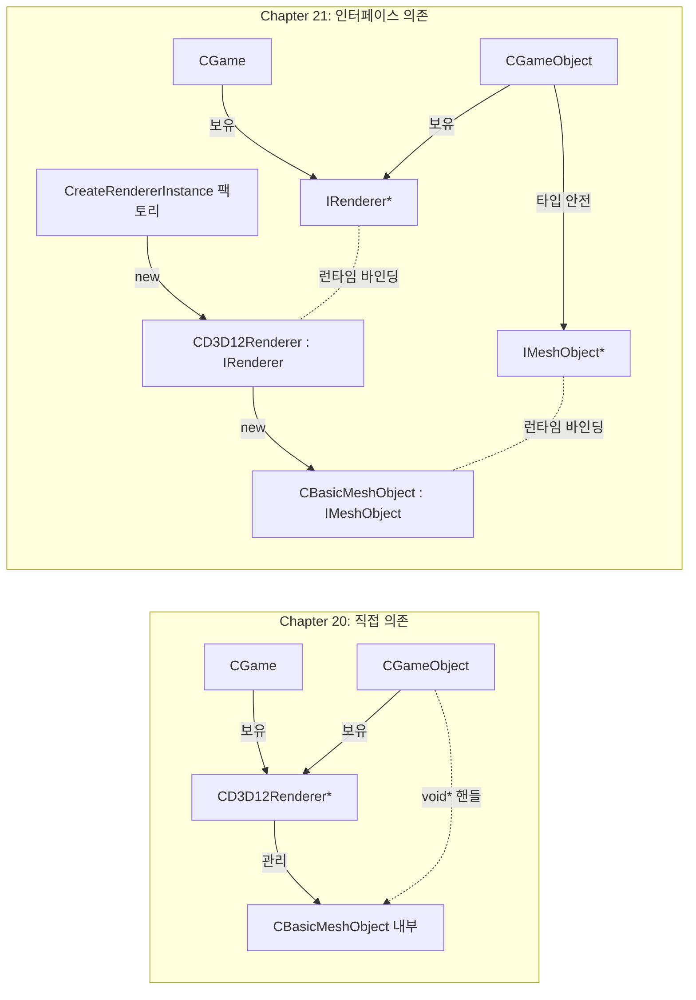
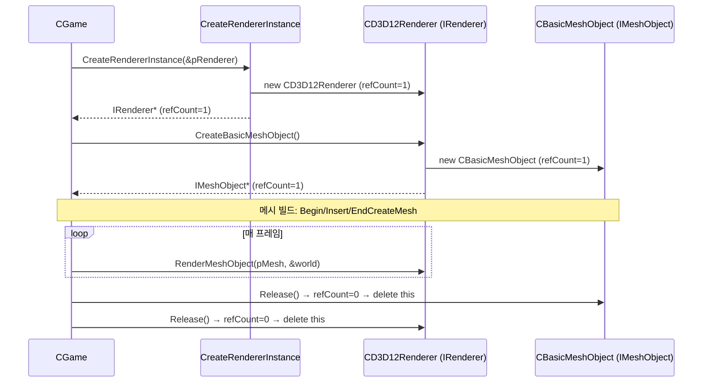

# Chapter 21 — Virtual Interface 심층 분석 및 Chapter 20과의 비교

> 대상 폴더: [21_VirtualInterface/](.) vs [20_MultiThreadRender/](../20_MultiThreadRender)
>
> 핵심 키워드: **COM-스타일 인터페이스, 추상화 경계(ABI Boundary), 팩토리 함수, IUnknown 수명 관리**

---

## 1. 21장에서 무엇이 바뀌었나 — 한 줄 요약

> "구체 클래스(`CD3D12Renderer`)와 `void*` 핸들로 직접 다루던 렌더러를, `IRenderer` / `IMeshObject` / `ISprite` 라는 **순수 가상 인터페이스(COM Interface)** 뒤로 숨기고, 팩토리 함수 `CreateRendererInstance()` 한 곳에서만 구체 타입을 생성하도록 했다."

이는 **DLL/모듈 경계 분리**, **타입 안전성 향상**, **수명관리 표준화(IUnknown)** 라는 세 가지 효과를 노린 리팩터링입니다.

---

## 2. 추가/수정된 파일 핵심 정리

### 2.1 새로 추가된 파일

| 파일 | 역할 |
| --- | --- |
| [IRenderer.h](IRenderer.h) | `IMeshObject`, `ISprite`, `IRenderer` 순수 가상 인터페이스 정의(모두 `IUnknown` 상속) |
| [Global.h](Global.h) / [Global.cpp](Global.cpp) | 팩토리 함수 `CreateRendererInstance(IRenderer** ppOutRenderer)` 선언/정의 |

### 2.2 IRenderer 인터페이스 (핵심)

```cpp
interface IMeshObject : public IUnknown
{
    virtual BOOL __stdcall BeginCreateMesh(const BasicVertex*, DWORD dwVertexNum, DWORD dwTriGroupCount) = 0;
    virtual BOOL __stdcall InsertTriGroup (const WORD* pIndexList, DWORD dwTriCount, const WCHAR* wchTexFileName) = 0;
    virtual void __stdcall EndCreateMesh  () = 0;
};

interface ISprite : public IUnknown { /* 비어있음 — 핸들 식별 용도 */ };

interface IRenderer : public IUnknown
{
    virtual BOOL  __stdcall Initialize(HWND, BOOL bEnableDebugLayer, BOOL bEnableGBV) = 0;
    virtual void  __stdcall BeginRender() = 0;
    virtual void  __stdcall EndRender()   = 0;
    virtual void  __stdcall Present()     = 0;
    virtual BOOL  __stdcall UpdateWindowSize(DWORD w, DWORD h) = 0;

    virtual IMeshObject* __stdcall CreateBasicMeshObject() = 0;
    virtual ISprite*     __stdcall CreateSpriteObject()    = 0;
    virtual ISprite*     __stdcall CreateSpriteObject(const WCHAR* wchTexFileName, int PosX, int PosY, int W, int H) = 0;

    virtual void* __stdcall CreateTiledTexture (UINT W, UINT H, DWORD r, DWORD g, DWORD b) = 0;
    virtual void* __stdcall CreateDynamicTexture(UINT W, UINT H) = 0;
    virtual void* __stdcall CreateTextureFromFile(const WCHAR*)  = 0;
    virtual void  __stdcall DeleteTexture(void* pTexHandle)      = 0;

    virtual void* __stdcall CreateFontObject(const WCHAR*, float fFontSize) = 0;
    virtual void  __stdcall DeleteFontObject(void* pFontHandle)             = 0;
    virtual BOOL  __stdcall WriteTextToBitmap(BYTE*, UINT W, UINT H, UINT Pitch, int* pOutW, int* pOutH, void* pFontObj, const WCHAR*, DWORD len) = 0;

    virtual void __stdcall RenderMeshObject  (IMeshObject* pMeshObj, const XMMATRIX* pMatWorld) = 0;
    virtual void __stdcall RenderSpriteWithTex(void* pSprObjHandle, int x, int y, float sx, float sy, const RECT*, float z, void* pTexHandle) = 0;
    virtual void __stdcall RenderSprite      (void* pSprObjHandle, int x, int y, float sx, float sy, float z) = 0;
    virtual void __stdcall UpdateTextureWithImage(void* pTexHandle, const BYTE*, UINT W, UINT H) = 0;

    virtual void  __stdcall SetCameraPos(float x, float y, float z) = 0;
    virtual void  __stdcall MoveCamera  (float x, float y, float z) = 0;
    virtual void  __stdcall GetCameraPos(float* outX, float* outY, float* outZ) = 0;
    virtual void  __stdcall SetCamera   (const XMVECTOR* pos, const XMVECTOR* dir, const XMVECTOR* up) = 0;
    virtual DWORD __stdcall GetCommandListCount() = 0;
};
```

### 2.3 팩토리 함수 ([Global.cpp](Global.cpp))

```cpp
HRESULT CreateRendererInstance(IRenderer** ppOutRenderer)
{
    *ppOutRenderer = new CD3D12Renderer;   // 구체 타입은 여기서만 노출
    return S_OK;
}
```

### 2.4 구체 구현 변화

- `CD3D12Renderer`가 `public IRenderer`로 상속되고 모든 공개 메서드에 `__stdcall` 부착, `STDMETHODIMP QueryInterface / AddRef / Release` 구현 추가 ([D3D12Renderer.h](D3D12Renderer.h), [D3D12Renderer.cpp](D3D12Renderer.cpp#L32-L51)).
- `CBasicMeshObject`가 `public IMeshObject`로 상속되고, `Begin/Insert/EndCreateMesh`가 **객체 자체의 가상 메서드**가 됨 ([BasicMeshObject.h](BasicMeshObject.h)).
- `CSpriteObject`는 `public ISprite`만 상속(스프라이트는 데이터 없음 → 식별용 인터페이스).

---

## 3. Chapter 20 vs Chapter 21 — 상세 비교

### 3.1 타입 시스템 비교

| 측면 | Chapter 20 | Chapter 21 |
| --- | --- | --- |
| 게임이 보는 렌더러 타입 | `CD3D12Renderer*` (구체) | `IRenderer*` (추상 인터페이스) |
| 게임이 보는 메시 타입 | `void* pMeshObjHandle` | `IMeshObject*` (타입 안전) |
| 게임이 보는 스프라이트 타입 | `void* pSpriteObjHandle` | `ISprite*` |
| 객체 생성 | `new CD3D12Renderer` 직접 | `CreateRendererInstance(&m_pRenderer)` 팩토리 |
| 객체 소멸 | `delete pRenderer` / `DeleteBasicMeshObject(void*)` | `pRenderer->Release()` / `pMeshObj->Release()` |
| 호출 규약 | (기본) `__cdecl` 또는 미지정 | 모든 가상 메서드 `__stdcall` 명시 |
| IUnknown 메서드 | 없음 | `QueryInterface / AddRef / Release` 구현 |

### 3.2 메시 생성 API 위치 이동

20장에서는 메시 생성이 **렌더러의 책임**:

```cpp
// 20장: D3D12Renderer.cpp
void* CD3D12Renderer::CreateBasicMeshObject();
BOOL  CD3D12Renderer::BeginCreateMesh(void* pMeshObjHandle, const BasicVertex*, DWORD vCount, DWORD triGroupCount);
BOOL  CD3D12Renderer::InsertTriGroup (void* pMeshObjHandle, const WORD*, DWORD triCount, const WCHAR* tex);
void  CD3D12Renderer::EndCreateMesh  (void* pMeshObjHandle);
void  CD3D12Renderer::DeleteBasicMeshObject(void* pMeshObjHandle);
```

21장에서는 **메시 객체 자신의 책임**으로 옮겨감:

```cpp
// 21장: IRenderer.h
interface IMeshObject : public IUnknown {
    virtual BOOL __stdcall BeginCreateMesh(const BasicVertex*, DWORD, DWORD) = 0;
    virtual BOOL __stdcall InsertTriGroup (const WORD*, DWORD, const WCHAR*) = 0;
    virtual void __stdcall EndCreateMesh  () = 0;
};
// 렌더러는 생성/렌더링만 담당
IMeshObject* CD3D12Renderer::CreateBasicMeshObject();
void         CD3D12Renderer::RenderMeshObject(IMeshObject*, const XMMATRIX*);
// DeleteBasicMeshObject는 제거 → pMeshObj->Release()로 통일
```

#### 효과
1. **응집도 증가**: 메시의 라이프사이클이 메시 객체 안에서 닫힘.
2. **렌더러 API 축소**: 다섯 개 메서드(`Begin/Insert/End/Delete/handle 캐스팅`) → 한 개(`CreateBasicMeshObject`).
3. **타입 안전성**: `void*` 캐스팅(`(CBasicMeshObject*)pMeshObjHandle`)이 없어짐.

### 3.3 사용 코드 비교 ([GameObject.cpp](GameObject.cpp))

```cpp
// 20장: 모든 호출이 렌더러 메서드 + void* 핸들
void* pMeshObj = m_pRenderer->CreateBasicMeshObject();
m_pRenderer->BeginCreateMesh(pMeshObj, pVertexList, vCount, 6);
for (DWORD i = 0; i < 6; i++)
    m_pRenderer->InsertTriGroup(pMeshObj, pIndexList + i*6, 2, texFiles[i]);
m_pRenderer->EndCreateMesh(pMeshObj);
...
m_pRenderer->RenderMeshObject(pMeshObj, &m_matWorld);
// 정리:
m_pRenderer->DeleteBasicMeshObject(pMeshObj);

// 21장: 객체의 메서드 직접 호출 + COM 수명관리
IMeshObject* pMeshObj = m_pRenderer->CreateBasicMeshObject();
pMeshObj->BeginCreateMesh(pVertexList, vCount, 6);
for (DWORD i = 0; i < 6; i++)
    pMeshObj->InsertTriGroup(pIndexList + i*6, 2, texFiles[i]);
pMeshObj->EndCreateMesh();
...
m_pRenderer->RenderMeshObject(pMeshObj, &m_matWorld);
// 정리:
pMeshObj->Release();
```

### 3.4 게임 초기화 흐름 비교 ([Game.cpp](Game.cpp))

```cpp
// 20장
m_pRenderer = new CD3D12Renderer;
m_pRenderer->Initialize(hWnd, dbg, gbv);
...
// 정리
delete m_pRenderer;

// 21장
CreateRendererInstance(&m_pRenderer);          // ← 유일한 구체 타입 의존 지점
m_pRenderer->Initialize(hWnd, dbg, gbv);
...
// 정리
m_pRenderer->Release();                        // 참조 카운트 0이면 자동 delete
m_pSpriteObjCommon->Release();
```

### 3.5 함수/메서드 인자 의미 정리(21장 기준 신규/변경분)

| 함수 | 인자 | 의미 |
| --- | --- | --- |
| `CreateRendererInstance(IRenderer** ppOutRenderer)` | `ppOutRenderer` | 출력 파라미터. 새로 생성된 렌더러 포인터를 받음. 호출자가 `Release()` 책임 |
| `IRenderer::Initialize(HWND hWnd, BOOL bDebug, BOOL bGBV)` | `hWnd` 윈도우 핸들 / `bDebug` D3D12 디버그 레이어 활성 / `bGBV` GPU-Based Validation 활성 | 디바이스/스왑체인/디스크립터힙/멀티스레드 풀 초기화 |
| `IRenderer::CreateBasicMeshObject()` | (없음) | 빈 메시 객체 생성. 반환된 `IMeshObject*`는 `AddRef`된 상태 |
| `IMeshObject::BeginCreateMesh(pVertexList, vNum, triGroupCount)` | `pVertexList` 정점 배열 / `vNum` 정점 개수 / `triGroupCount` 트라이그룹(서브셋) 개수 | 정점 버퍼 + 트라이그룹 슬롯 예약 |
| `IMeshObject::InsertTriGroup(pIndexList, triCount, wchTexFileName)` | `pIndexList` 인덱스 배열 / `triCount` 삼각형 수 / `wchTexFileName` 그룹의 텍스처 파일 경로 | 한 트라이그룹의 인덱스 버퍼+SRV 등록 |
| `IMeshObject::EndCreateMesh()` | (없음) | 메시 빌드 완료 마킹 |
| `IRenderer::RenderMeshObject(IMeshObject* pMeshObj, const XMMATRIX* pMatWorld)` | `pMeshObj` 그릴 메시 / `pMatWorld` 월드 변환 행렬 포인터 | 렌더 큐(`RenderQueue`)에 `RENDER_ITEM` 적재 후 라운드로빈으로 스레드 분배 |
| `IRenderer::CreateSpriteObject(...)` | 텍스처/위치/크기 또는 빈 인자 | 텍스처 바인딩 형/공용 형 두 가지 오버로드 |
| `IRenderer::CreateDynamicTexture(W, H)` / `CreateTextureFromFile(name)` / `CreateTiledTexture(...)` | 텍스처 크기·소스 | `void*` 핸들(`TEXTURE_HANDLE*`) 반환 — 텍스처는 여전히 불투명 핸들 |
| `IRenderer::DeleteTexture(void* pTexHandle)` | 텍스처 핸들 | 텍스처 매니저 통해 해제 |
| `IRenderer::CreateFontObject(name, size)` / `DeleteFontObject(handle)` | 폰트 이름/크기/핸들 | DirectWrite 기반 폰트 객체 |
| `IRenderer::WriteTextToBitmap(pDestImage, W, H, pitch, *outW, *outH, pFontObj, wchString, len)` | 비트맵 출력 버퍼와 텍스트 | CPU 비트맵에 텍스트 렌더링(이후 `UpdateTextureWithImage`로 동적 텍스처에 업로드) |
| `IRenderer::UpdateTextureWithImage(pTexHandle, pSrcBits, W, H)` | 동적 텍스처 + 소스 비트 | 업로드 버퍼 Map/Memcpy/Unmap |
| `IRenderer::SetCameraPos / MoveCamera / GetCameraPos / SetCamera(pos,dir,up)` | 카메라 좌표/벡터 | 뷰 행렬 갱신 |
| `IRenderer::GetCommandListCount()` | (없음) | 프레임당 사용된 커맨드리스트 개수(통계/FPS 표시용) |
| `IUnknown::AddRef()` | (없음) | 참조 카운트 +1, 새 값 반환 |
| `IUnknown::Release()` | (없음) | 참조 카운트 -1, 0이면 `delete this` |
| `IUnknown::QueryInterface(REFIID, void**)` | IID + 출력 포인터 | 21장 구현은 모두 `E_NOINTERFACE` 리턴(자리만 잡아둠) |

> 참고: 20장에서 존재하던 `DeleteBasicMeshObject(void*)`, `DeleteSpriteObject(void*)`는 21장에서 사라지고 모두 `Release()`로 통일됨(텍스처/폰트는 여전히 `void*` 핸들 + `Delete...` 방식 유지).

### 3.6 호출 규약(`__stdcall`)을 명시한 이유

21장에서 **모든 가상 함수에 `__stdcall`을 붙임**. 이는 향후 다음을 위해 필요:
- **DLL 경계** 너머로 인터페이스를 노출할 때 호출 규약 불일치로 인한 스택 깨짐 방지.
- 다른 언어/컴파일러(C#, Rust, MinGW 등)에서 COM-like 바인딩을 만들 때 ABI를 고정.
- x86에서 의미가 큼(x64에서는 `__stdcall`이 사실상 무시되지만 호환성 차원에서 표기).

### 3.7 멀티스레드 렌더링 로직은 그대로

20장에서 도입한 다음 구조는 21장에서도 **동일하게 유지**됨:

- `CCommandListPool`, `CDescriptorPool`, `CConstantBufferManager`, `CRenderQueue`를 `[MAX_PENDING_FRAME_COUNT][MAX_RENDER_THREAD_COUNT]`로 보유.
- `RenderMeshObject` / `RenderSprite`가 라운드로빈으로 `m_dwCurThreadIndex`를 증가시키며 큐에 적재.
- `EndRender`에서 워커 스레드들에게 이벤트 시그널 → 각 스레드가 자기 큐를 처리.
- 즉, 21장은 **외부 인터페이스 디자인 패턴 리팩터링**이지 내부 렌더 알고리즘 변경이 아님.

---

## 4. 전체 그림 — Mermaid 흐름도

### 4.1 클래스/모듈 의존 그래프 (20장 vs 21장)



### 4.2 한 프레임의 호출 흐름 (21장)

```mermaid
flowchart TD
    A[wWinMain] --> B[g_pGame->Initialize]
    B --> C[CGame::Initialize]
    C --> C1[CreateRendererInstance &m_pRenderer]
    C1 --> C2[new CD3D12Renderer]
    C --> C3[m_pRenderer->Initialize hWnd, dbg, gbv]
    C --> C4[CreateFontObject / CreateDynamicTexture / CreateSpriteObject]
    C --> C5[GameObject 2000개 생성<br/>각각 m_pRenderer->CreateBasicMeshObject<br/>+ pMeshObj->BeginCreateMesh / InsertTriGroup×6 / EndCreateMesh]

    A --> L[메시지 루프 / g_pGame->Run]
    L --> R[CGame::Run]
    R --> U[CGame::Update<br/>카메라/오브젝트 변환 갱신]
    R --> RD[CGame::Render]

    RD --> RB[m_pRenderer->BeginRender]
    RD --> RL[각 GameObject::Render →<br/>m_pRenderer->RenderMeshObject IMeshObject*, pMatWorld]
    RL --> RQ[RenderQueue[curThreadIdx].Add RENDER_ITEM<br/>curThreadIdx = +1 mod threadCount]
    RD --> RS[m_pRenderer->RenderSpriteWithTex 텍스트 텍스처]
    RD --> RE[m_pRenderer->EndRender]
    RE --> RE1[워커 스레드 이벤트 시그널<br/>WaitForSingleObject CompleteEvent]
    RE1 --> RE2[각 스레드 RenderQueue.Process →<br/>CommandList 빌드 후 CommandQueue 실행]
    RD --> RP[m_pRenderer->Present<br/>Fence + 다음 컨텍스트 자원 Reset]

    A --> Q[종료]
    Q --> CL[delete g_pGame → CGame::Cleanup]
    CL --> CL1[pMeshObj->Release / pSpriteObj->Release<br/>m_pRenderer->DeleteFontObject / DeleteTexture<br/>m_pRenderer->Release → refCount==0 → delete this]
```

### 4.3 IUnknown 수명 관리



---

## 5. 정리 — 이 리팩터링이 가져오는 실전 이점

1. **모듈/DLL 분리 준비 완료**
   - 게임 코드는 `IRenderer.h`와 팩토리 함수 시그니처만 알면 되므로, 렌더러를 별도 DLL로 분리해도 헤더 의존성이 거의 사라짐.
2. **수명 관리 표준화**
   - `void*` + `DeleteXxx(void*)` 쌍이 사라지고 `Release()`로 통일 → 사용자가 외울 API 수가 줄고, 동일 객체에 대한 다중 소유(`AddRef`)도 자연스럽게 가능.
3. **타입 안전성**
   - 메시 핸들이 `void*` → `IMeshObject*`로 바뀌어 컴파일 타임에 오용 차단(예: 텍스처 핸들을 메시로 잘못 넘기는 실수 방지).
4. **다른 백엔드 교체 가능**
   - 동일 `IRenderer`를 구현하는 Vulkan/D3D11 렌더러를 만들면 게임 코드 수정 없이 백엔드 교체 가능(전형적인 Bridge/Strategy 패턴).
5. **ABI 안정성**
   - `__stdcall` + 순수 가상 함수 테이블 구조 = 클래식 COM 호환 → 향후 외부 언어 바인딩에 유리.
6. **무엇이 바뀌지 않았는가도 중요**
   - 멀티스레드 렌더 큐, 커맨드리스트 풀, 디스크립터 풀, 펜스 처리 등 20장의 내부 엔진 구조는 **그대로**. 즉 이 챕터는 "외피(API 표면)의 추상화"에 집중한 리팩터링.

---

## 6. 부록 — 새 API를 쓰는 최소 게임 측 코드 골격

```cpp
IRenderer*   pRenderer = nullptr;
IMeshObject* pMesh     = nullptr;

CreateRendererInstance(&pRenderer);
pRenderer->Initialize(hWnd, FALSE, FALSE);

pMesh = pRenderer->CreateBasicMeshObject();
pMesh->BeginCreateMesh(pVertexList, vCount, triGroupCount);
for (DWORD i = 0; i < triGroupCount; ++i)
    pMesh->InsertTriGroup(pIndexList + i*6, 2, texFiles[i]);
pMesh->EndCreateMesh();

// per frame
pRenderer->BeginRender();
pRenderer->RenderMeshObject(pMesh, &worldMatrix);
pRenderer->EndRender();
pRenderer->Present();

// shutdown
pMesh->Release();
pRenderer->Release();
```
